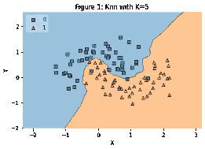
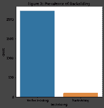
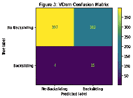
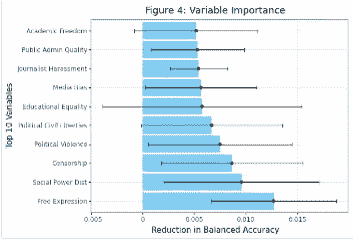

# 可视化民主倒退的决定因素

> 原文：<https://towardsdatascience.com/visualizing-the-determinants-of-democratic-backsliding-e9e15a09a729>

# 可视化民主倒退的决定因素

## 使用 K-最近邻分类器预测民主侵蚀

艾萨克·史密斯在 [Unsplash](https://unsplash.com?utm_source=medium&utm_medium=referral) 上拍摄的照片

## 介绍

机器学习模型是非常有用的工具，它让我们既能理解我们周围的世界，又能预测未来。然而，与此同时，往往很难理解他们的决定是如何做出的，以及如何解释他们的结果，尤其是当模型变得更加复杂时。数据可视化是一种有用的方法，可以使这些模型更容易理解。下面的简介将使用数据可视化来解释用于预测民主倒退的 K-最近邻分类器的功能。

## k-最近邻

作者图片

k-最近邻(KNN)是一种受监督的机器学习技术，可以应用于回归和分类。KNN 分类器的工作原理是从训练数据中识别与我们感兴趣的观察最接近的“K”个点的数量，然后根据最接近点的多数类别来确定其类别。图 1 通过使用只有两个特征的简单模拟数据清晰地展示了这一概念。如图所示，基于最近的 5 次观察，在两个类别之间形成了(大部分正确的)判定边界。我们的实际数据集将包含更多的特征，因此需要将这一概念推广到多维特征空间。然而，这个简单的可视化应该有助于说明这个概念。

## 背景

在我们开始分析之前，对民主倒退有一个概念性的理解是很重要的。最近，全球走向民主的趋势似乎正在逆转，许多国家正在经历所谓的民主倒退，这一事实已被大肆宣扬。民主倒退被定义为“国家主导的削弱或消除维持现有民主的政治机构”，是一个描述国家走向更专制的治理形式的各种过程的总称。政治科学家已经对民主崩溃的各种过程有了相对充分的理解，但问题仍然存在:民主倒退的原因是什么？什么指标可以用来预测一个国家是否会倒退到离民主治理更远的地方？在简报的其余部分，我们将使用上面讨论的 KNN 模型来尝试回答这个问题。

## 数据

作者图片

用于这项分析的数据是从几个不同的来源汇编的。分析单位是国家年，观测始于 1960 年，跨越 166 个不同的国家。因变量——民主倒退的存在与否——是基于 Polity Project 的 [Polity 5 数据集](https://www.systemicpeace.org/inscrdata.html)创建的，该数据集衡量民主和威权治理的各种质量。这包括一个 221 分制的“政治得分”，从-10 分(世袭君主制)到 10 分(巩固民主制)。衡量民主倒退的方法是从上一年的政治得分中减去感兴趣的一年的得分。因变量是一个二元变量，政治得分的负年度差异被编码为 1-代表民主倒退的发生率，正年度差异或无变化被编码为 0-表明没有倒退的证据。数据显示，民主倒退是一个罕见的事件——如图 2 所示，自 1960 年以来，在近 2500 个有政体得分的国家年中，倒退事件不到 200 次——只有 8%左右。因此，在运行模型时需要解决明显的偏差。

这些关键的独立变量构成了一套社会和制度因素，并从[民主](https://kellogg.nd.edu/research/major-research-initiatives/varieties-democracy-project)数据集中提取出来。V-Dem 指数是一个“多维和分类的数据集，反映了民主作为一种统治制度的概念的复杂性。”在完整的 V-Dem 数据集中的数百个可能的指标中，选择了 58 个最相关和最可概括的用于本分析的指标作为独立变量。

人口数据来自[世界银行](https://datacatalog.worldbank.org/public-licenses)，GDP 和人均 GDP 的信息来自 [Gapminder](https://www.gapminder.org/data/) ，它提供了以 2011 年美元计算的年度估计值，以各国购买力平价为标准。⁴的年人均国内生产总值增长和人口被用来控制 V-Dem 变量对不同大小和经济发展水平的国家的不同影响。此外，还增加了一个十年变量来处理时间效应。最后，在条件生效需要时间的假设下，所有独立变量(几十年除外)都滞后了 5 年。

## 分析

作者图片

为了运行机器学习模型，我非常依赖 Python 的 Scikit-learn 包，它提供了一套用于预测数据分析的工具。⁵:除了运行 KNN 分类器，我还使用交叉验证来验证模型，并将其调整到所需的超参数。这里使用的交叉验证方法是 k-Fold 验证，它将观察值分成 k 组，只将最后一组作为测试集。然后重复 k 次，基于 k 个测试组的平均值计算交叉验证估计值。为了分析的目的，k 设定为 5。该模型根据用于计算的邻居数量进行了调整。使用 50 个最近邻的估计产生了最好的结果。

作者图片

因为数据集是不平衡的，如图 1 所示，所以我使用重采样技术来人为地增加少数民族类的大小。该模型中使用的技术称为上采样或过采样。过采样允许通过从现有数据生成新样本来人为增加少数样本的数量，以解决平衡问题。为了实现过采样，我通过 SkLearn contributor 包 imblearn 使用了 RandomOverSampler 特性，该包是专门为帮助处理不平衡数据集而设计的。⁶

为了评估模型的性能，我使用了两个指标。使用的主要度量是平衡精度。在处理不平衡数据时，平衡精度优于常规精度度量，因为它根据类的反向流行率对精度进行加权，从而防止由于简单预测主导类而导致的估计值膨胀。我还测试了由管道确定的最佳模型的召回能力。召回率计算为 tp / (tp + fn) —或分类器找到所有阳性样本的能力。在这种情况下，这相当于能够正确识别倒退事件。

最后，在运行模型之后，我试图确定模型中每个变量的重要性。为此，我使用了 SkLearn 的置换函数。这种方法一次打乱一个变量的数据，然后使用该模型对现已打乱的数据进行重新预测。然后对每个变量重复 5 次。然后，我们可以根据模型预测准确性的最大变化来确定哪些变量对模型最重要，这也是由模型的平衡准确性得分决定的。

## 结果

总的来说，该模型具有相当好的预测性，返回了 0.7498 的平衡准确度分数，这意味着它能够在大约 75%的时间内准确预测倒退的情况。

该模型在测试数据中正确预测倒退的能力甚至更高，召回分数为 0.79，这意味着它能够预测 79%的倒退情况。图 3 中的混淆矩阵展示了模型在不同的可能类别组合中的表现，x 轴上是预测值，y 轴上是真实值。如图所示，该模型最薄弱的环节是其产生假阳性的倾向。它预测有 162 个案例会出现倒退，而实际上没有。这可能至少部分是由于缺乏足够的倒退样本，并意味着需要做更多的工作来补偿偏斜的 Y 分布。

根据评估变量重要性的排列运行，完整模型中最重要的变量是表达自由，对平衡准确度得分的平均影响为 0.013。图 4 显示了前 10 个最重要的变量。彩色条代表所有 5 次试验的平均效果，而穿过它们的误差线跨越排列的最大和最小效果。有趣的是，前 10 名没有一个共同的主题贯穿其中，这意味着没有任何特定的定义特征集有助于预测倒退。相反，有许多分散的因果因素。

## 结论

从上面可以看出，K-最近邻分类器提供了一种有效的方法来处理涉及各种特征的分类问题。此外，可视化提供了一个“引擎盖下的外观”,使模型及其性能更容易解释。这在政策背景下尤其重要，因为没有背景的预测几乎没有用处。解释驱动模型的因素的能力可以为决策者提供必要的信息，以加强他们的民主和避免倒退。

[1]:南希·贝尔梅奥，“论民主倒退”，《民主杂志》27 期，第 1 期(2016):5–19。doi:10.1353/jod

[2]:蒙蒂·g·马歇尔(Monty G. Marshall)，特德·罗伯特·古尔(Ted Robert Gurr)(2020)，《政体 5:1800–2018 年的政治体制特征与转型》。数据集用户手册。系统和平中心。[http://www.systemicpeace.org/inscr/p5manualv2018.pdf](http://www.systemicpeace.org/inscr/p5manualv2018.pdf)

[3]: Michael Coppedge 等人，“V-Dem[国家–年份/国家–日期]数据集 v10”(2020)，民主的多样性(V-Dem)项目。https://doi.org/10.23696/vdemds20

[4]:世界银行，世界发展指标。人口总数[数据文件]，(2012)从 https://data.worldbank.org/indicator/SP.POP.TOTL[检索](https://data.worldbank.org/indicator/SP.POP.TOTL)

[5]: Pedregosa，f .等人(2011)，sci kit-learn:Python 机器学习研究杂志中的机器学习，12，2825–2830。

[6]:纪尧姆·勒迈特、费尔南多·诺盖拉和克里斯特斯·k·阿里达斯(2017)，《不平衡学习:一个 Python 工具箱来解决机器学习中不平衡数据集的诅咒》，《机器学习研究杂志》，18(17)，1–5。