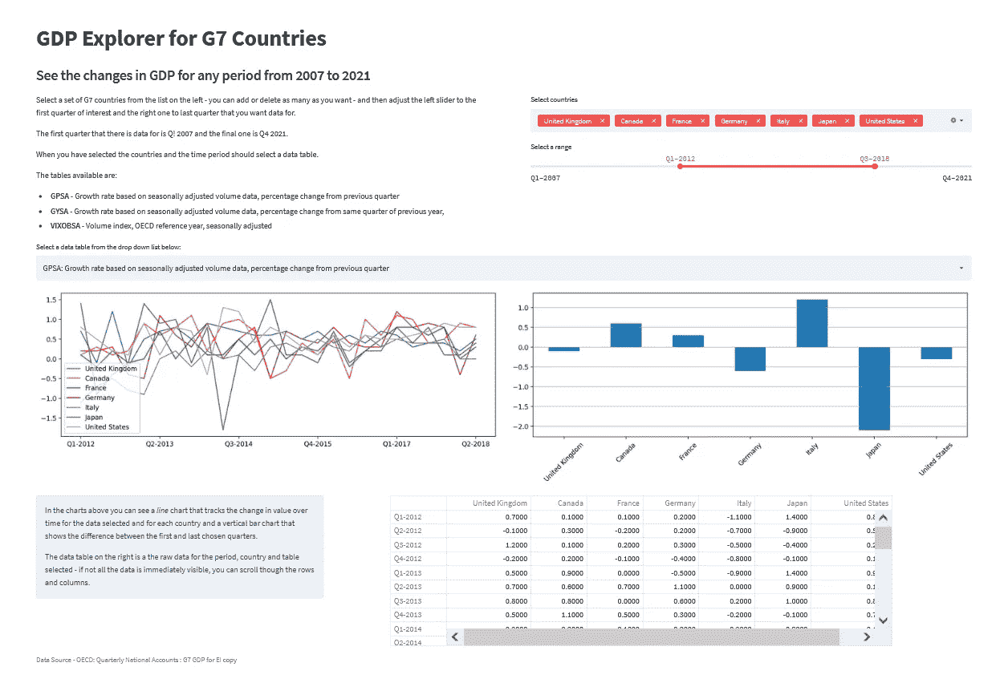
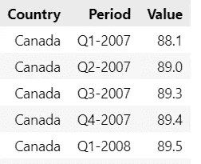
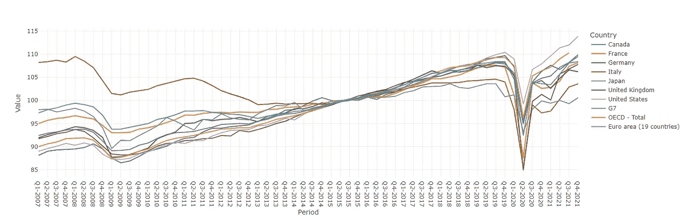
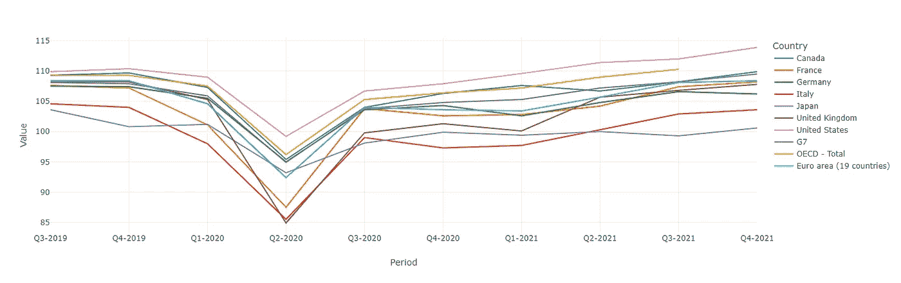
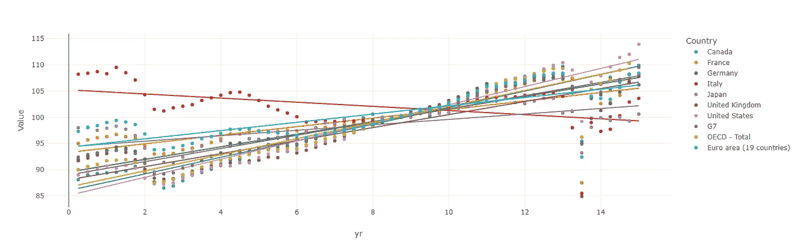
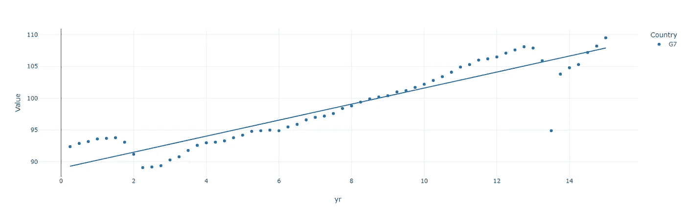
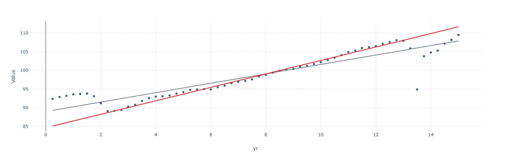

# 使用 Jupyter 笔记本电脑和 Streamlit 可视化疫情的经济影响

> 原文：<https://towardsdatascience.com/visualizing-the-economic-impact-of-the-pandemic-using-jupyter-notebooks-and-streamlit-c25c91411d1e>

## 数据可视化

## 在科维德·疫情的震惊之后，我们回到正轨了吗？我们可以使用经合组织的数据、Python、简单的回归模型和 Jupyter 笔记本来找出并创建一个交互式 Streamlit 应用程序来显示结果



Streamlit 应用程序截图—作者图片

在大多数国家，GDP 在 2020 年第一季度像石头一样下降。停工和疾病意味着工业陷入停顿。

在正常情况下，GDP 往往会随着时间的推移而增长，但当出现像我们现在正在经历的这种特殊事件和 2008 年的金融危机时，就不会这样了。它急剧下降。

GDP 是一个国家整体财富的指标；当失业率高时，就业率往往更高，公民通常也更富裕。但是，像我们现在经历的这种冲击，并不一定意味着潜在的经济因素已经发生了变化。那么，如果疫情没有发生，我们的经济会恢复到应有的水平吗？事实上，正如一些政客暗示的那样，他们已经这样做了吗？

这真的取决于你如何看待它——你在衡量什么，在什么时期衡量。

我们将使用一个回归模型来研究，如果没有 2008 年和疫情的影响，增长可能会如何继续。然后，我们可以将当前事件状态与建模的事件状态进行比较。

# 经合组织数据

我用经合组织的数据制作了一些可视化的 Plotly，可能有助于澄清这种情况。

我用 Jupyter 笔记本做了我的第一次分析，以解决一些特定的问题。然后我创建了一个 Streamlit 应用程序(你可以在上面的图片中看到)，它使用户能够与数据交互(这是一个原型，很快就会更新)。

*笔记本电脑、Streamlit 应用程序和数据文件都可以下载——参见最后的链接。*

我决定只关注 G7 国家，因为这比试图解决整个世界更可行。经合组织提供了从 2007 年到 2021 年底的全球生产总值和经济增长数据。这很方便地涵盖了 2008 年的金融危机以及当前的形势。

正如你所料，只要你引用正确，经合组织的数据对任何人都是免费的。因此，需要明确的是，该数据集来自经合组织的*季度国民账户*，并在本文末尾有完整的引用，可以在[这里](https://stats.oecd.org/Index.aspx?QueryId=77241)找到。

该数据是三个时间序列的组合:

*   VIXOBSA:数量指数，经合组织参考年 2015 年，经季节性调整
*   GPSA:增长率基于经季节性调整的数量数据，与上一季度相比的百分比变化
*   GYSA:增长率基于经季节性调整的数量数据，与上一年同季度相比的百分比变化

我们将在这里使用体积数据，尽管该应用程序也允许您探索其他两个数据集。

如果您想使用 Jupyter 笔记本，那么您需要首先导入库。

```
import pandas as pd
import matplotlib
import plotly.express as px
```

我们可以创建一个包含所有数据的数据帧。

```
gdpdata = pd.read_csv('QNA_26022022111050612.csv')
```

然后创建一个包含卷数据的新数据帧，即 VIXOBSA 数据。

```
data = gdpdata[gdpdata['MEASURE']=='VIXOBSA']
```

然后，我们通过选择我们确实需要的列来删除我们不感兴趣的列。

```
data = data[['Country','Period','Value']]
```

它看起来是这样的:



作者图片

这些列代表 G7 集团中的 7 个国家之一(我们在这里看到加拿大的部分数据)，记录数据的年份和季度以及数据本身。

每行记录一个季度的 GDP。因此，我们可以看到，在数据集中的前 5 个季度，加拿大的 GDP 每个季度都有所增长。

顺便说一下，这些数字不是美元或任何其他货币的总数，而是相对于 2015 年而言的。2015 年的平均国内生产总值是 100，然后每个季度都相对于这个数字进行计算:因此，如果某个特定季度的数字是 95，那么这代表的值是 2015 年平均值的 95%。以这种方式表示 GDP 意味着我们可以在图表上绘制所有国家的数字，并在相同的尺度上看到每个国家的相对增长。

这是 G7 在 2007 年至 2021 年间的 GDP 曲线图。



作者图片

这是生成它的代码。

```
fig = px.line(
    data, 
    x='Period', 
    y='Value', 
    color='Country',
    template='none')
fig.show()
```

这显示了 G7 国家的 GDP 随欧元区、G7 整体以及 OECD 国家整体的变化。

你可以看到 2008 年危机之后的大幅下跌，以及 2020 年初疫情爆发后的大规模突然下跌。

你还可以看到，从 2010 年初到最近，大多数国家的 GDP 都在增长(意大利是个明显的例外)，因此可以想象，如果没有当前的危机，这种趋势还会持续下去。

但疫情来袭，GDP 骤降至 2008/09 年以来的最高水平。虽然出现了快速复苏，但 GDP 并没有反弹到之前的水平，而是在最初飙升，然后开始缓慢上升。

为了使将来的计算更容易，我将添加一个列，用数字表示每个季度。它是这样工作的:第一年，2007 年是 0 年，第一季度是 0.25，第三季度是 0.5 等等。因此，例如，2020 年的第三季度将是 13 年加上 0.75 代表第三季度:13.75。在绘制数据子集和计算回归线时(我们将在后面看到)，使用实数会让事情变得简单一些。

以下是代码:

```
def formyr(x,data):
    d = data['Period'].values[x]
    #print(data['Period'])
    y= int(d[-4:])+int(d[1:2])*0.25 - 2007
    return y yr=[formyr(x,data) for x in range(len(data)) ]
data['yr'] = yr
```

让我们放大一点，更详细地看看趋势:这是 2019 年第三季度到 2021 年底的折线图。

```
fig = px.line(
    data[data['yr'] > 12.5], 
    x='Period', 
    y="Value", 
    color='Country',
    template='none')
fig.show()
```



作者图片

现在更容易看出，国内生产总值再次上升，并正在接近，甚至在某些情况下超过疫情前的水平。

# 事情正在好转吗？

是的，他们是。如果我们绘制整个日期范围的趋势线，我们会看到，总的来说，国内生产总值的趋势仍然是向上的(意大利除外)。

```
fig = px.scatter(
    data,
    x='yr', 
    y="Value", 
    title='', 
    color='Country',
    template='none', 
    trendline='ols')fig.show()
```



作者图片

也许把 G7 作为一个整体来看待更容易一些。

```
fig = px.scatter(
    data[data['Country'].isin(['G7'])], 
    x='yr', 
    y="Value", 
    title='', 
    color='Country',
    template='none', 
    trendline='ols')
fig.show()
```



作者图片

这里你可以清楚地看到，尽管经历了 2008 年和现在的冲击，趋势线仍然显示出稳定的增长水平。事实上，目前的 GDP 水平高于趋势线预测的水平。

这是否意味着，如果没有发生这些金融动荡，我们会处于与现在同样的境地？不。趋势线(由 Plotly 计算)是一个考虑了倾角的回归模型。如果这些下跌没有发生，回归线会有所不同。

# 一种新的回归模型

Plotly 趋势线是一个回归模型的结果，该模型考虑了整个数据范围，但如果我们建立一个新的模型，忽略那些异常情况，我们就会有一条趋势线，向我们显示如果 2008 年和疫情事件没有发生，事情可能会如何。

在下面的代码中，我们使用 SciPy 构建了一个回归模型。它是根据两次崩溃之间的数据进行训练的，然后应用于整个数据范围。这可能会让我们更好地了解，如果疫情没有发生，现在的 GDP 会是多少。

建立和应用模型后，我们绘制结果。灰线是 Plotly 计算的整个期间的趋势，红线是回归模型的新趋势线。为了简单起见，我们将 G7 视为一个整体。

```
# build regression model for one year from Q1 2009 to Q4 2019
# attempt at missing out major effects from 2008 and pandemic
# the middle years are closer to linearfrom scipy import stats
import plotly.graph_objects as go# new df for OECD data only
OECDdata = data[data['Country']=='OECD - Total']# set x and y values for limited period
x= OECDdata[16:-8]['yr']
y= OECDdata[16:-8]['Value']# create model for limited period
slope, intercept, r, p, std_err = stats.linregress(x, y)def f(x):
return slope * x + intercept# create new trendline data and insert new column
rlist = [f(x) for x in OECDdata['yr'] ]
OECDdata.insert(1, "r", rlist)fig = px.scatter(
    OECDdata, 
    x='yr', 
    y='Value',
    template='none', 
    trendline='ols', 
    trendline_color_override="grey")fig.add_trace(
    go.Scatter(
    x=OECDdata['yr'],
    y=OECDdata['r'],
    mode="lines",
    line=go.scatter.Line(color="red"),
    showlegend=False)
)
```

这是结果。



作者图片

你可以看到这条红线非常符合疫情之前和 2008 年之后的趋势，向我们表明增长应该比现在高得多。

这是正确的吗？如果是这样的话，我们还有一些工作要做。

但这只是一个数据实验，可能有理由认为结果不可信。一个立即浮现在脑海中的想法是，由于 2008 年，这中间几年的增长率可能会更高。如果那次崩盘没有发生，那么 5 月份我们会看到一个不那么陡峭的上升，因为我们会从一个更高的基数开始。

然而，通过思考这些数据，我们或许可以洞察什么是真实的，什么不是。

我希望这个小小的统计数据是有用的，或者至少有点娱乐性。

一如既往地感谢您的阅读，如果您想知道我何时发表新文章，请考虑注册下面的电子邮件提醒，或者订阅我在 [Substack](https://technofile.substack.com/) 上偶尔发布的免费简讯。

如果你还不是一个媒体订阅者，那就注册吧，这样你就可以每月花 5 美元阅读尽可能多的文章。在这里注册，我将赚取一小笔佣金。

# 密码

本文和 Streamlit 应用程序的代码可以在我的 Github 库[这里](https://github.com/alanjones2/stGDPG7)找到。

在 Streamlit Cloud [这里](https://share.streamlit.io/alanjones2/stgdpg7/main/stapp.py)可以访问 Streamlit app(注意，这是一个原型，没有使用文章中的所有代码，将在适当的时候更新)。

# 参考

1.  经合组织(2022 年)，*季度国民账户:七国集团国民生产总值 EI 副本*，网址:[https://stats.oecd.org/Index.aspx?QueryId=77241](https://stats.oecd.org/Index.aspx?QueryId=77241)(2022 年 2 月 26 日访问)