# 用 Python 可视化光速

> 原文：<https://towardsdatascience.com/visualizing-the-speed-of-light-in-the-solar-system-with-python-fa9ead33ac86>

## 创建简单的可视化，一步一步地显示光在外层空间传播的时间和距离

[泽通李](https://unsplash.com/@zetong?utm_source=medium&utm_medium=referral)在 [Unsplash](https://unsplash.com?utm_source=medium&utm_medium=referral) 上的照片

我在科学课上被告知[光](https://en.wikipedia.org/wiki/Light)是超级快的。在真空中，它的速度大约是每秒 3 x 10⁸米(每秒 186，282 英里)。光从太阳传播到地球大约需要 8.3 分钟。因为不可能观察到光速，所以我必须用我的想象力记住所有这些信息。

最近发现一篇文章叫[可视化光速(快，但是慢)](https://www.visualcapitalist.com/visualizing-the-speed-of-light-fast-but-slow/)。有一个视频展示了光速在太阳系中的实时旅行。这是展示光速有多快的天才方式。

外太空很大，有很多天文物体。因此，创建一个选择我们想要的天文物体的可视化将是有用的。本文将展示如何使用 Python 制作简单的动画，显示光线在空间移动时的时间。

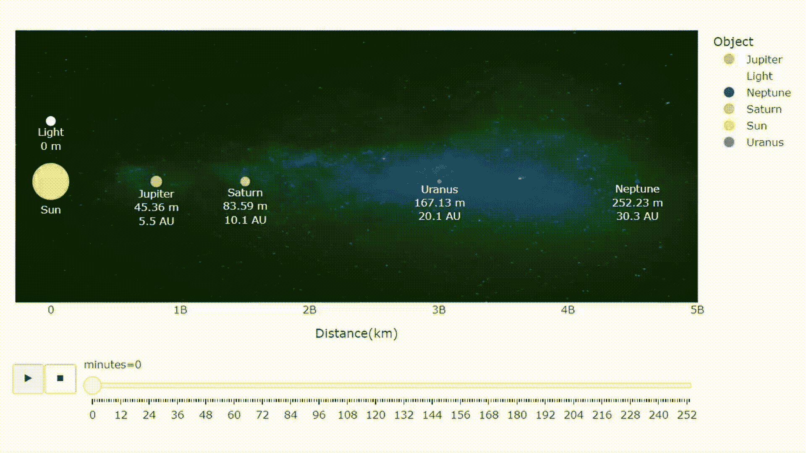

本文中可视化的一个例子。阳光到达外行星的距离和时间。作者的动画。由 [Eduardo Rosal](https://unsplash.com/@eduardorosal?utm_source=medium&utm_medium=referral) 在 [Unsplash](https://unsplash.com?utm_source=medium&utm_medium=referral) 上拍摄的壁纸照片。

让我们开始吧。

# 内行星

首先，我们将想象光线从太阳传播到内行星，即水星、金星、地球和火星。

## 创建数据框架

我们将用 [pd 在 Python 上手动创建一个简单的 DataFrame。数据帧](https://pandas.pydata.org/docs/reference/api/pandas.DataFrame.html)。我自己收集了本文中使用的数据。各种天文数据可以在[维基百科](https://en.wikipedia.org/wiki/Main_Page)上找到。如果有不正确的地方，请在评论中告诉我。

导入库后，创建三个列表:对象名称、距离和半径。然后，从这三个列表中创建一个数据帧。

距离是[远日点](https://en.wikipedia.org/wiki/Apsis)，轨道上离太阳最远的点。可以改成[近日点](https://en.wikipedia.org/wiki/Apsis)，轨道上离太阳最近的点，或者[半长轴](https://en.wikipedia.org/wiki/Semi-major_and_semi-minor_axes)，近日点和远日点的平均值。半径是为了以后计算尺寸。

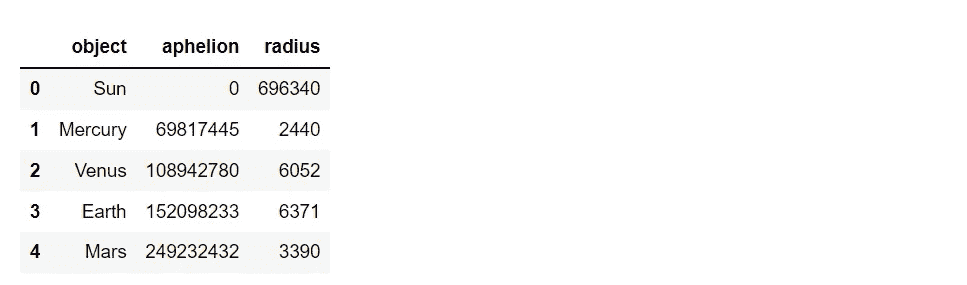

总时间可以通过将距离除以光速(299，792，458 米/秒)来计算。下面的代码显示了如何获取总次数(以分钟为单位),这将用于创建光的距离列表。

为了使用 Plotly，我们需要创建一个每分钟包含一组数据的 DataFrame。我们可以用目标数据帧乘以分钟数，然后将它们连接起来。然后，创建时间和 Y 轴列。

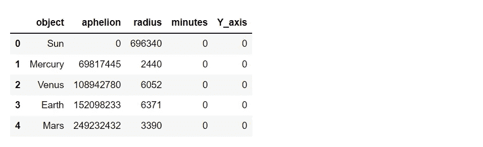

手动创建灯光数据帧。这个数据帧用于在动画中显示光的运动。

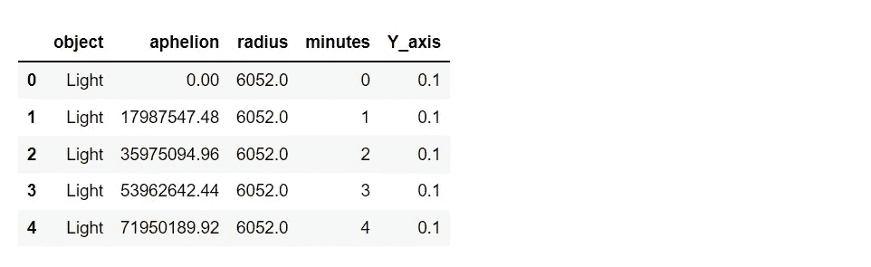

将对象和灯光数据帧连接在一起。可视化将是二维的。因此，我们可以通过将半径乘以数字[π](https://en.wikipedia.org/wiki/Pi)来计算每个物体的面积。

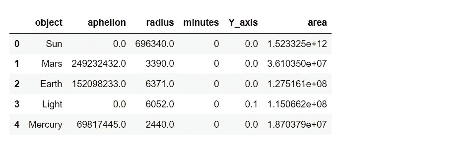

与太阳系的行星相比，太阳太大了。如果我们直接绘制它们，散布大小会有太大的差异。我们应该增加其他行星的面积，然后在动画中显示天体。请注意，结果中获得的尺寸不会按比例绘制。

天文单位( [AU](https://en.wikipedia.org/wiki/Astronomical_unit) )是长度单位。1 天文单位等于太阳到地球的距离。为了使结果更具信息性，通过将每个对象的距离除以 149，597，871 km 来创建 AU 列。最后，为注释创建一个文本列。

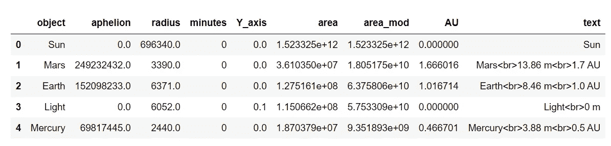

## 形象化

接下来是可视化部分。我们将使用 [Plotly](https://plotly.com/python/) ，这是一个 Python 图形库，很容易用来制作交互式图形。Plotly 是强大的绘图功能，由于其定制。

作为一个例子，让我们从一个简单的交互式散点图开始。

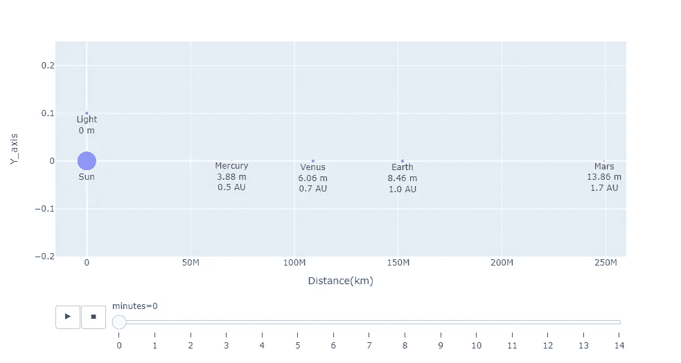

使用 Plotly 可视化光速与内行星的距离。图片由作者提供。

为了改善结果，用颜色定义每个天体的字典。以下颜色代码用作示例。

下面的代码显示了如何通过给每个天体分配颜色并添加背景壁纸来改善结果。壁纸是由[爱德华多·罗萨](https://unsplash.com/@eduardorosal)从 [Unsplash](https://unsplash.com/photos/21Q8MadVbRU) 取回的。

瞧啊。！…

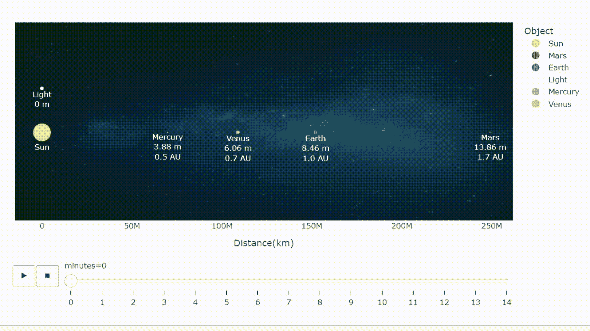

阳光到达内行星的距离和时间。比例距离。尺寸不符合比例。作者的动画。爱德华多·罗萨尔在 [Unsplash](https://unsplash.com?utm_source=medium&utm_medium=referral) 上拍摄的壁纸照片。

现在，让我们进一步把这些代码应用到其他天体上。

# 外行星

外行星是木星、土星、天王星和海王星。与内行星相比，这些行星要大得多。它们被称为[气态巨行星](https://www.ck12.org/earth-science/inner-versus-outer-planets/lesson/Inner-vs.-Outer-Planets-HS-ES/#:~:text=Summary,they%20are%20called%20gas%20giants.)，因为它们主要由气体和液体组成。

手动创建太阳和外行星的数据框架。

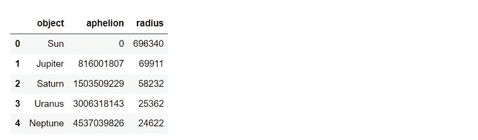

定义一个函数来简化获取绘图数据帧的步骤。

应用该功能

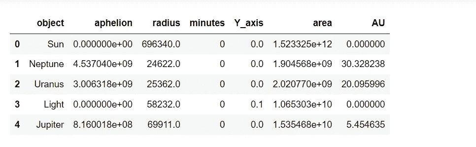

创建一个用于处理尺寸的列和一个用于注释的文本列。

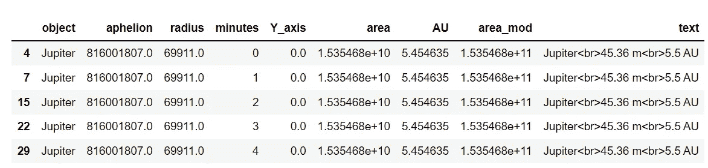

将数据可视化。

Ta-daaaaa

阳光到达外行星的距离和时间。比例距离。尺寸不符合比例。作者的动画。由 [Eduardo Rosal](https://unsplash.com/@eduardorosal?utm_source=medium&utm_medium=referral) 在 [Unsplash](https://unsplash.com?utm_source=medium&utm_medium=referral) 上拍摄的壁纸照片。

# 太阳离我们很远

我总是很好奇绕太阳运行最远的物体是什么。用快查，是一个叫 [FarFarOut](https://en.wikipedia.org/wiki/2018_AG37) 的物体。这个名字听起来很有趣。这是一颗[跨海王星物体](https://en.wikipedia.org/wiki/Trans-Neptunian_object)，一颗比海王星绕太阳运行平均距离更远的小行星。因此，我们也将绘制海王星来比较结果。让我们看看 FarFarOut 有多远。

创建一个数据框架。

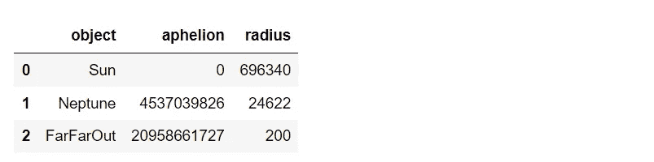

由于太阳和 FarFarOut 之间的距离很长，光速将以千米/小时为单位来加速计算。

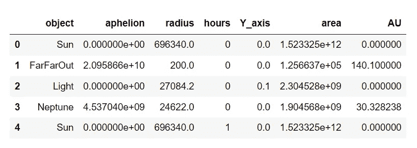

创建一个用于处理尺寸的列和一个用于注释的文本列。时间单位是小时。绘制时，FarFarOut 太小。我们可以用^(脱字符号)来指出它的位置。

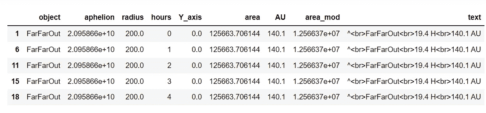

将数据可视化。

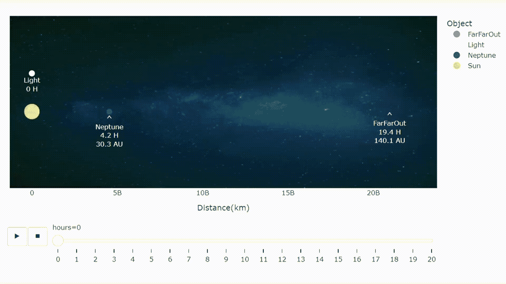

阳光到达远方的距离和时间。比例距离。尺寸不符合比例。作者的动画。由[爱德华多·罗萨](https://unsplash.com/@eduardorosal?utm_source=medium&utm_medium=referral)在 [Unsplash](https://unsplash.com?utm_source=medium&utm_medium=referral) 拍摄的壁纸照片。

# 每颗行星及其卫星。

太阳系中有卫星的行星是地球、火星、木星、土星、天王星和海王星。这里我将分别画出它们的一些卫星:月亮、戴莫斯、木卫四、伊帕托斯、奥伯龙和内索。

如果你想用他们的其他自然卫星做实验，代码可以修改。

创建一个行星和卫星的列表和一个字典来指定 Y 轴的值。

应用函数。

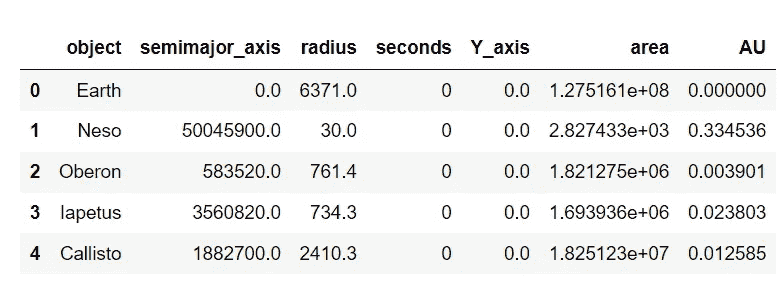

使用字典将 Y 轴值指定给对象。创建一个用于处理尺寸的列和一个用于注释的文本列。

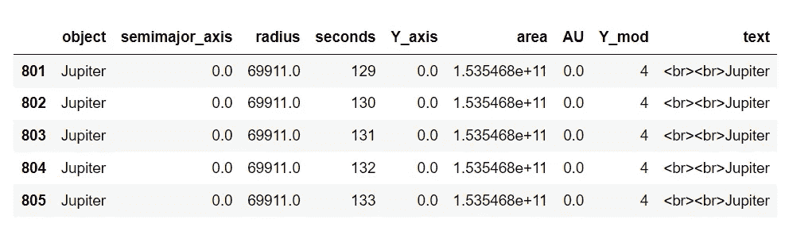

最后，可视化数据。

瞧啊。！…

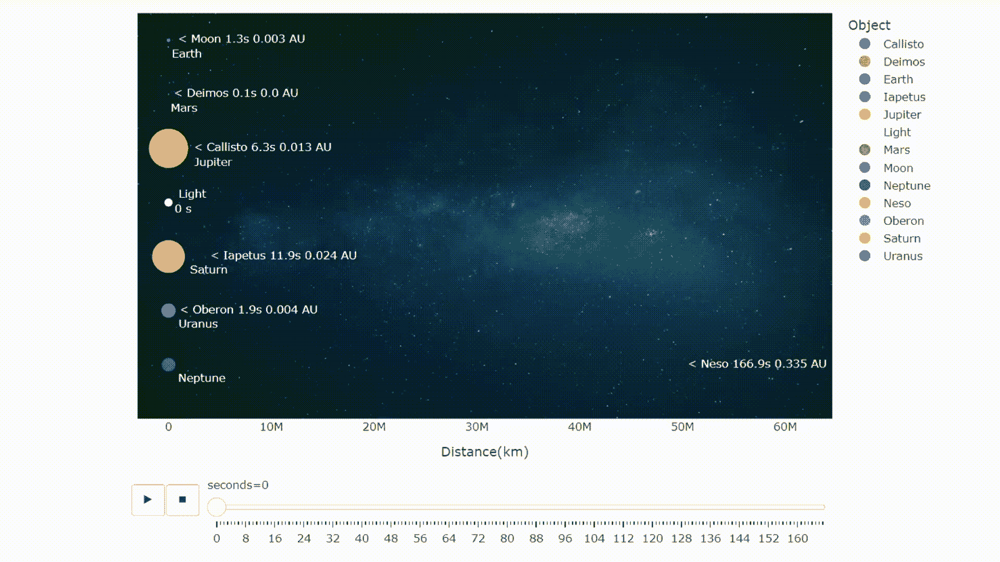

光从行星传播到其卫星的距离和时间。比例距离。尺寸不符合比例。作者的动画。由 [Eduardo Rosal](https://unsplash.com/@eduardorosal?utm_source=medium&utm_medium=referral) 在 [Unsplash](https://unsplash.com?utm_source=medium&utm_medium=referral) 上拍摄的壁纸照片。

# 关于数据

正如我提到的，我通过手动在维基百科上查找来收集本文中使用的天文数据。这些数据将来可以更改。如果有不正确或不及时的地方，请在评论中告诉我。

此外，天文大小，在现实中，太不同，如太阳和月亮。当它们被缩放用于绘图时，这是一个限制。因此，请注意本文中的一些结果不是按比例的。

# **总结**

本文展示了如何创建一个简单的动画来可视化光速。其他天体可以用同样的方法绘制。如果您有建议或问题，请随时发表评论。

感谢阅读。

这些是关于数据可视化的其他文章，您可能会感兴趣。

*   8 用 Python 处理多个时序数据的可视化([链接](/8-visualizations-with-python-to-handle-multiple-time-series-data-19b5b2e66dd0))
*   用 NASA 数据和 Python ( [链接](/visualize-the-invisible-so2-with-nasa-data-and-python-2619f8ed4ea1))可视化看不见的二氧化硫
*   用 Python 分 4 步进行图像颜色提取([链接](/image-color-extraction-with-python-in-4-steps-8d9370d9216e))

# 参考

*   j . des jardins(2019 年 11 月 11 日)。*可视化光速(快，但慢)*。视觉资本家。2022 年 5 月 9 日检索，来自[https://www . visual capitalist . com/visualizing-the-speed-of-light-fast-but-slow/](https://www.visualcapitalist.com/visualizing-the-speed-of-light-fast-but-slow/)
*   维基媒体基金会。(2022 年 5 月 11 日)。*太阳系*。维基百科。检索于 2022 年 5 月 12 日，来自[https://en.wikipedia.org/wiki/Solar_System](https://en.wikipedia.org/wiki/Solar_System)
*   维基媒体基金会。(2022 年 5 月 4 日)。*自然卫星*。维基百科。检索于 2022 年 5 月 12 日，来自[https://en.wikipedia.org/wiki/Natural_satellite](https://en.wikipedia.org/wiki/Natural_satellite)
*   维基媒体基金会。(2022 年 5 月 5 日)。 *2018 AG37* 。维基百科。于 2022 年 5 月 12 日从 https://en.wikipedia.org/wiki/2018_AG37 检索