# 可视化您的嵌入

> 原文：<https://towardsdatascience.com/visualizing-your-embeddings-4c79332581a9>

## 从 SNE 到 SNE 霸王龙和 UMAP 的进化指南

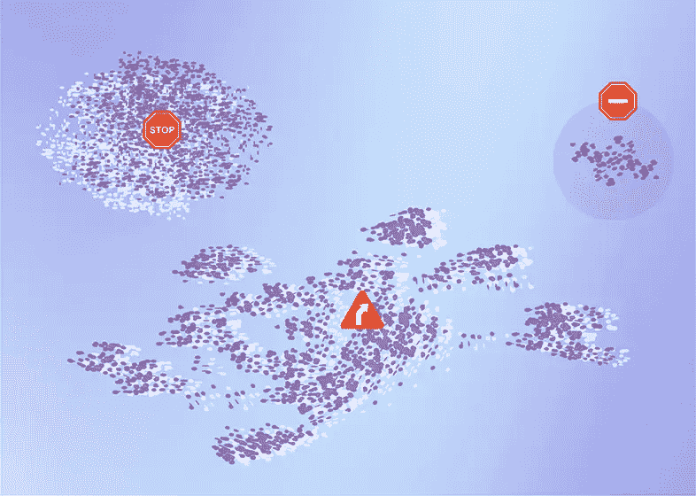

作者图片

## 介绍

根据[多项估计](https://mitsloan.mit.edu/ideas-made-to-matter/tapping-power-unstructured-data)，当今企业生成的 80%的数据是非结构化数据，如文本、图像或音频。这些数据在机器学习应用方面有着巨大的潜力，但在直接使用之前还有一些工作要做。*特征提取*帮助从原始数据中提取信息嵌入。嵌入，我和我的合著者和 Arize 的同事 Aparna Dhinakaran 在[的上一篇文章](/getting-started-with-embeddings-is-easier-than-you-think-e88b7b10bed1)中提到过，是许多深度学习模型的支柱；它们被用于 GPT 3，DALL E 2，语言模型，语音识别，推荐系统和其他领域。然而，一个长期存在的问题是，现在很难对嵌入和非结构化数据进行故障诊断。理解这种类型的数据具有挑战性，更不用说识别新的模式或变化了。为了有所帮助，有几种使用降维技术可视化数据集嵌入表示的突出方法。在[这篇文章](https://arize.com/blog-course/sne-t-sne-umap/)中，我们将介绍三种流行的降维技术及其演变。

首先值得注意的是，介绍这些技术的学术论文——SNE([“随机邻居嵌入](https://proceedings.neurips.cc/paper/2002/file/6150ccc6069bea6b5716254057a194ef-Paper.pdf)，作者杰弗里·辛顿和萨姆·罗韦斯)，t-SNE([“使用 t-SNE](https://www.jmlr.org/papers/volume9/vandermaaten08a/vandermaaten08a.pdf?fbcl) 可视化数据”，作者劳伦斯·范德马腾和杰弗里·辛顿)，以及 UMAP([乌玛普:统一流形近似和投影降维](https://arxiv.org/abs/1802.03426))，作者利兰·麦金尼斯、约翰·希利和詹姆斯·梅尔维尔——都值得完整阅读。也就是说，这些都是密密麻麻的文件。这篇文章旨在成为一个易于理解的指南——也许是阅读完整论文之前的第一步——帮助时间紧迫的 ML 从业者理解从 SNE 到 SNE t 到 UMAP 的潜在逻辑和演变。

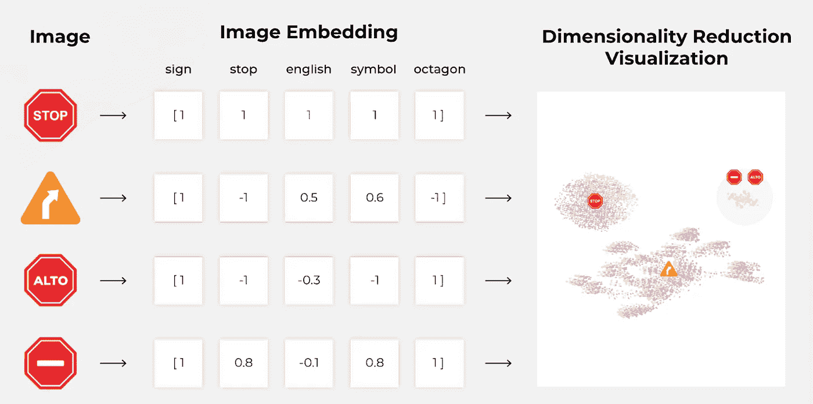

作者图片

## 什么是降维？

降维作为机器学习可视化和预处理的一项基本技术，在数据科学中扮演着重要的角色。降维方法将高维数据 *X={x0，x1，…，xN}* 映射到低维数据 *Y = {y0，y1，…，yN}* ，其中 *N* 是数据点的数量。

本质上，计算嵌入是一种降维形式。当处理非结构化数据时，输入空间可以包含大小为 WHC(宽度、高度、通道)、[标记化语言](https://arize.com/blog-course/tokenization/)、音频信号等的图像。例如，让输入空间由分辨率为 1024×1024 的图像组成。在这种情况下，输入维数大于一百万。让我们假设您使用 ReNet 或 EfficientNet 之类的模型，并提取 1000 维的嵌入。在这种情况下，你的输出空间维数是 1000，低了三个数量级！这种转换将非常大的、通常很稀疏的输入向量变成更小的(仍然具有相当大的大小)、**密集的**特征向量，或者*嵌入*。因此，我们将这个子空间称为*特征空间*或*嵌入空间*。

一旦我们有了与输入相关联的特征向量，我们该怎么处理它们呢？我们如何从它们身上获取人类可解读的信息？我们无法想象比三维更高的物体。因此，我们需要工具来进一步将嵌入空间的维度减少到两个或三个，理想情况下尽可能多地保留数据集的相关结构信息。

有大量的降维技术。它们可以分为三类:特征选择、矩阵分解和邻居图。我们将专注于后一类，其中包括 SNE(随机邻居嵌入)，t-SNE(t-分布式随机邻居嵌入)和 UMAP(一致流形逼近和投影)。

## 进化:SNE → t-SNE → UMAP

在这一节中，我们将从 SNE 开始讨论邻居图方法的发展。然后，我们将在此基础上，解释导致 SNE 霸王龙和后来的 UMAP 霸王龙的修改。

这三种算法的操作方式大致相同:

*   计算高维概率 *p* 。
*   计算低维概率*问*
*   通过给定的成本函数 *C(p，q)* 计算概率之间的差异。
*   最小化成本函数。

# 窦房结电图

本节涵盖了[随机邻居嵌入(SNE)算法](https://www.cs.toronto.edu/~fritz/absps/sne.pdf)。这将是我们进一步了解 SNE 霸王龙和 UMAP 的基础。

## 第一步:计算高维概率

我们从计算概率开始

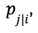

数据点 *i* 将选择另一个点 *j* 作为其邻居，

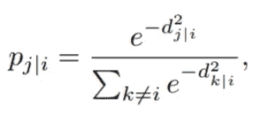

在哪里

代表高维点 *Xi* ， *Xj* 之间的相异。它被定义为缩放的欧几里德距离，

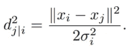

***数学直觉:*** *给定两点* X *i，* X *j，它们越远，它们的距离 dj|i 越高，它们的相异度越高，它们将彼此视为邻居的概率越低。*

***关键概念:*** *两个嵌入在空间中越远，它们越不相似。*

请注意，由于参数 *σi* 的原因，这种差异是不对称的。这是什么意思？在实践中，用户设置本地邻居的有效数量或*困惑度*。一旦选择了*困惑*、*k*；该算法通过二分搜索法找到 *σi* ,以使邻居上分布的熵相等

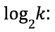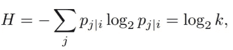

其中 *H* 是香农熵，以比特为单位。从前面的等式我们可以得到

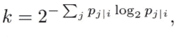

因此，通过调整 *σi，*我们可以调整右侧，直到它与用户设置的困惑度相匹配。局部邻居的有效数量(困惑度)越高， *σi* 越高，并且在相异度中使用的高斯函数越宽。

***数学直觉:*** *困惑度越高，越有可能将相距较远的点视为邻居。*

可能会出现一个问题:如果困惑是用户决定的，我们如何知道哪个是正确的？这是艺术与科学相遇的地方。对于我们可以使用散点图可视化的低维空间的有用投影来说，困惑的选择是至关重要的。如果我们选择的困惑度太低，那么我们期望由于相似性而在一起的数据点的聚类将不会出现在一起，而我们将会看到子聚类。另一方面，如果我们选择一个对于我们的数据集来说太大的困惑，我们将看不到正确的聚类，因为来自其他聚类的点将被认为是邻居。困惑没有一个确定的全好值。然而，有一些好的经验法则。

***建议:****[*SNE*](https://proceedings.neurips.cc/paper/2002/file/6150ccc6069bea6b5716254057a194ef-Paper.pdf)*和*[*t-SNE*](https://www.jmlr.org/papers/volume9/vandermaaten08a/vandermaaten08a.pdf?fbcl)*(是的，t-SNE 也有不惑力)使用 5 到 50 之间的不惑力值。**

*因为在许多情况下，没有办法知道正确的困惑是什么，从 SNE(和 t-SNE)那里得到最多可能意味着分析具有不同困惑的多个情节。*

## *第二步:计算低维概率*

*现在我们有了高维概率，我们继续计算低维概率，这取决于数据点在低维空间中的映射位置。幸运的是，这些更容易计算，因为 SNE 也使用高斯邻域，但是具有固定的方差(没有困惑参数)，*

*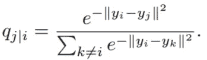*

## *第三步:选择成本函数*

*如果点 *Yi* 在低维空间放置正确，条件概率 *p* 和 *q* 会非常相似。为了测量这两种概率之间的不匹配，SNE 使用了 Kullback-Leibler 散度作为每个点的损失函数。高维和低维空间中的每个点都有条件概率将另一个点称为其邻居。因此，我们有多少数据点就有多少损失函数。我们将成本函数定义为所有数据点上 KL 散度的总和，*

*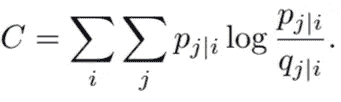*

*该算法首先将所有 y *i* 放置在非常靠近原点的随机位置，然后使用梯度下降来训练最小化成本函数 *C* 。关于成本函数微分的细节超出了本文的范围。*

*关于所使用的损失函数，有必要发展一些直觉。该算法的创造者[表示](https://proceedings.neurips.cc/paper/2002/file/6150ccc6069bea6b5716254057a194ef-Paper.pdf)“虽然 SNE 强调局部距离，但它的成本函数干净地强制保持附近物体的图像在附近，并保持相距较远的物体的图像相对较远。”让我们看看这是否是真的，使用下一张图，我们可以分别看到高维和低维概率 *p* 和 *q* 的 KL 散度。*

*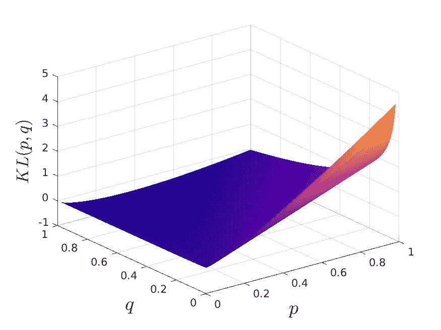*

*库尔贝克-莱布勒分歧:作者图片*

*如果在高维空间中两个点靠得很近，它们的相异度很低，概率 *p* 应该很高( *p ~ 1* )。那么，如果它们被映射到很远的地方，低维概率就会很低(*Q0*)。在这个场景中，我们可以看到损失函数取了很高的值，严重地惩罚了这个错误。另一方面，如果两个点在高维空间中彼此远离，则它们的相异度高，并且概率 p 应该低( *p0* )。然后，如果它们被映射到彼此附近，低维概率将会很高( *q1* )。我们可以看到 KL 背离并没有像我们希望的那样惩罚这个错误。这是 UMAP 将解决的一个关键问题。*

# *t-SNE*

*至此，我们对 SNE 的工作原理有了一个很好的了解。然而，该算法有两个 t-SNE 试图解决的问题:它的成本函数很难优化，并且它有一个拥挤问题(下面将详细介绍)。为了解决这些问题， [t-SNE](https://www.jmlr.org/papers/volume9/vandermaaten08a/vandermaaten08a.pdf) 引入了两个主要的修改:对称化和使用低维概率的 t 分布。这些修改可以说使 t-SNE 成为多年来可视化降维的最先进技术，直到 UMAP 出现。*

## *对称 SNE*

*第一个修改是使用 SNE 的对称版本。一般来说，到目前为止描述的条件概率是不对称的。这意味着点 *xi* 将点 *xj* 视为其邻居的概率与点 *xj* 将点 xi 视为邻居的概率不同。我们通过定义来对称化高维空间中的成对概率*

*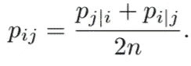*

*这个定义*

*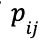*

*每一个数据点*

*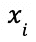*

*对成本函数有不可忽略的贡献。你可能会想，低维概率呢？*

## *拥挤问题*

*就我们目前所知，如果我们想要正确地投射点与点之间的近距离，中等距离会被扭曲，并在低维空间中表现为巨大的距离。[根据 t-SNE 的作者的说法，这是因为“可用于容纳距离适中的数据点的二维地图区域，与可用于容纳附近数据点的区域相比，不够大。”](https://www.jmlr.org/papers/volume9/vandermaaten08a/vandermaaten08a.pdf)*

*为了解决这个问题，引入的第二个主要修改是使用学生 t-分布(这是将‘t’赋予 t-SNE 的原因),低维概率具有一个自由度，*

**

*现在成对概率是对称的*

*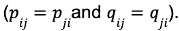*

*主要优点是对称成本函数的梯度，*

*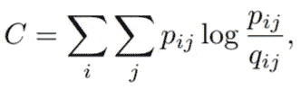*

*具有更简单的形式，计算起来更容易、更快，从而提高了性能。*

*由于 t-SNE 也使用 KL 散度作为它的损失函数，它也带来了前一节讨论的问题。这并不是说它完全被忽视了，但主要的收获是 SNE 霸王龙严格地优先考虑当地结构的保护。*

****直觉:*** *由于 KL 散度函数没有对高维空间中距离较远的点在低维空间中的错位进行惩罚，所以我们可以得出结论，全局结构没有得到很好的保存。SNE 霸王龙会把相似的数据点归为一类，但是类之间的距离可能没有任何意义。**

# *UMAP*

*[用于降维的统一流形近似和投影](https://arxiv.org/pdf/1802.03426.pdf) (UMAP)与 t-SNE 有许多相似之处，也有一些非常关键的差异，这使得 UMAP 成为我们降维的首选。*

*这篇介绍这项技术的文章不适合胆小的人。它详细介绍了基于流形理论和拓扑数据分析的 UMAP 的理论基础。我们不会进入理论的细节，但请记住这一点:UMAP 的算法决策是由强大的数学理论证明的，这最终将使它成为机器学习的高质量通用降维技术。*

*现在我们已经了解了 SNE 霸王龙是如何工作的，我们可以在此基础上谈论它与 UMAP 的区别以及这些区别的后果。*

## *相似之处的图表*

*与研究概率的 t-SNE 不同，UMAP 直接研究相似性。*

*   *高维相似性:*

*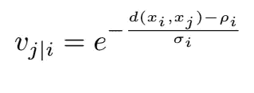*

*   *低维相似性:*

**

*请注意，在两种情况下**都没有应用归一化**(无分母)，不像 t-SNE，性能有相应的提高。高维相似性的对称化是使用概率 t-conorm 实现的:*

*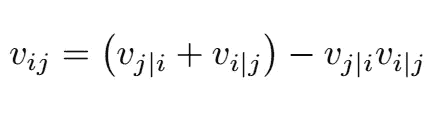*

*此外，UMAP 允许为高维相似性(eq)选择不同的度量函数 d。我们需要解决的是*

*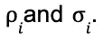*

*前者表示低维空间中接近点之间的最小期望间隔，而后者被设置为这样的值*

*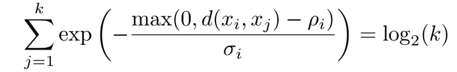*

*其中 *k* 是最近邻居的数量。两者*

**

*是超参数，其影响将在本节末尾讨论。*

## *优化改进*

*在算法的优化阶段，UMAP 的创造者做出了一些对其出色性能起着至关重要作用的设计决策，包括:*

1.  ***UMAP 使用交叉熵作为损失函数**，而 t-SNE 使用 KL 散度。CE 损失函数既有引力又有斥力，而 KL 只有引力(值得注意的是 t-SNE 有斥力但不在损失函数上。排斥力出现在相似矩阵的重整化过程中。然而，全局重正化是非常昂贵的，UMAP 通过使用 CE 损失使它更简单，并且在保持全局结构上具有更好的结果)。通过损失函数的这种新选择，将高维空间中远离的对象放置在低维空间中附近是不利的。得益于损失函数的更好选择，UMAP 比它的前辈们能捕捉到更多的全局结构。*

***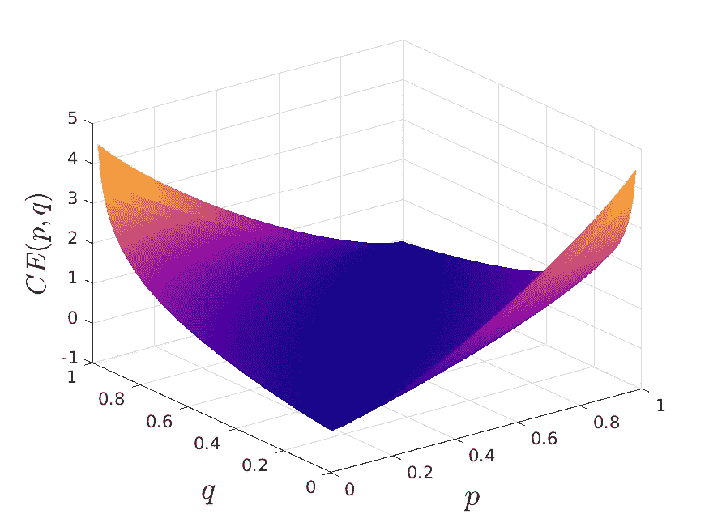*

*(a)t-SNE 使用的 KL 损失|(b)m 使用的 CE 损失(两幅图片均由作者提供)*

*图:SNE 和 UMAP 使用的损失函数比较。当高维空间中的远点在低维空间中被紧密地映射在一起时，交叉熵损失(b)是不利的。kull back-lei bler 损失(a)没有做到这一点。*

*2. **UMAP 使用随机梯度下降**来最小化成本函数，而不是较慢的梯度下降。*

## *初始化的选择*

***UMAP 使用光谱初始化，而不是低维点的随机初始化**。一个非常方便的拉普拉斯特征映射初始化(遵循理论基础)。这种初始化相对较快，因为它是从线性代数运算中获得的。它为随机梯度下降提供了一个良好的起点。理论上，这种初始化是确定性的。然而，考虑到所涉及的大型稀疏矩阵，计算技术提供了近似的结果。因此，不保证确定性，但实现了极大的稳定性。这种初始化提供了更快的收敛以及更大的一致性，即 UMAP 的不同运行将产生相似的结果。*

*还有其他一些差异值得探究。此外，UMAP 还有几个缺点。请继续关注关于 UMAP 利弊的下一篇文章。*

## *结论*

*在过去的几十年里，可视化嵌入的技术取得了长足的进步，数学、计算机科学和机器学习的成功结合使新算法成为可能。从 SNE 到 SNE 和 UMAP 的演变为数据科学家和机器学习工程师更好地理解他们的数据和解决模型问题开辟了新的可能性。*

*想了解更多？了解为什么开始使用[嵌入](https://arize.com/blog-course/embeddings-meaning-examples-and-how-to-compute/)比您想象的要容易。有什么问题吗？欢迎来到[阿里斯社区](https://arize.com/community-new/)。*