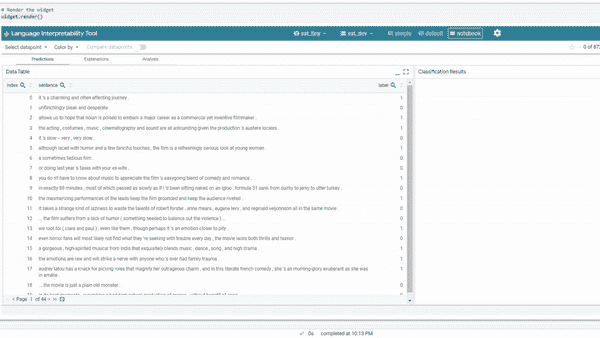
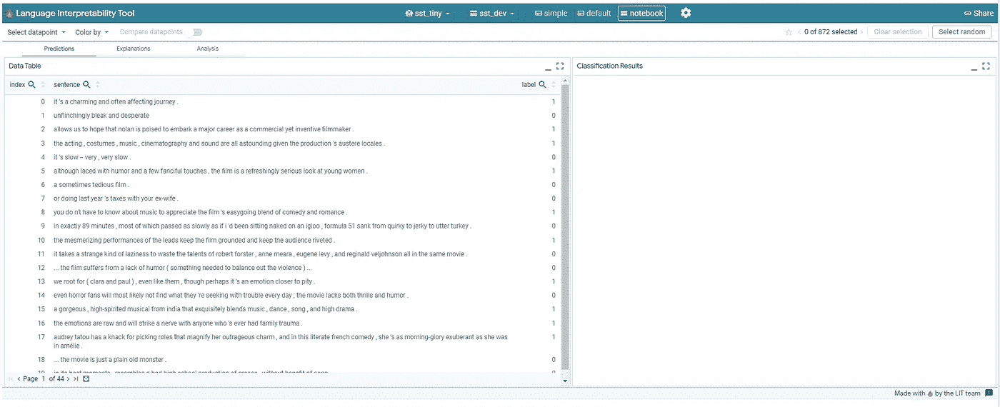

# 自然语言处理的可视化交互模型

> 原文：<https://towardsdatascience.com/visually-interactive-model-for-nlp-841c8a83918f>

## 使用 LIT 创建理解基于 NLP 的机器学习模型的可视化界面



文学(来源:作者)

NLP(自然语言处理)是数据科学的一个分支，处理理解和分析文本数据集，如分析情感，创建聊天机器人，推荐引擎等。它是人工智能最先进的概念之一。

随着越来越多的算法和技术的出现，创建 NLP 模型变得很容易，但是理解该模型以及预测是如何产生的仍然是未知的。我们如何了解我的模型在哪些数据上表现不佳？我的模型容易产生敌对行为吗？如果我改变了文本数据的样式，我的模型将如何表现？

这些问题现在可以很容易地用 LIT 来回答和分析。它是一个开源的 python 库，用于创建一个可视化的交互式仪表板，可以用来分析 NLP 模型、它们的预测、它们的行为等。以视觉上吸引人和互动的方式。

在本文中，我们将探索 LIT 并创建一个交互式仪表板来分析 NLP 模型。

让我们开始吧…

# 安装所需的库

我们将从使用 pip 安装来安装 LIT 开始。下面给出的命令将使用 pip 安装 LIT。

```
!pip uninstall -y tensorflow-datasets
!pip install lit_nlp tfds-nightly transformers==4.1.1
```

# 下载模型重量

在第一步中，我们将从下载预先训练的模型权重开始，这些权重将用于我们将要分析的模型。

```
!wget [https://storage.googleapis.com/what-if-tool-resources/lit-models/sst2_tiny.tar.gz](https://storage.googleapis.com/what-if-tool-resources/lit-models/sst2_tiny.tar.gz)
!tar -xvf sst2_tiny.tar.gz
```

# 导入所需的库

在这一步中，我们将导入加载数据集所需的所有库，从 LIT 示例中加载现有的 NLP 模型，并使用 LIT 对其进行渲染。

```
from lit_nlp import notebook
from lit_nlp.examples.datasets import glue
from lit_nlp.examples.models import glue_modelsdatasets = {'sst_dev': glue.SST2Data('validation')}
models = {'sst_tiny': glue_models.SST2Model('./')}widget = notebook.LitWidget(models, datasets, height=800)
```

之后，最后一步是在 Colab 笔记本中呈现这个小部件，并可视化仪表板。

# 可视化仪表板

下面给出的命令将在笔记本本身中呈现仪表板。

```
widget.render()
```



仪表板(来源:作者)

在这个控制面板中，有不同的部分，我们可以在其中分析数据并查看其执行情况，我们可以单独分析每个预测，还有更多的选项。您可以在下面的视频中看到不同的功能。


分析自然语言处理模型(来源:作者)

在这里，您可以看到我们使用一个高度交互式和视觉上吸引人的仪表板来分析 NLP 模型是多么容易。

尝试使用不同的数据集，创建这些仪表板，并让我知道您在回复部分的评论。

本文是与 [Piyush Ingale](https://medium.com/u/40808d551f5a?source=post_page-----841c8a83918f--------------------------------) 合作完成的。

# 在你走之前

***感谢*** *的阅读！如果你想与我取得联系，请随时通过 hmix13@gmail.com 联系我或我的* [***LinkedIn 个人资料***](http://www.linkedin.com/in/himanshusharmads) *。可以查看我的*[***Github***](https://github.com/hmix13)**简介针对不同的数据科学项目和包教程。还有，随意探索* [***我的简介***](https://medium.com/@hmix13) *，阅读我写过的与数据科学相关的不同文章。**