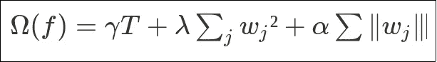
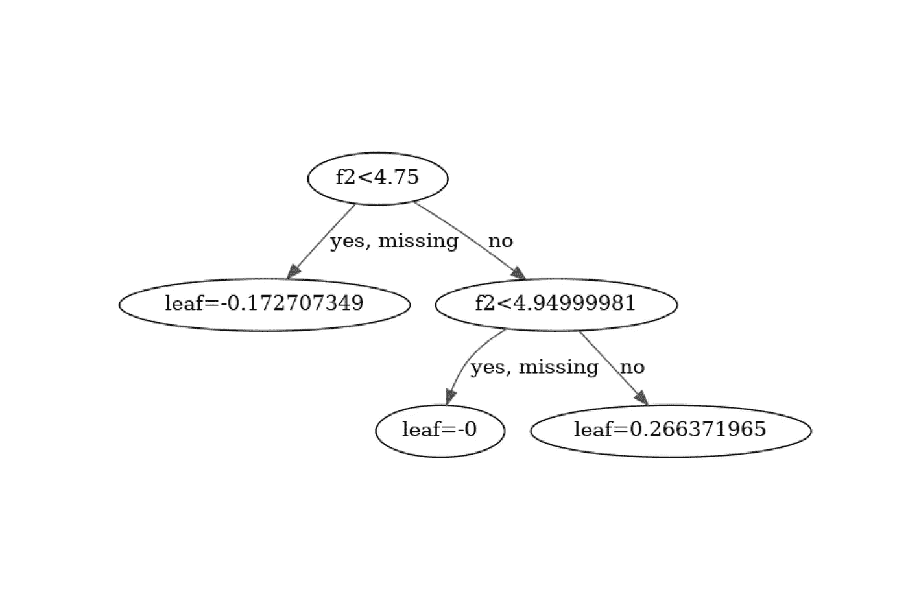
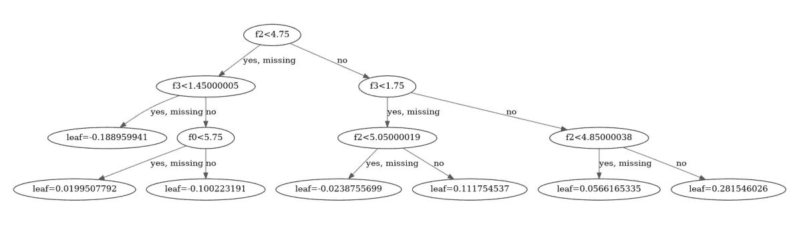
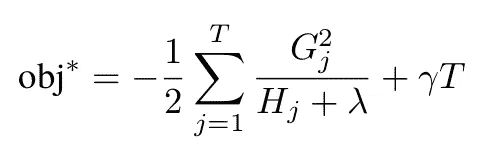
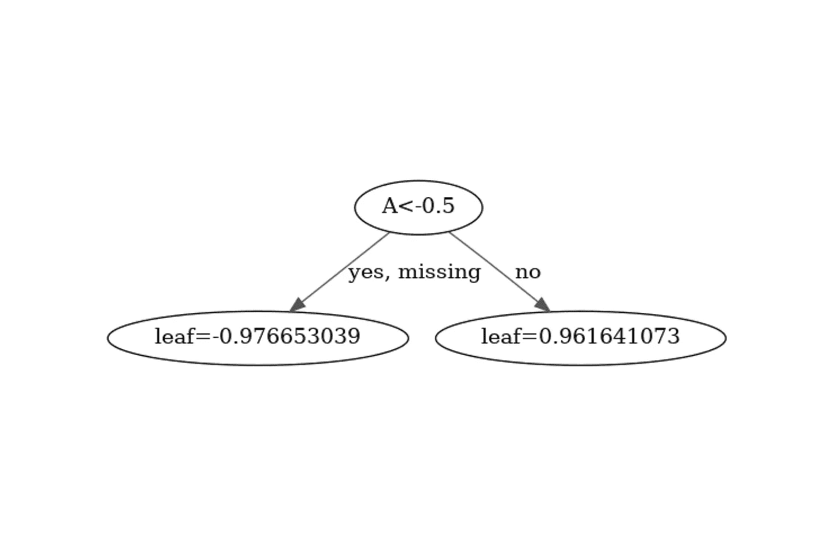
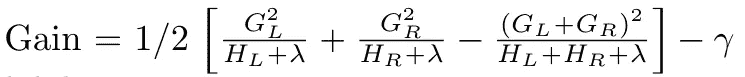
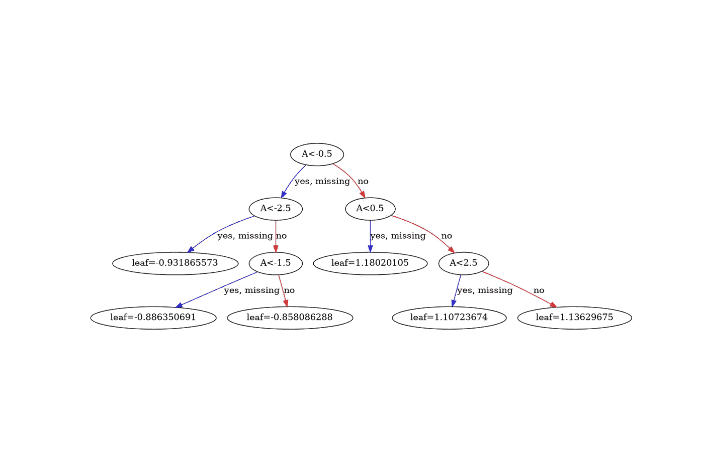
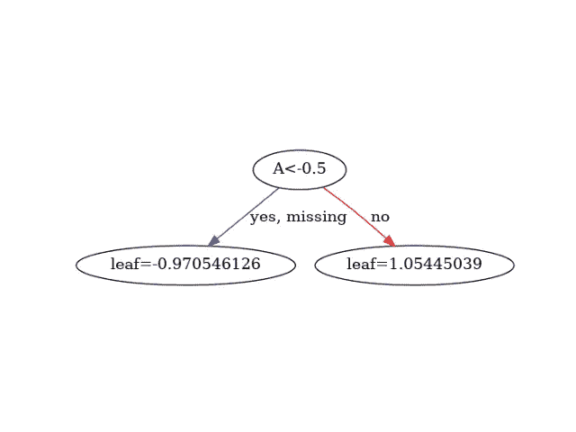

# 直观理解 XGBoost、LightGBM 和 CatBoost 正则化参数

> 原文：<https://towardsdatascience.com/visually-understand-xgboost-lightgbm-and-catboost-regularization-parameters-aa12abcd4c17>

里卡多·戈麦斯·安吉尔在 [Unsplash](https://unsplash.com?utm_source=medium&utm_medium=referral) 上的照片

> **更新**:发现我关于渐变提升的新书[实用渐变提升](https://www.amazon.com/dp/B0BJ82S916)。这是用 python 中的许多例子对渐变增强的深入探究。

 [## 实用的渐变增强:深入探究 Python 中的渐变增强

### 这本书的梯度推进方法是为学生，学者，工程师和数据科学家谁希望…](https://www.amazon.com/dp/B0BJ82S916) 

# 构建正确的模型

当考虑一个数据科学问题时，一个优秀的数据科学家应该对驱动其模型性能的主要特性有所了解。

尽管从理论上讲，相信自动 ml、自动特征化、自动超参数调整会更好，但依靠人类的专业知识来驱动模型调整通常更省时省力。

结合人类的直觉和计算机科学马力是非常强大的。

将人类的直觉转化为模型选择和训练需要对模型如何工作有深刻的理解。

# 一幅画胜过千言万语

在本文中，我们将直观地展示当使用梯度推进方法时，超参数如何控制系综树的形状。

有许多这样的参数，但是我们将集中于驱动模型复杂性的参数:正则化参数。

幸运的是，(逻辑上)决策树的梯度提升的三个主要实现 XGBoost、LightGBM 和 CatBoost 主要共享相同的正则化超参数。

# 超参数及其对决策树构建的影响

在详细讨论最重要的超参数之前，让我们先介绍一些结构。

我们可以将超参数分为三类:

*   驱动树结构的超参数
*   驱动权重值的超参数
*   推动训练的超参数

正则化参数通常影响树结构以及权重值。

## 结构超参数

第一类对树的结构有影响:本质上是树的深度和叶子的数量。

## 内容超参数

第二组控制附加到叶子上的值，即预测值。

## 学习超参数

最后，第三种驱动训练:算法是否使用所有样本，我们是否应用所有计算的增益，…

# 可视化正则化超参数

## Reg alpha

先说一个重要但不容易理解的参数:`reg_alpha`。顾名思义，该参数对模型的正则化有影响。

正则化是一种数学方法，其目标是使函数光滑。它经常被用在物理学中，把一个不规则的函数转化成一个规则的，光滑的函数。

使用正则化函数非常方便，因为这种函数在微分时有很好的性质。当应用梯度推进时，我们需要一个至少可以微分两次的函数:一次是梯度，另一次是 Hessian。

对于决策树的梯度推进，正则化函数如下所示:

大多数 GBT 方法中使用的正则化公式。作者的公式。

在训练期间，该算法试图最小化该函数以及目标函数。

在这个公式中可以看到，`alpha`是正则化函数`Omega`的三个参数之一。

`gamma`用于控制如何惩罚模型中的树的数量。

`lambda`控制我们想要惩罚多少平方树叶权重的总和。当应用平方函数时，我们通常将该参数称为 L2 正则化项。

`alpha`控制我们想要惩罚多少叶子权重的绝对值之和。我们通常将该参数称为 L1 正则化项，因为仅应用了绝对误差。

已知使用高`alpha`生成所谓的*稀疏模型，即*模型，其中权重趋于零。最大化空值至少有两个好处:

*   它简化了模型
*   它减小了模型的大小，因为不需要存储空值。

这类似于*稀疏矩阵*。让我们看看下面的代码，在著名的虹膜分类数据集上，低的`alpha`与高的`lambda`相比如何:

比较高 L2 正则化和高 L1 正则化。作者代码。

两个模型的表现都很好，但是正如你所看到的，在第一个模型中，使用 L2 正则化，没有权重是空的，而在第二个例子中，使用 L1 正则化，我们得到 65 个空权重。

因此使用非空的`reg_alpha`降低了模型的复杂性。

正如这篇文章所承诺的，我们可以看到不同之处。让我们看看使用 L1 正则化时的其中一个树:

当使用高α时，第五个估计量。作者的情节。

使用高 L2 正则化的相同估计量:

当使用高λ时，第五个估计器。作者的情节。

正如你所看到的，在 L1 的例子中，生成的树要简单得多，并且包含零作为权重。

## Reg lambda

现在让我们更深入地了解一下`lambda`。你可能已经注意到，或者已经知道，如果你已经读过我以前的文章:

  

`lambda`缩放平方权重的和`w_j`，因此在相对于`w_j`求导时仍然出现。

这意味着与`alpha`相反，`lambda`对梯度值有影响，并隐含在最优解中:

最佳重量公式。由作者创作。

正如我在以前的文章中所述，当目标函数是平方误差时，hessian 的值是 2，因此`H_j`是附加到当前节点的样本数量的两倍。

这意味着`lambda`的值越大，越会降低最佳值，因为只有几个样本附加到一个节点上。

但这并不是`lambda` as 在训练上的唯一效果。它还具有结构效应，因为`lambda`也隐含在最佳增益中:

最佳增益公式。作者的公式。

提醒一下，最佳增益用于选择节点的最佳分割。具有最佳增益的分割将被保留为最佳分割。

相对于样本数量而言具有大的`lambda`也会降低增益以及给定分割被认为是最佳分割的机会。

让我们用一个简单的例子来说明这一切:我们想根据整数的符号对它们进行分类。负整数应该标记为 1，而负整数应该标记为-1:

过度拟合模型。作者代码。

正如我们可以立即看到的，这个模型是过度拟合的，因为每个预测都有一个唯一的标签，而只需要两个标签。

让我们为`lambda`使用一个正值:

我们现在只预测两个值。作者代码。

正如预期的那样，使用更大的`lambda`值，得到的模型得到了简化。它现在只预测两个值。这是`lambda`对生成的树的结构影响。

然而，正如我们在上面看到的，`lambda`倾向于减少权重值，因此我们不预测 1 和-1，而是预测更小的值。使用更大的数据集在理论上应该可以减少这种影响，has `lambda`在样本数量方面将变得可以忽略不计。

作者代码。

正如所料，更大的数据集减少了`lambda`对权重的影响。该模型现在预测的值非常接近 1 和-1。

生成的树现在是:

一个简单的模型，使用正确的λ。作者的情节。

## 微克

正则化函数中隐含的另一个参数是`gamma`，正如你在上面`Omega`的定义中看到的。

看看这个公式，当有太多的树时，`gamma`通过惩罚目标来增加模型的复杂性。`T`树木的总数。

查看针对给定拆分添加两个新节点所带来的增益公式也很有趣:

非零伽玛会产生负增益。作者的公式。

该公式表明，只有当 gamma 为空时，两个新节点的增益大于原始节点的增益，拆分才会产生正增益。

使用非空伽马增加了另一个约束:增益必须大于`gamma`，否则增益将为负。

让我们看看上一篇关于对负整数和正整数进行分类的文章，如何使用`gamma`来获得一个合适的模型:

不使用和使用 gamma 训练模型。作者代码。

第一个模型是用`gamma = 0`训练的，我们可以看到模型在预测中过度拟合。我们不是只有两个值，而是每个输入都有不同的值。

生成的树太复杂了:

当 gamma 为空时，模型复杂性不受控制。作者的情节。

相反，第二个模型使用`gamma = 1`，这意味着当且仅当增益大于 1 时，新的级别被添加到树中。

预测表明，这一次我们有了一个合理的模型，因为我们只预测了两个不同的值:一个正值和一个负值。

绘制结果树证实了:

当 gamma 为非空时，得到的树被简化。作者的情节。

# 结论

Alpha、Lambda 和 gamma 是驱动决策树构建的三个重要参数。

总的来说，使用`alpha`生成稀疏树，这将强调主要特征并丢弃其他特征。这导致了简单的树

`lambda`用于剔除数量不足或至少重量不足的样品。

最后，`gamma`作为对树中节点数量的直接影响。