# VS 数据科学代码

> 原文：<https://towardsdatascience.com/vs-code-for-data-science-aee82fe08bac>

## 一个好的 Visual Studio 代码设置如何使您成为一个更有生产力的数据科学家

戈弗雷·尼安杰奇在 [Unsplash](https://unsplash.com?utm_source=medium&utm_medium=referral) 上拍摄的照片

# TL；速度三角形定位法(dead reckoning)

VS 代码对于数据科学来说非常有用，尤其是如果你选择了最好的扩展；在这篇文章中，我分享了一些我最喜欢的扩展和我的配置。

# 什么是 VS 代码？

  

它是由微软维护的开源 IDE，微软还拥有 GitHub 和 OpenAI。

它是目前[最受程序员欢迎的 IDE](https://insights.stackoverflow.com/survey/2021#section-most-popular-technologies-integrated-development-environment)[1】，非常具有可扩展性和个性化，并且可以处理我们通常使用的所有工具和文件格式。

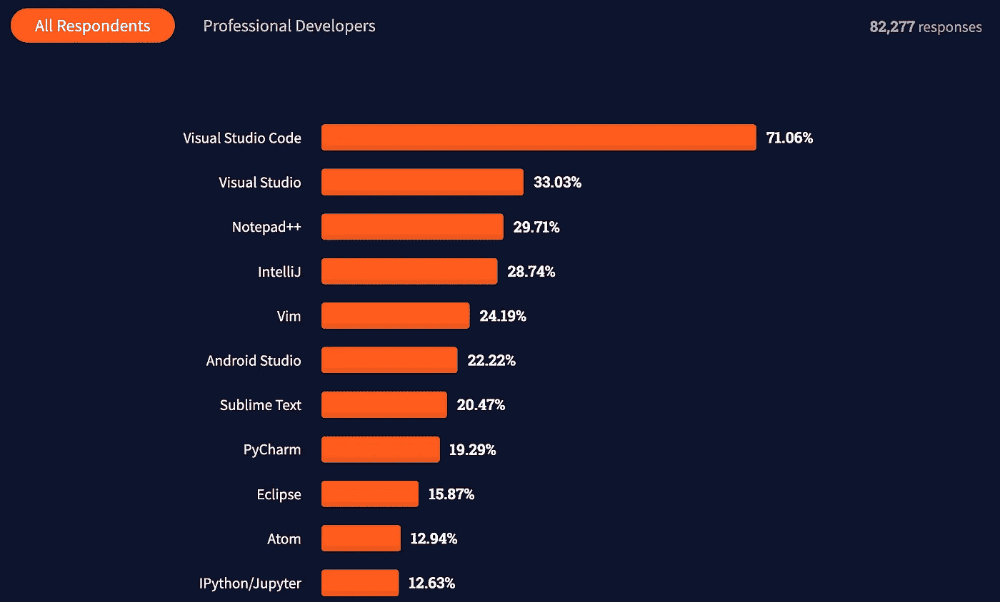

StackOverflow 的 2021 年开发者调查中显示了最常用的 ide。

# 副驾驶员

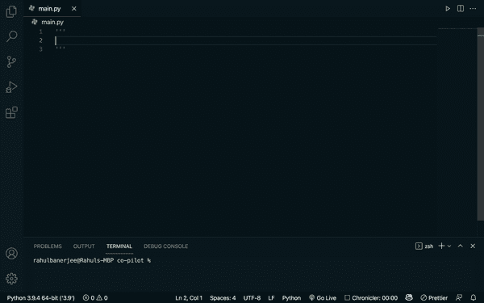

在 VS 代码中使用 [Copilot](https://marketplace.visualstudio.com/items?itemName=GitHub.copilot) 生成文档和 Python 代码的例子。从 [Rahul Banerjee](/some-experiments-using-github-copilot-with-python-90f8065fb72e) 获得的 GIF。

## 描述

[GitHub Copilot](https://copilot.github.com/) 是 GitHub 最近开发的 IDE 扩展，它使用 OpenAI 在代码和文本上训练的模型，可以提供非常有用的自动完成功能。这超越了通常的自动完成，在通常的自动完成中，我们只能获得给定对象的可用属性和方法的列表，以向我们建议完整的代码行、整个方法甚至注释和文档！

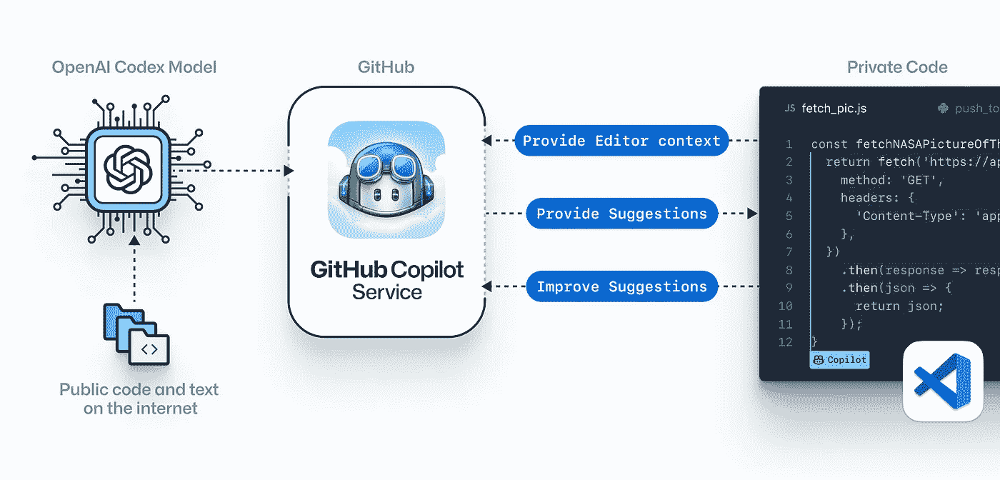

图片来自 [GitHub Copilot 的网页](https://copilot.github.com/)。

为了使用它，您需要注册[技术预览](https://copilot.github.com/):

  

## 扩展ˌ扩张

  

# 自动重新格式化和警告

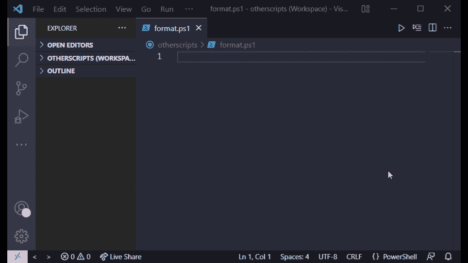

VS 代码在保存文件时如何自动更正格式的例子。从[韦斯利·卡马戈](https://www.c-sharpcorner.com/blogs/its-time-to-tidy-up-your-code-how-to-use-vs-code-autoformat)处获得的 GIF。

## 描述

如果您使用格式化和林挺库，如`flake8`和`black`(您应该这样做)，那么 VS Code 可以在每次保存文件时自动格式化您的代码，从而使它变得更容易。

您还会在可能违反代码样式规则的代码行中得到警告。

## 扩展ˌ扩张

在这种情况下不需要扩展，默认情况下它已经包含在 VS 代码中了！

# 搜索和替换

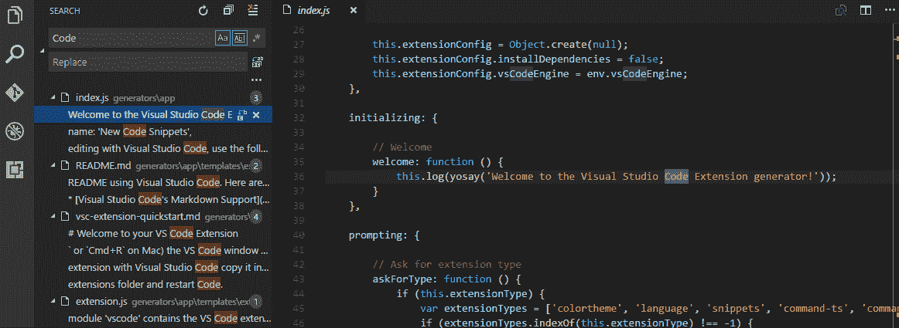

在 VS 代码中使用搜索工具查找所有出现的单词`Code`的例子。从 [Visual Studio 代码网站](https://code.visualstudio.com/)获得的 GIF。

## 描述

在 VS Code 的侧边栏上，您可以找到搜索工具，它可以快速找到您在整个目录中搜索的所有内容。此外，它允许你快速地用一个*替换所有的*，例如在一个变量被重命名的情况下。

## 扩展ˌ扩张

在这种情况下不需要扩展，默认情况下它已经包含在 VS 代码中了！

# 证明文件

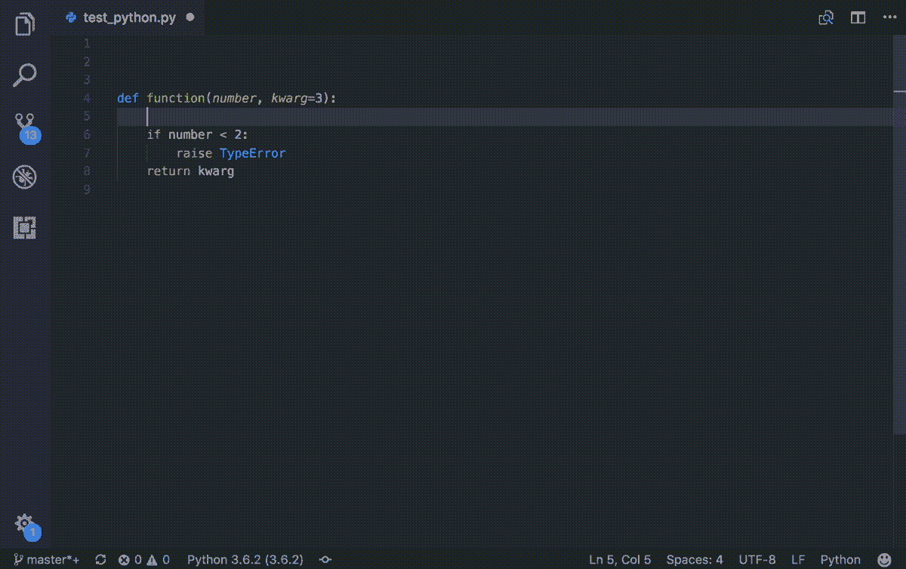

通过 [autoDocstring](https://marketplace.visualstudio.com/items?itemName=njpwerner.autodocstring) 扩展生成函数文档样板的例子。从[尼尔斯·沃纳](https://github.com/NilsJPWerner/autoDocstring)处获得的 GIF。

## 描述

记录代码是非常重要的，即使你不开源你的代码。总有这样的机会，你需要有人检查你的代码，甚至对你未来的自己来说，它可以帮助你记住它是如何工作的(老实说，看看你刚刚写的莫名其妙的东西🤷‍♂️ ).

两个扩展在这里很有帮助:

*   [autoDocstring](https://marketplace.visualstudio.com/items?itemName=njpwerner.autodocstring) :输入`"""`后，为函数生成样板文档。
*   Copilot :它的自动完成功能可以完全生成你的整个文档，理解每个变量的上下文以及你的代码是如何工作的(只是要小心，有时它会完全误解事情的意思)。

## 扩展ˌ扩张

    

# 调试脚本

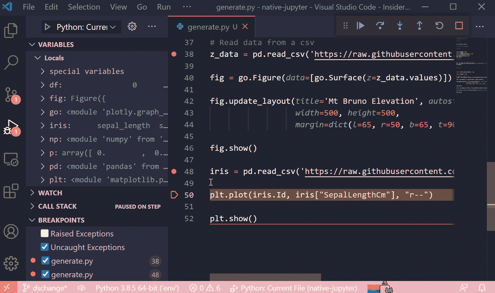

在 VS 代码中调试 Python 脚本的例子，包括通过 data viewer 分析数据帧。从 [Visual Studio 杂志](https://visualstudiomagazine.com/home.aspx)获得的 GIF。

我用它来进行一些调试会话。

## 描述

每个人都有可能定期面对代码中的错误。在数据科学中，你甚至会遇到数据和模型的错误。为了找出问题所在并修复它，没有什么比一个好的调试会话更好的了。

VS 代码允许我们调试脚本和笔记本，具有断点和调试控制台的所有常见功能，并添加了一些工具，如数据查看器，以检查那些可疑的数据帧。

您可以在一个`launch.json`中配置您的调试设置，在这里您可以更改设置来调试外部代码(通过`justMyCode`参数)和传递命令行参数(通过`args`参数)。

## 扩展ˌ扩张

在这种情况下不需要扩展，默认情况下它已经包含在 VS 代码中了！

# 笔记本电脑

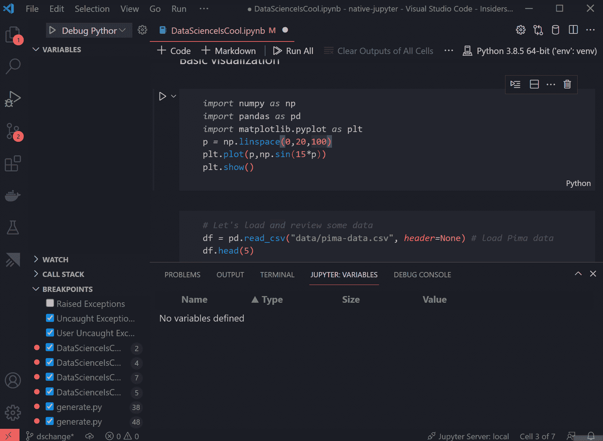

在 VS 代码中使用笔记本并调试笔记本单元的例子。从[微软 Python 博客](https://devblogs.microsoft.com/python/)获得的 GIF。

## 描述

无论你是喜欢笔记本还是讨厌笔记本，它们都是探索数据、测试代码和进行建模实验的常用格式。虽然 Jupyter 笔记本可能有其问题，但我个人认为 VS Code【4】中的[笔记本是一个重大改进。您可以在单个单元格上继续编码，并在 Markdown 中混合，但您也可以获得与编写脚本时相同的工具箱，如自动完成、调试和您可能已经安装的大多数其他扩展，如 Copilot 和 IDE 主题。您还可以看到运行每个单元所花费的时间，在我看来，这比在 Jupyter 中得到一个更好的 UI。](https://code.visualstudio.com/docs/datascience/jupyter-notebooks)

  

## 扩展ˌ扩张

        

# 对虚拟机的远程访问

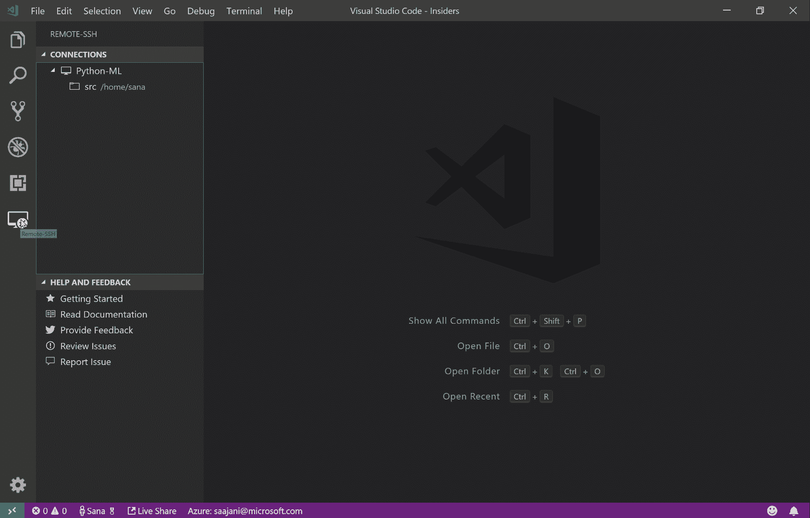

VS 代码中通过[远程 SSH](https://marketplace.visualstudio.com/items?itemName=ms-vscode-remote.remote-ssh) 连接到服务器或 VM 的例子。从[微软开源](https://opensource.microsoft.com/)获得的 GIF。

## 描述

您可能会在服务器、虚拟机或其他一些您可能希望通过 SSH 连接的硬件上运行代码。幸运的是，通过使用[远程 SSH](https://marketplace.visualstudio.com/items?itemName=ms-vscode-remote.remote-ssh) 扩展，您可以连接到它们中的任何一个，并且仍然继续使用您的本地 VS 代码安装。

## 扩展ˌ扩张

  

# 实时共享/协作编码

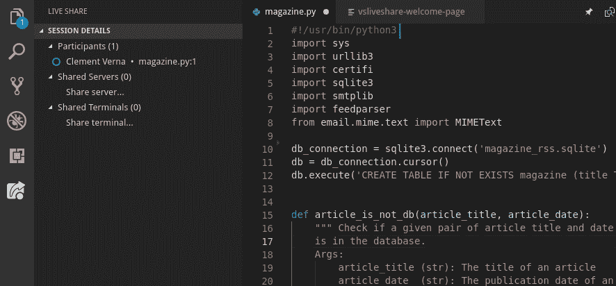

在 VS 代码上使用 [live share](https://marketplace.visualstudio.com/items?itemName=MS-vsliveshare.vsliveshare) 的例子，让多人同时处理同一个代码。从 [Fedora 杂志](https://fedoramagazine.org/)获得的 GIF。

## 描述

你知道如何在谷歌文档中实时协作编辑文档吗？你可以在 VS 代码中做同样的事情，即使你们不在同一个房间，也可以进行结对编程。

## 扩展ˌ扩张

  

# Git 管理

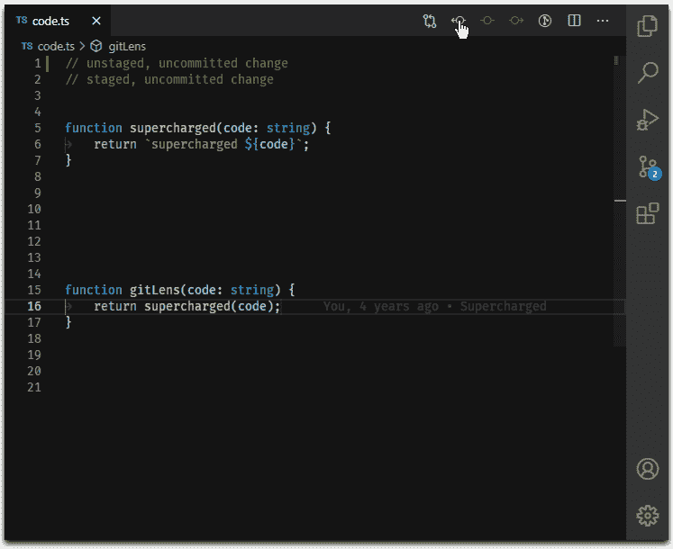

通过 [GitLens](https://marketplace.visualstudio.com/items?itemName=eamodio.gitlens) 扩展名检查 VS 代码中文件先前提交版本的例子。从 [GitLens](https://marketplace.visualstudio.com/items?itemName=eamodio.gitlens) 获得的 GIF。

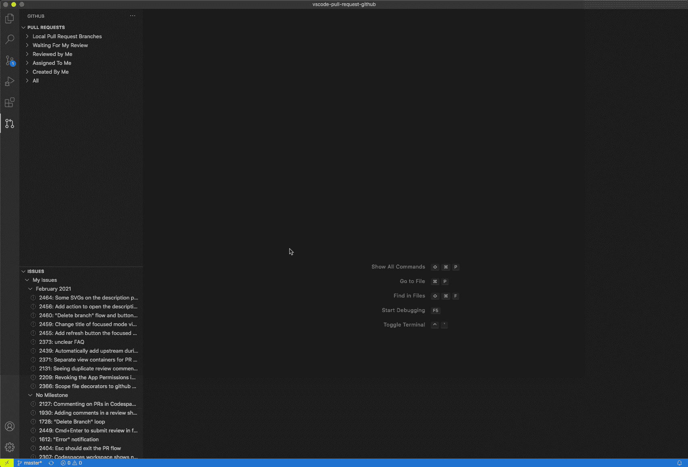

通过 [GitHub 拉请求和发布](https://marketplace.visualstudio.com/items?itemName=GitHub.vscode-pull-request-github)扩展查看拉请求的示例。从 [GitHub Pull 请求和发布](https://marketplace.visualstudio.com/items?itemName=GitHub.vscode-pull-request-github)获得的 GIF。

## 描述

VS 代码嵌入了对管理 git 的支持，允许你在没有终端的情况下进行推和拉。此外，我建议使用以下扩展:

*   [GitLens](https://marketplace.visualstudio.com/items?itemName=eamodio.gitlens) :通过显示提交、识别每一行代码中的最新更改、显示文件在之前提交的更改中的外观，以及其他功能来改善整体 git 体验。
*   [GitHub Pull 请求和发布](https://marketplace.visualstudio.com/items?itemName=GitHub.vscode-pull-request-github):在 VS 代码中提供对 GitHub Pull 请求的访问，同时显示它们各自代码行上的注释。

## 扩展ˌ扩张

    

# CSV

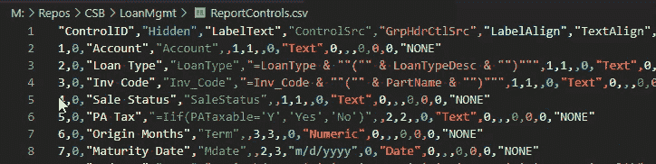

使用扩展名为 [Rainbow CSV](https://marketplace.visualstudio.com/items?itemName=mechatroner.rainbow-csv) 的 VS 代码打开 CSV 文件的示例。从[获取的 GIF 不再设置](https://nolongerset.com/)。

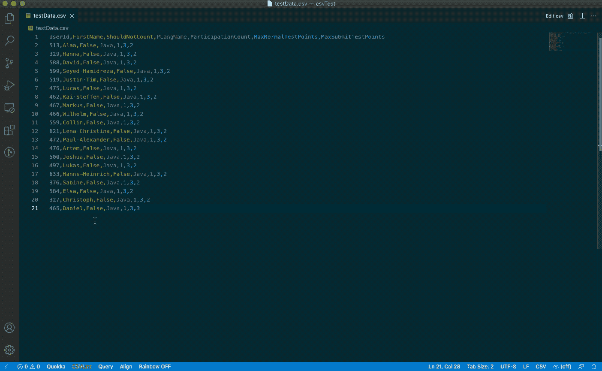

使用[编辑 CSV](https://marketplace.visualstudio.com/items?itemName=janisdd.vscode-edit-csv) 扩展进行更多类似电子表格操作的示例。从[编辑 CSV](https://marketplace.visualstudio.com/items?itemName=janisdd.vscode-edit-csv) 获得的 GIF。

# 描述

从事数据科学和/或机器学习的人倾向于使用 CSV 来存储他们的一些数据，而不得不使用 Excel 之类的东西可能有点烦人。在处理 CSV 时，您可以继续使用 VS 代码，特别是如果您安装了以下扩展:

*   [彩虹 CSV](https://marketplace.visualstudio.com/items?itemName=mechatroner.rainbow-csv) :给每一列一种颜色，并提供一个悬停提示来帮助引导您浏览 CSV。
*   [编辑 CSV](https://marketplace.visualstudio.com/items?itemName=janisdd.vscode-edit-csv) :添加一个类似电子表格的视图，您可以在其中以更结构化的格式进行编辑，并轻松添加列或行。

## 扩展ˌ扩张

    

# 降价

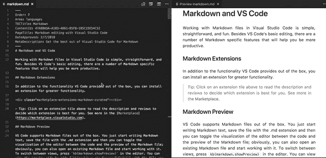

在 VS 代码中查看和编辑降价文件的例子。从 [Visual Studio 代码](https://code.visualstudio.com/)获得的 GIF。

## 描述

如果你对你的`README`文件、文档或任何其他写作使用 Markdown，你可以在 VS 代码中这样做，拥有与你的代码的其余部分相同的相关颜色系统，并看到如何渲染 Markdown 的实时预览。

## 扩展ˌ扩张

在这种情况下不需要扩展，默认情况下它已经包含在 VS 代码中了！

# 乳液

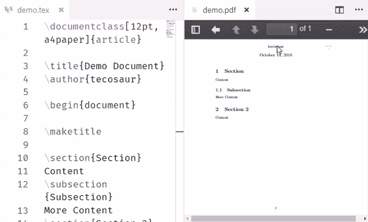

通过 [LaTeX Workshop](https://marketplace.visualstudio.com/items?itemName=James-Yu.latex-workshop) 扩展在 VS 代码中编辑和查看 LaTeX 文件的例子。从[乳胶车间](https://marketplace.visualstudio.com/items?itemName=James-Yu.latex-workshop)获得的 GIF。

## 描述

那些撰写论文或书籍并做出(可能令人遗憾的)使用 LaTeX 的决定的人，也可以依赖 VS 代码。你只需要安装 [LaTeX Workshop](https://marketplace.visualstudio.com/items?itemName=James-Yu.latex-workshop) 扩展就可以获得实时预览和你在 IDE 设置中习惯的所有特性。

## 扩展ˌ扩张

  

# 扩展市场

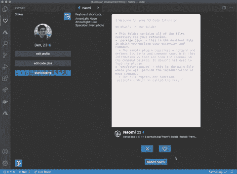

VS 代码确实什么都有，包括约会扩展(！？)🤷‍♂️ 😛从[贝纳瓦德](https://giphy.com/gifs/Vhw2lTXYI6FhGrbE2G)获得的 GIF。

虽然我只关注我最喜欢的扩展，但你可以在[扩展市场](https://marketplace.visualstudio.com/vscode)上找到许多其他的扩展。

我使用和推荐的一些其他扩展是 [RescueTime](https://marketplace.visualstudio.com/items?itemName=RescueTime.rescuetime) ，用于跟踪我们的生产力，以及 [Night Owl 主题](https://marketplace.visualstudio.com/items?itemName=sdras.night-owl)用于风格😎

    

您可以在 VS 代码或以下链接中检查所有可用的扩展:

  

# `settings.json`

我的 current `settings.json`定义了如何在扩展之外配置我的 VS 代码。

不是扩展安装的所有 VS 代码设置都保存在一个`settings.json`文件中。上面你可以看到我目前的配置。

# 最后的想法

希望这篇简短的文章对您有所帮助，有可能说服您尝试 VS 代码和所展示的设置。我鼓励你探索其他的选择，包括扩展和 ide。事实上，我分享的一些扩展，例如 Copilot，也可以在 [PyCharm](https://www.jetbrains.com/pycharm/) 中使用。

看完这篇文章后，我建议至少尝试一下与 GitHub Copilot 一起使用的 VS Code 笔记本。你将获得一个令人惊叹的代码测试、数据探索和模型实验的平台，我认为与其他选择相比，它完全在另一个层次上。

# 参考

[1] [堆栈溢出开发者调查](https://insights.stackoverflow.com/survey/2021#section-most-popular-technologies-integrated-development-environment) (2021)

[2]杰瑞米·霍华德，[我喜欢笔记本](https://youtu.be/9Q6sLbz37gk) (2020)

[3]乔尔·格鲁什(Joel Grus)，[我不喜欢笔记本](https://youtu.be/7jiPeIFXb6U) (2018)

[4] [Jupyter 笔记本在 VS 代码](https://code.visualstudio.com/docs/datascience/jupyter-notebooks) (2021)