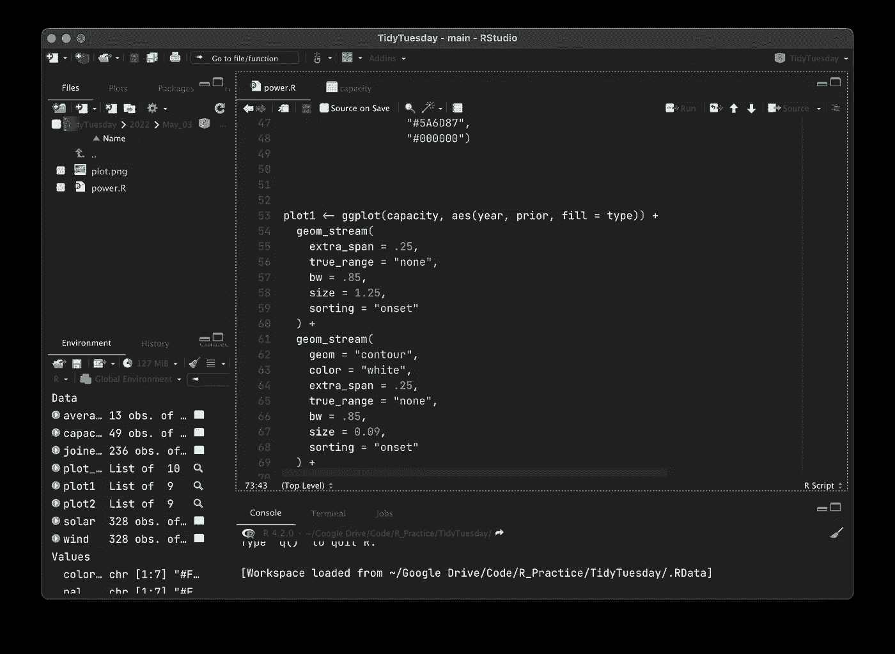
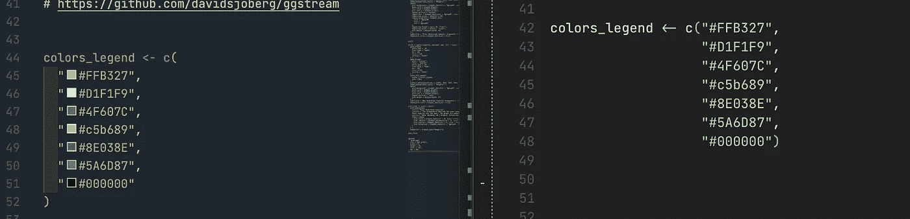
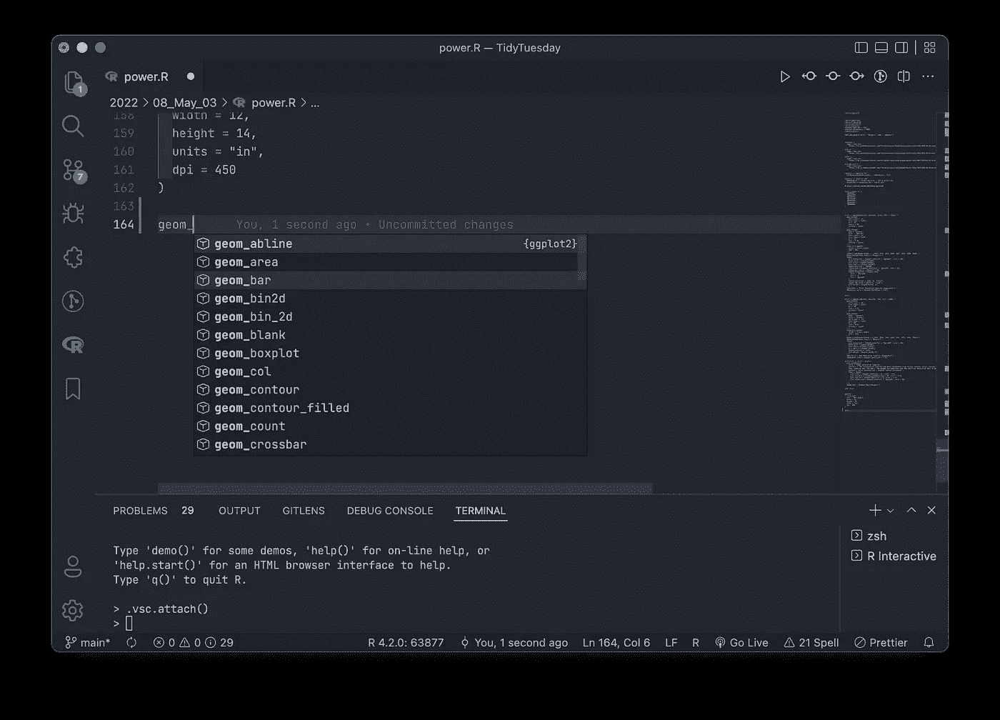
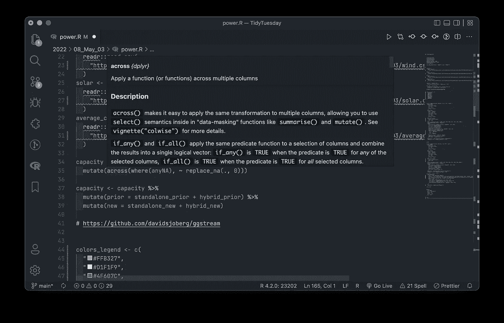

# VSCode 与 r studio——值得交换吗？

> 原文：<https://towardsdatascience.com/vscode-vs-rstudio-worth-the-switch-7a4415fc3275>

## 微软的旗舰代码编辑器能抵挡住旧的最爱吗？

克里斯托夫·高尔在 [Unsplash](https://unsplash.com?utm_source=medium&utm_medium=referral) 上拍摄的照片

对于大多数人来说，RStudio 是运行 R 代码的首选 IDE/编辑器，但是 VSCode 已经迅速成为大量其他语言最流行的代码编辑器之一。这篇文章是写给那些非常熟悉 RStudio 并希望了解两者对比的人的。因此，我不会过多讨论 RStudio，而是深入探讨 VSCode 与 RStudio 相比的优势和劣势。

此外，这是对两个编辑器的社区(免费)版本进行比较的一个非常简短的概述，我不能对 R-Studio 付费版本发表意见。

我是一个中级程序员，不像有些人那样经常使用 R，但是无论何时我使用 RStudio，它都是我首选的编辑器。对于其他所有东西(Python、Jupyter、HTML、CSS、JS 等)，我倾向于使用 VSCode。我决定为 R 尝试 VSCode，因为我想看看我是否可以用一个代码编辑器来做所有的事情。

RStudio 是一款出色的软件，在我的工作流程中从未给我带来任何重大问题，这只是一个实验，旨在找到一个适合所有代码编辑器/IDE 的通用版本。

*如果你只对我的结论或 TLDR 感兴趣；:*

## **不，我暂时不会切换到 R 的 VSCode。**

## 但是我喜欢 R 看起来很棒，而且已经开始工作了。

现在我们已经完成了，让我们进入一些细节:

# **安装**

**假设您的系统上已经安装了 R，**安装 VSCode 和 R 非常简单；

*   下载。pkg 或者。exe 文件并安装代码编辑器；
*   为 R(install . packages(" languageserver ")安装" language server "软件包
*   从市场([https://marketplace.visualstudio.com/items?)安装 R 扩展 itemName = reditorsupport . R](https://marketplace.visualstudio.com/items?itemName=REditorSupport.r)[R—Visual Studio market place](https://marketplace.visualstudio.com/items?itemName=REditorSupport.r)

您已经准备好开始编码了。

**可选:**你可以安装一个更好的终端，比如**弧度**，一个调试器和一个更好的绘图查看器，比如 **httpgd** ，因为 VSCode 的内置绘图查看器不是特别好。

# **设置编辑器**

您现在可以开始处理代码了，但是在运行代码时，您可能会遇到错误。为了消除任何潜在的错误/代码不起作用，您必须确保在 VSCode 首选项中指定了 R 路径(在 mac 上为 cmd+shift+p ),并搜索 R 路径。

找到路径很简单，打开 R 并键入:

*R.home("bin ")并复制输出路径。*

您可能希望对编辑器进行的另一个重大调整是:

一些简单的快捷方式，如管道操作符，不能开箱即用，所以根据您的喜好，可以使用以下方法为“%>%”或“| >”添加快捷方式:

  

**使用 R 代码:**

**这是我在相同的文件和环境下并排进行的两个设置的比较**

**RStudio:**

(图片由作者提供)

**vs code 中的 R:**

(图片由作者提供)

使用 R 非常类似于常规的 RStudio IDER-extension 为安装软件包、绘图和绘图查看器、全局环境、数据集、绘图、列表、变量、检查加载的软件包等提供相同的支持。

可以修改终端和控制台的位置，使输入和输出窗格彼此相邻，这在 R-Studio 中是做不好的。所以 VSCode 感觉非常熟悉，运行代码非常直观。

# **运行代码**

运行一段代码也非常类似于 RStudio。“运行文件”按钮位于面板的顶部，可以使用 mac 上的 cmd+return 快捷键运行单独的代码行。与上面修改管道运算符快捷方式的方式类似，可以很容易地修改快捷方式。

对于普通的 R 代码和。r 文件；对于包括我在内的许多人来说，VSCode 是一个很好的选择。所以如果你和我一样，你用 R 主要是为了统计分析，数据可视化和数据分析；试试 VSCode 吧。

# **使用笔记本和。Rmd**

这就是 VSCode 落后 RStudio 如此之多的地方，它变成了一场单人赛马。VSCode 中的笔记本支持就一个字——可怕。在一个. Rmd 笔记本上运行代码块感觉和看起来都过时了。我在 RStudio 中创建的现有笔记本在 VSCode 中存在错误，尽管在 RStudio 中没有显示任何错误。创造新的笔记本电脑是不直观的，就整体感觉而言，仍远远落后于 RStudio。

我已经寻找解决方案，包括全球安装 pandoc，knitr 和 rmarkdown 等，并尝试了多个版本的 R 和前面提到的包都没有用。这是我还没有完全转向 VSCode 的最大原因之一。

# **关于四开本的一个注记**

我最近开始玩 Quarto，它看起来像是 Rmarkdown 的自然继任者。到目前为止，我只在 RStudio 中使用过 Quarto，我非常喜欢它的外观和工作方式。我还没有在 VSCode 上尝试过，所以我不能对此发表评论。

# **我喜欢 VSCode 中 R 的什么地方**

VSCode 是**更快，快速加载**，代码运行时快速而爽快。我没有对加载一段代码的时间做任何分析，但是 VSCode“感觉”更快。VSCode 还可以作为 R、Python、HTML、CSS 和其他几十种语言的**一站式商店**，并且比 RStudio 做得更好。对于许多 R 用户来说，最重要的特性之一就是**多个 R 会话！！！**——随 VSCode 附带，一款自由软件。当您试图同时开发几个相关的项目时，这尤其有用。VSCode 中的**代码重构**也比 RStudio 好很多

颜色选择器和色块**对于像我这样处理大量数据可视化的人来说非常有用，看到颜色并使用色块无缝选择颜色的能力是一个游戏改变者。**

颜色选择器—左:VSCode，右:RStudio(图片由作者提供)

语言服务器和文档大纲特性有助于在一长行代码中导航，并使处理多个 R 文件变得轻松。**智能感知**在 VSCode 中，代码完成速度更快，也更加用户友好。

VSCode 中的 Intellisense(图片由作者提供)

r 文档和帮助在两种软件中的处理方式非常不同。当涉及到 VSCode 中的帮助时，可以更快地获得信息，并且信息也更加精简。

将鼠标悬停在某个功能上获得帮助(图片由作者提供)

类似地，使用微软的 Liveshare，团队和多人在一个 R 文件上工作更容易。VSCode 中的 Git 和 **github** 集成无疑是任何代码编辑器中最好的之一，在与多人合作时更有帮助。代码片段在频繁使用一个函数或一行代码时很有帮助。我个人觉得 VSCode snippets 比 RStudio 更容易使用和设置。功能处理得非常出色。悬停在它们上面，你会得到各种信息和回调。VSCode 出色地处理了**代码组织**；代码段允许代码折叠，使代码阅读和导航更容易，代码整体更整洁。

VSCode 中的代码块(图片由作者提供)

最后，整个代码编辑器是高度可定制的，您可以通过编辑 VSCode 中的 json 文件来定制它。*照此；VSCode 有一些惊人的特性，可能会真正吸引 RStudio 用户。*

# **vs code 中我不喜欢 R 的地方**

任何 R 代码使用 R-studio 的最大原因之一是因为它**开箱即用**，我们不需要安装扩展，而 R 的 VSCode 设置可能会很棘手，有时会涉及跟踪和错误。再者；R studio 中的 R-templates 非常棒，而且很容易找到和使用。RStudio 中的数据查看器也比 VScode 好得多，尤其是在处理大型数据集时。

尽管我使用 VSCode 开发 Python、HTML、CSS 等，但在其中编写 R 代码，尤其是最初几个小时，感觉非常奇怪，而且在某种程度上是陌生的，尽管整个 IDE 组织非常熟悉。目前不切换到 VSCode 的最大原因是**笔记本支持**——如果你使用 rmd 超过 r，不要切换；在 VSCode 中运行大量代码是非常笨拙和糟糕的，并且经常会导致无效的代码会话。此外，**编织笔记本根本不能很好地工作**，而且很多时候会导致错误。

即使有了`httpgd``包，VSCode 的绘图查看器也比不上 RStudio 的内置绘图查看器。R-terminal 有时会在 VSCode 中抛出错误，这些错误在 RStudio 中的同一段代码中是找不到的，当您很匆忙时，您可能不想处理这些错误。

本质上，RStudio 感觉更像是为数据科学家/统计分析人员量身定制的**，而 VSCode 感觉像是以开发人员为中心的代码编辑器。**

# **我希望用 VScode 尽快尝试的事情**

*   四开
*   Rblogdown 和 Rbookdown
*   更多调试
*   弧度终端

# **结论**

*目前为止我爱 VSCode 里的 R 吗？* ***绝对***

*足以让我想转行？* ***还没有。***

*为什么？* ***笔记本***

我会很快切换吗？ ***希望是的。***

如果你喜欢这个，有什么建议给我；在 twitter 上找到我:

[卡拉特·西杜·🥼🔬(@karat_sidhu) /推特](https://twitter.com/karat_sidhu)

# 进一步阅读

*   坤仁关于这个主题的一个很棒的视频:[https://youtu.be/9xXBDU2z_8Y](https://youtu.be/9xXBDU2z_8Y)
*   同一题材的博客:[https://renkun . me/2019/12/11/writing-r-in-vs code-a-fresh-start/](https://renkun.me/2019/12/11/writing-r-in-vscode-a-fresh-start/)
*   在 VSCode 中运行 R:[https://www . infoworld . com/article/3625488/how-to-run-R-in-visual-studio-code . html](https://www.infoworld.com/article/3625488/how-to-run-r-in-visual-studio-code.html)
*   在 VSCode 中插入 R:【https://code.visualstudio.com/docs/languages/r 
*   奖金:https://yihui.org/en/2022/04/quarto-r-markdown/四开 vs RMD:

感谢您的阅读。编码快乐！