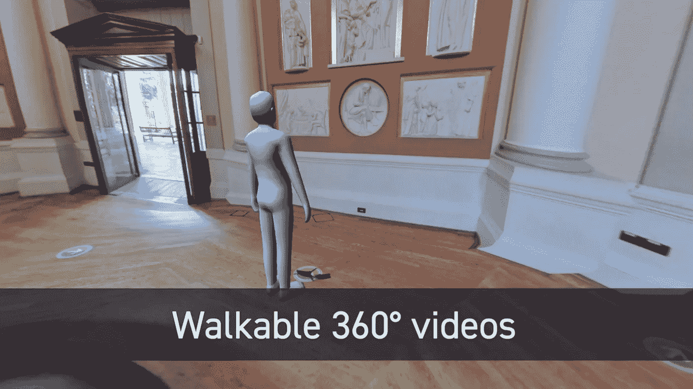
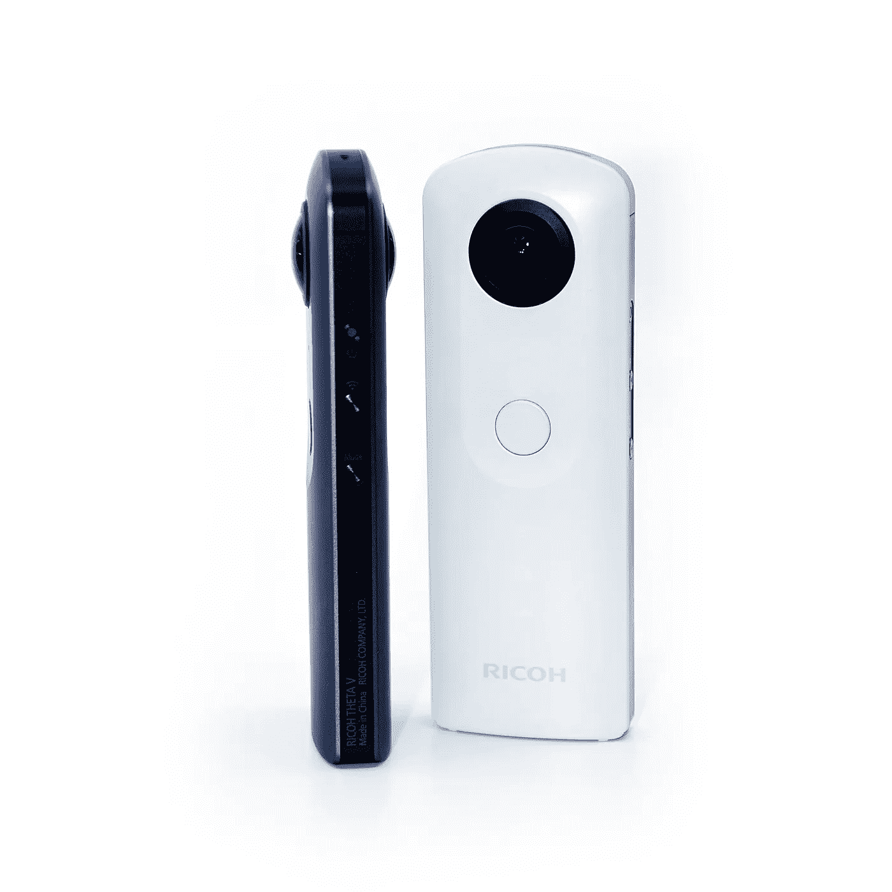
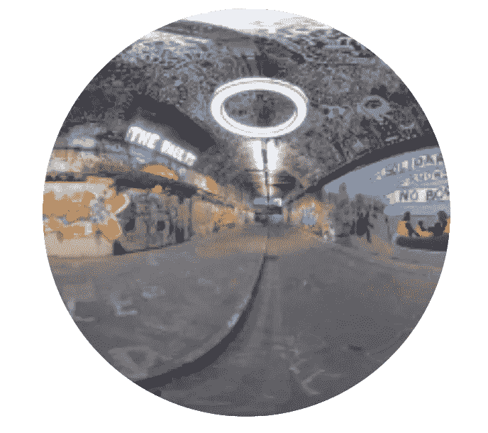

# 可行走的 360 视频

> 原文：<https://towardsdatascience.com/walkable-360-video-b77c11792d4d>

## 几何人工智能可以让你进入 360 VR 照片和视频

可步行 360 视频。【原创图片由作者创作。]

今天的虚拟现实体验与用户期望的现实主义相差甚远。当前的虚拟现实技术基本上分为两类:基于 3D 模型和计算机生成图像(CGI)的技术；以及基于全景 360°图像的那些。

基于 CGI 的体验是*交互式的*，支持新颖的视角，但是*远非照片般真实*，构建成本高昂，并且表现出高数据量和计算成本。

基于 360°图像的虚拟现实体验*逼真*，易于获取，数据量和计算成本较低，但*不具备交互性*且不支持新颖的视图。

> 理想情况下，我们希望两个世界都是最好的，虚拟现实体验既逼真又互动。

# 360°摄像机仅捕捉单个视点

虽然 360°内容，即全景照片和视频，本质上是照片级的，毕竟它们是基于摄影的，但它们是由相机在每个时间点在空间的给定点获取的。在每个时刻，相机只捕捉这个固定的视点。

360°摄像机捕捉完整的 360°全景，但仅从固定视点拍摄。【来源于[维基共享](https://en.wikipedia.org/wiki/Ricoh_Theta#/media/File:Omnidirectional_camera_03.jpg)。]

因此，360°内容只能从原始摄像机视点在 VR 中观看。*不可能*在空间中移动来探索拍摄时未被摄像机捕捉到的新奇视角。

> 在 360 VR 中，无论你在真实的物理世界中如何移动，你都在虚拟世界中保持冻结状态。

我们希望从相机视点解锁用户的视图，从而提供基于 360°图像的真实感 VR 体验，同时也是交互式的，允许用户在上面移动。人工智能(AI)技术可以帮助实现这一目标。

# 周正艾来救驾了

虽然人工智能在过去十年经历了一场革命，但大多数人工智能方法都是基于标准(欧几里得)数据，如常见的 2D 图像。但是，360°照片和视频具有几何结构，因为它们是在 360°球面上定义的。

360 照片和视频产生球体上定义的数据。【原创图片由作者创作。]

为了将人工智能应用于 360°照片和视频，我们需要专门在 360°球体上定义的人工智能技术。几何人工智能的新兴领域恰恰解决了这一挑战(参见[本文](/geometric-deep-learning-for-spherical-data-55612742d05f)介绍球面 360°数据的几何人工智能，以及[本文](/what-einstein-can-teach-us-about-machine-learning-1661e26bef2c)介绍一些底层概念)。

# 用几何人工智能合成运动

> 利用 360°数据的几何人工智能技术，有可能实现既逼真又互动的 VR 体验。

在 [Kagenova](https://www.kagenova.com/) ，一家致力于建设未来照片般逼真的元宇宙的初创公司，我们开发了 [copernic360](https://www.kagenova.com/products/copernic360/) 来提供可行走的 360°视频。

copernic360 利用 Kagenova 开发的[几何球形人工智能](https://www.kagenova.com/research/)技术，从单个 360°图像(照片或视频帧)中估计代表场景的 3D 几何图形。

copernic360 查看器系统使用这种几何图形以及原始的 360 视频或照片来渲染场景的 3D 纹理表示。然后，用户能够在重建的场景中自由移动。这不仅大大增强了虚拟现实体验的真实性，还消除了网络晕动病的主要原因。

下面嵌入的视频演示了由 copernic360 实现的可行走的 360°照片和视频。

可步行 360 视频演示。【视频由作者创作。]

# 逼真的元宇宙

> 通过将图像与强大的人工智能技术相结合，有可能实现既逼真又互动的虚拟体验。

copernic360 提供的可行走的 360°视频体验只是朝着这个方向迈出的第一步。神经渲染领域正在快速发展，并有可能提供更真实的体验，为未来的照片级元宇宙提供动力——这是我们在 Kagenova 积极追求的目标！

与此同时，copernic360 提供可行走的 360 照片和视频，可以在今天的生产中部署，以增强现有的 360 体验、应用程序和平台。