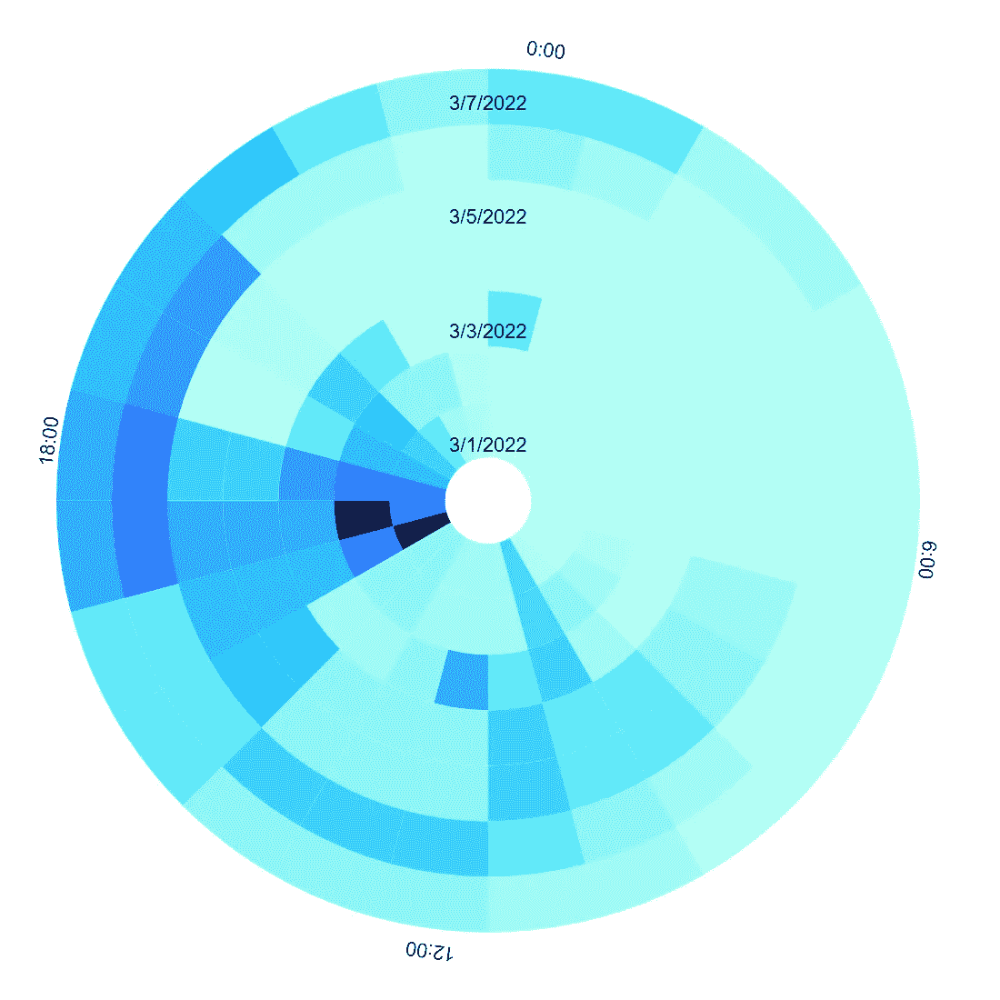
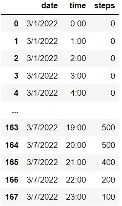
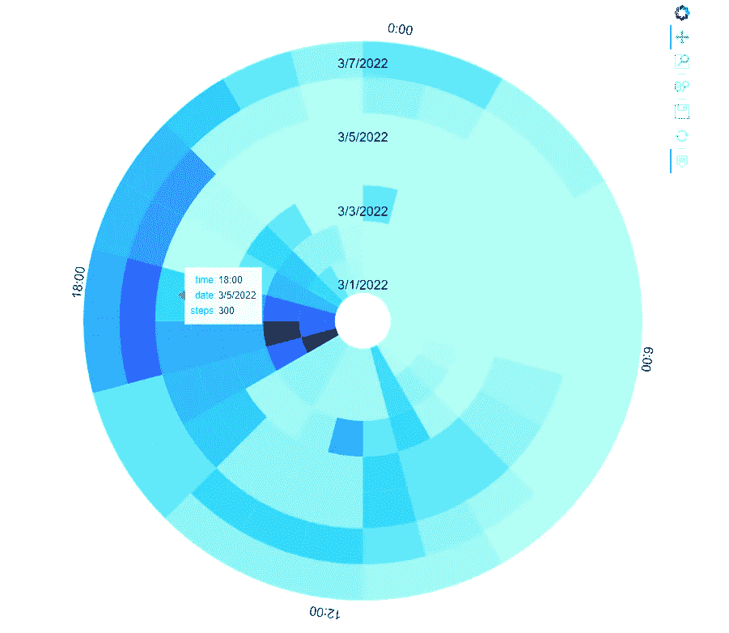
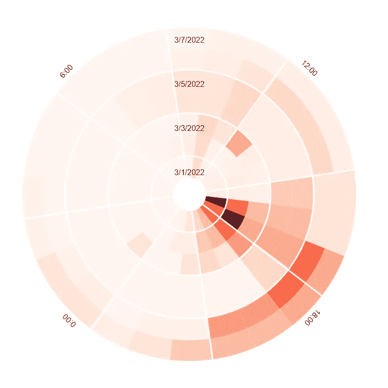

# 使用径向热图扭曲空间和时间

> 原文：<https://towardsdatascience.com/warp-space-and-time-with-radial-heatmaps-c9a878d2ebf6>

## 使用 Python 和 HoloViews 对时间序列和循环数据进行独特的数据可视化

作者创建的图像

# 径向热图简介

简单的热图是一种数据可视化形式，它通过与所代表的数据相对应的颜色变化来突出显示现象的程度。这些颜色的变化为数据科学家探索时空趋势提供了线索。

径向热图是一种更复杂的数据可视化形式，本质上是一个简单的卷成球的热图。因此，径向热图可以扭曲空间和时间，以帮助加快发现时间序列数据和其他循环变量中的周期性模式和趋势。

安德烈·格鲁什尼科夫从[派克斯](https://www.pexels.com/)拍摄的图片

# 开始使用散景和全息视图

要创建自己的径向热图，必须首先安装必要的 python 库。对本教程很重要的库包括散景和全息视图。

散景和全息视图使得用交互式组件创建高质量的数据可视化成为可能。要了解有关这些库的更多信息，请访问以下链接:

 [## 散景文档

### Bokeh 是一个 Python 库，用于为现代 web 浏览器创建交互式可视化。它帮助你建立美丽的…

docs.bokeh.org](https://docs.bokeh.org/en/latest/)  [## 安装- HoloViews v1.14.8

### HoloViews 是一个开源的 Python 库，旨在使数据分析和可视化无缝而简单。与……

holoviews.org](https://holoviews.org/index.html) 

# 设置径向热图

使用全息视图创建径向热图的过程非常简单。在创建热图之前，让我们先导入我们的库:

接下来，我们可以通过设置 radial=True 来激活热图元素上的 radial plot 选项，同时还可以管理大小和悬停选项。

出于本文的目的，创建了一个模拟数据集来表示七天内每小时的步数。有了这些数据，我们就可以确定一整天和一周内的活动模式。

作者创建的模拟数据

# 创建放射状热图

现在我们准备绘制数据。我们将“时间”和“日期”声明为数据框中的关键维度。对于要理解第一个关键维度(对应于径向轴)的径向热图，它应该是一个周期性变量。这里的变量是“时间”，从图表顶部的午夜开始:

使用作者提供的模拟数据创建的交互式放射状热图

如您所见，放射状热图使您能够识别全天和一周的趋势。您还可以与情节互动，以收集更多信息。

如果您喜欢更多的控制，您可以尝试使用下面的代码操纵绘图的方向，更改配色方案以及其他细节:

作者更新了绘图参数

# 结论

你有它！用 python 创建放射状热图的简单方法。如上所述，放射状热图可以提供模式在时间和空间上的快速快照。这对于识别人类活动数据中的模式可能特别有用，如本教程所示，或者提供关于其他循环关系的信息。

所有代码都可以在 GitHub [这里](https://github.com/chags1313/RadialHeat)获得。单击下面的链接，在 google colab 笔记本上试用一下。

 [## 辐射地图

### 密码

colab.research.google.com](https://colab.research.google.com/drive/1dgYmkdGeye0v5PP_BCWEW_kbwb_UYr_n?usp=sharing) 

*感谢您的阅读！*

## 作者的相关文章—

 [## 用雨云图让它下雨

### 使用 python 实现 ptitprince 库以实现健壮的数据可视化

towardsdatascience.com](/making-it-rain-with-raincloud-plots-496c39a2756f)  [## Python 流图快速入门

### 使用 altair 可视化库

towardsdatascience.com](/a-quick-introduction-into-stream-graphs-with-python-33ff4493ccc)  [## 使用 Py-Feat 绘制面部表情预测

### 可视化面部表情数据的实用 python 工具包

towardsdatascience.com](/using-py-feat-to-plot-facial-expression-predictions-86a9064990ce)