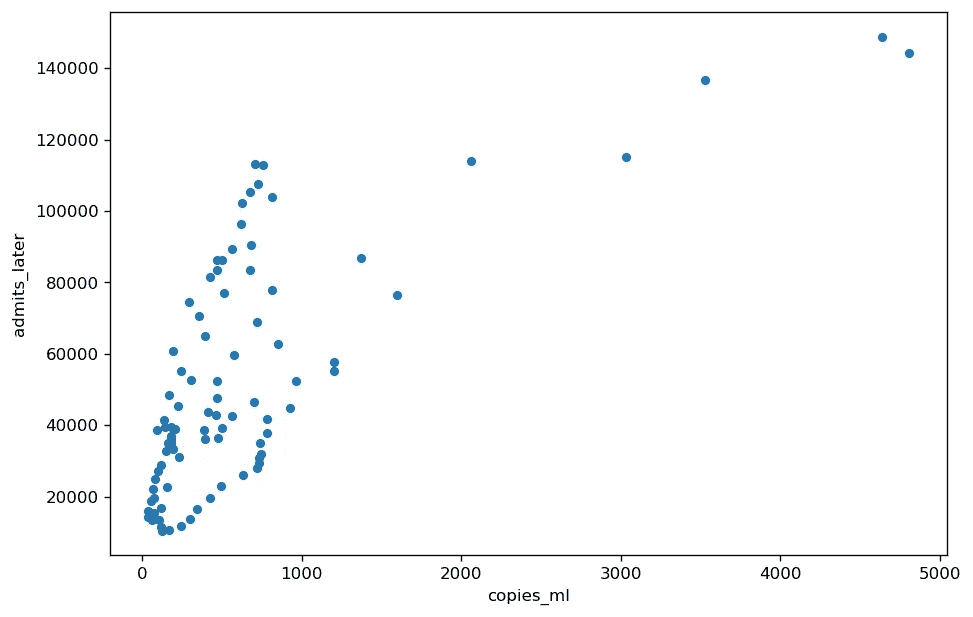
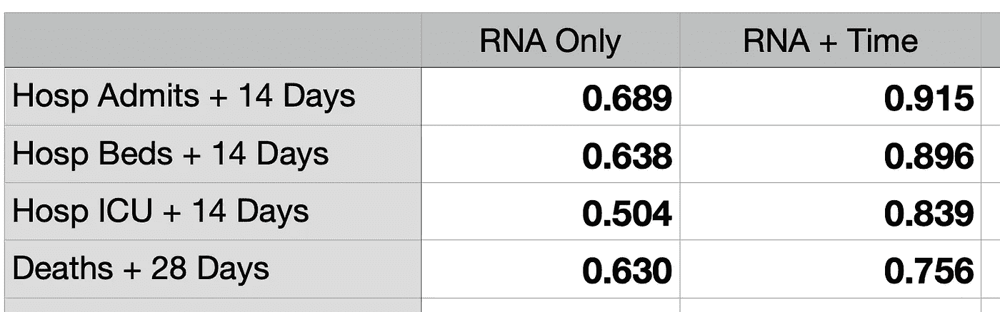

# 废水 RNA +时间=非常强的结果预测

> 原文：<https://towardsdatascience.com/wastewater-rna-time-very-strong-outcome-prediction-6725330285a6>

## 将废水 RNA 水平与总疫情时间相结合产生了对新冠肺炎病结果的非常高的预测


图片由[皮克斯拜](https://pixabay.com/?utm_source=link-attribution&utm_medium=referral&utm_campaign=image&utm_content=3222267)的 Gerd Altmann 提供

# 摘要

在[之前的一篇文章](/strong-correlation-of-wastewater-covid-19-signal-to-hospitalization-and-death-fc33eaf52a23)中，我展示了新型冠状病毒废水水平的生物机器人数据集提供了美国新冠肺炎疾病结果的强有力预测。但是，预测住院和死亡的因素可能不仅仅是污水中的 RNA 标记。一些明显的候选因素是疫苗接种、既往感染和医学治疗的进展。

我针对这个假设测试了几个指标，在不同程度上考虑了这些因素。我发现与新冠肺炎病结果最准确相关的指标是废水 RNA 加上自疫情开始以来的日历时间。这种相关性明显强于单独的废水。我将这个新的度量命名为 RNA 加时间(RPT ),并用这个 [Python/pandas 代码](https://github.com/ChuckConnell/covid19_wbe/blob/main/analyze_biobot_vs_outcomes.py)进行计算。

RPT 捕捉到这样一个事实，即在疫情早期给定的废水 RNA 水平比在疫情后期相同的 RNA 水平导致更多的住院和死亡。直观的解释是，随着 30 个月疫情的继续，更多的人接种了疫苗，更多的人以前感染过，医生更擅长治疗病人，有更好的治疗药物，而且(可悲的是)许多最脆弱的人已经死亡。

# 背景

我之前的文章显示了废水(污水)新型冠状病毒 RNA 水平和新冠肺炎病结果之间的强统计相关性。我发现美国废水和新冠肺炎住院之间的 Spearman 相关系数约为 0.8(满分 1.0)。我发现这种疾病的死亡率也有类似的结果。

但是可以肯定的是，预测疾病结果的因素不仅仅是废水病毒水平。想象两个具有相同病毒水平的群体，但是一个群体完全易感，而另一个群体 100%接种疫苗，并且每个人都有一名医生站在他们身边。

在这个项目中，我试图通过将测得的病毒水平与其他信息相结合来提高废水的预测能力。

# 废水和结果数据集

我从 [Biobot 的](https://biobot.io)区域汇总[数据集](https://github.com/biobotanalytics/covid19-wastewater-data)中获取废水数据，该数据集将许多单独的水处理厂汇总成一个全国范围的集合，经过几周的平滑处理，并根据水质测试点附近的人口进行加权。

我从 [CovidActNow](https://covidactnow.org/) 获取了新冠肺炎疾病的结果，并添加了入院人数、使用的医院床位、使用的 ICU 床位和死亡人数的滚动平均值。

当将水测试与疾病结果结合时，我使用了日期前瞻，因此合并的数据集具有水测试后 14 天的住院统计数据和每次水测试后 28 天的死亡率统计数据。

# 一种新的度量标准:RNA 加时间(RPT)

我的目标是创造一个新的指标，包括废水 RNA 水平，并结合其他数据。我试验了各种方法，并比较了它们对疾病结果的预测能力。我测试的最佳公式是增加日历时间，包括增加疫苗接种，加强免疫，自然感染，医学治疗的进步，以及最脆弱的人在疫情中过早死亡的可悲事实。

我给废水 RNA 打分，从 0 到 100，100 是发现最多的 RNA。我也给“疫情内的逆时间”分配了 0 到 100 的范围，其中 100 是美国疫情的起点，0 是今天。将这两项相加得出一个从 0 到 200 的指标，其中 200 是最糟糕的疾病前景-在完全脆弱的人群中高废水 RNA。

我发现的一个细节是最高的 RNA 水平是异常值。如果它们被赋值为 100，大多数废水值在 0 到 100 的范围内将会非常低。所以我把 RNA 值的前 10%压缩到 90%的水平。

```
RNA_TOP_COMPRESSION = 0.90 top_rna = BiobotDF["effective_concentration_rolling_average"].quantile(RNA_TOP_COMPRESSION)BiobotDF["rna_signal_pct"] = (BiobotDF["effective_concentration_rolling_average"] / top_rna) * 100BiobotDF.loc[BiobotDF["rna_signal_pct"] > 100, "rna_signal_pct"] = 100
```

日历时间设定为废水取样时剩余的疫情周的百分比。

```
VIRUS_START = "2020-03-01" pandemic_weeks = int(round(((pd.Timestamp.today() - pd.Timestamp(VIRUS_START)) / np.timedelta64(1, 'W'))))UsaDF['pandemic_week'] = ((UsaDF.week - pd.Timestamp(VIRUS_START)) / np.timedelta64(1, 'W')).round().astype(int)UsaDF["pandemic_pct"] = ((UsaDF['pandemic_week'] / pandemic_weeks) * 100).round(2)UsaDF["pandemic_pct_inv"] = 100 - UsaDF["pandemic_pct"] 
```

RNA 加时间(RPT)是这两个因素的简单相加。

```
UsaDF["RPT"] = (UsaDF["pandemic_pct_inv"] + UsaDF["rna_signal_pct"]).round(2)
```

# 比较预测

要了解 RPT 对废水数据的预测能力，请考虑下面的两个散点图，它们显示了从 2020 年 4 月到 2022 年 7 月的 121 个全国废水值。

第一个图是简单的每毫升废水中新型冠状病毒 RNA 的拷贝数与两周后新冠肺炎的住院人数的对比。请注意，由于一些水样含有非常高浓度的 RNA，大多数数据都聚集在最左边。



作者图片

第二个图是相同数据的 RNA 加时间(RPT)。有两个改进。首先，由于非常高的 RNA 水平在添加疫情时间之前被压缩，所以数据沿着 x 轴更均匀地分布。第二，时间因素的加入将每个废水测量置于整个疫情的背景下，使其更有意义。


作者图片

散点图中数据的 Spearman 相关性证实了 RPT 与严重疾病结果之间的密切关系。下面的第一行是入院散点图。其他行是用于新冠肺炎、ICU 和死亡的病床。与仅含废水病毒相比，所有行都显示出与 RPT 的相关性显著提高。接近 0.9 的相关值非常强。



作者图片

细心的读者可能会注意到，废水中只有 RNA 的相关性(上面第二列)比我以前文章中引用的要低。原因是这里使用的数据集覆盖了更长的时间跨度，并包括最近的 BA.5 波，该波具有高废水 RNA 水平，但相对较低的严重疾病结果。这是 RNA 加时间是比仅用 RNA 更准确的疾病预测因子的额外证据。

# 了解更多信息

https://link . springer . com/article/10.1007/s 13762-022-04326-1(新型冠状病毒废水监测科学文献综述)

【https://en.wikipedia.org/wiki/Correlation (斯皮尔曼和皮尔逊相关)

https://biobot.io/science/[(来自生物机器人的技术文章)](https://biobot.io/science/)

[https://Data . CDC . gov/Public-Health-Surveillance/NWSS-公共-新型冠状病毒-废水-公制-数据/2ew6-ywp6](https://data.cdc.gov/Public-Health-Surveillance/NWSS-Public-SARS-CoV-2-Wastewater-Metric-Data/2ew6-ywp6) 。(CDC 废水追踪)