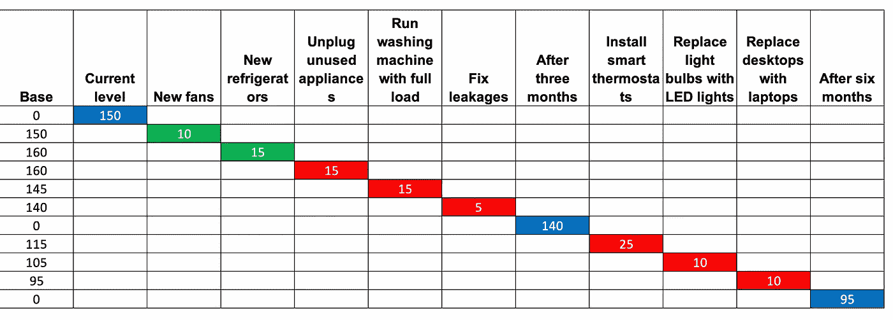
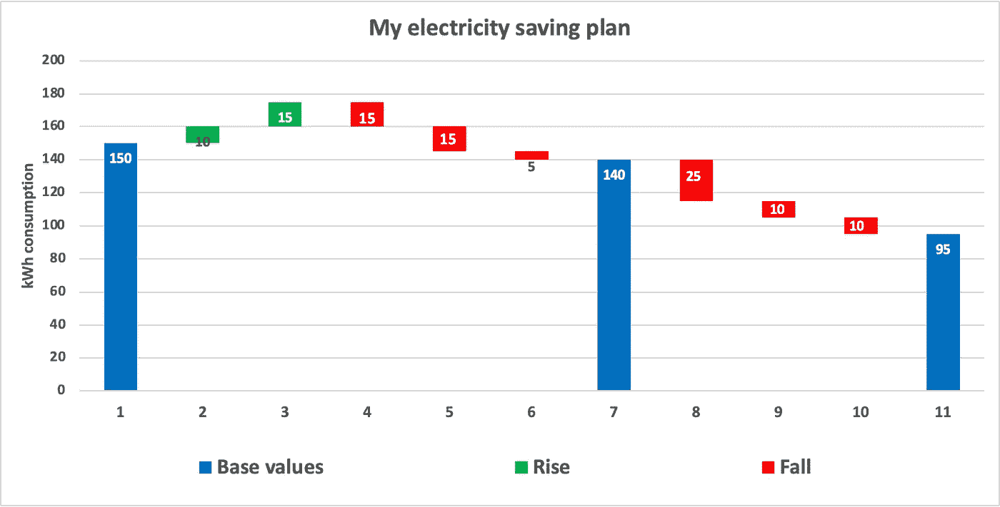
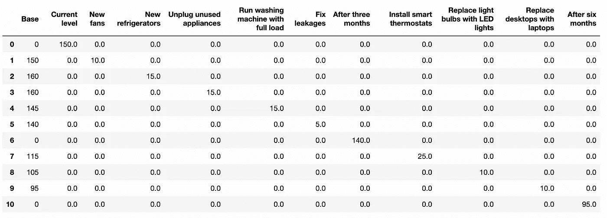
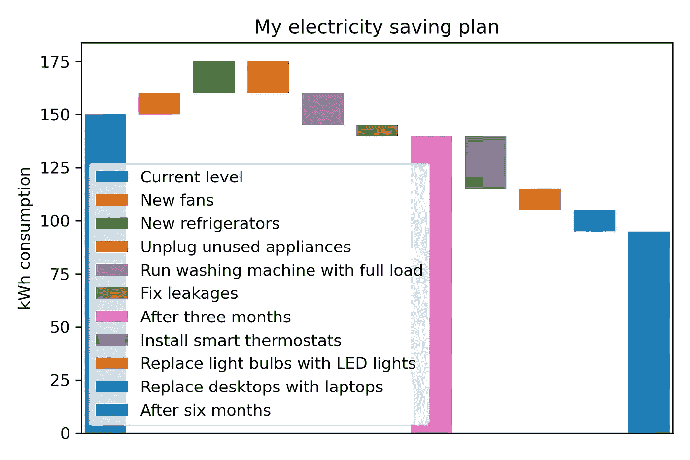
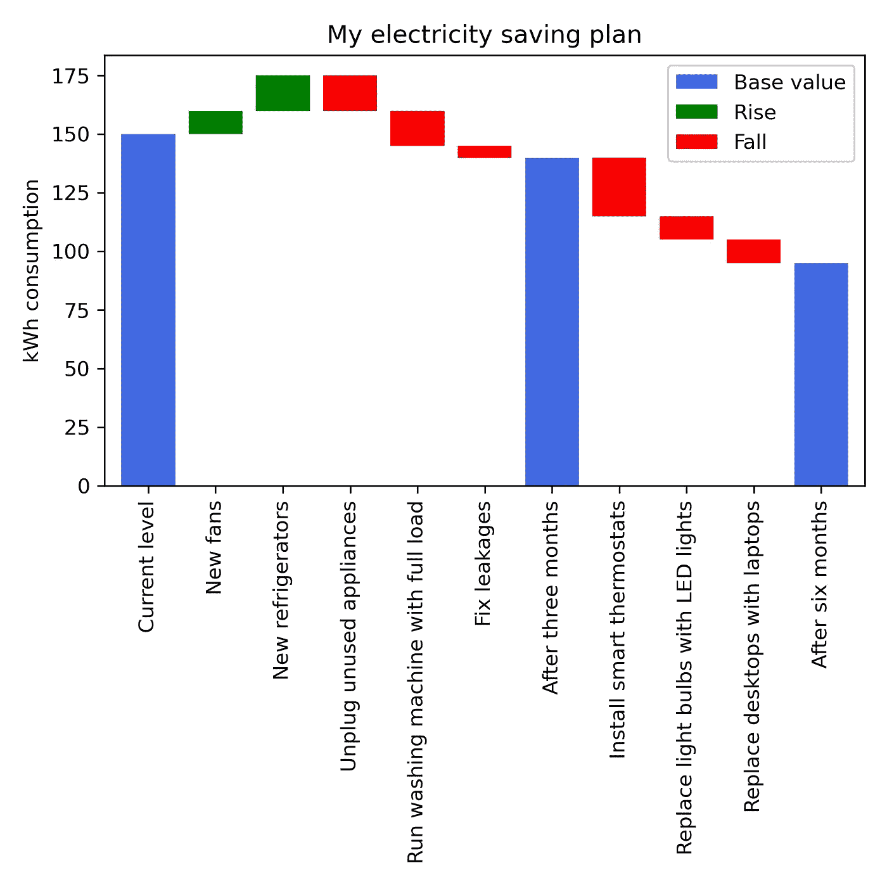
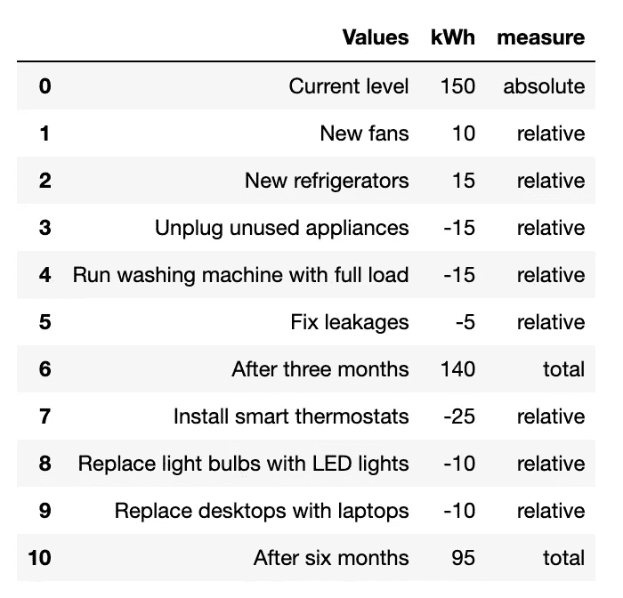
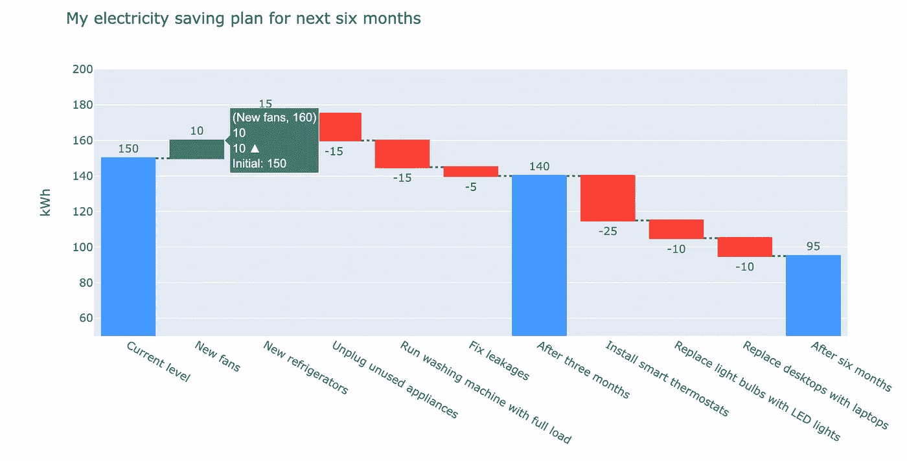
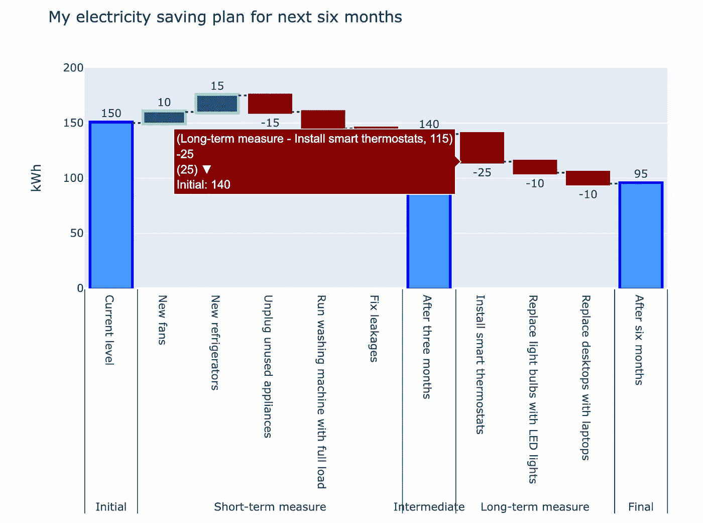

# 带有 Excel、Matplotlib 和 Plotly 的瀑布图

> 原文：<https://towardsdatascience.com/waterfall-charts-with-excel-matplotlib-and-plotly-5b3fb42cbf46>

## 在 Excel 和 Python 中创建瀑布图

瀑布图是一种数据可视化形式，它将从初始阶段到最终阶段的各种中间步骤的逐步贡献可视化。初始阶段和最终阶段由瀑布图中的**全栏**表示。这些列是满的，因为它们在水平轴上从零开始。

另一方面，中间值是初始阶段和最终阶段之间的一系列正的或负的步骤。这些中间值在瀑布图中显示为**浮动列**。这些列位于隐藏基数的顶部，隐藏基数是初始值和先前正或负增量步骤的净和的总和。因此，瀑布图根据其外观也被称为**飞砖**图或**桥**图。

瀑布图有着广泛的应用，但它们在金融领域尤其流行。例如，瀑布图用于直观地说明一家公司在某一年年初的收入如何按月**(基于时间)**变化，以达到年底的累计收入。同样，它也可用于说明年初的总收入贡献如何增加或减少公司投资组合中的每个产品**(基于类别)**以达到日历年末的净收入。

使用不同的工具有不同的方法来构建瀑布图。在这篇文章中，我将分享一些使用 Excel 和 Python 中的 matplotlib 和 Plotly 包构建瀑布图的技巧。让我们开始吧。


图片由[罗伯特·卢克曼](https://unsplash.com/@robertlukeman)在 [Unsplash](https://unsplash.com/) 拍摄

# 虚拟示例

作为一个假设的案例，我将使用瀑布图来说明在六个月的时间里，一座建筑中不同的节电措施的逐步效果。本例中使用的数据纯粹是虚拟值，仅用于说明目的。

考虑到我的大楼截至目前每月用电量为 150 千瓦时。我决定在夏天在我的大楼里安装一定数量的新风扇和冰箱，因此每月的耗电量将分别增加 10 和 15 个单位。由于我的用电量达到了每月 175 台，我起草了一些措施来减少每月的用电量。作为短期措施，我计划采取一些行为上的改变。比如:不用电器时拔掉插头，满负荷运转洗衣机，修理故障水电泄漏。我粗略估计，这些措施将有助于在短期内每月减少 15、15 和 5 个单位的电力。结果，三个月后我的月用电量将达到 140 单位。

三个月后，我打算安装一些新设备或更换现有设备。如:安装智能恒温器，用 LED 灯取代现有的灯泡，用笔记本电脑取代大楼里的台式电脑。据估计，这些措施将帮助我的建筑分别减少 25、10 和 10 个单位的电力消耗。因此，我的大楼每月的用电量将从现在的 150 单位增加到六个月后的 90 单位。

# 用 Excel 制作瀑布图

上述假设的例子可以用如下所示的 Excel 表格来表示:



代表我所在建筑的电流和节能措施的 Excel 表格。图片作者。

蓝色单元格分别代表我所在的大楼截至目前、三个月后和六个月后的每月用电量。绿色单元格表示逐步增加，红色单元格表示有助于逐步减少我所在建筑每月耗电量的措施。该表中的第一列是基础列。蓝色单元格的基础值为零。在增量的情况下，基本值加上绿色单元格中的值。在下降的情况下，从基础值中减去红细胞的值。

Microsoft Office 的最新版本有一个在“插入”选项卡中创建瀑布图的默认选项。然而，为了通过选择上面的表格在 Excel 中绘制瀑布图，我首先插入了堆积柱形图。基本列中的非零值仍然可见。因此，为了使它们不可见，我为这些列选择了不填充选项。生成的瀑布图如下所示。


使用 Excel 创建的瀑布图。图片作者。

我手动排列了不同列的颜色，蓝色条代表基本值，绿色条代表逐步增加，红色条代表逐步减少耗电量的措施。结果图如下所示。



# 带有熊猫和 matplotlib 的瀑布图

上面在 Excel 中创建的图可以很方便地使用 Python 重新创建。我使用了 pandas 和 matplotlib 包。我读取同一个 Excel 表，用 0 填充 NaN 值，得到下面的数据帧`df`:



熊猫数据框代表我的建筑的电流和节能措施。图片作者。

下面给出了用于重新创建第一个图的代码。数据框从`Current level`列向前绘制，以`df`的`Base`列为底部。

```
df.loc[:,”Current level”:].plot(kind = “bar”, 
                                bottom = df[“Base”],
                                width = 35)
plt.xticks([])
plt.title(“My electricity saving plan”)
plt.ylabel(“kWh consumption”)
plt.tight_layout()
plt.show()
```



第一个使用 pandas 和 matplotlib 创建的瀑布图。图片作者。

在上面的图中，每个具有独特颜色的条形代表电流或节能的不同步骤。在下一个图中，我想分别用蓝色、绿色和红色突出显示具有初始值/中间值/最终值、步进增量和减量的列。因此，我为每个条形定义了一个颜色列表。

我重新构建了熊猫数据框架，如下图所示，以`df`的`Base`列为底部绘制一个柱状图。我还手动选择了补丁和标签来定义每种颜色。

```
plt.figure(figsize = (6, 6))colors = [“royalblue”,”green”,”green”,”red”,”red”,”red”,
          “royalblue”, “red”, “red”, “red”, “royalblue”]fig = df.T[1:].max(axis = 1).plot(kind = “bar”,
                                  bottom = df[“Base”],
                                  width = 0.8,
                                  color = colors)selected_patches = fig.patches[0], fig.patches[2], fig.patches[4]plt.legend(selected_patches,
           [“Base value”, “Rise”, “Fall”],
           loc = “upper right”)plt.title(“My electricity saving plan”)
plt.ylabel(“kWh consumption”)
plt.tight_layout()
```

我得到了一个稍微好一点的结构图，如下所示:



使用 pandas 和 matplotlib 创建的第二个瀑布图，具有结构化的颜色组合。图片作者。

# Plotly 瀑布图

要使用 Plotly 绘制瀑布图，pandas 数据帧结构需要有所不同，如下所示。在 **kWh** 栏中显示了每项措施的用电量或逐步上升或下降。**测量**栏指示**值**是绝对值、总和还是相对值。



熊猫数据框用不同的方法表示电流。图片作者。

Plotly 有一个独特的[模块](https://plotly.com/python/waterfall-charts/#horizontal-waterfall-chart)，简单用于创建瀑布图，作为[财务图](https://plotly.com/python/financial-charts/)的一种形式。瀑布图作为跟踪添加到 graph 对象中。瀑布图是通过将`df`的**值**列指定为`x`、**千瓦时**列指定为`y`、**度量**列中的值列表指定为`measure`来构建的。**千瓦时**流量也作为文本添加，出现在瀑布图的列外。使用 Plotly 生成瀑布图的代码如下:

我得到了下面的瀑布图:



使用 Plotly 创建的瀑布图。图片作者。

Plotly 允许用不同的选项进一步定制瀑布图。我将 x 轴上的标签分为初始值、短期测量值、中间值、长期测量值和最终值。此外，我编辑了总计、增加和减少条的颜色和边缘颜色。这反映在《法典》的以下要旨中:

这将返回一个定制的瀑布图，如下所示:



用 Plotly 构建定制瀑布图。图片作者。

# 结论

当从初始阶段遍历到最终结果时，瀑布图对于展示基于**时间的**或基于**类别的**值的逐步递增或递减效果非常有用。根据其外观，瀑布图也被称为**飞砖** **图**或**桥图**。虽然瀑布图有不同的领域应用，但它们在金融领域特别受欢迎，以反映时间或产品的现金流贡献。

在这篇文章中，我提供了一个构建瀑布图的例子，来看看在六个月的时间里，不同的节电措施对建筑的影响。本文中使用的值是虚拟值。我提供了一些使用 Python 中的 Excel、Matplotlib 和 Plotly 包构建瀑布图的技术。还可以使用各种其他工具或技术来构建瀑布图。根据我的经验，我更喜欢使用 Plotly 构建瀑布图。瀑布图可以通过定义`x`、`y`、`measure`在 Plotly 中创建为一个对象。此外，`connector`、`text`、`textposition`、`orientation`、`increasing`、`decreasing`、`totals`等参数允许根据需要和愿望定制瀑布图。

这篇文章的数据和笔记本可以在这个 [GitHub 资源库](https://github.com/hbshrestha/Data_Analytics)中找到。感谢您的阅读！