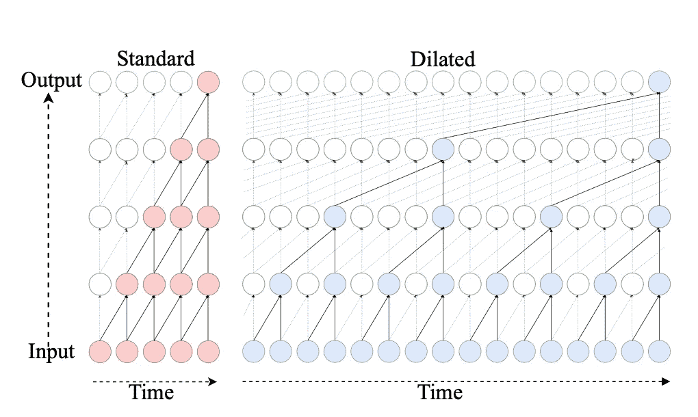
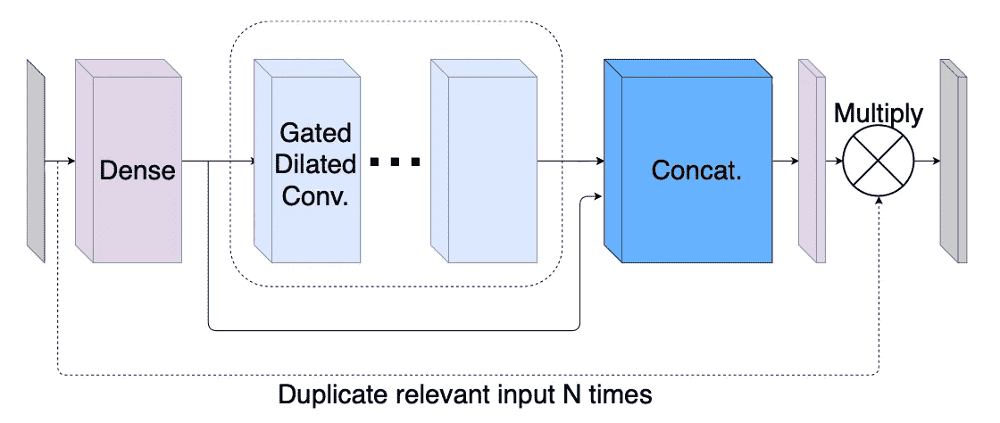
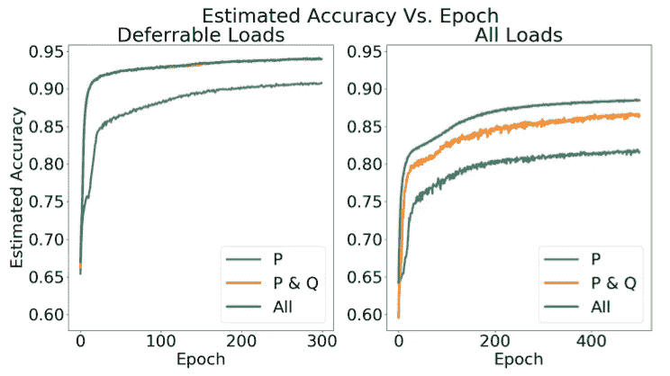
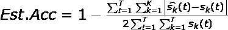
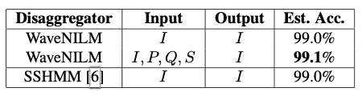
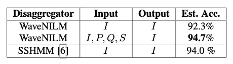

# WaveNILM:一种用于功率分解的因果神经网络

> 原文：<https://towardsdatascience.com/wavenilm-a-causal-neural-network-for-power-disaggregation-15e0024ff7c5>

## NILM 的深度学习

## 因果关系在深度学习中更值得关注

亚历山德罗·比安奇在 [Unsplash](https://unsplash.com/s/photos/Energy-industry?utm_source=unsplash&utm_medium=referral&utm_content=creditCopyText) 上拍摄的照片

## 介绍

P 能源分解是为不断增长的能源消耗需求建立更好的电网基础设施的重要过程之一。分解意味着"*将单个电器的消耗值*从总耗电量中分离出来。众所周知，深度神经网络正被应用于解决几乎所有行业和垂直领域的复杂问题，它在能源行业也取得了成功。我们已经看到了 LSTMs [1]、1D-CNN、Transformers [2]以及其他基于时间序列的算法在常见用例中的应用，如负荷预测、整合策略[3]、需求响应[4、5]、NILM(非侵入式负荷监控)、P2P 交易等。在本文中，我们将重点关注 NILM，它是开发未来智能电网基础设施的重要过程之一。

## 背景

NILM 是一个经验丰富的研究领域，于 1992 年首次提出。快进 20 年，我们在这一领域有许多令人兴奋的研究[6，7，8]，在处理和解决这一问题的各种其他方法中，深度学习占据了大多数焦点。该领域涉及时间序列数据，并直接涉及序列建模架构的使用，如 RNNs、LSTMs、GRUs，当然还有最新的 Transformers。但是，这些都不是因果关系，需要在当前时间步 *t* 分解的未来值。

TCNs(时间卷积网络)的出现，挑战了 LSTMs 和 gru 在各种序列建模任务中除了因果性之外还具有更长的有效记忆。TCN 中的隐藏图层与输入图层的大小相同，并补零以确保序列长度始终保持不变。此外，它防止信息从未来泄漏到过去的方式是通过使用因果卷积层，该卷积层在当前时间步长 *t* 处对 *t-n* 时间步长进行卷积。使用具有各种膨胀因子的膨胀卷积来回溯非常远的过去(指数大的感受野),以便将预测考虑在内。

时态数据的标准卷积与扩展卷积。图片致谢—wavelnilm[论文](https://arxiv.org/pdf/1902.08736.pdf)

## 理念与建筑

WaveNILM [9]建立在因果 CNN [10]架构之上，在构建更好、更高效的实时解聚架构的过程中做了一些改进，这在智能和动态电网时代非常需要。

这就是 WaveNILM 架构中块的样子。图片致谢—wavelnilm[论文](https://arxiv.org/pdf/1902.08736.pdf)

上图描述了 WaveNILM 如何使用门控膨胀方法-来自 Conv 密集层的输出被分成两个方向，即 Sigmoid(门)路径和 ReLU(回归量)路径。然后将输出连接起来，形成模块的总输出。有几个以剩余方式堆叠的块，但是剩余连接的性质略有不同——来自每个块的跳过连接不仅仅跳过一个块，而是跳过几个块并在最后几个下游层加入网络。

输入层是一个 512 单位时间分布层，后跟一个门控块堆栈。在这里，所有跳过的连接被收集并连接在一起，形成另一个新图层，作为输出掩膜。由于体系结构的多输入性质，输出掩码与对应于我们要分解的设备的单元相乘。

## 结果和基准

单输入与多输入实验。图片鸣谢——韦芬尼姆[论文](https://arxiv.org/pdf/1902.08736.pdf)

让我们快速讨论一下可延迟负载，这是一种重要的负载特征类型，需要针对关键优势进行分解。可推迟负载是可以在非高峰时间运行的大型负载。例如暖通空调、热泵、烘干机、烤箱和洗碗机。上述负荷的成功分解有助于防止电网停电和负荷减载。

来自 AMPds2 [11]的数据首先在【1440，1】之间进行缩放、批处理，并在 1 天(1440)的样本集上训练大约 500 个时期。由于 WaveNILM 是一个回归网络，我们必须关注错误率，而不是分类输出。下图所示的估计精确度是这些场景中广泛采用的度量标准之一，

作者图片

其中 s *k* ^(t)是时间 *t* 时一个电器的预测功率，s *k* (t)地面实况，t 和 k 分别是总时间和电器数量。WaveNILM 通过各种输入信号进行研究，如电流(I)、功率(P)、无功功率(Q)和视在功率(S)。当选择多个输入信号时，P 或 I 被选作输出信号。

作为对比，WaveNILM 已针对高噪声和去噪输入信号的 SSHMM [12]架构进行了基准测试。下表显示了 WaveNILM 与 SSHMM 在单输入和多输入情况下的性能。

可推迟负荷的降噪结果。图片致谢—wavelnilm[论文](https://arxiv.org/pdf/1902.08736.pdf)

噪声情况导致可推迟负载。图片鸣谢——韦芬尼姆[论文](https://arxiv.org/pdf/1902.08736.pdf)

## 我的想法

在我看来，WaveNILM 是一个很好的方法，一般来说是向基于因果关系的神经网络发展。当事物从其对数据的基本假设发生变化时，在理解模型行为方面，因果关系比相关性领先一步。具有因果关系的深度学习是当前更好的建模和鲁棒性的需要。了解因果方面可以让 AI 应用变得可解释和更智能。

还有一个方面是数据集，只检查和使用了一个数据集。我期待像 REDD 和 Pecan Street 这样的流行数据集的使用。使用这些数据集将开启基准测试的竞争，并提供更真实的性能数据。

## 结论

WaveNILM 提出了一种简单有效的因果网络来解决实时解聚问题。它的主要优点是能够添加/删除用于分解的输入数量，以便更好地拟合模型。还关注了所涉及的电力类型，以及如何推进基础设施以安全地捕获这些读数，这将大大有助于为消费者和电网运营商开发人工智能系统。

## 参考

[1]用于智能家居中非侵入式负载监控的并行 LSTM 架构:【https://ieeexplore.ieee.org/document/9308592 

[2]电力:非侵入式负荷监测的高效变压器:[https://pubmed.ncbi.nlm.nih.gov/35458907/](https://pubmed.ncbi.nlm.nih.gov/35458907/)

[3]数据驱动电动汽车集成策略的非侵入式电动汽车负载分解算法:[https://ieeexplore.ieee.org/document/9794150](https://ieeexplore.ieee.org/document/9794150)

[4]智能需求响应和智能电网的深度学习:综合调查:[https://arxiv.org/pdf/2101.08013.pdf](https://arxiv.org/pdf/2101.08013.pdf)

[5]使用深度学习预测需求响应的电能消耗:[https://ieeexplore.ieee.org/document/9862353](https://ieeexplore.ieee.org/document/9862353)

[6]使用智能电表分析能源消耗的负荷曲线以反映家庭特征:[https://www.mdpi.com/1996-1073/12/5/773](https://www.mdpi.com/1996-1073/12/5/773)

[7]太阳能发电住宅中电动汽车的低频非侵入式负载监测:通用性和可移植性:[https://www.mdpi.com/1996-1073/15/6/2200](https://www.mdpi.com/1996-1073/15/6/2200)

[8]用于非侵入式负荷监控的神经网络的序列到点学习:【https://arxiv.org/pdf/1612.09106.pdf 

[9] WaveNet:原始音频的生成模型:【https://arxiv.org/pdf/1609.03499v2.pdf 

[10]韦夫尼姆:[https://arxiv.org/pdf/1902.08736.pdf](https://arxiv.org/pdf/1902.08736.pdf)

[11] AMPds2 数据集:[https://dataverse.harvard.edu/dataset.xhtml?persistent id = doi:10.7910/DVN/fie0s 4](https://dataverse.harvard.edu/dataset.xhtml?persistentId=doi:10.7910/DVN/FIE0S4)

[12]利用 HMM 稀疏性进行在线实时非侵入式负荷监控:[https://ieeexplore.ieee.org/document/7317784](https://ieeexplore.ieee.org/document/7317784)

[13] WaveNILM 实现:[https://github.com/picagrad/WaveNILM](https://github.com/picagrad/WaveNILM)