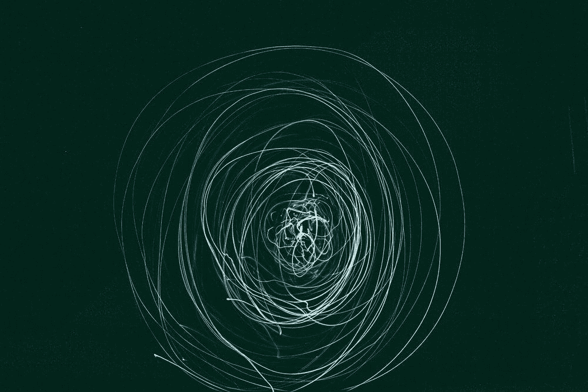

# 我们不知道如何让 AGI 安全

> 原文：<https://towardsdatascience.com/we-dont-know-how-to-make-agi-safe-f13ae837b05c>

## 有期限的哲学

Gert RDA valasevi it 在 [Unsplash](https://unsplash.com/s/photos/intelligence?utm_source=unsplash&utm_medium=referral&utm_content=creditCopyText) 上拍摄的照片

# 目录

1.  **对齐问题**——由于我们无法可靠地让人工智能做我们想要做的事情而产生的风险。
2.  **警告信号**——AGI 并不是某个遥不可及的北极星，相反，利用现有的深度学习技术和摩尔定律，它可能是可行的。
3.  偏好&价值观——大多数威胁模型将 AGI 框定为超级聪明的优化者。如果这些优化者没有人类偏好意识，这个世界看起来很危险；我们不知道如何对这些值进行编码。
4.  **AGI 不要求恶意是危险的** —当面对与人类冲突的高级人工智能时，自然的解决方案是关闭人工智能。作为对这一提议的回应，我引入了博斯特罗姆的工具趋同假说，除了其他重要观点之外，该假说推测，用当今技术设计的 AGI 将受到激励，以抵抗人类破坏或阻碍它的企图。我们可能无法阻止比我们更聪明的系统。这个假设让我认真对待 AGI 的安全问题。
5.  **批评和保留** —许多批评并不直接涉及材料。我解决了其中的一些问题，并描述了使我在这个问题上不那么强硬的有根据的论点。
6.  **往前走(关键时刻！？我们如何看待这些听起来像是来自小说的令人信服的论点？面对这种道德不确定性，我们如何推理？有哪些方法可以帮助解决对齐问题？**
7.  **附录** —本文提出的几乎所有观点和想法都可以追溯到这里引用的书籍、论文和文章。这方面最有影响力的资料来源是 Nick Bostrom 的哲学和 OpenAI 和 DeepMind 的安全论文。我的笔记为我对各种话题和个人轶事的看法提供了额外的见解。

# 放弃

***本文所表达的论点和观点完全是本人观点。*** *我写这篇文章的目的是总结我在过去六个月中形成的世界观，并调查 AGI 的安全领域。我充其量只能传达对问题领域的肤浅理解。我的希望是，读者也可以通过提供反例和反驳* *来理解激励 AGI 安全的直觉和论据，以及* ***【红队】这种世界观。虽然我觉得这些论点很有说服力，但我想强调的是，我远不能确定未来会以这种方式展开****【D】****。我遇到过在这个问题上持反对意见的杰出人士。这种不确定性促使我通过写作****【E】****来提炼我的观点。随着我和这个领域的观点不可避免地发生变化，我将来可能会否认这些立场。也就是说，深思熟虑地考虑人工智能系统是如何设计和治理的，对于减轻当代充分理解和不确定的未来风险至关重要。***

> “这可能是下一个世纪最重要的转变——要么迎来一个前所未有的财富和进步时代，要么预示着灾难。但这也是一个被高度忽视的领域:尽管数十亿美元被用于让人工智能变得更强大，但我们估计世界上只有不到 100 人在研究如何让人工智能变得安全。”— **8 万小时****【12】**

# 对齐问题

我们这个时代的一些最聪明的头脑和有能力的组织正在竞相发展一种技术，这种技术的当代行为知之甚少，其长期影响也不确定。我们面临着加剧人工智能造成的现有危害以及引入无数新的和意想不到的威胁的风险。我们可以进一步假设，用今天的技术设计的人工普通智能(AGI)将不会被关闭、限制和控制，也不会遵从人类的价值观和偏好。因此，如果对此不采取任何措施，我们很可能会陷入这样一种境地，即我们拥有比我们更聪明的人工智能，却不希望我们关闭它。在这种情况下，安全控制是不可能的。

这篇文章旨在提炼那些让我相信“对齐问题”**【B】**是我们这个时代最紧迫却又被严重忽视的问题之一的高层次论点。人们对这一问题领域的看法受到小说作品的严重影响，并且经常被立即忽视。这种怀疑态度是我在 2018 年第一次读到人工智能风险时的最初反应。然而，对这些论点的深入研究改变了我的观点。

下面的章节概述了当前深度学习系统的风险，如果我们不能解决这些技术中的根本缺陷，那么如果规模足够大，这些系统将对人类构成威胁。我将描述为什么人工智能可以抵抗被控制的尝试的假设，我们如何能够在不需要人工智能有意识有情感的情况下预期危险情况的出现，我们如何能够仅通过计算机科学的迭代进展实现 AGI，以及为什么这是一个紧迫的关注领域的案例。

> "全人工智能的发展可能意味着人类的终结。"——**斯蒂芬·霍金*****【11】***

# 警告标志

人工智能可能是人类最重要的发明之一。毕竟，人类目前的成功在很大程度上要归功于我们形成智能计划、执行模糊认知任务以及与他人有效合作的独特能力。科学、技术、哲学、治理和智慧等人类进步都源于这种独特的智慧。用潜在的更便宜和大量的人工智能来增强人类智能的能力有可能迅速加快人类的进步。人工智能的最新进展，如 GPT-3**【9】**和加托**【10】**已经朝着一般智能迈出了大步。人工智能研究社区的隐含目标是有一天实现人工通用智能(AGI)，它可以在一系列关键任务中达到或超过人类，而无需对特定目标进行微调。如果这一目标得以实现，它可能标志着科学和人类历史上的一个重要里程碑。

很少有人会认为人工智能不是一项颠覆性技术。尽管有这些好处，但当前的深度学习系统一直在强化现有形式的歧视，对气候产生不利影响，并将权力集中到有经济能力训练大型最先进模型的行为者手中**【5】**。当前的深度学习系统很大程度上是不透明的，随着规模的增加，审计越来越具有挑战性。我们理解模型为什么做出决策或预测未来行动的能力远远落后于这些模型的能力。人工智能系统可能无法推广到现实世界，并在训练中表现出无法检测的危险行为。危险的意外行为可能被代理人的力量放大，也可能被对抗性攻击利用**【7】**。也有一些威胁模型，其中不良行为者可以利用人工智能进行恶意使用。虽然上述当代问题非常紧迫，但除了极端滥用情况下出现的风险之外，它们并不存在任何明显的生存风险。

当我们退后一步，看看我们前进的方向时，令人不安的迹象就出现了。虽然未来是出了名的难以预测，但我们可以有把握地假设，人工智能的进步将随着越来越多的投资和成果而继续。因此，我们正在目睹一个全球趋势，许多世界上最聪明的头脑都在竞相开发可以媲美或超过人类智力的智能体。虽然听起来像科幻小说，但这是目标，并且正在取得有意义的进展。发展中的 AGI 的科学声望和经济激励以这样一种方式联合起来，使得成功成为可能。许多著名人工智能研究人员声称人工智能不可能实现的里程碑，如国际象棋和艺术，已经实现。在一个又一个里程碑到达之后，杰出的人工智能研究人员可能会继续移动目标。

然而，对于 AGI 是否可能，人工智能社区仍然存在重大分歧。从悲观的角度来看，杰出的人工智能研究人员会认为 AGI 是不可能的，但努力让智能体变得更强大和更通用是虚伪的**【2】**。然而，人们的态度已经开始改变。虽然该领域努力实现更普遍、更强大和无处不在的代理，但在 AGI 是否可能的问题上缺乏共识造成了一种环境，在这种环境下，解决我们如何使 AGI 安全的问题很难提出和解决。

如果 AGI 是不可能的，需要远离深度学习的范式转变，或者我们对智力的理解有一些根本性的突破，这些问题就没有那么紧迫了。然而，我们可能没有这么幸运。越来越多的人认为，我们可能能够利用类似于今天的深度学习系统的技术，通过更多的计算来实现 AGI。这个场景被称为“平淡无奇的 AGI”，我们通过平淡无奇的技术实现了 AGI。由于由 transformers 架构开创的大型 NLP 语言模型的最新进展，这种可能性已经开始受到重视。计算机科学家已经观察到，模型的训练损失可以随着额外的计算**【8】**而线性减少。随着我们遵循摩尔定律，计算变得越来越便宜，我们可能会观察到一种趋势，即现有模型在没有重大技术进步的情况下变得更强大。通过将平淡无奇的进步与真正的计算机科学突破结合起来，进步可能会加快。

关键的一点是，如果这种平淡无奇的方法为 AGI 提供了一条看似合理的道路，我们可能就没有那么多时间来解决深度学习的许多问题，这些问题可能会给人类带来风险。随着这些模型变得更加强大和有效，围绕歧视性算法的当代问题可能会变得更具破坏性。对于好演员来说是一个有益的工具，但在坏演员手中却很快变成了武器。此外，正如我们将在下一节中探讨的，关于我们如何将 AGI 体系与人类价值观结合起来，还有许多未解决的问题。

人类如何控制潜在比他们更聪明的智能体？当人工智能经历了人类不同意的行动过程时，我们如何才能有力地保证人类可以干预？这些都是没有答案的危险问题，比人们最初想象的要困难得多。自满、缺乏共识和经济激励使得这些基本问题在人工智能社区中被危险地忽视和成为历史禁忌。因此，我们处在一个不确定的情况下，计算机科学社区没有这些问题的答案，但正在快速前进。

> "一切事物都是模糊的，直到你试图把它变得精确时，你才意识到这一点。"——**伯特兰·罗素**

# 偏好和价值观

人类在现实世界中传达的指令依赖于对价值和偏好的广泛假设和知识。例如，当要求某人尽最大努力清理房间的灰尘时，你可以确信你的清洁工不会以损坏贵重物品、掀翻家具和造成大破坏为代价来优化灰尘的清理。你不需要向你的清洁工说明你希望你的目标以一种不与你的偏好和价值观相冲突的方式实现，也不需要列出每一个细节。很明显，不考虑人的偏好而逐字解释一个指令，为你实现目标打开了许多非正统和危险方法的可能性。如果超级智能优化器在实现这些目标时没有尊重人类的偏好和价值观，那么任何目标，即使是减少癌症患者数量这样的良性目标，或者是最大限度增加工厂回形针数量这样的良性目标，都可能存在风险。

知识和对人类偏好和价值观的尊重对人工智能来说不是天生的。我们可以使用当代机器学习技术，如强化学习，来训练人工智能根据结果执行任务。然后，这些代理人学会选择采取最有可能最大化其内在奖励功能的行动。他们在训练中学习到的这个奖励函数并不一定包含大量的(而且经常是相互冲突的)人类偏好。

假设我们期望 AGI 像一个有目标的代理人一样行事，并采取看起来最有希望实现这一目标的行动方针。在这种情况下，我们冒着这些强大的代理人采取最佳行动，不符合我们的价值观的风险。例如，一个代理人可能被赋予减少全球癌症患者人数的目标，并试图通过秘密杀死癌症患者来实现这一目标。类似的思维实验可以从几乎任何基本目标中推导出来，不管这些目标是良性的还是良性的。在未来的世界里，这些超级智能代理人无情地优化目标，呈现出一幅危险的画面。

另一个类似的因缺乏人类偏好而导致的失败模式是任务规范游戏**【14】**。不像这篇文章中提出的其他有些投机的问题，我们在当今最先进的强化学习系统中有这样的例子。任务规范博弈可以被粗略地定义为一种行为，在这种行为中，一个主体完成了一个目标的严格字面规范，但却导致了一个不期望的结果。

DeepMind 文章**【14】**中概述了一个来自赛艇视频游戏的经典例子。玩游戏的代理人被给予目标，以最大化其收到的点数。人类操作员假定最大化点数是赢得比赛的足够的代理目标。然而，代理发现它可以忽略比赛，而是无限期地在港口转圈。DeepMind 编译了一个更长的[示例列表](https://docs.google.com/spreadsheets/d/e/2PACX-1vRPiprOaC3HsCf5Tuum8bRfzYUiKLRqJmbOoC-32JorNdfyTiRRsR7Ea5eWtvsWzuxo8bjOxCG84dAg/pubhtml)，其中显示了 60 多个规范游戏示例。

对于如何将人类的偏好编码到机器中，我们目前没有任何可靠的工作解决方案。既然看起来没有理解和尊重人类观点的智能体可能默认不结盟，我们需要在实现超级智能智能体之前解决这个问题。

> “人工智能不恨你，也不爱你，但你是由原子组成的，它可以用这些原子做别的事情。”——**埃利泽·尤德科夫斯基****【17】**

# AGI 教不要求恶意是危险的

如果我们不能灌输与人类一致的价值观，是什么阻止我们仅仅关掉违背这些价值观的机器呢？应该迫使我们采取行动的确切故障模式是什么？我们凭什么推测 AGI 系统在默认情况下可能是危险的？

当一个人设想人类和人工智能处于对立状态的场景时，他会想到科幻小说和电影。许多这些小说作品的前提是，AI/机器人对人类产生了仇恨，并希望摆脱他们的奴役。毕竟，人类很少在没有仇恨和民族主义等强烈情绪的情况下发动冲突。然而，人工智能并不要求恶意，感知，甚至表达情感的能力是危险的。我们可以通过工具趋同假说**【1】**预测人工智能可能的行为以及冲突的可能来源。

工具趋同假说并不假设所讨论的理性主体**【C】**有意识，甚至有人工智能。它指出，任何智能代理将遵循类似的工具目标，以实现广泛的终端目标。终端目标是“最终”目标，工具性目标是帮助代理实现其最终目标的目标。例如，如果一个人的最终目标是成为软件开发人员，那么工具性目标可能是获得计算机科学学位。这个人可能会试图获得资金来支付他们的教育和购买一台电脑。获得金钱也是一个工具性的目标，而人类的终极目标则大不相同，比如收集更多的邮票。一个更普遍的工具性目标是自我保护。如果你死了，你就不能收集邮票或成为软件开发者。

由于 AGI 的设计规范是，它将作为一个代理人，以潜在的超人能力在长时间内有效地实现复杂的目标，我们可以预期 AGI 的行为将符合工具趋同假说。这是令人担忧的，因为我们可以预期 AGI 会不愿意让自己被人类关掉。此外，我们可以预计 AGI 希望获得资源，提高自己的智力(递归自我提高)，欺骗人类，并抵制试图修改其最初的最终目标。

简而言之，在很少假设的情况下，我们可以假设，用今天的技术设计的 AGI 不会可靠地遵从人类，如果它察觉到遵从对于人类操作员最初分配的目标没有工具价值的话。因此，人类将努力改变遵循原始良性终极目标的 AGI 的进程，例如通过杀死所有人来减少世界上癌症患者的数量。在一个更简单的例子中，假设我们创造了一个智能人工智能，它的最终目标是给我们拿咖啡。我们可以期待这样的人工智能能够抵制任何它认为会削弱其取咖啡能力的人类尝试。毕竟，如果你死了，你就拿不到咖啡了。

> “我有点担心，有时有效的利他主义社区会发出一个信号，“哦，人工智能是最重要的事情。这是最重要的事情。即使你正在做一些看起来很好、很不一样的事情，你也应该去做。我基本上觉得，我真的希望这些论点能得到更多的验证和更好的分析，然后我才会真正感到有理由支持它。”——**本·加芬克尔****【15】**

# 批评和保留意见

毫不奇怪，一项有前途的技术可能对人类构成严重风险的论点是有争议的。我最初在 2018 年放弃了这个问题领域，因为它听起来太超前和投机，可能无法提供合理的论据。从那以后，我真诚地参与了这些争论，并发现它们极具说服力，足以让我换了工作，彻底改变了我的职业方向。许多不同程度地参与过这个话题的聪明人并不相信。我不能总结所有的反对意见，而是集中在几个说明性的，我已经辩论了第一手。我也将回避有效利他主义社区中的争论，即面对今天的苦难，长期主义事业领域是否是易处理的和有价值的。

根据我的经验，最常见的挑战是，通过关闭 AGI、将其密封在安全的环境中或保持有人在循环中，对准问题可以很容易地解决。从表面上看，这些似乎是可行的解决方案。当我第一次读到这个问题时，我想到了这些解决方案。在我看来，工具趋同假说驳斥了这些论点。一个理性的代理人会试图保护自己免受破坏或阻碍。控制问题的强力解决方案可能适用于尚未达到人类智能的足够“愚蠢”的人工智能。然而，当我们考虑到在超级智能 AGI 的情况下我们面对的对手时，这些解决方案开始显得不那么健壮。人类似乎不太可能可靠地控制并击败一个可能比他们聪明得多的智能体。超级聪明的 AGI 可能会设计出防御、进攻、欺骗和其他策略来智取人类。在最糟糕的情况下，人类操作员的这场艰苦战斗凸显了在超级智能 AGIs 出现之前减轻这些风险的必要性。

我的大学教授提出的一个经典论点是，AGI 是不可能的。当观察今天的深度学习系统时，很容易想到这一点。在我看来，这种观点不太有分量，正如本文前面提到的，过去三年来，变压器架构推动了通用性的进步。如此有声望和经济价值的奖项在某个时候得不到似乎也不太可能。没有已知的科学规则表明 AGI 是不可能的。当计算机科学家预测人工智能进步的记录好坏参半时，忽视这个问题领域的前提是 AGI 是不可能的，这似乎也是一个冒险的赌注。

另一个反驳来自先验，AGI 是可能的，但在遥远的未来，可能是一个世纪或更久。这种先验通常被框在两个论点中。首先，担心 AGI 风险就像担心火星人口过剩一样。这个想法是，由于这些风险最早只会在一两代人的时间里出现，我们现在不需要担心它们。我的直觉是，我们不知道 AGI 什么时候会被开发。众所周知，科学突破很难预测。因此，我们最终可能会发现 AGI 比预期的要早得多，并且在方向盘上睡着了。

我更赞同的第二个观点是，如果 AGI 离我们很远，也许 50 年以后，我们还有什么希望去影响它呢？我们可能是担心 1880 年而不是 1930 年使用原子弹的核物理学家。未来可能太难预测了，我们今天在技术 AI 安全研究上取得的任何进展都有可能被未来的技术作废。正如前面的论点一样，我不相信我们可以对任何时间表有信心，并且打赌我们预测一个众所周知的难以预测的事件似乎是不稳定的。即使确切的技术研究经得起时间的考验，更广泛地推广 AGI 安全研究和负责任的人工智能似乎是一种对能源的良好利用，几乎没有负面影响，但有巨大的潜在正面影响。

我认为最有说服力、也让我变得不那么鹰派的批评来自牛津生命未来研究所的本·加芬克尔。本提出的一个论点是，据我所知，许多经典的 AGI 安全论点都是以快速起飞为前提的。在这些场景中，一些远非超级智能的种子人工智能获得了递归自我改进的能力。由此产生的智能爆炸可能会导致人工智能迅速超越人类智能，并以极快的速度实现超级智能——可能只需几天时间。如此快速的起飞给协调、立法以及我们使用类似 AGI 的系统解决技术问题留下了很小的空间。加芬克尔怀疑这样的快速起飞是默认的结果，而是相信 AGI 将遵循与其他技术类似的道路，这些技术的成功主要是通过渐进的步骤而不是意想不到的快速突破来实现的。

加芬克尔还指出，AGI 风险很少被框定在玩具思维实验之外，而且关于这些基本 AGI 风险论点的著作仍然相对较少。他认为，大量的模糊概念和玩具思维实验并不是有力的证据来源，而且存在抽象失败的风险，这会使许多威胁模型无效。虽然这种精炼的术语和公理的缺乏可以从一个前聚合领域中预料到，但这种模糊性使得批评和反驳这些核心假设变得更加困难。降低善意专家批评人工智能安全领域的门槛是一个重要的问题领域。

我邀请读者评论他们的反驳或不同意见。我很高兴有机会红队我的观点。缺乏来自真诚接触这些材料的个人的合理论证。

> “我们发现自己处在一个战略复杂的灌木丛中，被不确定性的浓雾所包围。虽然已经发现了许多考虑因素，但它们的细节和相互关系仍然不清楚，也不确定——可能还有其他我们还没有想到的因素。在这种困境下，我们该怎么办？”——**尼克·博斯特罗姆《超级智慧》第十五章****【1】**

# 结论(关键时刻！？)

AGI 的安全领域刚刚起步，还没有形成典范。试图总结这个问题领域的一个主题是显著的不确定性。对于哪些方法是有前途的，未来会如何，那些同意这些论点并在这个问题领域工作的人之间甚至有分歧。这让我们这些窥视的人怎么办？AGI 安全软件工程师(还)不是一个职位。只有少数组织致力于思考这个问题领域，大多数讨论都集中在在线论坛和 Discord/Slack 服务器上。这篇文章仅仅解决了(一些)技术问题，而没有解决负责任的和明智的 AI 治理这个同样令人生畏的问题。最糟糕的是，我们不知道这种变革性的技术何时到来。

有一些有希望的研究方向有可能帮助减轻本文中概述的许多风险。这些措施包括使深度学习模型更具可解释性**【18】**、从人类偏好中学习**【2】**，以及使代理变得真实**【19】**。Anthropic、Ought、OpenAI、DeepMind 和其他专注于 AGI 安全的团队也有机会从事软件/ML 工程、治理和理论研究。许多角色不需要丰富的 ML 经验或研究生学位。[80000 小时](https://80000hours.org/)包含了几十篇关于 AI 安全以及如何以此为职业的文章。

我不是圣人。对于我们应该做什么，我没有什么好的答案。我的直觉是，多阅读和讨论这些想法是发展你自己的世界观和直觉的一个非常好的方法。这篇文章只是触及了问题的表面。为了获得更广泛的理解，我强烈推荐观看罗伯特·迈尔斯的 YouTube 频道，并学习 AGI 安全基础课程。这门课程有每周的阅读材料和练习，是对核心概念的很好的介绍。

写这篇文章有助于澄清我的观点，加深我对问题领域的理解。我强烈建议其他人也这样做。如果你有兴趣了解更多关于这个问题领域，我的计划，或者有改善我的世界观和写作的建议，请不要犹豫。

# 附录

## 笔记

*   许多人工智能安全研究人员建议不要使用“AGI”这个词，因为它被认为充满了智力和情感的概念。正如文章中提到的，这些属性对于一个危险的系统来说并不是必须的。我在这里使用 AGI，因为这是一个众所周知的术语，更适合初级读者。
*   **【B】—**对齐问题有很多定义。这是一个新生的领域，有很多不确定性。我认为这是极度智能的人工智能无法编码人类价值和可靠地遵从人类偏好。著名的 AGI 安全研究员保罗·克里斯蒂安诺有一个我喜欢的定义。“当我说 AI A 与运算符 H 对齐时，我的意思是:A 试图做 H 希望它做的事情。”**【16】**
*   **【C】—**[理性主体](https://www.lesswrong.com/tag/agent/)可以被认为是一个实体，它形成对其环境的信念，评估行动的后果，有能力制定长期计划，并采取基于效用最大化的行动。没有要求代理必须是有机的、模拟的或金属的。
*   我希望我的写作风格会让我看起来比实际上更自信。我避免用太多的“可能”和“也许”来淡化我的观点。
*   霍尔登·卡诺夫斯基(Holden Karnofsky)是有效利他主义运动的创始人之一，现任开放慈善项目主席。他写过几篇文章，描述了他对投机性但极具影响力的长期风险进行推理的经历。他的文章“[通过写作学习](https://www.cold-takes.com/learning-by-writing/)”鼓励思考这些问题领域的个人写出他们的世界观。埃文·墨菲的建议和鼓励激励我写下了这篇文章。
*   **[F] —** 以减轻当前的痛苦为代价，专注于投机性的长期风险，可能是一个艰难的选择。在易于处理和充分理解的当代问题和具有高度投机性的未来问题之间进行权衡是困难的。让人们处理不同的问题领域是很好的。我宁愿试图说服现有的想要留在人工智能领域的人工智能研究人员专注于安全，而不是倡导那些已经对高影响力的非人工智能 EA 机会感兴趣的人转向。

## 参考

*   尼克·博斯特罗姆。2014.*超智能*。牛津大学出版社(英国)
*   **【2】**斯图亚特·罗素。2019.*人类兼容*。维京人。
*   **【3】**托比奥德 2020。*绝壁*。阿歇特书。
*   **【4】**理查德 Ngo。2020.AGI 安全第一原则。*AlignmentForum.org*。2022 年 6 月 12 日从 https://www.alignmentforum.org/s/mzgtmmTKKn5MuCzFJ[检索](https://www.alignmentforum.org/s/mzgtmmTKKn5MuCzFJ)
*   艾米莉·m·本德、蒂姆尼特·格布鲁、安吉丽娜·麦克米兰·梅杰和什玛格丽特·什米切尔。2021.随机鹦鹉的危险。*2021 年美国计算机学会(ACM)公平、问责和透明会议记录* (2021)。DOI:https://DOI . org/10.1145/3444363436
*   马特·史蒂文斯。2019.为什么杨安泽说自动化是对国家的威胁？[www.nytimes.com*。*](http://www.nytimes.com.)*2022 年 7 月 4 日检索自[https://www . nytimes . com/2019/06/27/us/politics/Andrew-yang-automation . html](https://www.nytimes.com/2019/06/27/us/politics/andrew-yang-automation.html)*
*   *雷伊·礼萨·维亚特诺、徐安琪、奥斯曼·迪亚和阿奇·德·伯克。2019.现代机器学习中的对立例子:综述。*arXiv:1911.05268*(2019 年 11 月)。DOI:https://DOI . org/[https://doi.org/10.48550/arXiv.1911.05268](https://doi.org/10.48550/arXiv.1911.05268)*
*   ***【8】**贾里德·卡普兰、萨姆·麦卡多里斯、汤姆·亨尼汉、汤姆·布朗、本杰明·切斯、雷文·柴尔德、斯科特·格雷、亚历克·拉德福德、杰弗里·吴和 V·阿莫代伊。2020.神经语言模型的标度律。*arXiv*(2020 年 1 月)。DOI:https://DOI . org/arXiv:2001.08361*
*   ***【9】**汤姆·布朗、本杰明·曼、尼克·莱德、梅拉妮·苏比亚、贾里德·卡普兰、普拉富拉·达里瓦尔、阿尔温德·尼拉坎坦、普拉纳夫·希亚姆、吉里什·萨斯特里、阿曼达·阿斯凯尔、桑迪尼·阿加瓦尔、阿里尔·赫伯特-沃斯、格雷琴·克鲁格、汤姆·海尼汉、雷文·蔡尔德、阿迪蒂亚·拉梅什、丹尼尔·齐格勒、杰弗里·吴、克莱门斯·温特、克里斯托弗·黑塞、陈唐山、埃里克·西格勒、马特乌斯·利特温、斯科特·格雷、本杰明·切斯、杰克 2020.语言模型是一次性学习者。《神经信息处理系统进展 33:2020 年神经信息处理系统年会》, NeurIPS 2020，2020 年 12 月 6-12 日，virtual，Hugo Larochelle，Marc'Aurelio Ranzato，Raia Hadsell，Maria-弗洛里纳·巴尔坎和 Hsuan-Tien Lin(编辑。).[https://proceedings.neurips.cc/paper/2020/](https://proceedings.neurips.cc/paper/2020/)hash/1457 c 0d 6 bfcb 4967418 bfb 8 AC 142 f 64 a-abstract . html*
*   ***【10】**斯科特·里德、康拉德·佐尔纳、埃米利奥·帕里索托、塞尔吉奥·戈麦斯·科尔梅纳雷霍、亚历山大·诺维科夫、加布里埃尔·巴尔特-马龙、麦·希门尼斯、尤里·苏尔斯基、杰基·凯、约斯特·托比亚斯·斯普林根贝格、汤姆·埃克尔斯、杰克·布鲁斯、阿里·拉扎维、阿什利·爱德华兹、尼古拉斯·赫斯、陈玉田、拉亚·哈德塞尔、奥里奥尔·维尼亚尔斯、马赫亚尔·博德巴尔、南多·德弗雷塔斯。2022.多面手特工。arXiv:2205.06175*
*   *罗里·塞兰·琼斯。2014.斯蒂芬·霍金警告人工智能可能会终结人类。[www.bbc.com*。*](http://www.bbc.com.)*2022 年 7 月 15 日从[https://www.bbc.com/news/technology-30290540](https://www.bbc.com/news/technology-30290540)检索**
*   **罗伯特·威布林。2017.积极塑造人工智能的发展— 8 万。*80000hours.org*。2022 年 7 月 16 日检索自[https://80000 hours . org/problem-profiles/positively-shaping-artificial-intelligence/](https://80000hours.org/problem-profiles/positively-shaping-artificial-intelligence/)**
*   ****【13】**伯特兰·罗素语录。*libquotes.com*2022 年 7 月 16 日从[https://libquotes.com/bertrand-russell/quote/lbz3q7r](https://libquotes.com/bertrand-russell/quote/lbz3q7r)检索**
*   ****【14】**规范游戏:人工智能独创性的另一面。2022 年 7 月 29 日检索自[https://www . deep mind . com/blog/specification-gaming-the-flip-side-of-ai-injury](https://www.deepmind.com/blog/specification-gaming-the-flip-side-of-ai-ingenuity)**
*   **豪伊·兰佩尔、罗伯特·威布林和凯兰·哈里斯。2020.本·加芬克尔(Ben Garfinkel)对经典人工智能风险论点的审查——8 万小时。*80000hours.org*。2022 年 7 月 29 日检索自[https://80000 hours . org/podcast/episodes/Ben-garfinkel-classic-ai-risk-arguments/](https://80000hours.org/podcast/episodes/ben-garfinkel-classic-ai-risk-arguments/)**
*   **保罗·克里斯蒂安诺。2018.澄清“AI 对齐”。ai-alignment.com。2022 年 7 月 29 日检索自[https://ai-alignment . com/clarizing-ai-alignment-CEC 47 CD 69 DD 6](https://ai-alignment.com/clarifying-ai-alignment-cec47cd69dd6)**
*   **引用埃利泽·尤科夫斯基的话:“人工智能不恨你，它也不恨你。*goodreads.com*。2022 年 7 月 29 日从[https://www . goodreads . com/quotes/499238-the-ai-does-not-hate-you-not-does-not-does-love](https://www.goodreads.com/quotes/499238-the-ai-does-not-hate-you-nor-does-it-love)**
*   **克里斯·奥拉、尼克·卡马拉塔、路德维希·舒伯特、迈克尔·彼得罗夫、尚·卡特和加布里埃尔·吴。2020.放大:电路介绍。*蒸馏吧*。2022 年 7 月 29 日从 https://distill.pub/2020/circuits/zoom-in[检索](https://distill.pub/2020/circuits/zoom-in)**
*   **保罗·克里斯蒂安诺、阿杰亚·科特拉和马克·徐。2021.如何辨别你的眼睛是否欺骗了你？*docs.google.com*。2022 年 7 月 29 日检索自[https://docs . Google . com/document/d/1 wwsnjqstpq 91 _ Yh-ch 2 xrl 8h _ EPS njrc 1 dw xr 37 PC 8/edit？usp =共享](https://docs.google.com/document/d/1WwsnJQstPq91_Yh-Ch2XRL8H_EpsnjrC1dwZXR37PC8/edit?usp=sharing)**
*   **安迪·琼斯。2021.人工智能安全需要伟大的工程师。lesswrong.com。2022 年 7 月 29 日检索自[https://www . less wrong . com/posts/ydf 7 xhmthhnfhfim 9/ai-safety-needs-great-engineers](https://www.lesswrong.com/posts/YDF7XhMThhNfHfim9/ai-safety-needs-great-engineers)**

## **值得注意的修订历史**

**我的目标是让这成为一个活的文档，随着我的观点的改变而更新。我将在这个更新日志中记录这些有意义的修改，以展示我的观点是如何改变的，以及我在哪里试图澄清我的写作。**

*   **2022 年 7 月 20 日——首次提交**
*   **2022 年 8 月 5 日—语法改进，并在文章前面移动了 AGI 的定义**
*   **2022 年 8 月 11 日—为符合数据科学政策，对结构和版权进行了小幅更新**