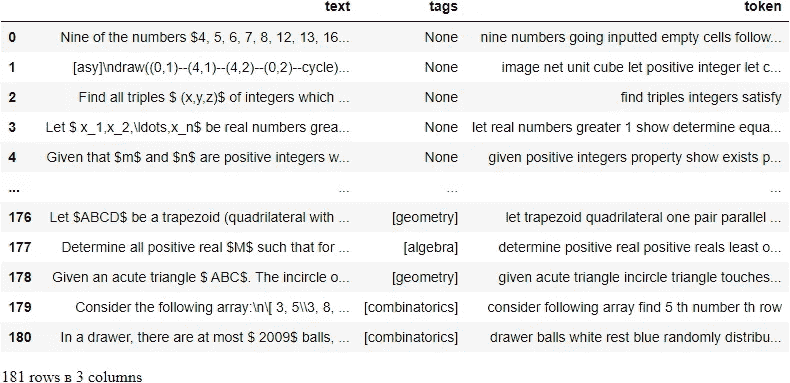
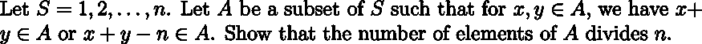
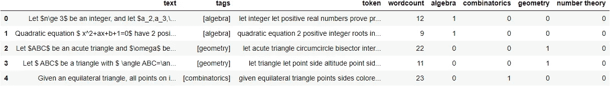
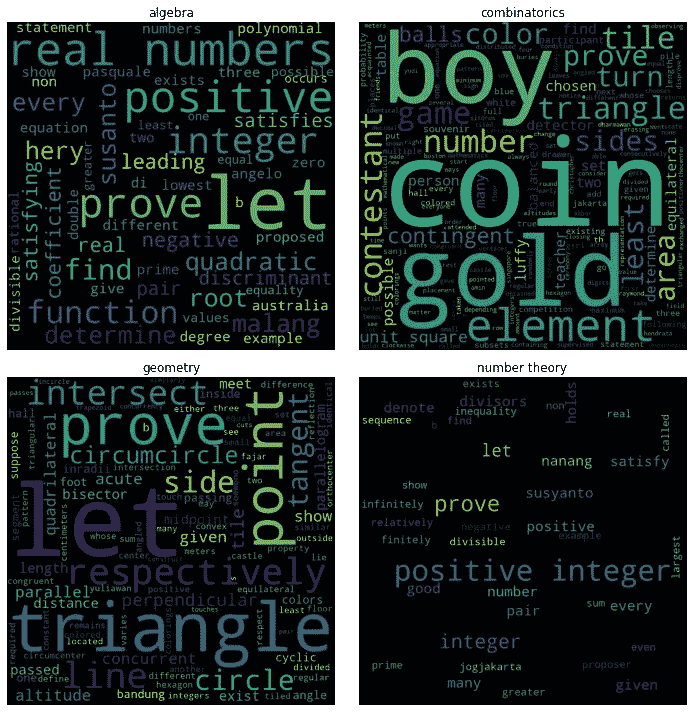
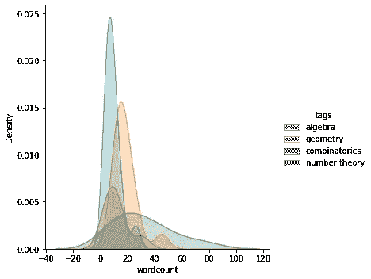
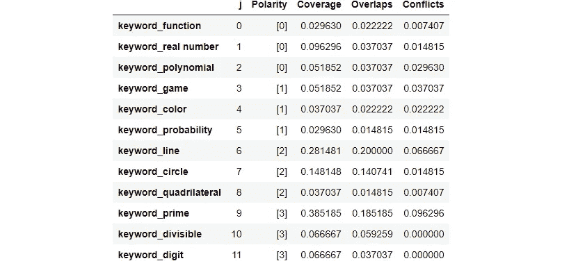
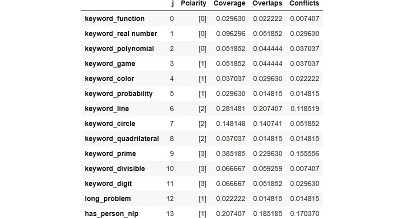

# 监管不力:给你的数据贴上标签却没有真正贴上标签🤔

> 原文：<https://towardsdatascience.com/weak-supervision-with-snorkel-for-multilabel-classification-tasks-c7af4990ea45>

## 实践教程

## 以编程方式标记您的数据！


照片由 [Swanson Chan](https://unsplash.com/es/@alien_spaceship?utm_source=medium&utm_medium=referral) 在 [Unsplash](https://unsplash.com?utm_source=medium&utm_medium=referral) 上拍摄

```
**Table of Contents:**· [Exploratory Data Analysis](#d97d)
· [Keyword Labeling Functions](#a348)
· [Heuristic Labeling Functions](#8495)
· [Labeling Functions with spaCy](#cce7)
· [Combining Labeling Function Outputs](#5315)
· [Training a Classifier](#b386)
· [Wrapping Up](#62d7)
```

这是一个彻底消除在机器学习项目中手工标注任何训练数据的激进想法。它诞生了[通气管](https://www.snorkel.org/)，一个强大的程序库来构建训练数据。

在通气管中有三种程序化操作:

1.  标记功能，例如，使用启发式规则来标记数据
2.  转换功能，例如，执行数据扩充
3.  切片功能，例如，将数据分成子集以进行有针对性的改进

在这个故事中，我们将着重于标记函数。关键思想是标注函数不需要非常精确。浮潜将结合这些来自许多嘈杂的启发式标记策略的输出标签，以产生可靠的训练标签。

这个过程被广泛称为**监管不力**。

我们使用一个名为`problems_preprocessed.json`的数据集，它有三个键:`text`键包含 LaTeX 格式的数学问题，`tags`键包含代数、组合学、几何或数论中的一两个标签，以及`token`键。原始数据集与我在[之前的故事](/active-learning-a-practical-approach-to-improve-your-data-labeling-experience-26da83983393)中使用的数据集相同。

[](/active-learning-a-practical-approach-to-improve-your-data-labeling-experience-26da83983393) [## 主动学习:改善数据标注体验的实用方法

### 一种更智能的人类标记方式

towardsdatascience.com](/active-learning-a-practical-approach-to-improve-your-data-labeling-experience-26da83983393) 

回想一下，通过几个步骤对`text`进行预处理(只是现在没有去词干)以获得干净的`token`。我们不做词干分析，因为我们需要原始单词来构建关键字标签函数。预处理细节请访问[上一个故事](/active-learning-a-practical-approach-to-improve-your-data-labeling-experience-26da83983393)。



将“问题”定义为`text`中的观察/数据点。请注意，一个问题可以分为多个类别。例如，下面这个问题被归类为代数和组合学。



总共有 181 个不同的问题。我们再加一列名为`wordcount`，是`token`的字数。

你可能会注意到，一些问题有标签，但其他许多问题没有。带有标签的问题是用于分类器最终评估的测试问题。这些标签是手工标记的，以确保正确性。没有标记的问题是列车问题，应使用弱监管进行标记。我们看到有 135 个不同的训练问题和 46 个不同的测试问题。

```
Train data shape: (135, 4)
Test data shape: (46, 4)
```

接下来，将测试数据中的标签转换成 4 个二进制列，依次表示`algebra`、`combinatorics`、`geometry`和`number theory`，这样我们就可以继续建模，然后将结果连接回测试数据。



# 探索性数据分析

要创建标注函数，您至少需要对数据集有所了解。因此，EDA 非常重要。首先，您可以将每个标签的单词云可视化。



图片作者[作者](http://dwiuzila.medium.com/membership)

一些单词与标签紧密相关。例如，如果一个问题包含短语“实数”，那么它很可能是一个代数问题，而几何问题包含类似“三角形”或“圆”的单词。

有些标记可以进一步清理，如“let”和“prove ”,它们不强调任何标签，因为每个问题都很可能包含这些命令词。然而，由于我们在这里只做启发式标记，我们可以在创建标记函数时忽略这些词，而不做一些大范围的清理。

还记得`wordcount`吗？我们也可以使用这些信息来形成标记函数。看下面的分布图。



图片作者[作者](http://dwiuzila.medium.com/membership)

很明显，组合数学问题更长:它们包含许多单词！这是有意义的，因为组合学问题有时会传达某种故事，比如下面这个。

> m 个男生和 n 个女生(m>n)坐在一个圆桌对面，由一个老师监督，他们做了一个游戏，是这样的。起初，老师指着一个男孩开始游戏。被选中的男孩把一枚硬币放在桌子上。然后，按顺时针顺序，每个人都轮到自己了。如果下一个人是男生，他会把一个硬币放到现有的硬币堆里。如果下一个人是女生，她会从现有的一堆硬币中拿一枚。如果桌上没有硬币，游戏结束。请注意，根据选择的男孩，游戏可能会提前结束，也可能会进行完整的回合。如果老师想让游戏至少进行一整圈，可以选择多少个男孩？

我们可以有把握地说，一个超过 60 个单词的问题是一个组合学问题。

接下来，让我们定义一些变量来提高代码的可读性。

# 关键词标签功能

有几种技术可以创建标注函数。最简单的方法是使用关键字。从 EDA 中，我们可以选择每个标签中的主要关键字。例如，如果一个问题包含“素数”或“整数”这两个词，我们就将其标记为数论。

我们为每个标签构建了 3 个关键字标记函数，总共产生了 12 个标记函数。请注意，有些标注函数有多个关键字。如果一个问题没有关键词，那就让它弃权吧。

制作标签函数的一种方法是使用`LabelingFunction`类，它接受一个实现核心标签函数逻辑的 python 函数。

如果训练数据的真实标签不可用，例如在我们现在的情况下，则在通气管中有 4 个汇总统计来评估标签功能:

1.  极性:每个标签函数输出的唯一标签集，不包括弃权
2.  覆盖率:每个标注函数标注的数据集的分数
3.  重叠:每个标注函数和至少另一个标注函数标注的数据集部分
4.  冲突:每个标注函数和至少另一个标注函数标注且不一致的数据集部分

因为增加误报会增加覆盖率，所以高覆盖率并不总是好的。可以使用`PandasLFApplier`类将标记功能应用于训练数据。

```
100%|███████████████████████████| 135/135 [00:00<00:00, 2327.52it/s]
```



# 启发式标记函数

接下来，从 EDA，我们一致认为，一个超过 60 个单词的问题将被标记为组合学问题。因此，让我们创建一个标记函数来做这件事，如果问题的字数少于或等于 60，就把它们作为弃权。

这里，我们使用`@labeling_function` decorator 来制作如下的标签函数，它可以应用于任何返回单个观察值标签的 python 函数。

```
100%|███████████████████████████| 135/135 [00:00<00:00, 4784.38it/s]
```


# 用空间标记函数

现在，对于稍微高级一点的实现，我们不像以前那样使用原始数据来导出标记函数。相反，我们利用 spaCy 库，这是由浮潜中的`@nlp_labeling_function`装饰器简化的。

我们使用空间来[识别问题中被标记为“人”的实体](https://spacy.io/usage/linguistic-features#named-entities)。那么如果这些问题包含实体，它们就被标记为组合学。这是有用的，因为组合学问题，如前所述，有时传达了关于一个人的某种故事。否则，把这些问题当做弃权。

```
100%|█████████████████████████████| 135/135 [00:02<00:00, 61.12it/s]
```



# 组合标注功能输出

我们现在有 14 个标记功能，预计它们会相互重叠或冲突。浮潜有能力结合和降噪他们的输出。

但是首先，让我们创建`calc_score`函数来计算真实标签和预测标签之间的测试数据的加权精度、召回率和 f1 值。

不要忘记将标签函数应用于测试数据，如下所示，因为我们只能评估标签函数在测试数据上的性能。

```
100%|███████████████████████████████| 46/46 [00:00<00:00, 63.67it/s]
```

现在，如何准确地将许多标记函数的输出合并到每个观察的一个或多个标记中呢？一种简单的方法是使用我们称之为`MajorityLabelVoter`的标签，其中所选择的标签将是由大多数标签功能投票的标签。为了理解它是如何工作的，让我们看一下测试数据的前五个观察结果。我们有这些标签:

```
array([[-1,  0, -1, -1, -1, -1, -1, -1, -1,  3, -1, -1, -1,  1],
       [-1, -1, -1, -1, -1, -1, -1, -1, -1,  3, -1, -1, -1, -1],
       [-1, -1, -1, -1, -1, -1,  2,  2, -1, -1, -1, -1, -1,  1],
       [-1, -1, -1, -1, -1, -1,  2, -1, -1, -1, -1, -1, -1, -1],
       [-1, -1, -1, -1,  1, -1,  2, -1, -1, -1, -1, -1, -1,  1]])
```

这是一个 5 × 14 的矩阵，因为我们有 14 个标记函数。每个元素代表一个标签，其中-1 表示放弃。让我们去掉弃权符号，看看选择了哪些标签。

```
[0, 3, 1]
[3]
[2, 2, 1]
[2]
[1, 2, 1]
```

现在变得更清楚了。例如，我们可以理解，对于第三个观察值(标签显示为上面的[2，2，1])，14 个标签函数中的 2 个输出几何，1 个标签函数输出组合学。让我们调用基数为 4 的`MajorityLabelVoter`(因为有 4 个标签),看看会发生什么。

```
array([-1,  3,  2,  2,  1])
```

我们观察到`MajorityLabelVoter`有三个条件:

1.  如果只有一个投票的标签函数，它输出相应的标签。
2.  如果有多个标签函数投票，并且其中一个投票占主导地位，则输出主导标签。
3.  如果有一个以上的标签函数投票，并且其中两个(或更多)以同样优势投票，则输出弃权。

总而言之，`MajorityLabelVoter`为每个观察值输出一个标签，这不是我们真正想要的，因为我们正在处理一个多标签分类任务。事实上，[通气管本身并不支持多标签分类](https://github.com/snorkel-team/snorkel/issues/1041)。

要解决这个问题，我们需要一个变通方法。我们将使用`MajorityLabelVoter`中的`predict_proba`方法。

```
array([[0.33333333, 0.33333333, 0\.        , 0.33333333],
       [0\.        , 0\.        , 0\.        , 1\.        ],
       [0\.        , 0\.        , 1\.        , 0\.        ],
       [0\.        , 0\.        , 1\.        , 0\.        ],
       [0\.        , 1\.        , 0\.        , 0\.        ]])
```

正如预期的那样，对于每个观察值，它给所有(主要)标签一个相同的非零值。现在，我们将这些非零值解释为由`MajorityLabelVoter`选择的标签。换句话说，最后的标签`y_pred`是一个元素为 1 的布尔矩阵当且仅当`probs_test`的对应元素非零。因此，最终的标签预测如下。

```
array([[1, 1, 0, 1],
       [0, 0, 0, 1],
       [0, 0, 1, 0],
       [0, 0, 1, 0],
       [0, 1, 0, 0]])
```

我们看到标签为多标签分类任务提供了它们的用途，也就是说，有一些用多个 1 作为标签的观察结果。使用`calc_score`函数计算加权精度、召回率和 f1 分数。

```
{'precision': '0.70', 'recall': '0.90', 'f1': '0.77'}
```

我们获得了 0.70 的精确度，0.77 的 f1 分数，具有可疑的高召回率。然而，这是可以预测的，因为我们上面的方法将弃权标记为[1，1，1，1]，因此给出了许多假阳性，并间接为假阴性留下了很小的余量。

# 训练分类器

`MajorityLabelVoter`的输出只是一组标签，可以与最流行的库一起用于执行监督学习。在这个故事中，我们使用了 scikit-learn 库中的逻辑回归。准确地说，我们将首先将文本特征提取到 TF-IDF 矩阵中，然后采用具有平衡类别权重的逻辑回归(以解决类别不平衡)。该模型将在一个多类设置中作为一个对其余的训练。

我们的训练数据将是标签为`y_train`的`df_train`，其中`y_train`是一个元素为 1 的布尔矩阵，当且仅当`probs_train`的对应元素非零。然而，我们需要小心。可能存在一些我们的标记功能中没有涵盖的观察结果。因此，我们需要使用`filter_unlabeled_dataframe`过滤掉这些观察结果。

最后训练模型，在`df_test`上预测，计算得分。

```
{'precision': '0.83', 'recall': '0.80', 'f1': '0.79'}
```

我们观察到分数总体上比`MajorityLabelVoter`有所提高，并且没有可疑的高召回率！这在一定程度上是因为判别模型的泛化能力超出了标注函数的标注范围，并对所有数据点进行了良好的预测，而不仅仅是标注函数覆盖的数据点。判别模型可以超越噪声标记试探法进行推广。

# 包扎

我们已经了解了**弱监管**，一种实际上不标记任何数据(手动)的数据标记方法。尽管它看起来像一个邪教，但薄弱的监管将贴标签的时间从几个月减少到几天，甚至几个小时，结果可靠。我们使用通气管来完成这项工作，并成功地设计了一种方法，使用`MajorityLabelVoter`中的`predict_proba`方法来简化多标记分类任务。

弱监督的思想是组合许多标记函数的输出，这些函数用于以编程方式标记数据。在我们的案例中，我们发现这种方法有很高的召回率。然后，我们表明，在弱监督数据集上训练的分类器可以优于仅基于标记函数的方法，因为它学会了在我们提供的嘈杂试探法之外进行概括。


🔥你好！如果你喜欢这个故事，想支持我这个作家，可以考虑 [***成为会员***](https://dwiuzila.medium.com/membership) *。每月只需 5 美元，你就可以无限制地阅读媒体上的所有报道。如果你注册使用我的链接，我会赚一小笔佣金。*

🔖*想了解更多关于经典机器学习模型如何工作以及如何优化其参数的信息？或者 MLOps 大型项目的例子？有史以来最优秀的文章呢？继续阅读:*


[艾伯斯·乌兹拉](https://dwiuzila.medium.com/?source=post_page-----c7af4990ea45--------------------------------)

## 从零开始的机器学习

[View list](https://dwiuzila.medium.com/list/machine-learning-from-scratch-b35db8650093?source=post_page-----c7af4990ea45--------------------------------)8 stories

[艾伯斯·乌兹拉](https://dwiuzila.medium.com/?source=post_page-----c7af4990ea45--------------------------------)

## 高级优化方法

[View list](https://dwiuzila.medium.com/list/advanced-optimization-methods-26e264a361e4?source=post_page-----c7af4990ea45--------------------------------)7 stories

[艾伯斯·乌兹拉](https://dwiuzila.medium.com/?source=post_page-----c7af4990ea45--------------------------------)

## MLOps 大型项目

[View list](https://dwiuzila.medium.com/list/mlops-megaproject-6a3bf86e45e4?source=post_page-----c7af4990ea45--------------------------------)6 stories

[艾伯斯·乌兹拉](https://dwiuzila.medium.com/?source=post_page-----c7af4990ea45--------------------------------)

## 我最好的故事

[View list](https://dwiuzila.medium.com/list/my-best-stories-d8243ae80aa0?source=post_page-----c7af4990ea45--------------------------------)24 stories

艾伯斯·乌兹拉

## R 中的数据科学

[View list](https://dwiuzila.medium.com/list/data-science-in-r-0a8179814b50?source=post_page-----c7af4990ea45--------------------------------)7 stories[](https://dwiuzila.medium.com/membership)

[1]通气管的 API 文档，[*https://snorkel.readthedocs.io/en/v0.9.7/*](https://snorkel.readthedocs.io/en/v0.9.7/)

[2]通气管介绍教程:数据标注，[*https://www.snorkel.org/use-cases/01-spam-tutorial*](https://www.snorkel.org/use-cases/01-spam-tutorial)