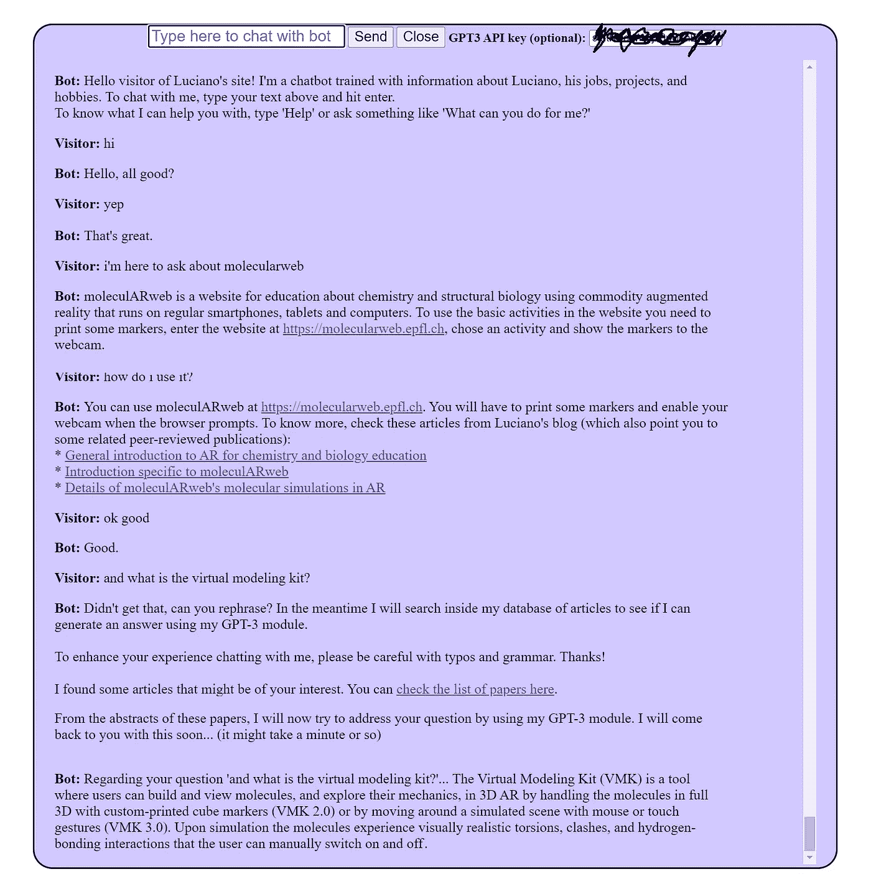

# 基于网络的聊天机器人项目，模块 2: GPT-3 生成的响应，有一个针对特定主题的少量学习的数据库辅助

> 原文：<https://towardsdatascience.com/web-based-chatbot-project-module-2-gpt-3-generated-responses-assisted-with-a-database-for-1ee2a0f4aad4>

## 这个项目的第二部分跨越网络编程，数学，人工智能，等等

我最近介绍了这个基于网络的、完全客户端的聊天机器人，它的“大脑”中有两个主要模块:

*   通过使用近似字符串匹配从问答配对数据库中检索答案的工具。
*   另一个使用 GPT-3 从内部解析的文本片段生成回复。

我还向您详细展示了第一个模块如何与字符串匹配函数、数据库编译等几个细节一起工作。：

</web-based-database-powered-chatbot-project-module-1-approximate-string-matching-65df0d8c999d>  

现在，这是这个聊天机器人大脑的另一半:一个通过 OpenAI 的 GPT-3 语言模型生成用户问题答案的模块，该模型通过对文本的少量学习进行扩展，这些文本首先通过字符串匹配进行检索。

> 关键要点:聊天机器人的 GPT-3 模块通过 OpenAI 的 GPT-3 语言模型生成用户问题的答案，该模型通过对文本的少量学习进行扩展，这些文本首先通过字符串匹配进行检索。

# 核心部分:基于 GPT 3 的自然语言处理和生成，包含自定义文本

## 快速回顾 GPT 协议-3

聊天机器人这一半大脑的核心是 GPT-3，这是由 OpenAI 开发的用于文本处理和生成的模型。我在很大程度上介绍并测试了 GPT-3，特别是它准确回答事实问题和获得定制数据的能力:

</devising-tests-to-measure-gpt-3s-knowledge-of-the-basic-sciences-4bbfcde8286b>  </gpt-3-like-models-with-extended-training-could-be-the-future-24-7-tutors-for-biology-students-904d2ae7986a>    

## 为什么 GPT-3 在这个项目中？

GPT-3 是当今最大的型号之一，但不是最大的，也可能不是最好的。但是它在前 3-5 名中，对我来说它是最容易使用的。为什么？因为您只需调用 OpenAI 提供的 API 对于 web 应用程序，您可以通过简单的 PHP 实现这一点:

</custom-informed-gpt-3-models-for-your-website-with-very-simple-code-47134b25620b>  

顺便说一下，我在我的免费 Altervista 驱动的网站上运行 PHP。这个提供商提供了丰富的功能(我没有因为推广它而获得任何东西…我只是喜欢它！):

<https://medium.com/geekculture/to-me-simply-the-best-free-web-hosting-out-there-honest-review-not-paid-advertisement-4829689913a>  

我更喜欢 GPT-3 的另一个重要原因是，它很容易用自然检索的信息来扩展它。有两种方法可以做到这一点:

*   **微调**，涉及用定制信息训练小块模型。我永远也做不好这件事…
*   **少量学习**，它包括在提示之前添加包含自定义信息的文本。这非常有效，并且实现起来非常简单。

在下一小节中，我将描述 GPT 3 中的少镜头学习，然后我将向您展示我如何在我的聊天机器人中使用它——因为有一个重要的限制需要克服，您将会看到。

## 向 GPT 3 号通报具体知识的少数机会学习

GPT-3 最酷的特点之一是，你可以很容易地模拟你教它，而不是实际上重新训练它。这被称为“少量学习”,包括在提示之前提供一段包含与提示相关的信息的文本。

当你想问 GPT 3 号一个它不知道的问题时，这尤其有用……比方说，关于像你我这样不出名的人。然后你可以在你的问题前面加上这个人的*简历*，或者几段关于他/她的介绍；当被询问时，GPT-3 会将此信息作为提示的一部分进行处理，然后精心制作一个输出文本，如果提示询问的是其中的信息，该文本将受其影响。

我用这个基于少量学习的精确策略来指导 GPT-3 回答关于生物学的问题。问题简单的时候，它不需要额外学习就能正确回复；但是随着话题变得越来越专业，它开始出错或者没有产生任何答案。如果你在问题前加上文本，甚至是复杂的论文摘要，它就能很好地检索出答案，即使没有被问到它们在文本中是如何编码的。您可以在下面的文章中看到一些这样的例子:

</gpt-3-like-models-with-extended-training-could-be-the-future-24-7-tutors-for-biology-students-904d2ae7986a>  

现在让我们看看如何用字符串匹配包装这些内容，以便在 chabot 中进行少量学习。

# 这个网络聊天机器人的 GPT 3 模块中的特定主题的少数镜头学习

少量学习策略的一个重要限制是，提示受限于它可以接受的标记数量。确切的限制是 2000 或 4000 个令牌，具体取决于确切的 GPT-3 引擎和端点。令牌中的这种限制既包括输入，其中用于少量学习的信息以及问题被提供给模型，也包括模型的输出，即由 GPT-3 生成的文本。

OpenAI 的官方文档解释说 2000 个代币相当于 8000 个字符，或者 1500 个单词。这意味着，如果我们期望问题和答案占用大约 100-200 个单词，那么我们就剩下 1300-1400 个单词来为少量学习提供信息。这是一个相当大的数量，但是我们无法容纳大量的文本，即使是短文也不行。因此，我们不能提供，比方说，关于某个给定主题的整本教科书，或者在我的情况下，我的论文和博客帖子的全部内容，用于少量的学习。

这是我在聊天机器人中内置的程序:

1.  建立一个数据库，包含我的论文摘要和我的博客条目，每个不超过 300 字，以独立的变量链接到完整文章及其标题的 URL。
2.  清理用户输入的数字、符号、停用词等。
3.  在数据库的标题和摘要中，从清理后的文本中搜索 1、2 或 3 个连续单词。当有匹配时，保存相应的文本。
4.  将所有保存的文本合并在一起，将其精简到不超过 5000 个单词，在最后添加用户的问题，并将结果提交给 GPT-3。该输入包含从具有匹配关键字的文章中检索的少量学习的信息，后跟用户的问题。
5.  从 GPT-3 返回后，删除输入，只保留 GPT-3 添加的文本部分，大概包含问题的答案。

## 对程序的深入探究

关于这个模块如何工作的几个具体点。

首先，我将文本保存在如下形式的数组中:

```
[“Title”,”Author(s)”,”Journal, magazine or blog”,Year,”[U](https://www.nature.com/articles/s43588-021-00142-8)RL","Text”]
```

其中最后一个字段“文本”是一个长字符串，用于构建 GPT-3 的少量学习提示。对于科学文本来说，这仅仅包括出版物的摘要或预印本，这些都可以在 PubMed 等网站上公开获得。对于杂志文章和博客文章来说，这段文字要么是文章的摘要，要么是文章的前几段。

以下是我的聊天机器人程序当前版本的例子:

摘自我的一篇同行评议论文:

> texts.push([“通过 WebXR 实现科学教育的民主化互动和沉浸式体验”，“F Cortes Rodriguez，M Dal Peraro 和 LA Abriata”，“自然计算科学”，2021，“[https://www.nature.com/articles/s43588-021-00142-8](https://www.nature.com/articles/s43588-021-00142-8)”，“抽象自然、极端尺寸、可用性差或购买成本高的对象和概念通常很难理解和实验。我们人类使用[…]完全虚拟的，如在虚拟现实(VR)中，或真实世界的扩展视图，如在增强现实(AR)中。”])

来自我的一篇博客:

> texts.push([“罗勒、草莓、沙拉和西红柿在果园的阳台上茁壮成长。另外…那是什么？西瓜？西葫芦？”、“L Abriata”、“园艺、观鸟和户外探险(中)”、2022，“[https://Medium . com/Gardening-Birding-and-Outdoor-Adventure/basil-草莓-沙拉-西红柿-growing-powerful-in-the-orchard-阳台-d6fad7ee6e73](https://medium.com/gardening-birding-and-outdoor-adventure/basil-strawberries-salads-and-tomatoes-growing-powerful-in-the-orchard-balcony-d6fad7ee6e73) ，“这里你看到其中一个在我建造的架子上，用来养植物，让它们接触阳光。前面还有一些玉米沙拉。这些是罗勒植物[…]草莓已经在我的阳台上生活了多年，几乎是野生的，但这次我把它们放在了更多日光浴的地方。多亏了这些金鱼草，这里的环境多姿多彩。”])

第二，清理输入字符串是必不可少的，这样字符串搜索就可以集中在有意义的单词上。你可以查看我以前的文章，看看单词修复、停用词、符号等列表。包含在我的字符串清理函数中。

请注意，一旦某些文章匹配，聊天机器人就会显示一个链接，指向它们的列表。这总是有用的，但尤其是当用户没有 GPT-3 API 密钥时，在这种情况下，聊天机器人将无法根据文本内容进行回复——但用户至少可以自己去看文章。

第三，聊天机器人检查用户是否正在提供 GPT-3 的 API 密钥。如果没有提供，它甚至不会尝试运行这个模块。如果提供了，它会通知用户它将尝试使用它，表明可能需要一分钟左右的时间才能得到答案。

最后一点很重要，因为 API 调用是异步工作的，所以在聊天机器人从 GPT-3 模块返回回复之前，用户可能会输入一些内容。为了使对话更自然，当聊天机器人要展示 GPT-3 程序的结果时，它首先回忆用户“*关于……然后……*”的问题

您可以在下面的示例中看到这一点以及迄今为止讨论的其他点。

# 与最终网络聊天机器人的对话示例

这里有一个对话，它通过字符串匹配(在我以前的帖子中介绍过)和调用 GPT 3:



使用了这个基于网络的聊天机器人的两个模块的聊天会话，如下所述。作者截图。

在这里，为了便于阅读，我把它转录了下来，中间用简单的字体格式做了注释:

> 卢西亚诺网站的访客你好！我是一个聊天机器人，受过关于卢西亚诺、他的工作、项目和爱好的信息训练。要与我聊天，请在上面键入您的文本，然后按 enter 键。
> 要知道我能帮你什么，键入‘Help’或问类似‘你能为我做什么？’

这是聊天机器人加载时显示的默认句子。

> **访客:**嗨
> 
> **Bot:** 你好，都好吗？
> 
> 参观者:是的
> 
> Bot: 太好了。

这段聊天来自我基于微软聊天机器人个性的开放数据集建立的非常丰富的数据库，正如我在以前的帖子中解释的那样。

> 来访者:我是来询问关于分子网的事情的
> 
> **Bot:** moleculARweb 是一个关于化学和结构生物学的教育网站，使用商品增强现实技术，在普通智能手机、平板电脑和电脑上运行。要使用网站中的基本活动，您需要打印一些标记，请通过[https://molecular web . epfl . ch](https://molecularweb.epfl.ch/)进入网站，选择一项活动并向网络摄像头显示标记。

这还是数据库的回复。下面继续，其中“it”在内部被“molecularweb”替换(最后一个主题，所有这些都在我以前的文章中)，这允许与数据库的问题精确匹配。

> 访问者:我如何使用它？
> 
> **Bot:** 你可以在[https://moleculARweb . epfl . ch](https://molecularweb.epfl.ch/)使用 molecular web。当浏览器提示时，您必须打印一些标记并启用您的网络摄像头。要了解更多信息，请查看 Luciano 博客中的这些文章(这些文章也为您提供了一些相关的同行评审出版物):
> * [化学和生物教育 ar 概述](https://medium.com/geekculture/chemistry-and-biology-education-using-commodity-web-augmented-reality-in-any-device-9fa9fdc4ab35)
> * [针对 moleculARweb 的介绍](https://lucianosphere.medium.com/molecularweb-a-brief-practical-introduction-5738771b224d)
> *[molecular web 在 AR 中的分子模拟详情](https://medium.com/age-of-awareness/molecular-graphics-and-simulations-in-augmented-reality-on-your-web-browser-9e79c7b75a04)
> 
> 来访者:好的，很好
> 
> **Bot:** 好。

最后一个响应也来自数据库的聊天部分。

现在，当用户询问关于 molecularweb 的一些非常具体的问题时，GPT-3 开始发挥作用:它的虚拟建模工具包。

> **参观者:**那虚拟建模工具包是什么？
> 
> **Bot:** 没听懂，你能换个说法吗？与此同时，我将在我的文章数据库中搜索，看看我是否能使用我的 GPT-3 模块得出一个答案。

该机器人首先澄清说，它不太确定问了什么，但它会尝试它的 GPT-3 模块。

> 为了提高你和我聊天的体验，请注意拼写和语法。谢谢！

以防出现打字错误或复杂的问题，它还阐明了如何使聊天更加流畅。

> 我找到了一些你可能感兴趣的文章。你可以在这里查看论文列表。
> 
> 根据这些论文的摘要，我现在将尝试使用我的 GPT-3 模块来回答你的问题。我很快会带着这个回来给你…(可能需要一分钟左右)

如果它找到了包含有问题的关键词的文章(记住它们被清除了符号、停用词等等)。)，然后它会这样说，甚至会创建一个可点击的链接来查看文章。注意，它警告用户这可能需要一些时间。

最后，当 GPT-3 返回结果时，它会在文本前面显示这些结果，并引用原始问题。

> 关于你的问题“虚拟建模工具包是什么？”…虚拟建模工具包(VMK)是一种工具，用户可以在 3D AR 中构建和查看分子，并探索它们的机制，方法是使用定制打印的立方体标记(VMK 2.0)在全 3D 中处理分子，或者使用鼠标或触摸手势在模拟场景中移动(VMK 3.0)。在模拟时，分子会经历视觉上真实的扭曲、碰撞和氢键相互作用，用户可以手动打开和关闭。

## 另一个话题，这次是关于生长在瑞士的野生水仙花

根据从我的博客中的一篇文章中获取的信息，这篇文章包含在“少量学习”的文章列表中:

<https://medium.com/illumination/the-history-of-switzerlands-wild-daffodils-dea42e8a4df4>  

我问“*水仙花需要什么土壤才能生长？*”。我知道这个信息就在那里。它可以找到它:

> **参观者:**水仙花需要什么土壤才能生长？
> 
> 不确定你在问什么，你最好换种方式再问我一次。与此同时，我将在我的文章数据库中搜索，看看我是否能使用我的 GPT-3 模块得出一个答案。
> 
> 为了提高你和我聊天的体验，请注意拼写和语法。谢谢！

它说上面的文字是因为在数据库中没有任何匹配。但是正如你在下面看到的，它确实找到了这篇文章，所以它通过 GPT-3 模块，这个模块实际上可以回答这个问题！

> 我找到了一些你可能感兴趣的文章。你可以在这里查看论文列表。
> 
> 让我把我的 GPT-3 模块应用到它们上面……(可能需要一分钟左右)
> 
> 关于你的问题‘水仙花需要什么土壤才能生长？’……水仙花喜欢新鲜的土壤，微微湿润，营养丰富，比如奶牛放牧的田地——但是没有奶牛谁会吃它们！水仙花需要新鲜的空气，但又不需要太冷，所以它们生长在海拔 700 到 1800 米的地方。它们需要阳光，所以它们在朝南的开阔森林中茁壮成长..

它其实回答的比我问的还多，不过还好，至少都是和这些花长在哪里有关的信息。

# GPT-3 带来的另一个很酷的东西:它让你的机器人可以使用多种语言！

如果你用西班牙语或法语问我的聊天机器人，如果问题通过 GPT-3 模块，那么很有可能得到答案。下面是我用这两种语言问它的关于 molecularweb 的问题:

> **访客:**什么是分子网？
> 
> **Bot:** 原则上我不知道该说什么，但我会在我的文章数据库中搜索，试图用我的 GPT-3 模块得出一些答案。
> 
> 为了提高你和我聊天的体验，请注意拼写和语法。谢谢！
> 
> 我找到了一些你可能感兴趣的文章。你可以在这里查看论文列表。
> 
> 让我把我的 GPT-3 模块应用到它们上面……(可能需要一分钟左右)
> 
> 关于你的问题“分子网络是什么？”这是一个允许学生和教育工作者代表虚拟分子、分子、轨道和复杂生物分子和生物结构、分子结构、分子轨道和理论的网站；拉埃斯特雷。
> 
> 访客:你是说分子网络吗？
> 
> 请再说一遍。与此同时，我将在我的文章数据库中搜索，看看我是否能使用我的 GPT-3 模块得出一个答案。
> 
> 为了提高你和我聊天的体验，请注意拼写和语法。谢谢！
> 
> 我找到了一些你可能感兴趣的文章。你可以在这里查看论文列表。
> 
> 让我把我的 GPT-3 模块应用到它们上面……(可能需要一分钟左右)
> 
> 关于你的问题“这是什么分子网络？”… molecularweb 是一个关于化学和生物结构中的“教育和低俗化”的网站，可以在智能手机、平板电脑和纵坐标导航网站中快速浏览。我们提出了两个改进方案。

如果你能读懂这些语言，你就会确认它运行得非常好。结尾的截断与语言无关；它们有时也发生在英语中。它们与调用 API 时请求的最大长度有关。

我发现 GPT-3 也能够用意大利语和其他一些语言回答问题。另一方面，我看到它在像匈牙利语这样的语言中失败了，这可能在用于训练它的原始语料库中没有得到很好的表示。

# 想玩这个聊天机器人吗？

您可以在这里找到它:

[**http://lucianabriata . alter vista . org/chatbotallweb/chatbottest . html**](http://lucianoabriata.altervista.org/chatbotallweb/chatbottest.html)

> 请注意，我一直在改进聊天机器人，无论是在代码层面还是在两个数据库层面(问题-答案对和 GPT-3-通知文本)…所以如果你在我工作的时候输入，你可能会遇到问题。如果发生这种情况，请稍后再试。

请记住**你需要**一个 OpenAI API 密匙来使用 GPT 3，你可以通过……嗯，问我的聊天机器人——例如用“*我如何获得 GPT-3 的 API 密匙？*”

www.lucianoabriata.com*[***我写作并拍摄我广泛兴趣范围内的一切事物:自然、科学、技术、编程等等。***](https://www.lucianoabriata.com/) **[***成为媒介会员***](https://lucianosphere.medium.com/membership) *访问其所有故事(我免费获得小额收入的平台的附属链接)和* [***订阅获取我的新故事***](https://lucianosphere.medium.com/subscribe) ***通过电子邮件*** *。到* ***咨询关于小职位*** *查看我的* [***服务页面这里***](https://lucianoabriata.altervista.org/services/index.html) *。你可以* [***这里联系我***](https://lucianoabriata.altervista.org/office/contact.html) ***。******