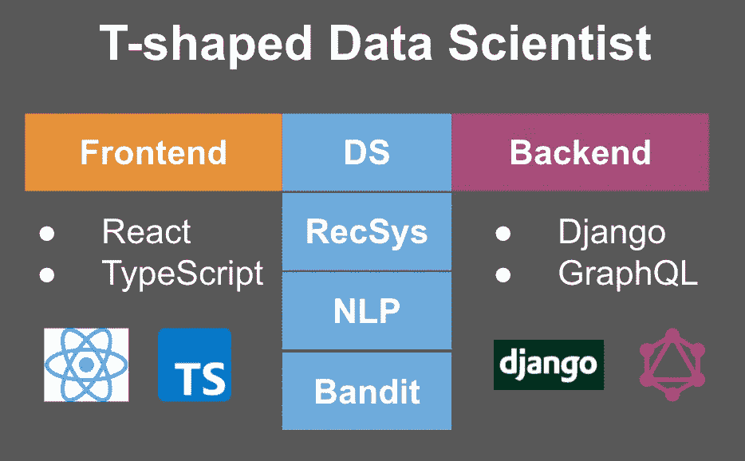
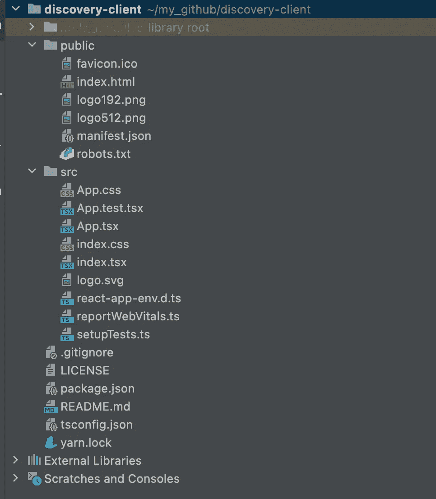
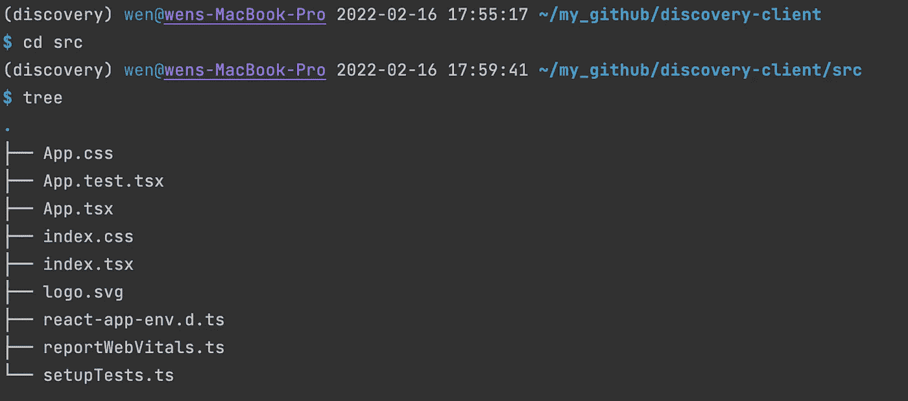
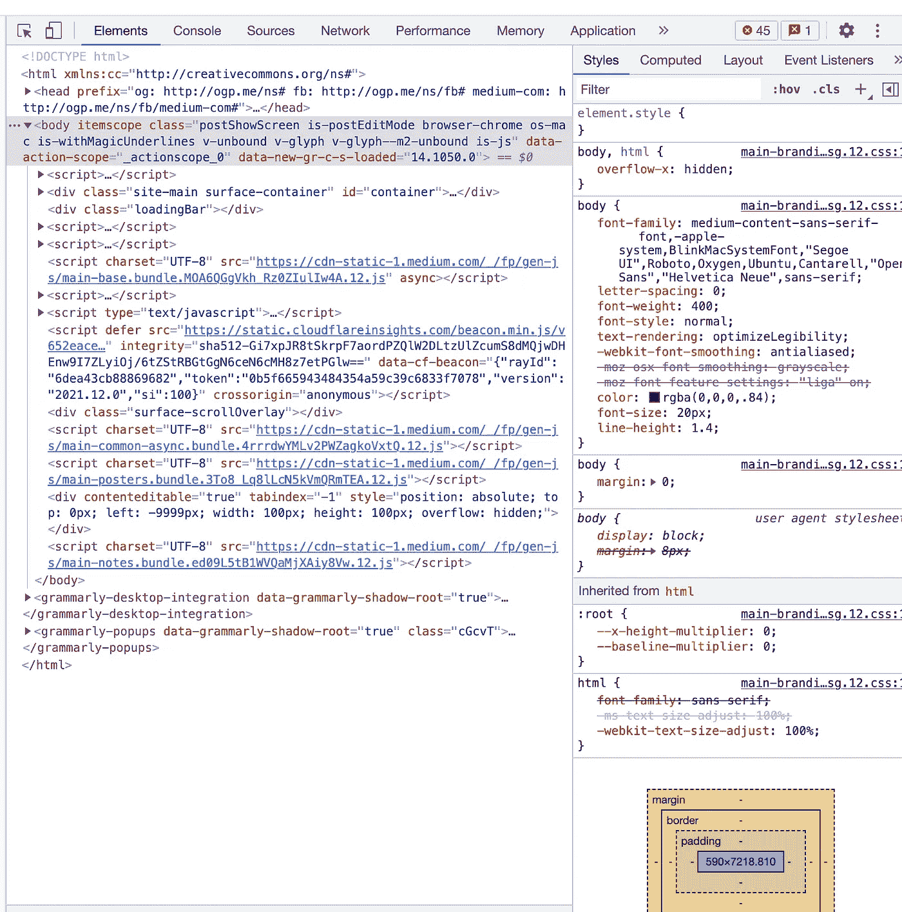

# 一位数据科学家的 Web 开发笔记

> 原文：<https://towardsdatascience.com/web-development-notes-from-a-data-scientist-95e4794fb4ab>

## React 和 TypeScript +前端环境设置的声音片段


照片由 [Sourabh Panari](https://unsplash.com/@_sourabh_?utm_source=medium&utm_medium=referral) 在 [Unsplash](https://unsplash.com?utm_source=medium&utm_medium=referral) 上拍摄

# 谁应该读这个？

*   我自己:我 2022 年的职业目标之一是成为更好的 [T 型数据科学家](/t-shaped-skills-builder-guide-in-2020-for-end-to-end-data-scientist-33d2652511b0)。例如，我的“T”的深度代表数据科学和机器学习领域知识，尤其是推荐系统和自然语言处理(NLP)以及 Bandit 相关的进步。我的“T”的宽度代表了个性化从后端到前端将触及的所有领域。在过去的 6 个月里，我觉得我已经开始很好地掌握了如何将我的数据科学代码插入到 Django 和 GraphQL API 中。所以今年，我很想了解 GraphQL API 是如何插入我们的服务前端的。



我的 2022 目标:作者图片

*   任何想要学习 web 开发基础知识以更好地理解前端工作流的数据科学家。

# 包括什么？

以下是我从我杰出的同事 Nic 那里得到的笔记，他不仅是一名优秀的前端开发人员，还是 React、NextJS 和 web 开发的优秀教师！有四个部分:

1.  核心前端技术平台的广告词
2.  关于前端开发环境设置的分步指南
3.  关键文件结构演练
4.  小贴士:如何在 Chrome + material ui 中激活 DevTools

# 🎵核心前端技术平台的广告词

## **核心前端技术平台:创建-反应-应用(CRA) +打字稿**

当我开始从 Nic 学习 web 开发时，他说**我要做的第一选择是选择 next . js VS Create-React-App(CRA)**。你可能会问一个自然的问题——它们是什么，有什么区别？

**它们是什么？**

*   **Next.js** 和 **Create-React-App** 都是面向前端开发者的 **web 开发框架**。从数据科学打个比方，类似于我们把 Keras 和 PyTorch 作为深度学习框架。从后端打个比方，我们有 Flask 和 Django 作为后端开发人员的基于 python 的 web 开发框架

**对于数据科学家来说，它们有多大的不同？**

*   由于我的主要目的是了解数据科学 API 如何与前端代码连接，并且我不打算在短期内成为前端开发人员，所以对我来说，不同之处在于 **Next.js** 需要更多的设置，而 **Create-React-App** 只需要最少的设置。
*   因此，我选择 Create-React-App 作为第一个选项的答案。

第二个选择是在**类型脚本**和 **JavaScript** 之间进行选择。实际上，我不需要做出选择，我只需要遵循——Nic 强烈建议将 TypeScript 视为最佳实践或现代 JavaScript。

*   什么是 TypeScript？
    -是 JavaScript 的超集，语法和 JavaScript 几乎一样。
*   为什么更好？
    - JavaScript 允许你对不同类型的数据使用相同的对象，这使得调试变得困难。只有当应用程序已经部署到生产环境中时，您才可能注意到问题。而 TypeScripts 具有可选的静态类型和类型推断，增加了更多的限制以实现更好的健壮性。

我的**第三个问题**是关于我经常听到的两个术语:**React Native**VS**React**

*   所以 **Next.js** 和 **Create-React-App** 都是基于 **React** ，这是一个用于构建用户界面(UI)的 JavaScript 库。React 用于 web 开发，意思是工作是为了开发网站。
*   **React Native** 是一个工具，它可以让你编写相同的 JavaScript 或 TypeScript 代码，并为移动应用程序开发它们。例如，通常情况下，Android 应用程序用 Java 编写，ios 应用程序用 swift 编写。如果你在网站、Android 手机和 iPhones 上开发你的服务，你需要写三套完全不同的代码。React Native 允许您捆绑为网站开发的相同类型的脚本代码，并将其部署到 Android 和 ios 移动应用程序。

Nic 还提到前端开发有三大支柱:HTML、CSS、JavaScript (TypeScript)。由于我的目标是理解数据科学模型(包装在 API 中)如何在前端使用的逻辑，我们将较少关注 HTML 和 CSS，而主要关注 TypeScript 部分。

# 👣关于前端开发环境设置的分步指南

第一步:我们需要安装软件包`node`和`yarn`。

**什么是** `**yarn**` **？**
——是一个包经理。就像数据科学一样，我们有 python 包管理器`pip`和`conda`。这里我们有`npm`和`yarn`。他们都从`npm`仓库下载包。默认情况下，Yarn 生成`yarn.lock`来锁定包的依赖版本。它的主要优点是，它有助于避免与 node.js 系统模块的不同版本相关的任何可能的问题，项目将安装在这些模块上。

(下面的安装代码在 MacBook 的终端上运行)

```
# 1\. install node
$ brew install node# Check your node version
$ node --version# 2\. install yarn
$ brew install yarn
```

提示:如果你需要使用不同版本的 Node.js(就像有时候在 DS 中我们有不同版本的 python 代码)，你可以安装`n`来管理 Node.js 版本

```
# if you already have Node.js installed
$ npm install -g n# check node.js version 
$ n lts
```

步骤 2:创建一个项目本地或 Github。在 local 中，您可以选择在 Pycharm 中创建一个 React 项目。如果你希望你的项目是协作性的，你也可以先在 Github 中创建一个项目，然后运行`git clone your-project`到你想要的项目文件夹。

步骤 3:使用下面的命令创建一个 typescript react-app 项目

```
$ yarn create react-app discovery-client --template typescript
```

# 🗝密钥文件结构演练

一旦你在 Pycharm 中打开你的第一个 react 应用项目，你会注意到你有很多很多的文件，尤其是在`node_modules`中。所以强烈推荐将`node_modules`添加到你的`.gitignore`中，这样可以保持更新的整洁和可读性。

由于我的目标是构建一个推荐器前端，称为`discovery-client`，下面是我的项目文件夹的样子:



生成文件结构的一个快速提示是使用`tree`命令。例如，下面是`src`文件夹中的内容:



这引出了一个我长久以来一直思考的问题。我知道最好的做法是将所有代码放在`src`下，即使是我们的数据科学代码，我的经理也建议这样做。但是为什么呢？
——因为`src`是生产部署的切入点。生产系统通常是云托管的解决方案，并且`src`允许生产系统指向目录。生产系统就是这样找到所有代码并执行正确路径的。

Nic 提出的三个关键文件可能最值得数据科学家关注:

*   `public/index.html`:这将为浏览器呈现应用组件
*   `src/index.tsx`:这将为本地桌面环境呈现应用程序组件
*   `src/App.tsx`:这是我们应用程序中的主要组件，我们可以使用 TypeScript 编写 React 代码。

# 🌠小贴士:如何在 Chrome + material ui 中激活 DevTools

1.  如何在 Chrome
    - `option + cmd + J`
    中启用开发工具——例如，当我在 Medium 中输入时，我可以看到以下元素



作者图片

2.[Material ui](https://mui.com/)
——数据科学类比中最好的思考方式是，我们有 sklearn，我们可以轻松重用随机搜索和网格搜索，而无需从头编写代码。构建 UI 组件也是如此。这是一个包括许多预建的 UI 组件的库，允许你重复使用和节省你的时间！

# 摘要

*   作为一名数据科学家，如果你想了解你的代码如何从后端到前端，从高层次上了解前端和 web 开发如何工作是有益的。我在这里的目标是帮助我自己和其他数据科学家最大限度地了解前端的逻辑和工作流。
*   在我的公司，我们使用 React for web 和 React Native for mobile。在您的组织中可能会有所不同。我发现从你的前端开发同事那里学习它们比通过一门课程学习更有益，因为他们可以很容易地为数据科学和机器学习量身定制最重要的课程。
*   最后但同样重要的是，永远学习和发展，享受旅程！