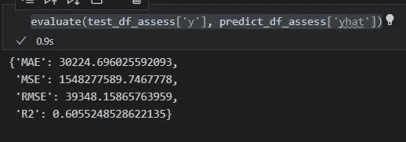
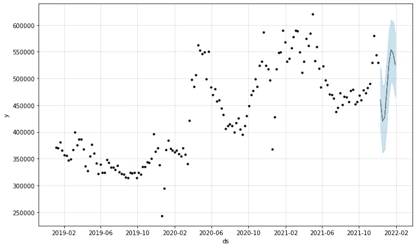
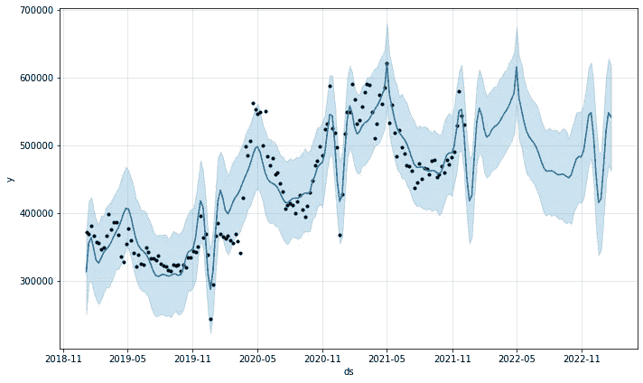
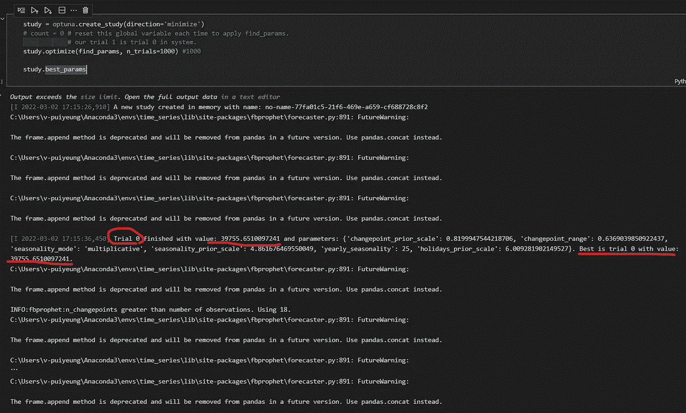
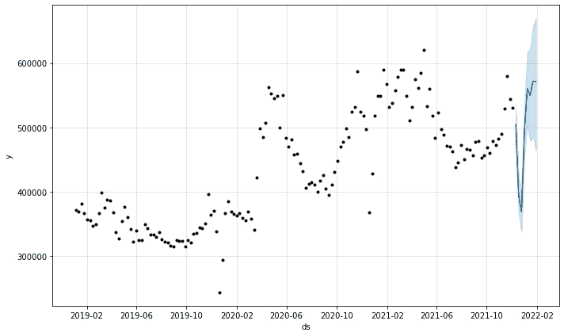
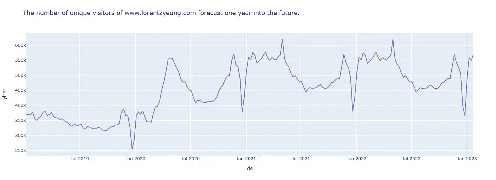

# 网站访客预测与脸书先知:完整教程

> 原文：<https://towardsdatascience.com/website-visitor-forecast-with-facebook-prophet-a-complete-tutorial-1d0a5bcd1f8f>

## 安装说明、数据、参数调整以及简单和复杂的预测—第 2 部分


卢克·房龙在 [Unsplash](https://unsplash.com/s/photos/pit?utm_source=unsplash&utm_medium=referral&utm_content=creditCopyText) 上的照片

这是[教程的第 2 部分——用脸书预言家 2022 的所有教程进行网站访客预测(](/real-world-website-visitor-forecast-with-facebook-prophet-a-complete-tutorial-8d135b848c5e)安装说明、数据、参数调整，以及简单的&复杂预测)。

[原文](/real-world-website-visitor-forecast-with-facebook-prophet-a-complete-tutorial-8d135b848c5e)封面，

1.  [**安装先知**](/real-world-website-visitor-forecast-with-facebook-prophet-a-complete-tutorial-8d135b848c5e)
2.  [**简单的 ETL，以及数据可视化**](/real-world-website-visitor-forecast-with-facebook-prophet-a-complete-tutorial-8d135b848c5e)
3.  [**简单预测(默认设置的预测)**](/real-world-website-visitor-forecast-with-facebook-prophet-a-complete-tutorial-8d135b848c5e)
4.  [**预测与模型评估**](/website-visitor-forecast-with-facebook-prophet-a-complete-tutorial-1d0a5bcd1f8f)
5.  [**用调好的参数进行预测**](/website-visitor-forecast-with-facebook-prophet-a-complete-tutorial-1d0a5bcd1f8f)

但是，原文太长了。因此它现在被分成两部分——[前 3 节在第 1 部分](/real-world-website-visitor-forecast-with-facebook-prophet-a-complete-tutorial-8d135b848c5e)中，而[第 4 节](/website-visitor-forecast-with-facebook-prophet-a-complete-tutorial-1d0a5bcd1f8f)和[第 5 节](/website-visitor-forecast-with-facebook-prophet-a-complete-tutorial-1d0a5bcd1f8f)在[第 2 部分](/website-visitor-forecast-with-facebook-prophet-a-complete-tutorial-1d0a5bcd1f8f)中。如果您对安装和简单预测不感兴趣，请[点击此处进入第 2 部分](/website-visitor-forecast-with-facebook-prophet-a-complete-tutorial-1d0a5bcd1f8f)。

# 4.利用模态评估进行预测

评估模型的准确性对于创建机器学习模型来描述模型在预测中的表现至关重要。幸运的是，当评估我们的先知在预测中的表现时，我们可以采用一些常见而简单的评估标准。

## * MAE(平均绝对误差)

*   对数据集上原始值(y)和预测值(yhat)之间的绝对差值求平均值。越小越好。

## * MSE(均方误差)

*   对数据集上的原始值(y)和预测值(yhat)之间的平方差进行平均。这对于具有异常值的数据集来说是很好的，这将会受到这个度量的严重惩罚。同样，该值越小，模型越好。

## * RMSE(均方根误差)

*   就是取 MSE 的平方根。

## * R 平方(决定系数)

*   模型解释被研究对象的程度的系数。它的值从 0 到 1。越大越好。

```
def evaluate(y_true, y_pred):dict = {‘MAE’: mean_absolute_error(y_true, y_pred),‘MSE’: mean_squared_error(y_true, y_pred),‘RMSE’: sqrt(mean_squared_error(y_true, y_pred)),‘R2’: r2_score(y_true, y_pred)}return dict
```

在我们的分析中，我们将只关注 **MAE** 和 **R 平方**。但是我仍然会在代码中包含 MSE 和 RMSE。

我首先将数据集分成 2 份，一份用于训练和测试。

```
test_len_assess = 8train_df_assess = train_test_df_assess.iloc[:-test_len_assess, :]test_df_assess = train_test_df_assess.iloc[int(-test_len_assess):, :]
```

8 这个数字不是随机的。之前有读者问，为什么是 8 号？它是数据集的最后 10%除以 2。它是为了匹配本教程调优部分的数据集。

现在让我们预测和评估我们的模型。

```
m = Prophet(interval_width=0.95, weekly_seasonality=False, daily_seasonality=False)m.add_country_holidays(country_name=’DE’)
m.fit(train_df_assess)predict_df_assess = m.predict(test_df_assess)evaluate(test_df_assess[‘y’], predict_df_assess[‘yhat’])
```

predict _ df _ assess 数据框架中有许多列。它们都是有意义的，但是超出了本教程的范围。我会解释更多，如果我有另一篇文章。**请在 Medium 上关注我，了解我的最新数据科学文章。**你的追随和喜欢是我坚持写作的巨大动力。

在本教程中，我们将只关注数据框最后一列中的 yhat。没有科学的评估，Prophet 的默认参数模型总是看起来很好。现在我们可以看到它有 60%的解释力。



其余仅为 0.6。一点也不令人印象深刻。作者图片

将我们的结果和预测部分可视化。

```
plot_measure = m.plot(predict_df_assess)
```



蓝色部分是这个未经调整的脸书先知模型的测试部分。作者图片

让我们用这个评估模型来预测未来。

```
future_assess_input = m.make_future_dataframe(periods=60,freq=’W’)future_assess_output = m.predict(future_assess_input)plot_assess = m.plot(future_assess_output)
```

你可以看到这个模型在训练时少了八行；这就是为什么预测与上一节中的简单预测模型略有不同，后者多了八行。



作者图片

# 5.使用 Optuna 优化

Optuna 是一个自动超参数优化软件框架，主要用于机器学习。Optuna 的用户可以很容易地动态构造超参数的搜索空间。

我仍然不是这个图书馆的专家。如需了解更多信息，请点击此处:(https://optuna . readthe docs . io/en/stable/index . html)

在深入参数调优之前，让我们先深入了解一下参数。

Prophet 模型有几个可以考虑调整的输入参数。一开始，这些参数有点让人不知所措。但是，盲调并不理想。因此，需要事先了解参数。这里有一些关于超参数调优的一般性建议，可能是一个很好的起点。

*   **变化点**

变化点是趋势发生变化的点。默认情况下， **n_changepoints** ，代表“变化点数量”，有 25 个变化点。 **changepoint_prior_scale** 控制变化的幅度。如果发现趋势变化过拟合(弹性过大)，可以加大；或者如果它不合适(没有足够的灵活性)，则减小它。默认值为 0.05。

通常不建议你调优 **n_changepoints** 。根据我的经验，调整**季节性 _ 先验 _ 规模**可能会更有效。

*   **改变点 _ 范围**

这基本上是当 Prophet 设置 **change_point** 时将考虑多少数据。默认值为 0.8，这意味着只对时间序列的前 80%推断变点，以便有足够的时间预测未来趋势，并避免时间序列结束时的过度拟合波动。我的经验是，0.8 左右的数字，例如 0.82、0.70，就能很好地完成工作。

*   **成长**

这是一个非常棘手的参数。选项有“线性”和“逻辑”。我建议，只有当你知道你的数据将在你的预测期内饱和时，才把它改为逻辑。如果不是，保持简单，保持线性。因为 Prophet 会尽最大努力让你的未来预测在包含期内朝着这个饱和点移动。

如果您非常清楚您的数据正在达到这个饱和点，例如，您确定在未来几个月您的网站将有 1000 个访问者，您可以在此处选择逻辑并在您的数据框中包括“上限”和“下限”值。

*   **季节性 _ 模式**

选项有['加法'，'乘法']。默认为‘相加’，但很多业务时间序列会有相乘的季节性。最好通过观察时间序列来确定这一点，看看季节性波动的幅度是否随着时间序列的幅度而增长。我的经验是，默认的添加剂大多数时候符合我的需要。

*   **季节性 _ 先验 _ 规模**

该参数控制季节性的灵活性。类似地，一个显著的值允许季节性适应大的波动；较小的值会缩小季节性的幅度。默认值为 10。合理的调整范围可能是[0.01，10]。

*   **节假日 _ 事前 _ 规模**

这控制了适应假日效果的灵活性。类似于**季节性 _ 先验 _ 规模**，默认为 10。合理的调整范围可能是[0.01，10]。

*   **每年 _ 季节性**

默认情况下，它是“自动”。“真”将打开年度季节性，否则为“假”。选项有['自动'，真，假]。

因为我们有每周数据，没有每天或每小时的数据，所以我们不会应用每周季节性和每天季节性参数。

如上所述，我们将从主数据集中分离出一个数据框，尤其是用于验证的数据框。

```
test_len_tun = int(train_test_df_tun.shape[0] / 10) # take only 1/10 as the test sizetrain_df_tun = train_test_df_tun.iloc[:-test_len_tun, :]val_df_tun = train_test_df_tun.iloc[-test_len_tun:int(-test_len_tun/2), :] # within the test pool, the first half is taken for validationtest_df_tun = train_test_df_tun.iloc[int(-test_len_tun/2):, :] # only the final half of the test pool is for the test
```

然后我们创建一个名为 **find_params** 的函数，用 Optuna 库寻找最佳参数。

```
def find_params(trial):parameters = {‘changepoint_prior_scale’: trial.suggest_float(‘changepoint_prior_scale’, 0.005, 5),‘changepoint_range’: trial.suggest_float(‘changepoint_range’, 0.1, 0.9),‘seasonality_mode’: trial.suggest_categorical(‘seasonality_mode’, [‘multiplicative’, ‘additive’]),‘seasonality_prior_scale’: trial.suggest_float(‘seasonality_prior_scale’, 0.1, 10),‘yearly_seasonality’: trial.suggest_int(‘yearly_seasonality’, 1, 50),‘holidays_prior_scale’: trial.suggest_float(‘holidays_prior_scale’, 0.1, 10)}m = Prophet(**parameters, # ** means unpackinterval_width=0.95,weekly_seasonality=False,daily_seasonality=False)m.add_country_holidays(country_name=’DE’)m.fit(train_df_tun)validation = m.predict(val_df_tun)mae_for_optuna = mean_absolute_error(val_df_tun[‘y’], validation[‘yhat’])return mae_for_optuna
```

然后我们通过 **study.best_params** 应用该函数。我们将在这一步中指定试验的次数。我建议至少 1000。在我们的 Jupyter 笔记本中，你会发现我的一些其他试验，包括一些只有 500 次试验。

```
study = optuna.create_study(direction=’minimize’)study.optimize(find_params, n_trials=1000) #1000study.best_params
```

在搜索过程中，您可以在打印输出中找到单个结果。下面圈起来的数字是试用号。第一个下划线是试验的 MAE，越低越好。最后一个带下划线的是存储在进程中的最佳结果。



等待 2-3 小时后，搜索完成，找到最佳参数。作者图片

经过 2-3 个小时的等待时间，搜索完成，结果如下。

```
para = {‘changepoint_prior_scale’: 1.9804273036896098,‘changepoint_range’: 0.6543491388579227,‘seasonality_mode’: ‘multiplicative’,‘seasonality_prior_scale’: 4.465868155817663,‘yearly_seasonality’: 18,‘holidays_prior_scale’: 2.650571507054187}
```

现在，我们再次使用匹配长度的数据帧，用找到的最佳参数来训练我们的模型。

```
train_df_tun2 = pd.concat([train_df_tun, val_df_tun])m = Prophet(**para,interval_width=0.95,weekly_seasonality=False,daily_seasonality=False)m.add_country_holidays(country_name=’DE’)m.fit(train_df_tun2)# Then we test our newly trained model with the test df.predict_df_tun = m.predict(test_df_tun)evaluate(test_df_tun[‘y’], predict_df_tun[‘yhat’])
```

> { '梅':18960.888888888617
> 
> ' MSE ':78969 . 18678678671
> 
> RMSE:19967.888686868616
> 
> R2': 0.7987997251205757}

r 说明我们新训练的先知模型有 **80%的解释力。**一点都不差！比之前未调模型的 60%好多了。令人印象深刻的是 **32%的车型改进**。



蓝色部分是这个调整后的脸书先知模型的测试部分。作者图片

让我们创建最终的数据框架，并将其可视化。

```
future_optuna_df = m.make_future_dataframe(periods=60,freq=’W’)predict_optuna2 = m.predict(future_optuna_df)predict_optuna2.columnsforecast_final = predict_optuna2[[‘ds’, ‘trend’,’yhat’]]forecast_fig_final = px.line(forecast_final, x=”ds”, y=”yhat”, title=’The number of unique visitors of [www.lorentzyeung.com](http://www.lorentzyeung.com) forecast one year into the future.’)fig_final.show()
```



恭喜你，你的先知和最好的参数已经完成了。作者图片

# 结论

恭喜你！您刚刚学习了如何使用 Prophet 进行即时设置和优化预测。通过参数指定，可以在不过度拟合的情况下显著改进模型。在我们的案例中，我们将模型改进了 32%。它可能会更高，但我现在会停止。

感谢您的阅读。如果你喜欢这个教程，请分享给你的数据科学朋友，并**关注我**。以下是我继续为社区做贡献的动力。

## 如果你好奇或者想知道我在[的文章第一部分](/real-world-website-visitor-forecast-with-facebook-prophet-a-complete-tutorial-8d135b848c5e)中做了什么，[请点击这里进入第一部分](/real-world-website-visitor-forecast-with-facebook-prophet-a-complete-tutorial-8d135b848c5e)。

## 参考:

<https://facebook.github.io/prophet/>  

## 您可能还喜欢:

<https://medium.com/analytics-vidhya/sales-analytics-churn-analysis-and-prediction-with-pyspark-98fffc169f36>  </pandas-data-wrangling-cheat-sheet-2021-cf70f577bcdd>  </fundamental-marketing-analytics-f875018391d5> 