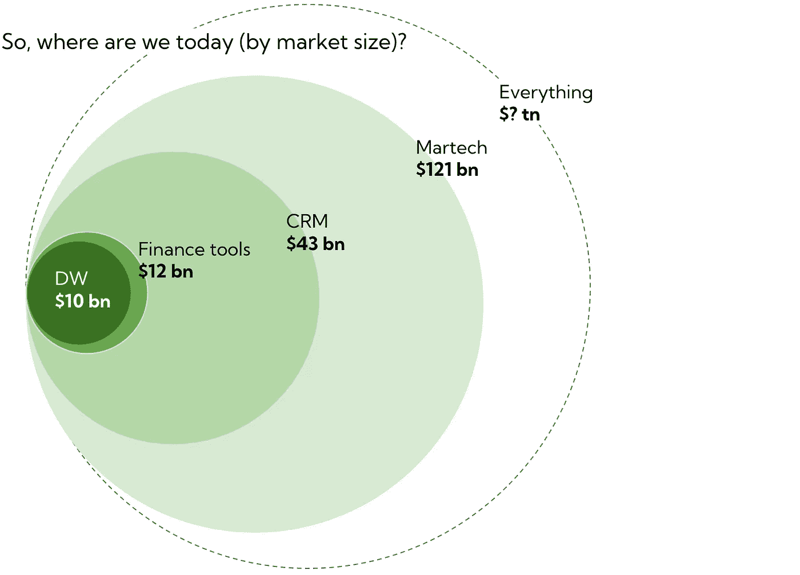
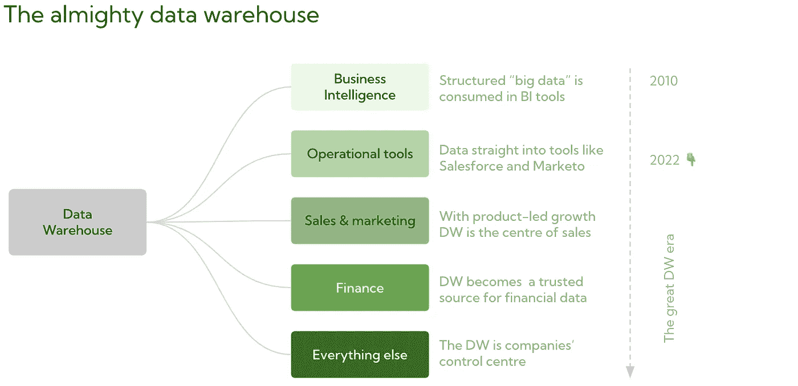
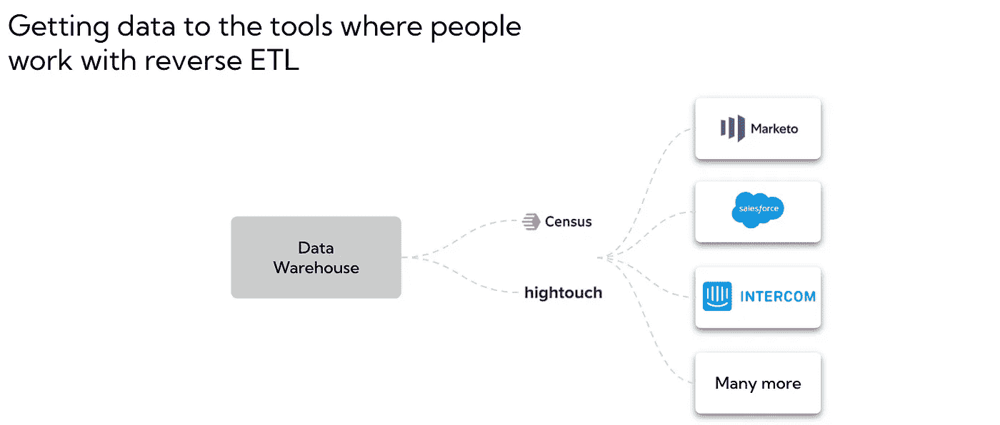
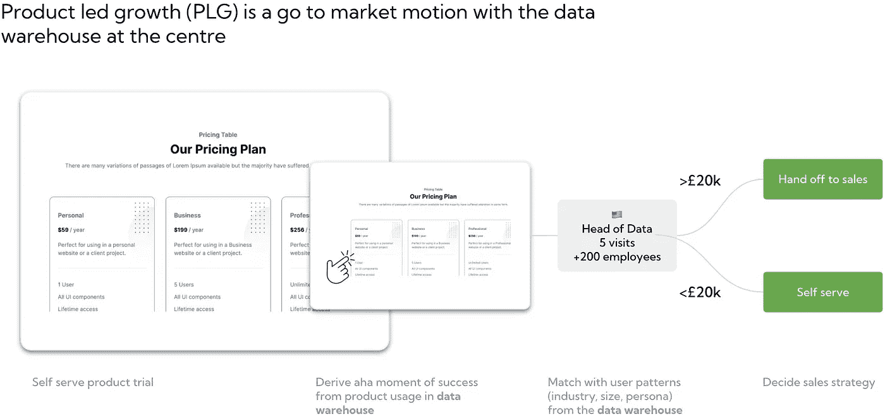
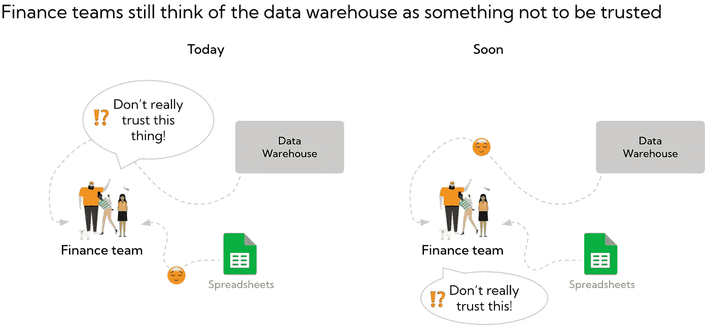
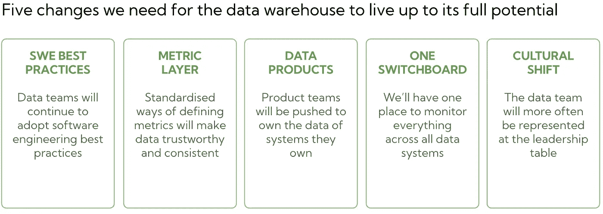

# 我们仅仅触及了数据仓库全部潜力的表面

> 原文：<https://towardsdatascience.com/weve-only-scratched-the-surface-of-the-full-potential-for-the-data-warehouse-a53d18aae170>

可能感觉我们正处于数据仓库的顶峰。数据团队[接近工程团队规模的 50%](https://mikkeldengsoe.substack.com/p/data-to-engineers)在一些公司，雪花收入去年增长超过 100%,现代数据堆栈现在是一个常用术语。

我认为我们只是触及了表面。

作者图片

当然，市场研究人员预计数据仓库市场将每年增长 34%，直到 2026 年达到 390 亿美元，但我认为长期潜力要大得多。

**数据仓库将是未来公司的控制中心。它将从分析扩展到销售、运营、财务等更多领域的核心。**

作者图片

数据仓库将从被认为是商业智能的工具转变为公司所做的一切的核心。以下是我认为它将如何发挥出来(事实上，它已经开始发生)

1.  **商业智能:**数据仓库是用来帮助公司有一个地方来分析他们的数据。
2.  **运营工具:**数据将被发送到所有运营工具，新的内部工具将直接构建在数据仓库之上。
3.  **销售&营销:**随着产品导向型增长的兴起，数据仓库将成为走向市场团队的核心。
4.  **财务:**数据仓库将能够真正为 100%准确的数据工作，财务和会计团队将成为数据仓库的一些最活跃的用户。
5.  **一切:**当所有这些部分汇集在一起时，数据仓库将成为任何现代公司的核心部分。

让我们看看这将如何发生。

# 数据仓库的五个阶段

## 1.商业智能—数据仓库主要用于公司仪表板和分析

这是我们仍然主要生活的时代。大多数公司都相信数据的价值(这就是为什么你经常被要求做“快速数据拉动”)。

这恰好也是今天大公司对其数据仓库产品进行品牌宣传的方式

> 借助快速、简单、安全的大规模云数据仓库，加快洞察速度 *— AWS 红移*
> 
> 借助灵活的多云分析解决方案从跨云数据中做出业务决策 *— Google BigQuery*

这是一个重要的目的，我们仍然有许多未解决的问题。然而，大块的拼图正一点一点地开始就位。没有人比 Benn Stancil 在他的文章[现代数据体验](https://benn.substack.com/p/the-modern-data-experience)中更好地描述了这些问题

> *“…*它试图在明天的董事会前找出增长放缓的原因；当不同的工具和仪表板显示不同的东西时，它让每个人都同意季度收入数字；这是与客户分享产品使用数据，他们告诉你他们的活跃用户列表中不知何故包括了六个月前离开公司的人；这是一封来自首席执行官的愤怒的懈怠邮件，称他们的每日进度报告又被破坏了。

## *2.运营工具—数据仓库使其融入公司的每一个部分*

*在 Census (2018 年)和 Hightouch (2018 年)的引领下，这个时代已经开始，让人们可以轻松地将数据从数据仓库直接输入到人们日常工作的工具中，如 Salesforce、Marketo 和 Hubspot。*

**

*作者图片*

*这是一个好的开始。如果您从事销售工作，当您与客户通电话时，如果洞察直接出现在 Salesforce 中，您更有可能根据洞察采取行动。*

*但这仅仅是开始。*

*我接触过的公司已经在数据仓库的基础上构建了完整的产品。无论是运行一项服务来决定在什么时间检查哪些汽车，还是为客户调查引擎提供动力，这都正在开始发生。*

## *3.销售和营销—数据仓库将成为走向市场团队的无形之手*

*产品导向型增长(PLG)是一种走向市场的战略，其中销售线索生成和销售的主要驱动力是自助式产品。PLG 的核心组件是数据仓库，它将产品使用数据与了解客户如何使用产品并从中获取价值联系起来。*

**

*作者图片*

*Slack、Atlassian、Dropbox 和许多其他公司已经被收购。他们的销售团队获得了更多合格的销售线索，因此他们可以销售更大的合同，扩大收入，关注正确的销售线索，并为客户提供更多价值。*

*我们仍处于 PLG 的早期，这只是数据仓库如何成为走向市场团队的核心部分的一个例子。*

## *4.财务—数据仓库将成为财务团队的首选工具*

*我谈过的大多数公司都有一些数据，只有*有*才是准确的。这可能是关于如何向客户收费的数据、使用模式或发送给监管机构的数据。如今，对于需要 100%准确的数据，数据仓库很少被信任。*

**

*作者图片*

*看到公司为这种类型的数据构建单独的生产系统花费大量开发人员时间并犯同样的常见错误并不罕见。*

*这将会改变。*

*总有一天，数据仓库会有正确的特性来帮助确保数据的可靠性和一致性，就像在任何其他生产级系统中一样。数据团队将能够封装数据仓库的各个部分，这些部分应该有更严格的规则来改变度量和维度。*

*财务和会计团队将成为数据仓库最频繁的用户。因此，他们的角色将发生巨大变化，他们将能够更加关注洞察力，而不是数据输入和准确性。*

## *5.一切——数据仓库将成为现代公司的核心*

*数据仓库已经从所有来源收集了数据。它将很快能够将这些数据发送到您想要的任何工具，运营和销售&营销团队将使用这些数据作为他们工作方式的核心决策引擎。财务团队将能够信任数据，并开始推动从电子表格转移到使用数据仓库。这个世界会发生什么？*

*不投资数据和他们的数据仓库的公司会无法竞争吗？*

*90%的会计工作会像今天看起来的那样自动化，而不需要会计师的人工输入吗？*

*SAP 会不会只是成为一个接口？*

*我认为我们正走在这条路上。*

# *我们如何到达那里？*

*在数据仓库发挥其全部潜力之前，仍然有一些构建模块需要就位。*

**

*作者图片*

***数据团队需要采用软件工程的最佳实践** 最优秀的数据团队已经开始使用测试、代码变更的版本控制，以及在数据目录和 dbt 中记录数据。他们也开始在文化上采纳工程工作方式的理念；数据人员通常被安插在产品团队中，公司正在招聘数据产品经理，而数据不太被视为一种服务功能。更多的公司需要走这条路。*

***指标需要成为一等公民** 我们已经看到了一些公司在指标商店领域的崛起，但是随着 [dbt 于 12 月](https://coalesce.getdbt.com/talks/keynote-metric-system/)在 Coelesce 上宣布指标，指标正在成为主流。这是非常必要的，并且解决了一些重要的问题。度量将受到版本控制，并且将围绕如何进行更改进行清晰的治理。它们将被快照，因此如果您想要复制两年前创建的指标，您可以复制到最后一位小数。将有一个明确的地方来定义指标，并且它们将不再以不一致的方式在整个数据堆栈中定义。数据团队将能够通过简单一致的 API 向所有其他工具公开指标。*

***产品团队将需要拥有来自他们所拥有的系统的数据** [数据网](https://martinfowler.com/articles/data-mesh-principles.html)文章提出了一些围绕数据所有权的非常现实的挑战。大多数产品团队在分散的小团队中工作，让产品团队拥有他们生产的数据的努力需要继续。工程师将提高数据方面的技能，将有关于数据质量的关键指标和更简单的方法来了解产品团队所拥有的数据资产的健康状况。*

***数据团队需要全面了解数据如何在所有系统中流动** 随着数据仓库的范围、方向和对所有团队的扩展，需要更简单、更可靠的方法来掌控一切。一个切换面板，提供来自数据堆栈中每个工具的适当级别的信息。*

***领导层中分析领导者的角色将会改变**
一旦数据仓库成为公司的核心，分析领导者的角色将会改变。这不仅仅是高层人员的问题，也是数据团队的结构问题。*

> *“大多数数据团队并不是为了成功而成立的。多年来，数据团队一直被埋没在 IT 职能中。像 IT 部门一样，这些数据团队处理从他们的系统中获取数据，并以 CSV 的形式呈现给利益相关者，利益相关者可以从中施展魔法并得出结论。”— [布莱恩·奥富特](https://locallyoptimistic.com/post/the-next-big-challenge-for-data-is-organizational/)*

*所有需要发生的事情让我兴奋的是，它们中的许多已经在发生了；最好的公司正在发明他们自己的工具，[对他们的数据团队](https://mikkeldengsoe.substack.com/p/data-to-engineers)进行大量投资，而[数据社区](https://www.getdbt.com/community/)非常优秀，充满了友好的人们，使得这一切成为可能。*

*如果你有什么想法，[告诉我](https://www.linkedin.com/in/mikkeldengsoe)！*