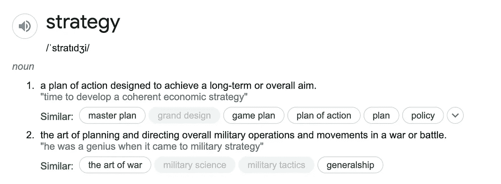
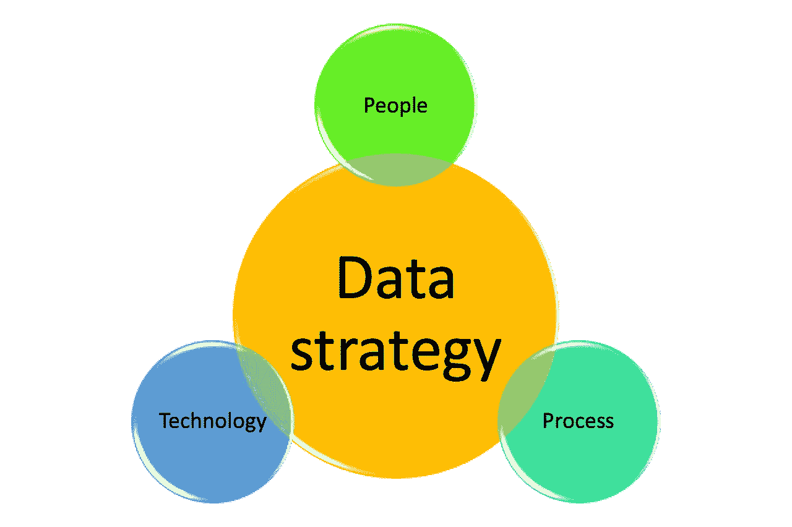

# 数据战略的内容、原因、方式、人员和时间

> 原文：<https://towardsdatascience.com/wh-questions-of-data-strategy-1e6b0d19cb30>

## 什么是数据策略？为什么重要？谁对此负责？您应该何时开始开发，以及如何开发？

[https://unsplash.com/photos/N4gn-eLEIwI](https://unsplash.com/photos/N4gn-eLEIwI)

# 什么是数据策略？

战略是指为实现一个长期目标而进行的规划！从历史上看，战略是为赢得军事行动而计划的艺术。然而，在我们的现代生活中，战略更多地用于商业战略和策划艺术的背景下，以赢得你的商战！

Google.com 战略定义快照

数据策略也不例外。它指的是通过高效和有效地使用数据来计划实现您的**业务的**长期目标！换句话说，数据战略没有意义，除非它与商业战略相联系。

# 为什么数据策略很重要？

大多数公司认为数据是一种战略资产。然而，原始数据本身并不能带来价值，也不能增强商业战略。

在以下情况下，数据将成为重要资产:

1.  它帮助个人，尤其是非技术员工，变得更有生产力，做出基于数据的决策，而不是相信他们的直觉！
2.  它有助于企业创收或降低成本，例如，通过更好地了解 b2c 企业中客户的需求，带来更好的客户体验。
3.  它鼓励在人工智能和机器学习的帮助下进行创新，这反过来有助于业务增长和市场竞争力。

话虽如此，将数据带入企业的核心和文化并不容易。您可能遇到过一些甚至所有这些情况:

*   **数据孤岛:**业务中的不同职能部门收集或依赖自己的数据，并且不信任他人。
*   **BAU vs 数据:**离开 BAU 的任务和花费时间来帮助数据质量和过程(包括创建、维护和分析)是有阻力的
*   **缺乏适当的规划:**规划和决策不是数据驱动的，而是基于最响亮的声音，因为没有使用数据快速交付价值的适当流程。
*   **数据(il)素养:**无论是技术职能还是非技术职能，都存在大量技能缺口，无法高效、有效地使用数据。
*   **数据不符合目的:**创造新价值，尤其是为传统的老企业创造新价值很难，因为所有容易的问题都解决了，需要新的数据代理。
*   **数据法规**:数据安全、隐私和其他数据法规在业务中存在问题。
*   **基础设施:**数据基础设施没有响应技术人员(更重要的是非技术人员)的需求，带来了糟糕的用户体验，也没有为创新提供合适的环境。
*   **最后但同样重要的是，数据没有产生价值！**

> 所有上述挑战表明，需要一个指导性计划来定义技术、流程和人员，以帮助企业使用数据实现其目标。这个指导性计划叫做数据策略。

按作者

# 如何制定数据策略

数据战略的主要目的是让企业通过从数据中提取价值来实现目标。虽然没有关于如何制定数据策略的唯一准则，但在制定数据策略时需要考虑几个主题:

1.  数据战略**应与业务战略**保持一致，否则，组织将看不到数据投资的切实 ROI。
2.  在了解业务战略以及 it 面临的机遇和挑战后，将确定数据和分析用例。
3.  确定团队和基础设施能力和技能差距。
4.  发现轻松取胜和战略举措。
5.  路线图已创建。

我发现[这篇文章](https://medium.com/dataroots/how-to-develop-a-business-driven-data-strategy-by-ben-mellaerts-8ee6241b9228)对如何开发数据策略很有用，它包含了以上 5 个重要步骤的更多细节。

> 请注意，对于如何开发数据策略，并没有明确的规定。简而言之，它应该基于业务战略来开发，以从数据中提取价值，并且它涉及在组织内就**技术、流程和人员**做出决策。还需要注意的是，战略计划不同于运营计划，前者更侧重于长期使命和目标，而不是近期计划。

# 谁负责数据策略？

[https://unsplash.com/photos/Zyx1bK9mqmA](https://unsplash.com/photos/Zyx1bK9mqmA)

传统上，业务数据是在 IT 团队内部处理的。他们将是看门人，对数据架构、数据管理、基础设施以及谁有权访问什么做出决策。这违背了数据和分析的民主化。非技术员工必须向数据分析师或类似人员询问他们的每个问题，这使得流程太长。这一切都意味着分析是静态的，并且*无法在企业内*扩展。数据和分析职能现在已经从传统的支持职能转变为通过数据和分析民主化，或者通过人工智能和机器学习实现某种程度的决策自动化，在整个组织内实现和加速数据驱动的决策。

> 数据是公司的资产，因此不是某个特定团队可以声称对其拥有完全控制权的东西。与业务预算类似，每个职能部门都应该对他们提出、维护或开发的数据资产负责。

然而，我们上面提到的变革需要企业内部进行大量变革，没有管理层的支持是无法实现的。它需要自上而下的规划，包括对整个公司的技术、数据资产和业务流程做出决策，并确定业务中的技能差距，以将数据素养和数据民主化引入业务。这一切都意味着决策将会也应该会影响整个商业文化。不足为奇的是，会有阻力，需要变革管理。

最近，许多公司开始引入新的高级管理职位，如首席数据官(CDO)，负责为整个组织的数据使用和治理铺平道路的战略决策。

# 何时制定数据策略

如果您不能证明您的数据战略如何与业务战略保持一致并有助于实现业务目标，您就不会总是选择最先进的基础架构、雇用世界上最有才华的人，并通过改变业务中的所有流程来制造摩擦。

企业通常在处于扩展阶段时就开始考虑数据策略(我之前写了一篇文章详细介绍了企业何时应该开始投资数据)，原因很简单，因为数据和分析可以通过适当的数据策略增强企业的扩展能力。