# 什么才是好的类别？

> 原文：<https://towardsdatascience.com/what-actually-makes-a-good-category-b30069305633>

# 什么才是好的类别？

## ***做出有意义类别的 5 个初始步骤***

简单的事情看起来很容易。不是吗？以条形图为例，它包含引人入胜的类别和引人注目的数字。一个好的图表可以在 7 秒钟内讲述一个故事，使企业领导人能够自信地领导。但是在这个过程中，很多事情都是理所当然的。

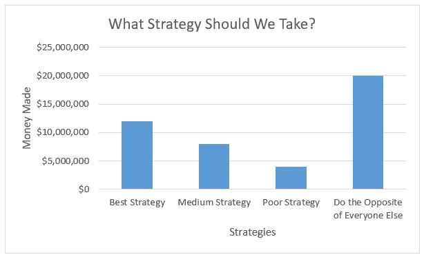

随机公司战略(图片由作者提供)

对于数据科学家来说，在这个敏感的地方获取分类数据并不容易。类别可能跨越不切实际的类别数量，范围不相等，或者严重不平衡。这些数据可能根本就不是类别！为了有意义，类别必须经历大量的解释、争论、重要性测试和最终分组(或重组)。

下面我将描述以下 **5 个步骤来选择好的分类变量**，最终用于二元分类模型(预测医院索赔是否会被拒绝):

1.  频率和目视检查(以特征工程为例)
2.  独立性测试(卡方检验)
3.  相关强度(克莱姆氏 V)
4.  功能选择(选择最佳)
5.  特征重要性(使用随机森林分类器)

我们还将触及分类数据的一些常见困境:

1.  高基数
2.  阶级不平衡
3.  联想 vs 实力
4.  真正的相关性

*注意:以下所有数据都是出于 HIPAA 目的由随机生成器生成的。*

## 1.频率和目视检查

理解类别的第一步是看它们的频率。我们将使用分类 CPT 代码作为例子。CPT 是 5 位数的字母数字代码，代表临床诊疗过程中执行的任何程序。大多数就诊有 1-2 个 CPT 代码，有些没有，有些很多。

以下是 7 次虚构患者就诊的 CPT 代码。

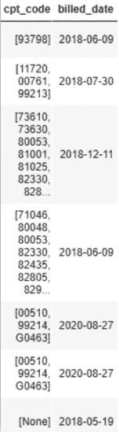

在一个非常大的数据集中，CPT 代码的变化太多，无法以有意义的方式显示(这里实际上有 137，376 个**唯一的** **类别**)。

让我们看看它们的频率。以下是十大最常见的 CPT 组合。

```
dataset.cpt_code.value_counts().head(10)/dataset.account.count()
```

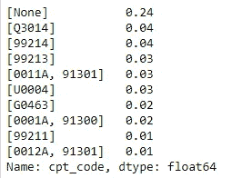

猜猜 Q3014 对应什么？远程保健。最近很常见。最常见的服务类型是[无]——没有服务(24%)。那很有趣。其余 CPT 组合出现的频率为 4%或更低。这揭示了医学的一些特殊之处:**患者就诊非常独特。**

在数据方面，这些 CPT 组合具有**高基数**，这将使预测建模具有挑战性。太多的类别会使可视化变得混乱，阻碍训练速度，并且会使数据溢出。**像 CPT 代码这样的类别的维数减少**是一项广泛但有价值的工作。

为类别提供更广泛、更有意义的标签不仅支持降维，还能突出关键特征。我们可以将许多 CPT 代码归为一类“临床经验”例如，代码 Q3014、99441、99442、99443 都与远程医疗访问有关(将其标记为“远程医疗”)。CPT 代码 80053、85025、86359、86360 都对应于实验室测试(标记为“其他实验室”)。

这样做，我们有效地将近 138，000 个类别缩减为大约 30 个“临床体验”这首先是商业意义，其次是数据科学意义。我们现在可以看到哪些 CPT 类别正在影响拒绝(我们的结果变量)以及影响的程度。

```
pd.DataFrame({‘count’:dataset.cpt_min_categories.value_counts(),‘denied’:dataset.cpt_min_categories[dataset.claim==1].value_counts(),\
 ‘frequency’:(dataset.cpt_min_categories[dataset.claim==1].value_counts()/dataset.cpt_min_categories.value_counts())*100}).sort_values(by=’frequency’,ascending=False)
```

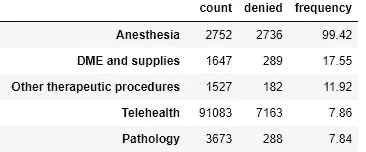

五大 CPT 类别

在这个虚构的数据集中，麻醉声称创造了最多的否认。为什么会这样？这些案件更复杂吗？这些程序的编码规则最近有变化吗？我们必须进一步探索。

## 保持简单:数数就好

或者，我们可以对 CPT 代码进行计数，而不是对它们进行分组。例如，有多少次访问生成了 1 个 CPT 代码、2 个 CPT 代码等。？这很简单，但它有助于深入了解每个患者体验的相对强度，也潜在地了解其临床复杂性。

我们可以创建两个新的类别: **cpt_count** 用于每次患者就诊的 cpt 代码计数，和 **cpt_count_10** 相同，但是将超过 10 个 CPT 代码的就诊分组在最后的第 10 个类别中。我这样分组是因为 **cpt_count** 一直延伸到 91 次(即一名患者在一次就诊中进行了 91 次手术)。将他纳入最多只有 10 个 CPT 代码的患者中会有错吗？让我们检查分布。

为了创建上面的两列，我们可以实现以下代码:

```
def cpt_count(x):
    """Creates the cpt_count and cpt_count_10 variables
    Input: Entire dataframe (dataset)
    Output (integers): 
    1\. cpt_count: counts of all CPT codes
    2\. cpt_count_10: counts of all CPT codes where >9 codes is bucketed as 10 
    """
    x['cpt_count'] = x['cpt_code'].where(x['cpt_code'].astype(str)!="['None']",'0')
    x['cpt_count'] = x['cpt_count'].where(x['cpt_count']=='0',[len(i) for i in x['cpt_count']])
    x['cpt_count'] = x['cpt_count'].astype(int)
    x['cpt_count_10'] = [10 if i>9 else i for i in x['cpt_count']]
    x['cpt_count_10'] = x['cpt_count_10'].astype(int)
    return xdataset = cpt_count(dataset)
dataset[['cpt_code','cpt_count','cpt_count_10']].head(10)
```

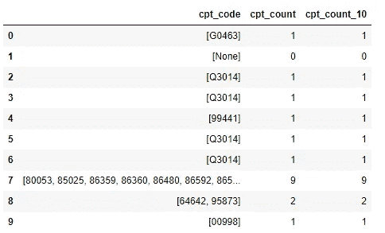

CPT 代码计数，以及最大计数为 10 的 CPT 代码计数

现在让我们用下面的代码将 **cpt_code_10** 和我们的拒绝结果变量可视化在一个条形图中:

```
table = pd.pivot_table(dataset[['cpt_count_10','claim']].groupby(['cpt_count_10','claim'])['claim'].count().reset_index(name='count'),index=['cpt_count_10'],columns='claim')
ax = table.plot(kind='bar', figsize=(10,6),fontsize=15)ax.set_title('Number of Claims by CPT Buckets',fontsize= 20) # title of plot
ax.set_ylabel('Number of Claims', fontsize=16)
ax.set_xlabel('CPT Buckets (0 - 10+ codes)',fontsize=16)L=ax.legend(fontsize=12)
L.set_title('Type of Claim',prop={'size':12})
L.get_texts()[0].set_text('Clean Claim')
L.get_texts()[1].set_text('Denied Claim')
```

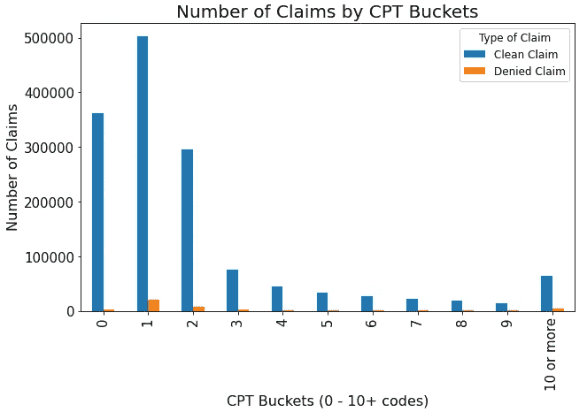

干净/被拒绝索赔的 CPT 类别分布

我们可以看到大多数访问只生成 0-2 个 CPT 代码。这远远超过了扩展到 91 个 CPT 码的“10 个或更多”桶。两个索赔结果显示大致相同的分布。但也许最有趣的是，这张图表揭示了索赔之间的阶级不平衡。下面我们将评估这种常见分布背景下的分类相关性。

## 2.卡方检验

卡方检验评估两个标称变量之间的独立性，每个变量都有两个或更多可能的值。对于分类变量来说，这是一个很好的初始测试，因为它测试了一个变量中的比例是否不同于另一个变量(结果变量)。

比如评价是否喜欢披萨(是/否)取决于是不是某个性别(男/女)。这个测试不能告诉你男性比女性更喜欢比萨饼的程度(影响大小)，只能告诉你男性和女性喜欢比萨饼的程度不同。

卡方的一个很好的特点是类别不平衡不会影响结果。在轻微不平衡(1:2)或甚至严重类别不平衡(1:1000)的情况下，两个结果都可能使卡方统计接近于零(无关联)。然而，影响卡方结果的是样本大小。在大样本中，即使组间最小的差异也会产生显著的卡方结果，p 值远低于 0.001。这是 p 值的一个固有特征，因为它表明*您偶然获得卡方统计的可能性有多大。*

例如，让我们首先创建一个列联表来执行卡方检验，以比较入院类型(急诊、住院、门诊)的数量与我们的二元拒绝状态结果(0 =索赔未被拒绝，1 =索赔被拒绝)。

```
patient_type = pd.crosstab(dataset[‘patient_type’], dataset[‘claim’])/100
patient_type
```

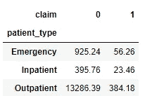

再一次，我们看到主张(拒绝结果)是不平衡的，但是没关系。让我们通过评估检验统计量和 p 值来评估这些组之间的独立性。

```
stat, p, dof, expected = chi2_contingency(patient_type)

# interpret p-value
alpha = 0.05
print("The p-value is: " + str(p))
print('The test statistic is: '+ str(stat))
print('The degrees of freedom are: '+str(dof))
print(' ')
if p <= alpha:
    print('Samples are dependent (reject H0); proportions of patient types are different between clean and denied claims')
else:
    print('Samples are independent (H0 holds true); proportions of patient types are the same between clean and denied claims')
```


结果表明，患者类型和我们的拒绝结果之间存在一定的相关性。仅从列联表中，我们可以看到住院病人和急诊病人的频率相似，但门诊病人的频率不同。当值的总数超过 1000，样本是独立的，并且交叉表中没有单元格少于 5 个时，适合使用卡方检验(改为应用 Fisher 精确检验)。

## 3.克莱姆氏 V

群体之间的独立性可能会告诉我们什么是有意义的不同，但如果你真的在追求差异的*强度*呢？对于分类变量和结果，我们可以求助于克莱姆 V 或比值比(or)。

OR 通常用于 2x2 表，而 Cramer 的 V 可以评估跨多个级别的类别，因此可以评估更大的表。

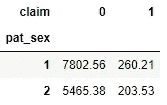

优势比的好表格

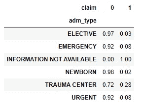

克莱姆的 V 的一个好表

OR 不是“赔率”的度量，而是 2 赔率的比值；例如，暴露组与非暴露组发生事件的几率。但是 OR 和 Cramer 的 V 都用来报告暴露和事件之间的关联强度。两者都报告为大于 1 的值，值越高，关联越大。

Cramer 的 V 还结合了卡方统计，因此这是一个很好的后续测试。它采用公式:


克莱姆氏 V

其中 *k* 代表行数或列数(取最大值)， *N* 是整个样本大小， *X* 是卡方统计量。

我们可以用 python 实现 Cramer 的 V 函数:

```
def cramers(x, y):
    """This is the Cramer's V statistic
        Input: X feature variable, y target variable
        Output: Provides association strength from the chi-square statistic
        """
    x_length = len(x.value_counts().index)
    y_length = len(y.value_counts().index)

    # getting highest row/column total - 1
    if x_length < y_length:
        rc = x_length - 1
    else: rc = y_length - 1

    chi_data = pd.crosstab(x, y)
    stat, p, dof, expected = chi2_contingency(chi_data)

    # total sample size
    n = chi_data.sum().sum()

    cramers =  np.sqrt((stat)/(n * rc))
    return print("The Cramer's V correlation strength is:", round(cramers, 4))
```

对于我们之前的患者类型变量，我们可以看到:

```
cramers(dataset['patient_type'], dataset['claim'])
```

退货:

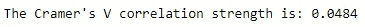

这表明，尽管患者类型与我们的结果变量之间存在有意义的差异(如卡方检验所示)，但没有很强的相关性。

对于克莱姆的 V:

*   > . 1 表示小的影响
*   > . 3 代表中等效果
*   > . 5 代表大效果

有兴趣查看所有变量的克莱姆 V 结果吗？创建一个循环，评估所有 Cramer 的 V 分数，并将它们(及其变量名)分配到一个列表中作为一个图。

```
column_list = ['pat_sex', 'patient_type',
       'department_name', 'adm_type', 'specialty', 'attending_prov',
       'financial_class_name', 'primary_payor', 'current_financial_class',
       'current_payor', 'collection_agency','cpt_count_10', 'cpt_categories', 'cpt_min_categories',
       'rev_categories', 'rev_min_categories', 'rev_count_10',
       'icd_10_min_categories', 'icd_10_count', 'icd_10_count_10',
       'pharm_categories', 'pharm_count', 'pharm_count_10',  'los_cat',

               'pat_dob_decade']cramer_list = []
for i in column_list:
    result = cramers(dataset[i], dataset['claim'])
    cramer_list.append(result)cramers_list = pd.DataFrame({'column': column_list, 'cramer_value':cramer_list})cramers_list.sort_values(by='cramer_value',ascending=True).plot(y='cramer_value',x='column',kind='barh', \
                                                                title='Strongest Correlation with Denial Rate')
```

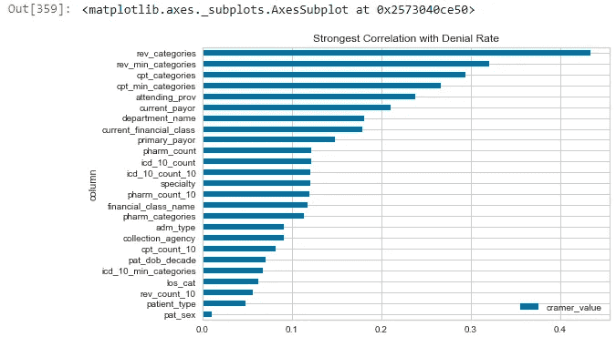

所有分类特征的 Cramer V 评分汇总

在这里，变量 **rev_categories** (收入代码) **cpt_categories** (cpt 代码)和**attenting _ prov**(护理提供者)在确定索赔是否会被拒绝方面最有希望。从商业角度来看，这也是有意义的；收入代码告诉付款人提供了什么服务以及多少钱，CPT 代码告诉提供了什么服务，并且主治医生经常在所有患者就诊时签字。

## 4.功能选择(选择最佳)

如果您的数据集包含许多分类变量，您可能会好奇哪一个对您的结果变量影响最大。这种特征选择剔除了非解释性变量，以提高模型性能。其次，它还提供了对功能工程工作可能提供高 ROI 的洞察。正如我们将会看到的，在精选测试中排名靠前的分类表现者可以被拆开、重新分类或重新加权，以进一步增强他们的影响力。

SelectKBest 函数可以接受卡方作为评分函数。它计算 *X* 和 *y* 的每个特征之间的 *X* 统计量(您的类标签)。大值意味着该特征与 *y* 非随机相关，因此可能提供重要信息。您可以强制模型只选择 *k* 个最相关的特征来保留。

实际上，您需要为分类变量中的所有类别获取单独的特征名称。在这里，我创建了一个 ColumnTransformer，它将 OneHotEncoder 应用于我的所有分类变量。

```
col_transformer = ColumnTransformer(transformers=[('ohe', OneHotEncoder(handle_unknown='ignore'), 
                  ['pat_sex','patient_type','department_name','adm_type','financial_class_name','primary_payor',
                       'collection_agency','cpt_count_10','cpt_min_categories','rev_count_10','rev_min_categories',
                       'icd_10_count_10','icd_10_min_categories','pharm_categories','pharm_count_10','los_cat'])],
                                   remainder='passthrough')
```

然后，我可以通过将我的变量转换成一个数组，然后调用 get_feature_names()来创建这些特性名

```
test = dataset[['pat_sex','patient_type','department_name','adm_type','financial_class_name','primary_payor',
                       'collection_agency','cpt_count_10','cpt_min_categories','rev_count_10','rev_min_categories',
                       'icd_10_count_10','icd_10_min_categories','pharm_categories','pharm_count_10','los_cat']].astype(str)codes = col_transformer.transform(test).toarray()
feature_names = col_transformer.get_feature_names()feature_names
```

这里有许多单独的特性名称:16 个变量乘以它们包含的类别数=特性名称的数量。很多。

现在我们实现 SelectKBest 函数。我们将下载这些包，将卡方作为我们的评分函数，并查看所有变量的排名分数(您可以让 k=5 只查看前 5 个变量)。

```
from sklearn.feature_selection import SelectKBest, chi2, mutual_info_classifselect = SelectKBest(score_func=chi2, k='all')
z = select.fit_transform(X_transformed, test_y)
```

现在，模型已经拟合好了，让我们找出所有特性名称的范围以及每个特性的得分。我们可以通过把它们组合成熊猫的数据框架来更好地形象化它们。

```
feature_num = []
feature_name = []
feature_score = []
for i in range(len(select.scores_)) and range(len(feature_names)):
    feature_num.append(i)
    feature_name.append(feature_names[i])
    feature_score.append(select.scores_[i])kbest = pd.DataFrame({'num':feature_num, 'name': feature_name, 'score':feature_score})kbest.sort_values(by='score', ascending=False)
```

最后，我们可以利用 [re 包](https://docs.python.org/3/library/re.html)来更新字符和字符串。

```
import re
import matplotlib.pyplot as plttypes = []
for i in kbest.name:
    result = re.search('__x(.*)_', i)
    types.append(result.group(1))kbest = pd.concat([kbest,pd.DataFrame({'types':types})], axis=1)counts = []
desc = []
for count, i in enumerate(test.columns):
    counts.append(count)
    desc.append(i)
lookups = pd.DataFrame({'types':counts, 'variable':desc})
lookups['types'] = lookups['types'].astype(str)kbest = kbest.merge(lookups, on='types')kbest.groupby('variable').score.sum().sort_values(ascending=True).plot(kind='barh',  title='Chi-Square statistic: Higher means related to denial rate')
```

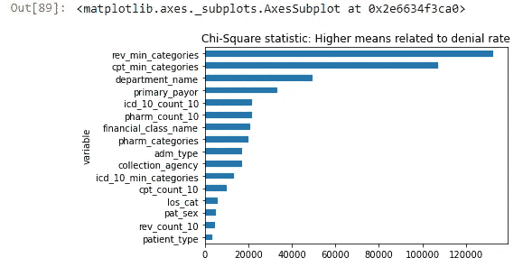

所有变量的卡方统计

这些卡方统计值相当高，会影响我们的结果变量。这也被我们的 Cramer 的 V 结果和我们早期的可视化所证实。画面在这里变得更加清晰:准确的税收代码和 CPT 代码是预测被拒绝索赔的核心。

## 5.特征重要性(使用随机森林分类器)

在像随机森林这样的基于树的模型中，决策分割是从每个特征(在其他特征的随机子集之间)中做出的，这最大程度地减少了杂质(基本上是不确定性)。所有预测的树集合在一起形成随机森林。尽管有些树是不相关的，但它们一起保护彼此免受个别错误的影响，并优于它们各自的组成树。

特征重要性将最能减少杂质的特征排列为最高。尽管有用且实现简单，但对于基数高的变量，重要性往往会增加。如果您的变量具有高基数，那么可以利用[排列重要性](https://explained.ai/rf-importance/)。

为了评估特征的重要性，我们简单地从随机森林分类器模型中调用 feature_importances_ right。

```
# instantiate RFC, assign coefficients to coefs, and zip together with column names
rfc = RandomForestClassifier(random_state=0)
coefs = rfc.feature_importances_
zipped = zip(clean_columns.iloc[:,0], coefs)# create a dataframe of just the top 20 most important features
feature_imp = pd.DataFrame(zipped, columns=['feature','importance']).sort_values(by='importance',ascending=False).head(20)
```

然后我们可以想象这些结果

```
fig, ax = plt.subplots(figsize=(10,4))
ind = range(0,10)
ax.barh(ind, feature_imp['importance'].values[0:10],
       align='center',alpha=0.8)
ax.set_yticks(ind)
ax.set_yticklabels(feature_imp.iloc[0:10,0].tolist())
ax.tick_params(left=False, top=False, right=False)
ax.set_title("10 Most Important Features in Denials Prediction Model")
ax.set_xlabel('Feature Importance Coefficient \n(RandomForestClassifier)')
plt.gca().invert_yaxis()
```

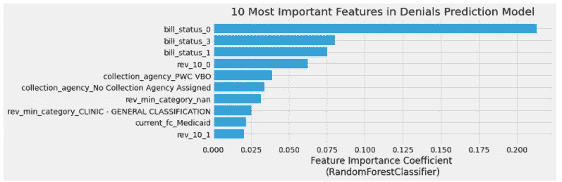

随机森林分类器中最重要的 10 个特征

上面的结果来自其他虚构的数据，包括 **bill_status** (发送给保险公司的账单类型)，但是同样，您可以看到收入代码占据了特性重要性的首位。

## 结论

这些只是评估分类变量的相关性和重要性的 5 种初始方法。像数据科学中的所有事情一样，我们一直处于证据收集模式，让统计数据和可视化告诉我们真实的故事。

感谢您的阅读，请随时通过 [LinkedIn](https://www.linkedin.com/in/gabe-verzino-71401137/) 或电子邮件与我联系！