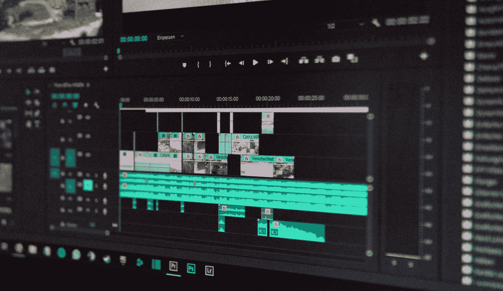

# 什么是深度赝品？

> 原文：<https://towardsdatascience.com/what-are-deepfakes-and-how-do-you-recognize-them-f9ab1a143456>

# 什么是深度赝品？

## 如何处理人工智能带来的错误信息

在 [Unsplash](https://unsplash.com/s/photos/video?utm_source=unsplash&utm_medium=referral&utm_content=creditCopyText) 上由 [Wahid Khene](https://unsplash.com/@wahidkhene?utm_source=unsplash&utm_medium=referral&utm_content=creditCopyText) 拍摄的照片

深度赝品是使用[深度学习](https://databasecamp.de/en/ml/deep-learning-en)模型人工创建的视频、图像或音频文件。例如，现有的视频序列通过替换人脸来使用和伪造。它们旨在尽可能表现得逼真，即使它们是由 [ML](https://databasecamp.de/en/machine-learning) 模型生成的。除了将 deep 赝品用于私人视频之外，它们还可以用于传播有针对性的错误信息。

# 深度赝品是如何制造的？

目前，有两种主要的技术模型被用来制作深度假视频。

**自动编码器**是由编码器部分和解码器部分组成的[机器学习](https://databasecamp.de/en/machine-learning)模型。他们实际上是用来学习非结构化数据的压缩但信息丰富的表示形式。例如，我们可以使用相同的图像作为输入和输出。这将允许自动编码器学习尽可能压缩的图像矢量表示，并存储所有重要特征。然后，解码器又使用该向量再次从其生成原始图像。自动编码器的学习矢量表示越好，生成的图像越逼真。

总共有两个自动编码器接受深度伪影训练。第一个模型是由最终产品中将要出现的人的图像或视频组成的。在大多数情况下，这些人是名人、政治家或运动员，在我们的例子中是人 a。第二个模型是根据另一个人(人 B)的图像训练的，这个人提供了要模仿的面部表情或手势。

当这两个模型被训练时，一个使用人 B 的图像，并用第二个模型的编码器对其编码。然后，将得到的向量从第一个模型馈送到解码器中，这创建了一个看起来像人 A 的图像，但是已经接管了人 b 的动作和面部表情。

所谓的 [**一般对抗网络**](https://databasecamp.de/en/ml/generative-adversarial-networks) 是训练一个 [ML](https://databasecamp.de/en/machine-learning) 模型来制造 deepfakes 的第二种方式。简而言之，我们一起训练两个[神经网络](https://databasecamp.de/en/ml/artificial-neural-networks)。第一个被训练以产生与原始训练图像共享尽可能多的特征的人工图像。反过来，第二个网络试图找出人工创建的图像和原始图像之间的差异。所以我们训练两个相互竞争的网络，结果都变得越来越好。

# deepfakes 有哪些类型？

这种模型的训练以及相应的好的 deepfakes 的创建是非常耗时和计算密集型的。由于图形处理单元(GPU)领域的巨大进步，这种技术只对大众开放，因为培训成本因此显著下降。大多数 deepfake 文件属于以下类别之一:

*   **面部交换**:A 人的面部和面部表情应该投射到 B 人的身体上，甚至可以用 A 人的身体替换视频或图像中 B 人的整个身体。
*   **人体木偶**:人 A 的动作、手势或面部表情被记录下来，然后由人 b 人工接管。
*   **声音交换**:自由书写的文本要尽可能真实地用一个人的声音来表演。例如，这种方法也可以与人体木偶结合起来。

# 如何检测 deepfakes？

高质量的 deepfakes，对于肉眼和这一领域的新手来说，最初是很难甚至无法察觉的。一般来说，有两种方法来揭露这种伪造的视频或音频文件。

第一种方法不太关心具体的文件，而更关心环境。以下问题有助于处理 deepfakes:

*   被展示的人真的会做或说类似的事情吗？是否可以预期所展示的是真实发生的？
*   你能找到其他来源吗，比如视频、报纸文章等。，那证实显示的是什么？
*   你能从不同的角度找到同一场景的其他镜头吗？

如果这些问题可以用“是”来回答，那么成为深度欺诈受害者的风险就会大大降低。然而，除此之外，还有更详细的技术问题可以提供关于 deepfake 的信息:

*   是否有典型的深度伪装特征，例如完美对称的脸，弯曲的眼镜，两个不同的耳环，或者类似的？
*   嘴唇的动作看起来像人类吗？它们与口语文本匹配吗？
*   人经常眨眼吗？

出于训练目的，我们在文章末尾链接了一些被证明是 deepfakes 的视频。在那里你可以测试你是否能马上认出他们。

# deepfakes 的危害是什么？

Deepfakes 可以在日常生活的许多领域对我们构成威胁。

比如，有可能这些人为的档案被用于所谓的 **CEO 造假**。在这种情况下，人们会尽可能真实地接到上级甚至管理层的电话，其目的是向欺诈者转移资金。当我们听到同事或上级的真实声音时，我们不太可能像收到带有恶意链接的钓鱼邮件时那样怀疑。

然而，除此之外，还有更严重的危险威胁着高质量 deepfakes 的广泛传播。这些媒体文件可以通过创建和分发攻击性视频或音频文件来传播有针对性的虚假信息。这不仅让个人处于不利地位，在最坏的情况下，甚至会导致社会动荡。

# 这是你应该带走的东西

*   Deepfakes 是人工创建的媒体，如视频、图像或音频文件，这些媒体是使用深度学习方法创建的。
*   他们试图表现不同背景或环境中的人，因为没有原始文件。
*   从技术上讲，这些文件是在所谓的自动编码器或一般敌对网络的帮助下创建的。

*如果你喜欢我的作品，请在这里订阅***或者查看我的网站* [*数据大本营*](http://www.databasecamp.de/en/homepage) *！还有，medium 允许你每月免费阅读* ***3 篇*** *。如果你想让***无限制地访问我的文章和数以千计的精彩文章，请不要犹豫，通过点击我的推荐链接:*[【https://medium.com/@niklas_lang/membership】](https://medium.com/@niklas_lang/membership)每月花$***5****获得会员资格***

** [## 谷歌了解我什么？找出来！

### 在我们之前的一篇文章中，我们谈到了陷入数字过滤泡沫是多么容易，信息…

medium.com](https://medium.com/@niklas_lang/what-does-google-know-about-me-find-it-out-c6115dca17e4)  [## 理解递归神经网络

### 递归神经网络(RNNs)是第三种主要类型的神经网络，前向网络和神经网络

medium.com](https://medium.com/@niklas_lang/what-are-recurrent-neural-networks-5c48f4908e34)  [## kubernetes(k8s)——简单解释！

### Kubernetes 是一个容器编排系统。这意味着应用程序可以在不同的容器之间拆分…

medium.com](https://medium.com/@niklas_lang/kubernetes-k8s-simply-explained-3dc2e1558b7c)**