# 什么是虚拟变量以及如何在回归模型中使用它们

> 原文：<https://towardsdatascience.com/what-are-dummy-variables-and-how-to-use-them-in-a-regression-model-ee43640d573e>


汽车的平均价格是气缸数量的函数。数据来源:[加州大学欧文分校](https://archive.ics.uci.edu/ml/datasets/automobile) ( [用法术语](https://archive.ics.uci.edu/ml/citation_policy.html))(图片由作者提供)

## 以及如何解释虚拟变量的回归系数

虚拟变量是取值为 0 或 1 的二进制变量。人们将这些变量添加到回归模型中，以表示二元性质的因素，即它们要么被观察到，要么没有被观察到。

在这个宽泛的定义中有几个有趣的用例。以下是其中的一些:

1.  **表示是/否性质:**表示数据点是否具有某种性质。例如，虚拟变量可用于指示汽车发动机是“标准”型还是“涡轮”型。或者如果药物试验的参与者属于安慰剂组或治疗组。
2.  **用于表示分类值:**虚拟数据的一个相关用途是表示一个数据点属于一组分类值中的哪一个。例如，车辆的车身样式可以是敞篷车、掀背车、轿跑车、轿车或旅行车。在这种情况下，我们将向数据集添加五个虚拟变量，五种体型各一个，我们将对这五个虚拟元素向量进行“一次热编码”。因此，向量[0，1，0，0，0]将表示数据集中的所有掀背车。
3.  **用于表示有序分类值:**使用虚拟模型来表示分类数据的一个扩展是分类是有序的。假设我们的汽车数据集包含发动机为 2、3、4、5、6、8 或 12 缸的汽车。这里，我们还需要捕获订单中包含的信息。我们将很快看到如何做到这一点。
4.  **用于表示季节周期:**可以添加一个虚拟变量来表示数据中可能包含的多个季节周期中的每一个。例如，交叉路口的交通流量通常表现出每小时一次的季节性(在早晚高峰时最高)和每周一次的季节性(在周日最低)。将虚拟变量添加到两个季节期间的数据中，将允许您解释交通流量中的大部分变化，这些变化可归因于每日和每周的变化。
5.  **用于表示固定效应:**在为面板数据集构建回归模型时，虚拟模型可用于表示“特定单位”和“特定时间”的效应，尤其是在固定效应回归模型中。
6.  **用于表示治疗效果:**在治疗效果模型中，虚拟变量可用于表示时间的效果(即应用治疗前后的效果)、组成员关系的效果(参与者接受治疗还是安慰剂)以及时间和组成员关系之间的相互作用的效果。
7.  **在回归不连续设计中:**这最好用一个例子来解释。想象一组月度就业率数据，其中包含由短暂而严重的衰退导致的失业率突然大幅上升。对于这些数据，用于失业率建模的回归模型可以部署虚拟变量来估计衰退对失业率的预期影响。

在本文中，我们将解释如何在前三种情况下使用虚拟变量，即:

1.  **用于表示是/否属性**
2.  **用于表示分类值**
3.  **用于表示有序分类值**

最后四个用例，即使用虚拟数据去季节化，表示固定效应和治疗效应，以及建模回归不连续性，都值得他们自己单独的文章。

顺便说一句，使用假人来表现**固定效果**在这里有所涉及:

</understanding-the-fixed-effects-regression-model-d2fccc2cc27e>  

在接下来的文章中，我们将介绍在构建**治疗效果**模型和建模**不连续性**的效果时使用的虚拟模型。

让我们深入第一个用例。

# 如何使用虚拟变量来表示是/否属性

我们将通过使用下面的车辆数据集来说明该过程，该数据集包含来自 1985 年版的沃德汽车年鉴的 200 多辆汽车的规格。每行包含一组 26 个关于单个车辆的规格:

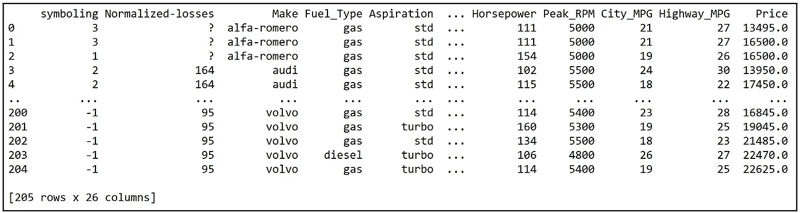

汽车数据集(来源:[加州大学欧文分校](https://archive.ics.uci.edu/ml/datasets/automobile))

我们将考虑由以下七个变量组成的数据子集:
*制造
吸气
车身样式
整备质量
气缸数
发动机尺寸
价格*

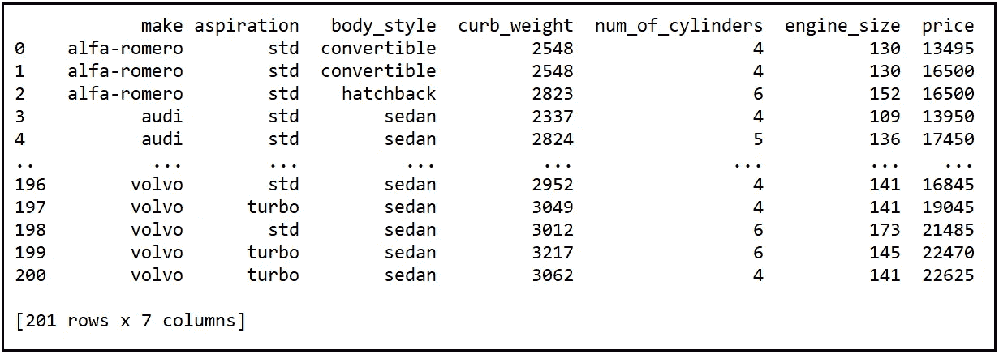

汽车数据集的 7 变量子集。(来源:[加州大学欧文分校](https://archive.ics.uci.edu/ml/datasets/automobile))

以上 7 变量版本可以从这里 下载 [**。**](https://gist.github.com/sachinsdate/402daa205e93a389d0f7023439588774)

在上述数据集中，*吸气*变量属于标准型或涡轮型。我们的回归目标是估计*期望*对汽车价格的影响。为此，我们将引入一个虚拟变量对*吸气*进行编码，如下所示:

*吸气 _ 标准* =1，否则为 0。

我们将使用基于 Python 的 [Pandas](https://pandas.pydata.org/docs/getting_started/index.html) 库将数据集作为数据帧加载到内存中。然后我们将使用 [statsmodels](https://www.statsmodels.org/dev/gettingstarted.html) 库建立一个简单的线性回归模型，其中响应变量为*价格*，回归变量为 *aspiration_std* (加上回归的截距)。

让我们从导入所有需要的包开始。

```
**import** pandas **as** pd
**import** statsmodels.formula.api **as** smf
```

让我们将汽车数据集的 7 变量子集导入到一个数据框架中:

```
df = pd.**read_csv**(**'**automobiles_dataset_subset_uciml.csv**'**, **header**=0)
```

我们将添加虚拟变量列来表示*抽吸*变量。

```
df_with_dummies = pd.**get_dummies**(**data**=df, **columns**=[**'**aspiration**'**])
```

打印出虚拟扩充数据集。

```
**print**(df_with_dummies)
```

我们看到以下输出。我突出显示了 Pandas 添加的两个虚拟变量列:

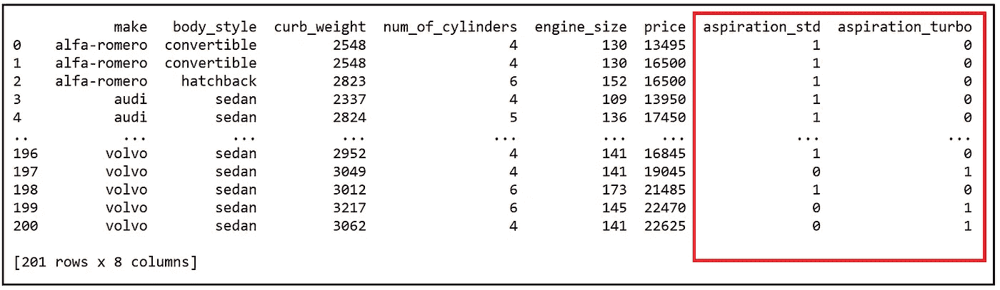

虚拟扩充数据集(图片由作者提供)

让我们构造回归表达式。回归的截距随后由模型自动添加。

```
reg_exp = **'price ~ aspiration_std'**
```

请注意，我们只添加了一个虚拟变量*吸气 _ 标准*，而没有添加两个虚拟变量*吸气 _ 标准*和*吸气 _ 涡轮。*我们这样做是为了避免**完全共线性**，因为数据集中的每台车辆发动机都是涡轮增压型或标准型。没有第三种。在这种情况下，回归截距捕捉到了*吸气 _ 涡轮*的效果。具体地，训练模型中回归截距的估计值是所有涡轮型汽车的估计平均价格。

或者，我们可以添加*吸气 _ 标准*和*吸气 _ 涡轮*并省略回归截距。在后一种情况下，由于模型没有回归截距，我们将无法使用 [**R 平方**](/the-complete-guide-to-r-squared-adjusted-r-squared-and-pseudo-r-squared-4136650fc06c) 值来判断其拟合优度。

让我们在这个虚拟增强数据集上构建普通最小二乘回归模型:

```
olsr_model = smf.**ols**(**formula**=reg_exp, **data**=df_with_dummies)
```

尽管我们已经将整个 7 变量数据集传递到这个模型中，但在内部，statsmodels 将使用回归表达式参数(`reg_exp`)来仅划分出感兴趣的列。

让我们训练模型:

```
olsr_model_results = olsr_model.**fit**()
```

让我们把培训总结打印出来。

```
**print**(olsr_model_results.**summary**())
```

我们看到以下输出。我强调了我们将仔细研究的部分:

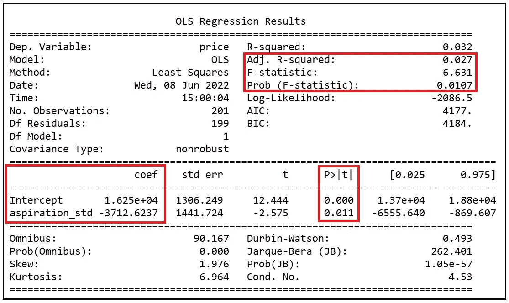

OLSR 模式的培训总结(图片由作者提供)

## 如何解读模型培训总结

我们首先注意到的是 [**调整后的 R 平方**](/the-complete-guide-to-r-squared-adjusted-r-squared-and-pseudo-r-squared-4136650fc06c) 为 0.027。*期望*变量已经能够解释汽车价格中略低于 3%的差异。它看起来非常小，但我们不需要过多解读调整后 R 平方的低值。回想一下，我们的目标是估计*期望*对*价格*的影响。我们从来没有指望*愿望*本身能够解释*价格*的大部分差异。此外，请注意，[**F-统计量**](/fisher-test-for-regression-analysis-1e1687867259) 的 p 值显著为 0.0107，表明即使是这种非常简单的线性模型也能够比均值模型更好地拟合数据(均值模型基本上是穿过*价格*平均值的水平直线)。

接下来，我们注意到模型的回归截距和系数 *aspiration_std* 都具有统计显著性，即非零，p 值分别小于 0 . 001 和 0 . 011。这是个好消息。让我们看看如何解释这些系数的值。

## 如何解释回归模型中虚拟变量的系数

回想一下，我们已经从模型中省略了虚拟变量 *aspiration_turbo* 以避免完全共线性。通过省略 *aspiration_turbo* ，我们将存储涡轮平均价格的工作交给了回归模型的截距。回归截距为 16250，表明 turbos 的平均价格为 16250 美元。

我们需要参照截距值来解释模型中所有虚拟变量的系数。

在我们的例子中，只有一个虚拟对象， *aspiration_std。它的值是 3712.62，并且有一个负号。这表明具有“标准”型吸气装置的汽车比具有“涡轮”型吸气装置的汽车平均便宜 3712.62 美元。涡轮增压发动机的预计平均价格为 16250 美元。因此，非涡轮增压发动机的估计平均价格为 16250 美元—3712.62 美元=**；12537.38 美元**。*

使用统计符号，我们可以将这两种方法表示如下:

*E(price | aspiration = ' standard ')=****$ 12537.38***

该估计在平均值附近具有以下 *95%* 置信区间:

*【16250 美元——6555.64 美元=****【9694.36 美元****【16250 美元——869.607 美元=****【15380.393 美元*** *】。*

我们从模型培训输出的 CI 部分获取了值 *-$6555.64* 和 *-$869.607* ，如下所示:

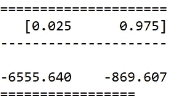

对于 turbos，期望值和配置项计算如下:

*E(price | aspiration = ' turbo ')=****【16250 美元*******【13700 美元*******【18800 美元*** *】。***

**拟合模型的回归方程如下:**

***价格=—3 . 712 . 62 *吸气 _std + 16250 + e***

**其中' *e* '包含回归的残差。**

**接下来，让我们看看使用虚拟变量来表示分类数据。**

# **如何使用虚拟变量来表示分类回归变量**

**假设我们希望估计 *body_style* 对*价格的影响。Body_style* 是一个分类变量，具有以下一组值:*【敞篷车、硬顶车、掀背车、轿车、旅行车】*。我们表示 *body_style* 的总体策略与表示 *aspiration* 的策略相似。所以让我们直接进入实现。我们将继续使用包含 7 变量汽车数据集的熊猫数据框架。**

**让我们用虚拟变量列来扩充数据帧，以表示 *body_style* :**

```
**df_with_dummies = pd.**get_dummies**(**data**=df, **columns**=[**'**body_style**'**])**
```

**打印出虚拟扩充数据集:**

```
**print(df_with_dummies)**
```

**我们看到以下输出:**

**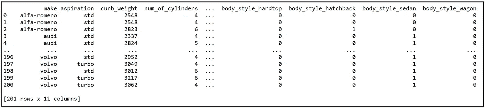**

**虚拟扩充数据集(图片由作者提供)**

**注意新添加的虚拟变量列，每个 *body_style* 都有一个。**

**接下来，我们将在 [Patsy](https://patsy.readthedocs.io/en/latest/quickstart.html) 语法中构建回归方程:与之前一样，我们将省略一个虚拟变量( *body_style_convertible* )以避免完全共线性。回归模型的截距将保存 *body_style_convertible* 的系数。**

```
**reg_exp = **'price ~ body_style_hardtop + body_style_hatchback + body_style_sedan + body_style_wagon'****
```

**让我们建立 OLS 回归模型:**

```
**olsr_model = smf.**ols**(**formula**=reg_exp, **data**=df_with_dummies)**
```

**让我们训练模型:**

```
**olsr_model_results = olsr_model.**fit**()**
```

**让我们打印出培训总结:**

```
****print**(olsr_model_results.**summary**())**
```

**我们看到以下输出:**

**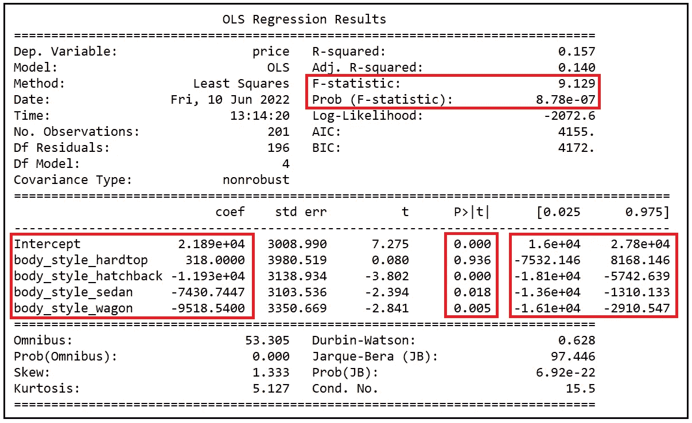**

**OLSR 模式的培训总结(图片由作者提供)**

**和以前一样，我们不会关注调整后的 R 平方。相反，让我们看看 F 统计量，并注意到它在 p 值为< .001\. It indicates that irrespective of the value of R-squared, the variables we have included in the model have been able to do a better job of explaining the variance in *价格*时比简单的均值模型更显著。完成*尽职调查*这一重要部分后，让我们深入研究所有变量的系数。**

## **如何解释虚拟变量的系数**

**让我们把目光转向拟合模型的系数。预计截距 21890。截距是敞篷车的估计平均价格，因为这是我们从回归方程中去掉的哑元。这一估计值在 3，790 美元(T1)、21890 美元(5742.639 美元=**16147.361 美元(T3))时非常重要。****

**同样，轿车的估计平均价格比敞篷车低 7430.7447 美元，四轮拖车的估计平均价格比敞篷车低 9518.54 美元。**

**总之，我们的模型显示，平均而言，敞篷车是最昂贵的车辆，其次是轿车、旅行车和掀背车，硬顶风格无法解释*价格*的差异。**

**拟合模型的方程如下:**

**拟合回归模型的方程(图片由作者提供)**

**如何使用虚拟变量表示有序分类值**

**我们要考虑的最后一个用例是分类变量对其组成部分施加了某种顺序。我们将再次使用汽车数据进行说明。具体来说，我们将注意力转向变量*气缸数量*。**

**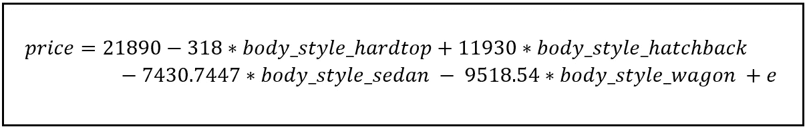**

**汽车数据集的 7 变量子集。(来源:[加州大学欧文分校](https://archive.ics.uci.edu/ml/datasets/automobile))**

# **乍一看，*气缸数量*似乎是一个整数值变量。对*气缸数*的*价格*进行回归的可能回归模型如下:**

**一个简单的回归模型，回归了汽缸数量的价格(图片由作者提供)**

**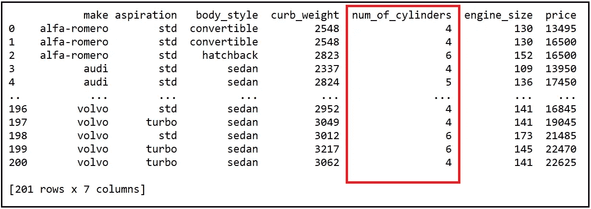**

**这个模型有一个致命的缺陷，当我们区分价格的期望值 w.r.t. *气缸数*时，这个缺陷变得很明显:**

**汽缸数量每单位变化汽车价格期望值的变化(图片由作者提供)**

**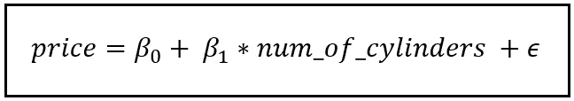**

**我们看到，该模型将估计气缸数量每单位变化的价格的恒定预期变化。该模型将估计 2 缸车和 3 缸车的平均价格差异，使其与 3 缸车和 4 缸车的平均价格差异完全相同，依此类推。在现实世界中，我们不会期望看到汽车价格出现如此一致的变化。**

**一个更现实的模型是将*气缸数量*视为分类变量，用虚拟变量表示*气缸数量*的每个值。**

**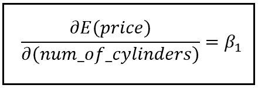**

**我们的数据集包括 2 缸、3 缸、4 缸、5 缸、6 缸、8 缸和 12 缸汽车。因此，我们构建模型如下:**

**一个线性模型，其中气缸数量表示为分类虚拟变量(图片由作者提供)**

**我们已经省略了*气缸数量 _2* 的假人。截距 *β_0* 将捕获*气缸数 _2* 的系数。所有虚拟变量的系数将包含相应类别车辆平均价格与 2 缸车辆估计平均价格的估计偏差。如上所示，可以计算 95%的 CIs。**

**让我们在汽车数据集上构建和拟合这个模型，并打印出培训摘要。**

**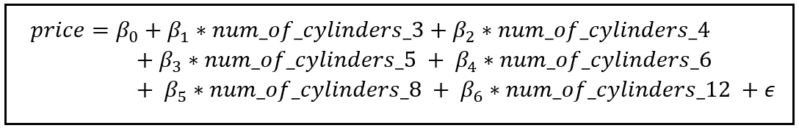**

**我们看到以下输出:**

**线性模型的训练总结(图片由作者提供)**

**如何解释虚拟变量的训练总结和系数**

```
*****#Add dummy variable columns to represent num_of_cylinders*** df_with_dummies = pd.**get_dummies**(**data**=df, **columns**=[**'**num_of_cylinders**'**])olsr_model = smf.**ols**(**formula**=reg_exp, **data**=df_with_dummies)olsr_model_results = olsr_model.**fit**()**print**(olsr_model_results.**summary**())**
```

**摘要中首先引人注目的是 0.618 的大调整后 R 平方。气缸数量似乎有能力解释汽车价格中高达 61.8%的差异。**

**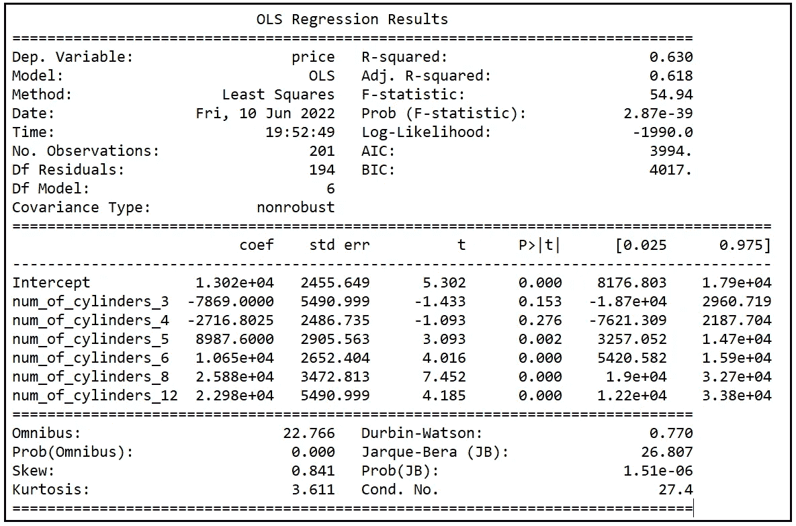**

**与往常一样，我们将尽职调查 F 统计的 p 值(在 2.87 e-39 处明显小于 0.001)，表明模型中的所有回归变量*共同*高度显著。**

## **和以前一样，我们的重点仍然是估计的系数，它们的 p 值和 95%的置信区间。**

**先说回归截距。它的估计值是 13020 美元，这是 2 缸汽车的估计平均价格。平均价格在 p 值为 0.001 时具有统计学意义，95%置信区间为[$8176.803，$17900]。**

**三缸汽车的估计平均价格为 13020 美元——7869.0 美元= 5151 美元，但这一估计只有在 p 值为 0.153 时才有统计学意义。它未能通过 95%、90%和 85%的置信度测试，但通过了 80%的置信度。**

**四缸汽车紧随三缸汽车之后，估计平均价格为 13020-2716.8025 美元= 10303.1975 美元。同样，在 p = 0 . 273 时，该估计的显著性仅在(1 — .273)100%=72.7%的置信水平下有效。**

**5 缸、6 缸、8 缸和 12 缸汽车的估计平均值都非常显著。平均而言，8 缸汽车似乎是所有汽车中最贵的，其平均价格比 2 缸汽车高出 25，880 美元。**

**下图显示了平均价格与气缸数量的关系，以及平均值上下 95%的界限。**

**汽车的平均价格是气缸数量的函数(图片由作者提供)**

**我们看到价格*并没有随着每个单位的气缸数量的变化而变化一个恒定的量*。这证实了我们之前的观点，即我们不应该将*的气缸数*表示为简单的整数值变量。**

**以下是拟合模型的方程式:**

**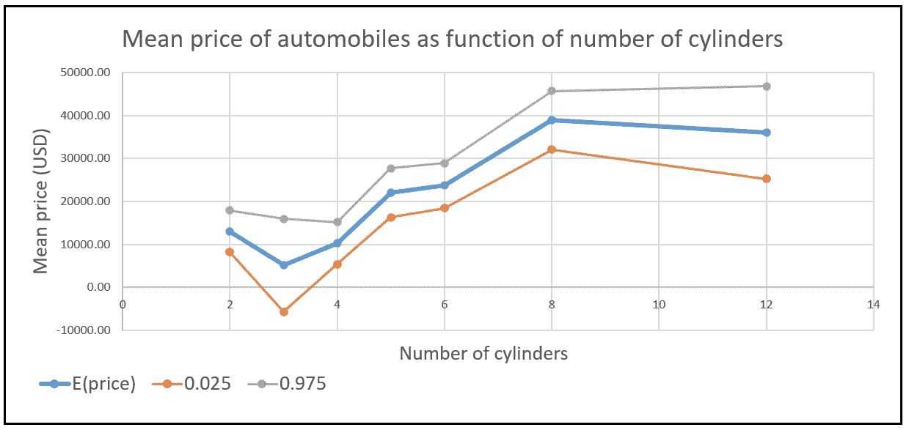**

**拟合回归模型的方程(图片由作者提供)**

**以下是本文中使用的完整源代码:**

**参考文献、引文和版权**

**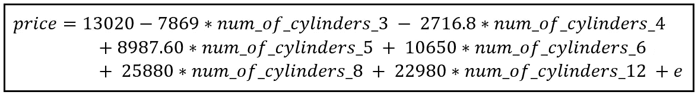**

**数据集**

**[**汽车数据集**](https://archive.ics.uci.edu/ml/datasets/automobile) **引用:** Dua，d .和 Graff，C. (2019)。UCI 机器学习知识库[http://archive . ics . UCI . edu/ml]。加州欧文:加州大学信息与计算机科学学院。(CC BY 4.0) [**下载链接**](https://gist.github.com/sachinsdate/402daa205e93a389d0f7023439588774)**

# **形象**

## **本文中的所有图片版权归 [Sachin Date](https://www.linkedin.com/in/sachindate/) 所有，版权归 [CC-BY-NC-SA](https://creativecommons.org/licenses/by-nc-sa/4.0/) 所有，除非图片下方提到了不同的来源和版权。**

***如果您喜欢这篇文章，请关注我的*[***Sachin Date***](https://timeseriesreasoning.medium.com)*以获得关于回归、时间序列分析和预测主题的提示、操作方法和编程建议。***

## **Images**

**All images in this article are copyright [Sachin Date](https://www.linkedin.com/in/sachindate/) under [CC-BY-NC-SA](https://creativecommons.org/licenses/by-nc-sa/4.0/), unless a different source and copyright are mentioned underneath the image.**

***If you liked this article, please follow me at* [***Sachin Date***](https://timeseriesreasoning.medium.com) *to receive tips, how-tos and programming advice on topics devoted to regression, time series analysis, and forecasting.***