# 什么是外生和内生回归变量？

> 原文：<https://towardsdatascience.com/what-are-exogenous-and-endogenous-regression-variables-c0ea1ba03ce8>

图片由[菲利佩](https://pixabay.com/users/95c-484762/)从[皮查拜](https://pixabay.com/illustrations/cubes-blue-wallpaper-background-1799270/) ( [皮查拜许可](https://pixabay.com/service/license/))

## 虽然外生性是一件好事，但内生性会让你的模型的有效性受到质疑

在本文中，我们将在回归分析的上下文中查看什么是**外生**和**内生**变量。我们还将解释当一个或多个回归变量变成内生变量时，你的回归模型会发生什么。我们将学习如何发现内生性，并且我们将触及一些处理它的方法。

让我们从这些术语的原始定义开始，然后通过使用真实世界的例子来发展我们对它们的直觉。

# 什么是外生变量？

考虑以下线性回归模型:

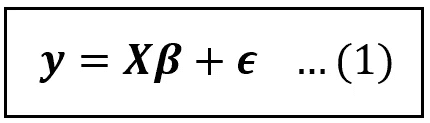

线性回归模型的方程(图片由作者提供)

以上模型中， ***y*** 为因变量。 ***X*** 是包含截距项占位符的解释变量矩阵， ***β*** 是回归系数的向量(包含截距*β_ 0*),*是误差项的向量。*

*虽然 ***X*** 或许可以解释*y 中的部分差异，但是*中无法解释的差异的余额却不得不去向某处。那个‘某处’就是错误**。*因此，误差项 ***ϵ*** 代表了模型的解释变量未能解释的所有因素对因变量的影响。****

**我们进一步假设数据样本中有 *n* 个数据点， *k* 个回归变量。因此，***【y】***是一个大小为*【n×1】****β***是一个大小为*【k×1】****的列向量，X*** 是一个大小为*【n×k】*的矩阵(其中包括 1s 的占位符列**

**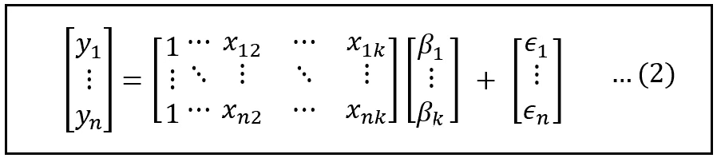**

**线性回归模型的矩阵版本(图片由作者提供)**

**样本中第*行与第*行的模型方程可以表示如下(其中 *x_i_k* 是*第 k 个*回归变量**x***_ k):***

**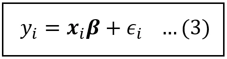**

**样本中第*行和第*行的回归模型方程(图片由作者提供)**

**有了这个设置，让我们开始定义感兴趣的内容。**

**在计量经济学中，尤其是在诸如等式(1)所示的回归模型的背景下，**外生变量**是与误差项不相关的解释变量。**

**在上述回归模型的上下文中，如果***x****_ k*与***【ϵ***不相关，则回归变量***x****_ k*是外生的。具体来说，对于数据集的任意给定行，**x _ k _ I*的值应该与对应的误差 *ϵ_i* ***不相关。*** 记住，在回归分析中，我们认为第*行*的*第 k 个*回归变量 *x_k_i* 的值以及相应的误差 *ϵ_i* 是随机变量。所以相关性的概念(或者在这种情况下，缺乏)适用于他们。***

**这种不相关的结果是，误差项的平均值不受外部解释变量的影响(因此不是其函数)。换句话说，一个外生解释变量不携带关于模型误差的信息，因此不能用来预测(甚至不精确地)误差。**

## **外生变量的例子**

**正如我们将很快在关于内生性的讨论中看到的，真正的外生解释变量很难获得。人们只需要足够努力地去发现解释变量和误差项之间的一些微妙的、潜在的联系。然而，让我们尝试用一个真实世界的例子来说明外来性。**

**2005 年是有史以来第二活跃的大西洋飓风季节，28 场大风暴在美国许多州造成了数十亿美元的财产损失。假设我们希望估计从 2005 年飓风季节之前到之后，飓风损害对大西洋沿岸各州房地产价格变化的影响。在下面的模型中，*δPrice _ I*是 2004-2006 年大西洋沿岸州 *i* 的房产平均销售价格的变化。 *Hurricane_Affected_i* 是一个二元(1/0)变量，表示状态 *i* 是否受到飓风的重大破坏， *δ* 是衡量 *Hurricane_Affected_i* 对*δprice _ I .****x****_ I****β***和*影响程度的系数我们希望初步估计 *δ* 。***

*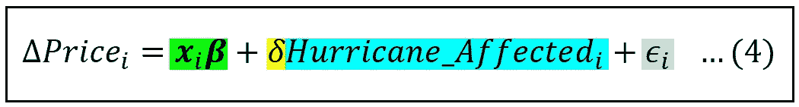*

*一个治疗效果模型，用于估计飓风损害对房地产价格变化的影响(图片由作者提供)*

*让我们假设在跨越数百个飓风季节的时间尺度上，构成每个面向大西洋的州的区域经历大西洋飓风的重大财产损失的机会大致相同。根据这一假设，很容易看出，第 I 个面向大西洋的州是否会在 2005 年遭受重大财产损失，必须与模型误差项中包含的几乎任何因素无关。因此， *Hurricane_Affected_i* 与 *ϵ_i* 不相关，使得 *Hurricane_Affected_i* 成为外生变量。*

*这种情况的反过来产生一个内生变量。*

# *什么是内生变量？*

***内生变量**是回归模型中与误差项相关的任何变量。内生变量携带关于误差项的信息(反之亦然)。理论上，在给定内生变量的值的情况下，至少可以构造一个不精确的函数来预测误差的平均值。*

*在等式(1)所示的回归模型中，如果*第 k 个*回归变量***x****_ k*是内生的，则对于数据集中的任何一行 *i* 都成立:*

**E(ϵ_i|x_k_i) = f(x_k_i)* ，其中 *f(。)*是 *x_k_i* 的某个函数*

## *误差项中的隐藏因素*

*由于相关性是双向的，看待内生性的另一种方式是想象回归模型的误差项影响内生回归变量的平均值。*

*根据这种观点，人们可以想象在模型的误差项中隐藏着一个或多个未观察到的因素。这些因素与模型的内生变量相关，因此，当这些隐藏因素的值发生变化时，所有相关内生变量的平均值也会发生变化。这进而改变了模型响应变量的平均值。请记住，模型的内生解释变量代表可观察的量，而误差项对于实验者来说是内在不可见的。因此，实验者观察到的是内生变量值的变化以及因变量观察值的相应变化。实验者没有意识到的是，至少一部分内生解释变量的变化是由误差项中隐藏的、未观察到的因素的变化引起的。*

*当你的模型中有内生变量时，你不知道的是，你的模型的误差项正在影响模型的响应，使用模型中的所有内生解释变量作为沟通渠道！*

*作为一个建模者，这不是一个好的状态，因为有很多好的理由。我们将在下面解释这些原因是什么。*

*考虑以下客车价格相对于发动机气缸数量的数据集:*

*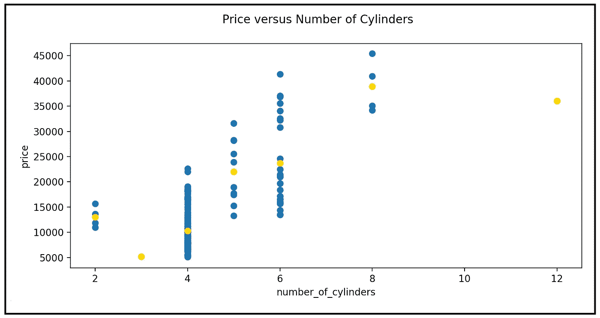*

*价格与气缸数量。金点代表条件均值: *E(价格|气缸数)*(图片由作者提供)(数据集: [UCI ML 汽车](https://archive-beta.ics.uci.edu/ml/datasets/automobile)用在 [CC BY 4.0](https://creativecommons.org/licenses/by/4.0/legalcode) 下*

*如果我们怀疑价格和气缸数量之间存在线性关系，我们可以使用以下模型来表示这种关系:*

*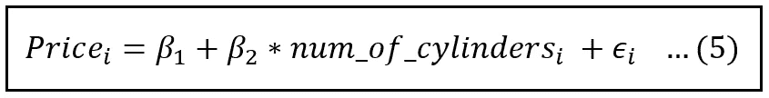*

*估计汽车价格的线性模型(图片由作者提供)*

*在上面的模型中， *price* 为因变量， *num_of_cylinders* 为单解释变量， *β_1* 为回归截距， *β_2* 为 *num_of_cylinders* 的系数， *ϵ* 为误差项。子脚本 *i* 表示样品中第*排*(*排*辆)的数量。*

*我们感兴趣的是估计第*和第*辆车的平均价格，给定它的气缸数，换句话说，价格对气缸数的条件期望**，表示为*E(price _ I | num _ of _ cylinders _ I)*。***

***因为我们已经假设价格和钢瓶数量之间是线性关系，我们希望这个条件期望只是钢瓶数量的函数。因此，我们正在寻找一个*汽缸数量*(并且只有*汽缸数量*)的函数，该函数将产生条件平均价格 *E(价格 _ i |汽缸数量 _i)。*换句话说，我们正在寻求以下条件均值函数:***

******

***第 I 辆汽车价格的条件均值函数(图片由作者提供)***

***如果我们应用*期望算子* *E(。)*对等式(5)的两边，我们得到如下关系:***

***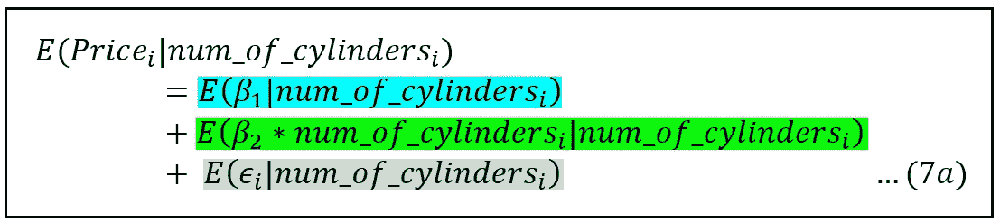***

***在线性模型的两侧应用期望运算符(图片由作者提供)***

***在上式中，右侧的蓝色位简单地解析为 *β_1* ，绿色位解析为*β_ 2 *气缸数量 i:****

***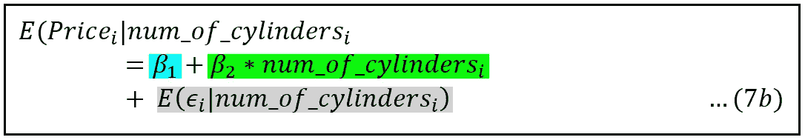***

***汽车价格的条件均值(图片由作者提供)***

***唯一的方法，我们将能够建立一个可估计的线性模型，这种类型的方程。(6)是如果(7b)的 R.H.S .上的灰色项为零，即，***

****E(ϵ_i|num_of_cylinders_i)需要为零。****

***该条件期望是以气缸数量的特定值为条件的第*辆*的*模型*价格的误差平均值。***

***该条件期望为零(或常数)的充分条件是误差与*汽缸数量*不相关，换句话说，如果*汽缸数量*是外生的。如果误差*e(ϵ_i|num_of_cylinders_i)*的条件均值是某个非零常数，我们可以简单地将其添加到模型的截距 *β_0* 中，等式(6)中我们期望的条件均值函数仍然是完整的。***

***但是如果*气缸数量 i* 是内生的，等式(6)不再是正确的均值函数。我们不应该使用诸如最小二乘法之类的技术来使用等式(6)估计条件均值。如果我们仍然继续使用最小二乘法估计等式(6)，我们将得到不正确的，具体地说，**、回归系数的估计值**。*******

******让我们更详细地研究这最后一点。******

# ******内生性对回归模型的影响******

******让我们重新看看等式(1)中的模型:******

************

******线性回归模型的方程(图片由作者提供)******

******假设*第 k 个*回归变量 ***x*** *_k* 是内生的，而变量 ***x*** *_1* 到***x****_(k-1)*是外生的。利用这个假设，我们可以将 ***X*** 矩阵分成如下两个矩阵:******

1.  ******一个大小为*【n X(k-1)】*的矩阵 ***X**** ，其中包含的变量***X****_ 1*到***X****_(k-1)*from***X***均被假定为外生变量。******
2.  ******一个列向量***X****_ k*，大小*【n×1】*，包含***×的*第 k*列。我们假设***x****_ k*是内生的，即***x****_ k*与误差 ***ϵ.相关************

***我们将 ***X**** 矩阵与*相乘，这是一个大小为 *[(k-1) x 1]* 的列向量，包含除了*第 k 个*系数之外的来自 ***β*** 的所有系数。注意，和前面一样， ***X*** *与*的矩阵相乘产生一个大小为*【n X 1】*的列向量。对此，我们加上用*第 k 个*系数 *β_k* 缩放的*【n×1】*大小列向量***x****_ k*，最后，我们将误差的*【n×1】*列向量加到这个总和上，从而产生*【n×1】*列向量*****

****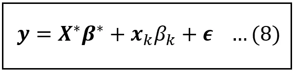****

****我们将内生变量 **x** _k 放入其中的分区线性模型(图片由作者提供)****

****既然我们已经假设 ***x*** *_k* 与*相关，那么***【ϵ】***中至少有一个隐藏因子与***×x****_ k*相关。这个隐藏的因素可以被认为是一个解释变量，实验者从模型中省略了它，仅仅是因为它不可观察或不可测量，因此不可能包括在内。假设这个省略的变量由 ***w.*** 表示*****

****如果 ***w*** 包含在模型中，则*理论上*正确的模型如下:****

****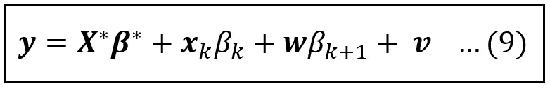****

****线性模型扩展到包括与内生变量 **x** _k 相关的假设因素 **w** (图片由作者提供)****

****其中所有变量 ***X*** *** ，***X****_ k*和 ***w*** 现在都是外生的，因此，误差项 ***v*** 与它们中的任何一个都不相关。使用普通最小二乘法可以正确地估计该模型，并且所有估计的系数将是无偏的。****

****不幸的是，这是一个不可能的模型，因为 ***w*** 无法观察到。我们必须估计的模型由等式给出。(8).****

****在上一篇关于 [**省略变量偏差**](/what-happens-when-you-omit-important-variables-from-your-regression-model-966830590d53) 的文章中，我们已经看到:****

1.  ****如果回归模型中省略了解释变量，并且****
2.  ****被省略的变量与模型中的至少一个解释变量相关，****

****这种省略的效果是使模型中包含的所有变量的*系数的估计值产生偏差。*****

****偏差量与忽略变量和模型中变量之间的相关量成正比，该变量与模型中剩余变量条件下的[相关，与模型中剩余变量条件下的内生变量](/understanding-conditional-variance-and-conditional-covariance-8b661067fc18)[的方差成反比](/understanding-conditional-variance-and-conditional-covariance-8b661067fc18)。****

****在我们的例子中，内生 ***x*** *_k* 与误差项***【ϵ】***之间的相关性可以解释为***x****_ k*与假设变量 ***w*** 之间的相关性。由于 ***w*** 不可观测，它被有效地从模型中省略，导致模型中所有变量的系数偏离它们的真实值。****

****is***x****_ k*与*的相关性越大，估计的回归系数就越偏离它们的真实总体值。*****

*****量化这种偏差是可能的。当估计等式(9)中的理论模型时，估计的系数如下:*****

*****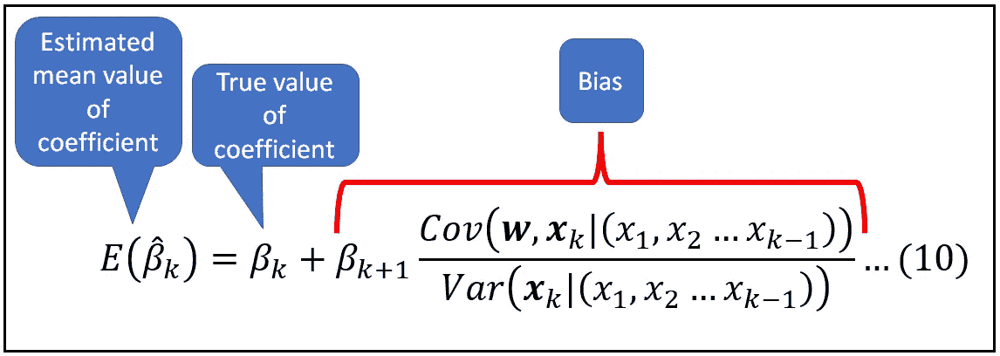*****

*****系数 *β_k 的估计值，表示为其真值与偏差之和******

*****在上面的等式中:*****

*   ******E(β_cap_k)* 是最小二乘法估计的第*k 个*系数的平均值，*****
*   *****β_k* 是其真实群体值，****
*   *****Cov(****w****，****x****_ k |【****x****_ 1、…****x****_(k-1)*就是****
*   *****Var(****x****_ k |【****x****_ 1、…****x****_(k-1)*是 [**的条件方差*****x***](/understanding-conditional-variance-and-conditional-covariance-8b661067fc18)****

****可惜在实践中，这种偏差无法测量，原因很简单，实验者无法观察到 ***w*** 。****

# ****导致内生变量的情况****

****在文章的前面，我们碰巧提到内生变量很容易得到。这个事实会对最仔细的实验产生可怕的影响。这里有几个例子来说明内生性是多么容易渗入到你的回归模型中。****

## ****治疗效果模型****

****通常，人们感兴趣的是建立一个或多个解释变量和响应变量之间的关系，而不仅仅是相关性。人们想知道事件 A *是否导致事件 b*吸烟会导致肺癌吗(会！)?常春藤盟校的教育会带来更高的终生收入吗(这个问题还没有定论)？有大量关于因果关系的文献。让我们考察一个这样的模型，在这个模型中，我们试图估计在常春藤盟校获得高 GPA(比如≥3.8/4.0)对一生收入的影响。该模型可以表述如下:****

********

****大学的高 GPA 对一生收入的影响(图片由作者提供)****

*******X*** 是可能与研究相关的回归变量矩阵。 ***X*** 可能包含父母的教育程度、种族、性别等变量。 ***High_GPA*** 是一个二元(1/0)变量。它是模型中的“治疗”变量。我们的目的是估计 *γ* 的值。****

****假设我们将实验的范围限制为只包括来自常春藤盟校的学生。****

****问题是， ***高 _GPA*** 是外生的吗？精英学校一直非常重视课程中的高度合作。人们可能会怀疑，那些性格特征有助于他们能够与其他学生有效合作的学生将能够从这项学校政策中获得最大的利益。这些学生甚至可能在大学的平均绩点上比其他学生更有优势。但是诸如开放、诚实、可爱、不内向、领导能力等特质。—可能有助于有效合作的因素也可能影响一个人获得和保持高薪职位或在大学毕业后成功经营企业的能力。所有这些特征在回归模型的定量设置中都是不可测量的，因此它们的影响隐藏在模型的误差项中。同时，它们似乎与可观察的解释变量 ***High_GPA*** 相关，从而使得 ***High_GPA* 内生**。可以有把握地假设这些人格特质与 ***High_GPA*** 之间存在正相关，因此等式(11)中 ***High_GPA*** 的估计系数会偏向其真实值的较高一侧。换句话说，实验者很可能高估了 ***高 _GPA*** 对 ***一生 _ 收益*** 的作用。****

****需要注意的是，即使实验者竭尽全力保证样本在模型的所有参数方面都是完美均衡的，估计出来的系数 ***High_GPA*** 仍然会有偏差。无论样本有多大，都是如此。不可避免地会高估高 GPA 对收入的影响。****

## ****非随机样本****

****考虑一个实验，该实验试图估计城镇成年居民每周饮用橙汁对每月普通感冒频率的影响。期望可能是两者之间的负相关之一。****

****为了招募志愿者，实验者在整个城镇张贴传单，比如超市外面、公共图书馆、公共汽车站等等。****

****不幸的是，由于内生性问题，这个实验可能注定要失败。****

****这些传单只张贴在户外，因此必然会被该镇的居家、身体或精神有障碍的居民拿不到。如果传单上的文字太小，年长的人可能看不到，或者读起来不够容易。不乘坐公共交通工具出行的人可能不太可能参与。总的来说，这组研究参与者可能是某一组身体健全的居民，他们经常出门，经常乘坐公共交通工具——很难称之为随机选择的样本。****

****如果这个模型中有一个收入变量，这个收入变量很可能与所有这些因素高度相关——居家、身体健康、不使用公共交通等。——实验者无法控制，因此其影响隐藏在误差项中。这将使模型中的收入内生。****

****如果一些相同的未观察到的因素与橙汁的周摄入量相关，那么*周 _ 橙汁 _ 摄入量*变量也是内生的。****

****如果使用 OLS 估计当前形式的模型，所有变量的估计系数将偏离其真实值，从而系统地高估或低估每个变量对普通感冒发病率的影响。具体来说，实验者会高估或低估橙汁消费的真实效应(如果存在的话)对普通感冒频率的影响。****

# ****内生性补救措施****

****在文章的最后，我们将简要概述面对可变内生性时我们可用的技术和策略。我们将在后续文章中研究如何使用这些工具。它们如下:****

*   ****如果我们怀疑假设为内生的变量与误差项中未观察到的因素没有很大的相关性，那么我们可以假设系数中产生的偏差将是轻微的。这可以从等式(10)看出。我们只能**接受这种假定的温和程度的偏差**。顺便提一下，回想一下，我们没有办法从数字上估计这种偏差。****
*   ****我们可以选择使用一个或多个**代理变量**来代替隐藏在误差项中的未观察到的效应，从而将它们的效应从误差项中“拉”出来并放入模型中。一个代表的例子是教育的受教育年限(可测量)(不可测量)，以及作为技能或能力(不可测量)的代表的智商分数(可测量)。我们将在下一篇文章中讨论代理的使用。****
*   ****在时间序列模型、[面板数据模型](/understanding-the-fixed-effects-regression-model-d2fccc2cc27e)或[治疗效果模型](/a-guide-to-using-the-difference-in-differences-regression-model-87cd2fb3224a)中，如果(疑似)内生变量不随时间变化，我们可以简单地用**将它们差分出来**。****
*   ****称为**工具变量(IV)** 估计的强大估计技术可用于通过引入另一组称为工具的回归变量，分离出内生变量中可能与误差项相关的方差部分。我们将在下一篇文章中研究 IV 估计。****

# ****总结和关键要点****

*   ****在计量经济学中，尤其是在回归模型的背景下，**外生变量**是与误差项不相关的解释变量。****
*   ******内生变量**是回归模型中与误差项相关的任何变量。根据定义，回归模型的因变量 ***y*** 总是内生的。****
*   ****当回归模型包含一个或多个内生解释变量时，模型的误差项通过所有内生解释变量影响模型的响应。****
*   ****当使用最小二乘法估计包含内生解释变量的回归模型时，估计的系数偏离其真实总体值。****
*   ****内生性很容易被引入到实验设计中，当它出现时，会破坏实验结果的有用性。****
*   ****如果怀疑内生性严重，可以使用代理变量、差分和工具变量等技术进行控制。****

# ****参考文献、引文和版权****

## ****数据集****

******汽车数据集**来源于 4.0 的 [CC 下的](https://creativecommons.org/licenses/by/4.0/legalcode) [UCI ML 数据集库](https://archive-beta.ics.uci.edu/ml/datasets/automobile)。****

## ****形象****

****本文中的所有图片版权归 [Sachin Date](https://www.linkedin.com/in/sachindate/) 所有，版权归 [CC-BY-NC-SA](https://creativecommons.org/licenses/by-nc-sa/4.0/) 所有，除非图片下方提到了不同的来源和版权。****

*****如果您喜欢这篇文章，请关注我的*[***Sachin Date***](https://timeseriesreasoning.medium.com)*以获得关于回归、时间序列分析和预测主题的提示、操作方法和编程建议。*****