# 计算机视觉中的内在和外在相机参数是什么？

> 原文：<https://towardsdatascience.com/what-are-intrinsic-and-extrinsic-camera-parameters-in-computer-vision-7071b72fb8ec>

由 [Unsplash](https://unsplash.com?utm_source=medium&utm_medium=referral) 上 [ShareGrid](https://unsplash.com/@sharegrid?utm_source=medium&utm_medium=referral) 拍摄的照片

## 在可视化的帮助下，详细解释内部和外部摄像机参数

I mages 是最近深度学习模型中最常用的数据之一。相机是用来捕捉图像的传感器。他们把世界上的点投影到一个 2D 平面上，这个平面就是我们看到的图像。在本文中，我们将介绍在此过程中发生的完整转换。

这种转化通常分为两部分: ***外在和内在。*** 摄像机的外部参数取决于摄像机的位置和方位，与摄像机的内部参数如焦距、视野等无关。另一方面，相机的内在参数取决于它如何捕捉图像。诸如焦距、光圈、视野、分辨率等参数控制相机模型的固有矩阵。

这些外部和非外部参数是将点从一个坐标系转换到另一个坐标系的变换矩阵。为了理解这些变换，我们首先需要了解成像中使用的不同坐标系是什么。

# CV 中常用的坐标系

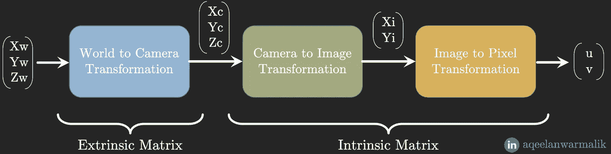

作者图片

计算机视觉中常用的坐标系有

1.  **世界坐标系(3D)**
2.  **摄像机坐标系(3D)**
3.  **图像坐标系(2D)**
4.  **像素坐标系(2D)**

**外矩阵**是从世界坐标系到摄像机坐标系的变换矩阵，而**内矩阵**是将点从摄像机坐标系转换到像素坐标系的变换矩阵。

## 世界坐标系(3D):

**【Xw，Yw，Zw】:**是任意原点的 3D 基础笛卡尔坐标系。例如房间的特定角落。这个坐标系中的一个点可以表示为 Pw = (Xw，Yw，Zw)。

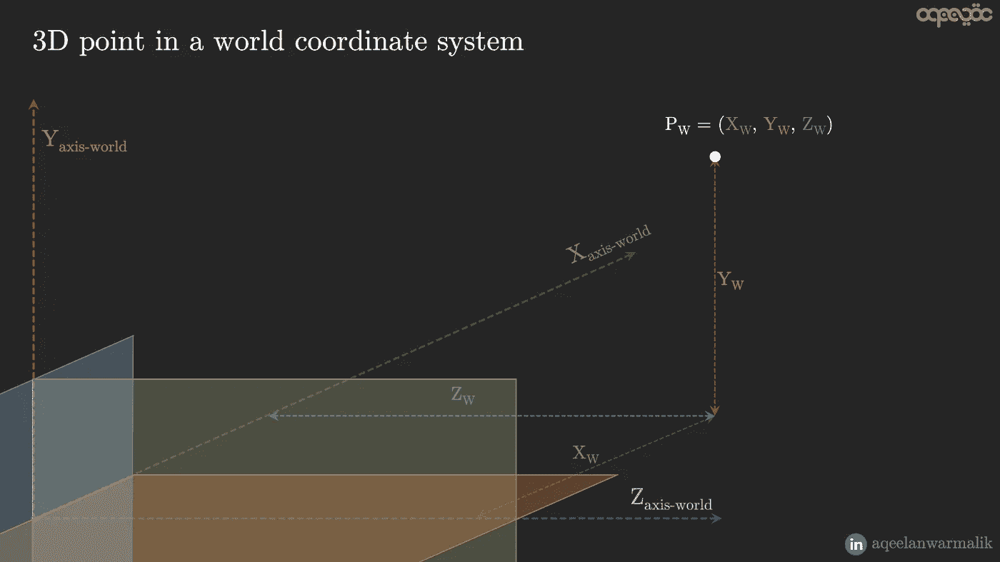

作者图片

## 物体/摄像机坐标系(3D):

**【Xc，Yc，Zc】:**相对于物体/摄像机的原点/方向进行测量的坐标系。相机坐标系的 z 轴通常面向相机镜头(相机主轴)的外部或内部，如上图所示(z 轴面向相机镜头的内部)。通过旋转和平移操作，可以从世界坐标系转换到工件坐标系(反之亦然)。

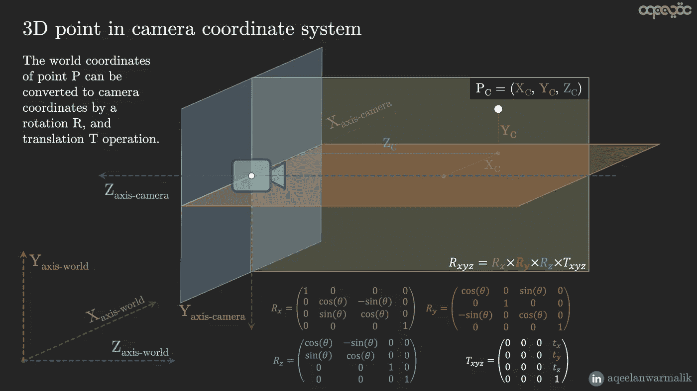

作者图片

将点从世界坐标系转换到摄像机坐标系的 4x4 变换矩阵被称为**摄像机外部矩阵。**如果摄像机的物理位置/方向改变(例如移动汽车上的摄像机)，摄像机外部矩阵也会改变。

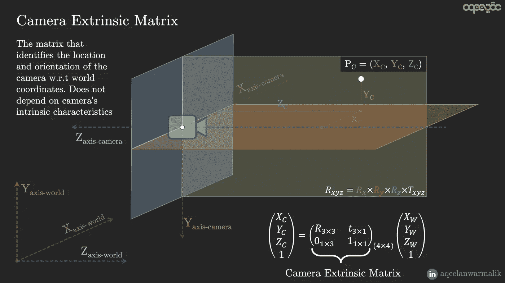

作者图片

## 图像坐标系(2D)[针孔模型]:

**【Xi，易】:**2D 坐标系，将相机坐标系中的 3D 点投影到具有针孔模型的相机的 2D 平面(通常垂直于相机坐标系的 z 轴-在下图中显示为黄色平面)上。

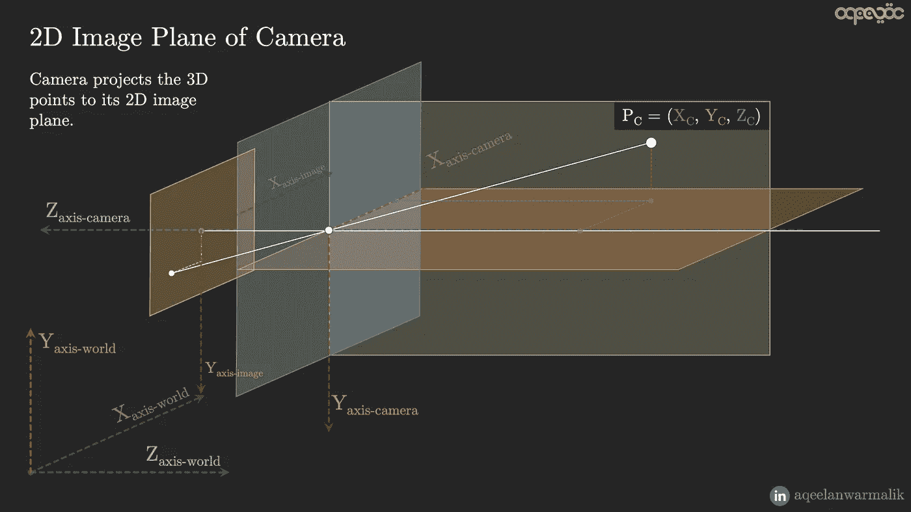

作者图片

光线通过相机开口的中心，投射到另一端的 2D 平面上。2D 平面是照相机捕捉到的图像。这是一种有损变换，这意味着将点从相机坐标系投影到 2D 平面是不可逆的(深度信息会丢失，因此通过查看相机捕捉的图像，我们无法判断点的实际深度)。这些点的 X 和 Y 坐标被投影到 2D 平面上。2D 平面距离相机的距离为 **f(焦距)**。投影，Yi 可由相似三角形定律求出(进入和离开相机中心的光线与 x 轴和 y 轴的夹角相同，分别为α和β)。

作者图片

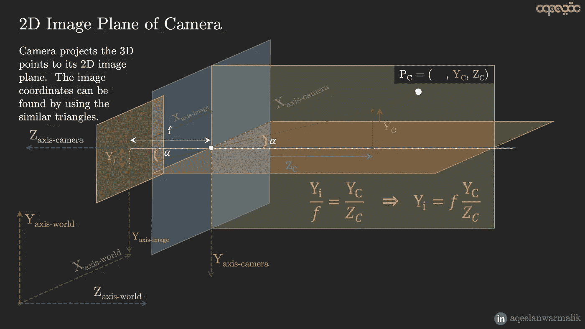

作者图片

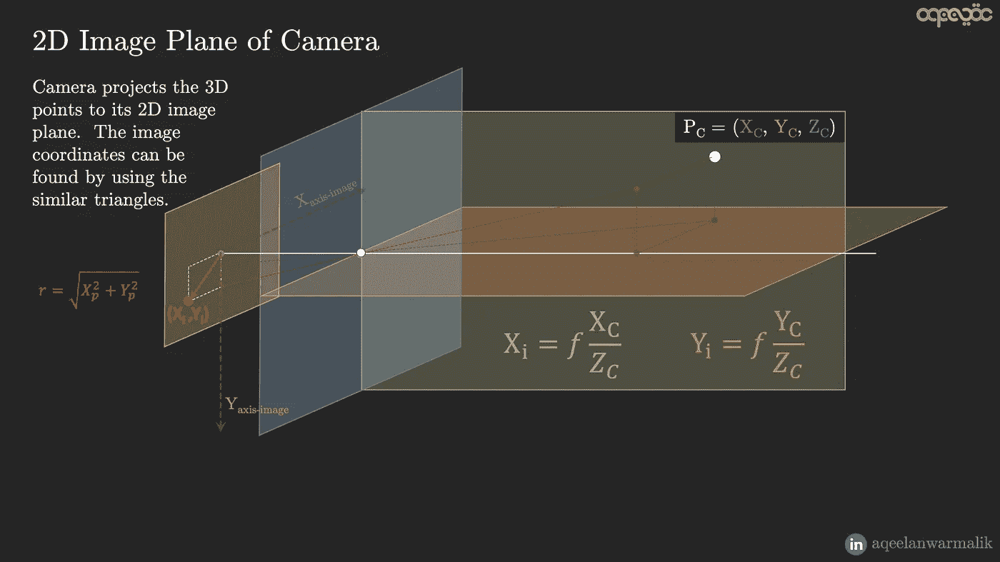

作者图片

因此，在矩阵形式中，我们有以下从相机坐标系到图像坐标系的变换矩阵。

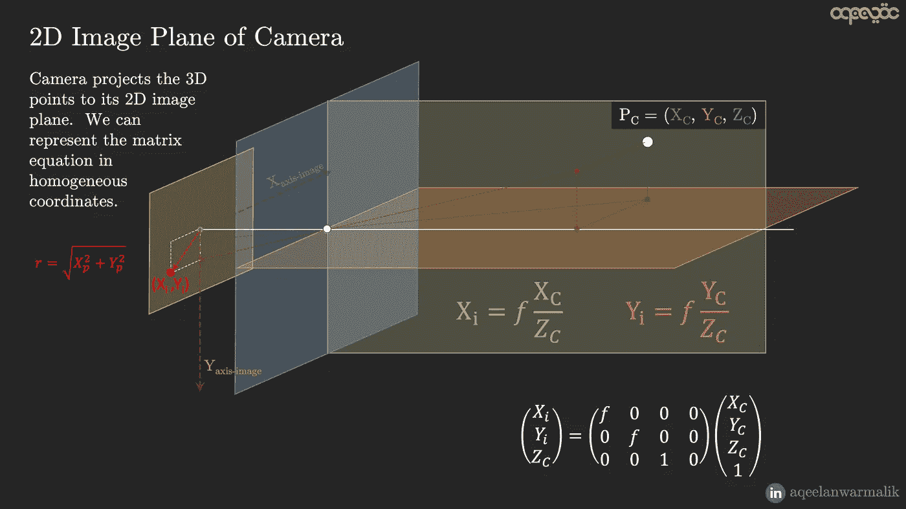

作者图片

这个变换(从摄像机到图像坐标系)是**摄像机固有矩阵**的第一部分。

## 像素坐标系(2D):

**【u，v】:**表示将图像坐标系中的点离散化后的整数值。图像的像素坐标是一定范围内的离散值，可以通过将图像坐标除以像素宽度和高度(相机的参数—单位:米/像素)来实现。

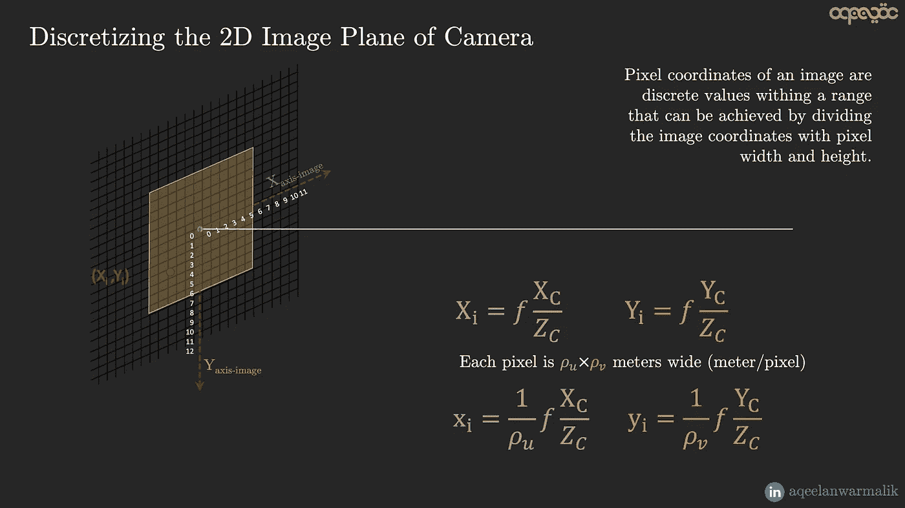

作者图片

像素坐标系的原点在左上角，因此在离散化的同时还需要一个平移运算符(c_x，c_y)。

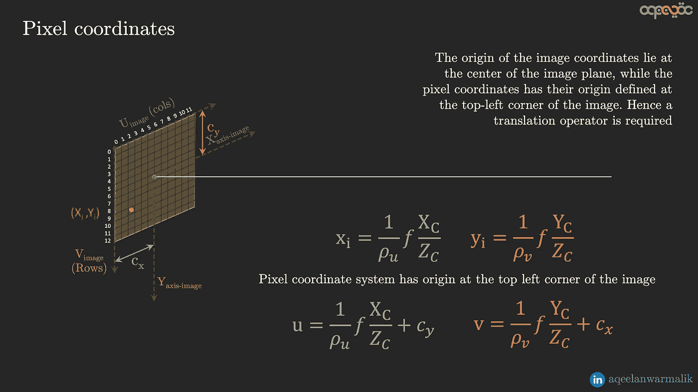

作者图片

从图像坐标系到像素坐标系的完整变换可以以如下矩阵形式示出

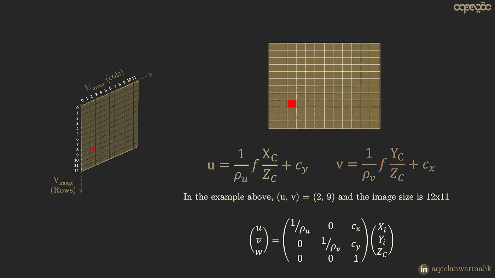

作者图片

有时，2D 图像平面不是矩形，而是倾斜的，即 X 轴和 Y 轴之间的角度不是 90 度。在这种情况下，需要执行另一个变换以从矩形平面到斜面(在执行从图像到像素坐标系的变换之前)。如果 x 轴和 y 轴之间的角度是θ，那么将点从理想的矩形平面转换到斜面的变换可以如下找到

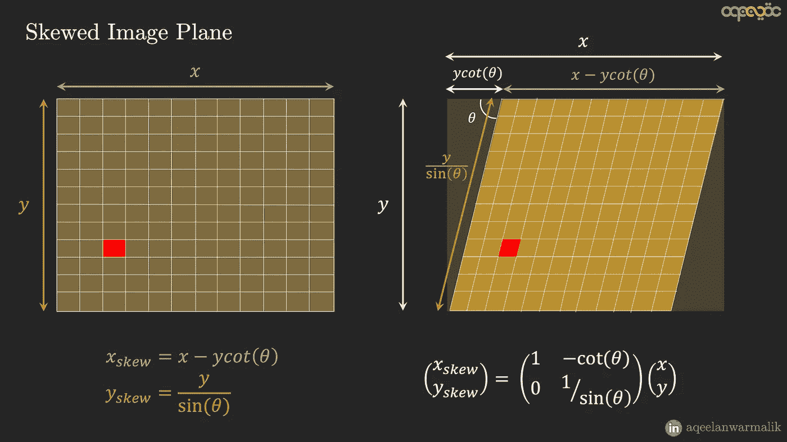

作者图片

这两个变换矩阵，即从直角图像坐标系到倾斜图像坐标系的变换和倾斜图像坐标系到像素坐标系的变换，构成了**摄像机固有矩阵的第二部分。**

组合三个变换矩阵产生如下所示的相机外部矩阵

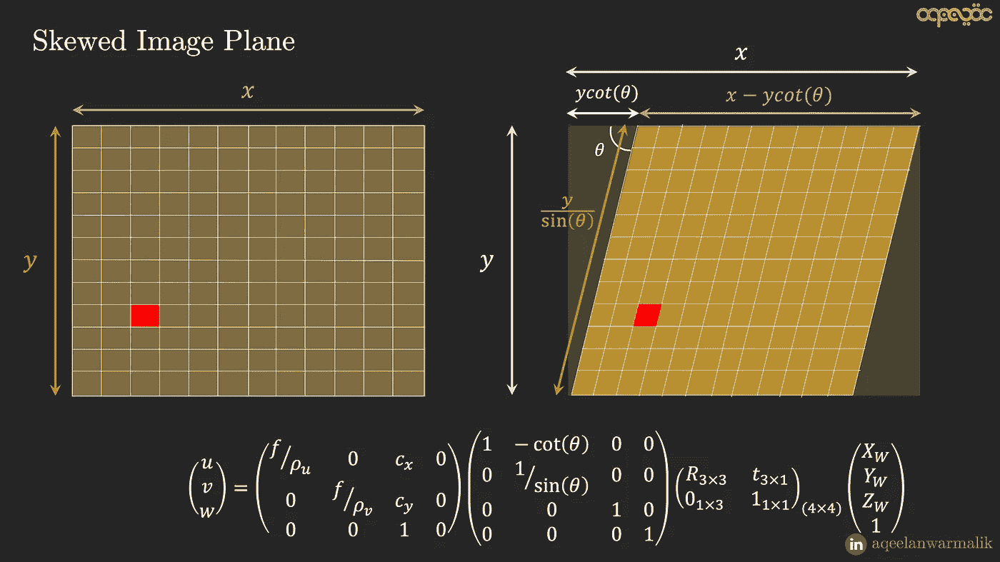

作者图片

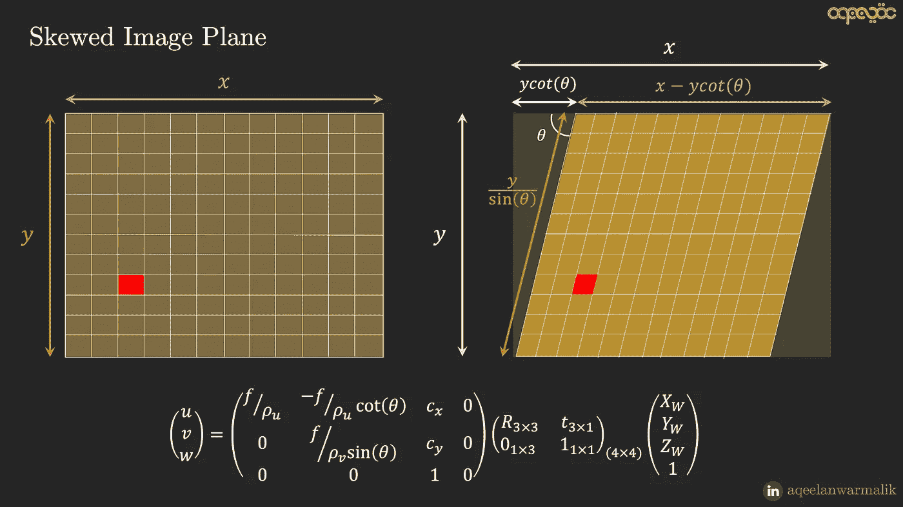

作者图片

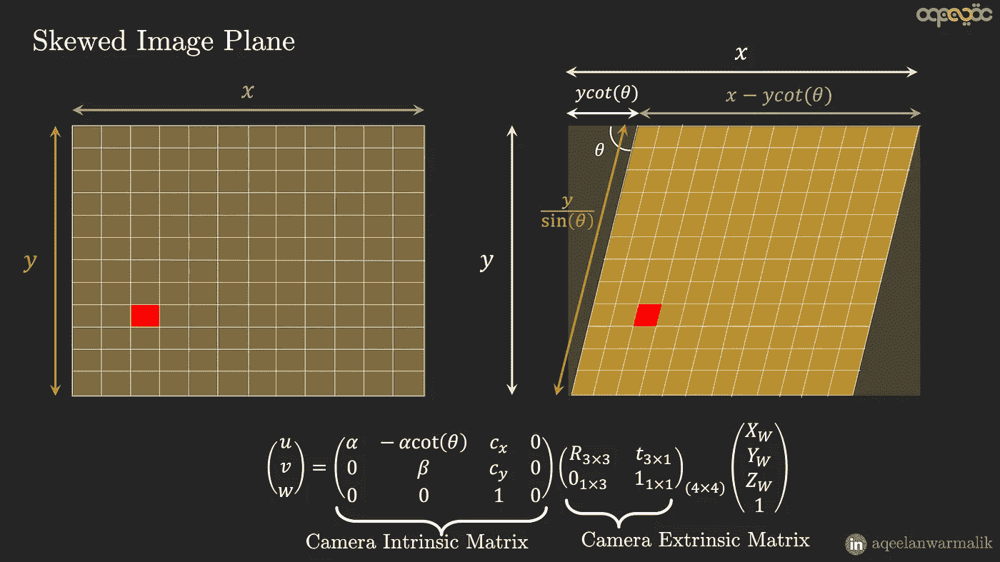

作者图片

# 总结:

## 转换:

1.  **世界到摄像机:** 3D-3D 投影。旋转、缩放、平移
2.  **相机转图像:**3D 2D 投影。信息丢失。取决于相机型号及其参数(针孔、f-theta 等)
3.  **图像到像素:** 2D-2D 投影。连续到离散。量子化和原点移位。

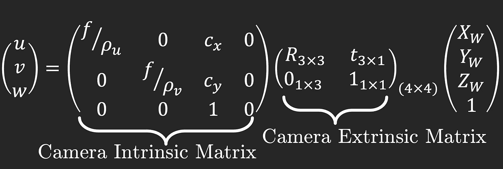

相机矩阵—作者提供的图片

## **摄像机外部矩阵(世界到摄像机):**

将点从世界坐标系转换到相机坐标系。取决于摄像机的位置和方向。

## **相机固有矩阵(相机到图像，图像到像素):**

将点从相机坐标系转换到像素坐标系。取决于相机属性(如焦距、像素尺寸、分辨率等。)