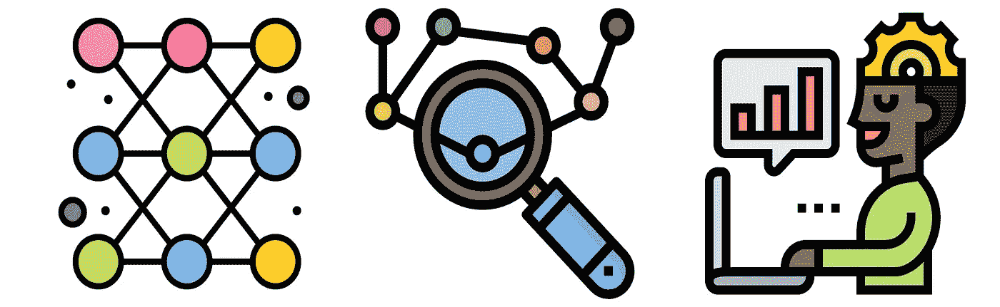
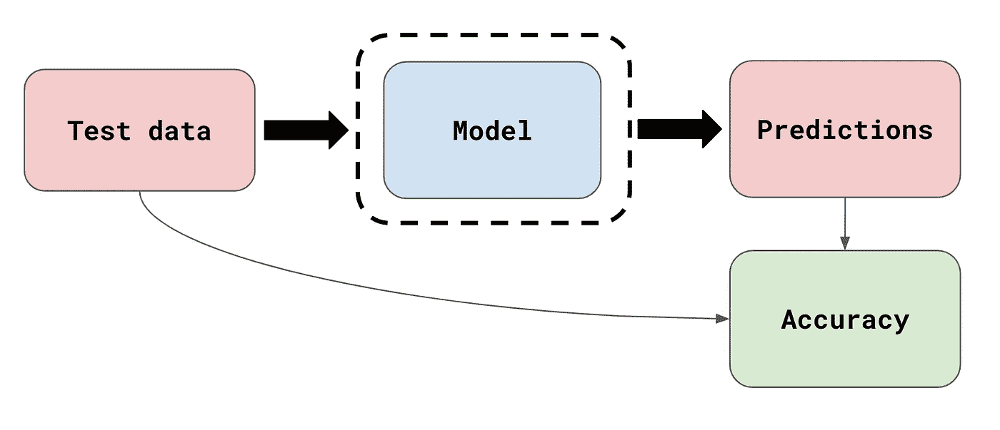
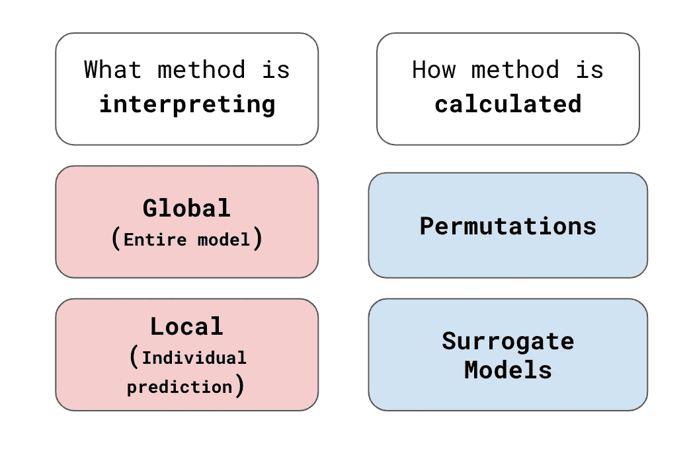
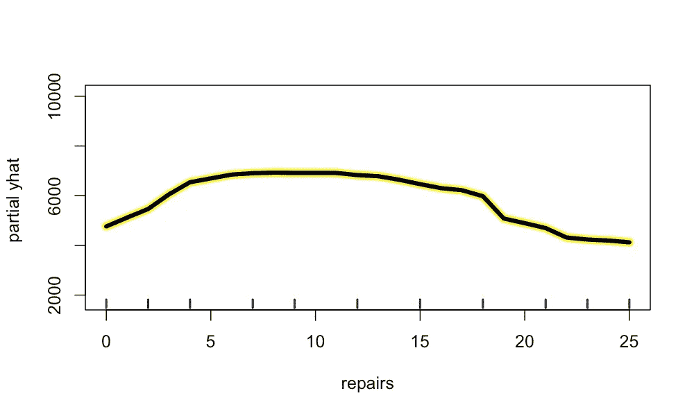
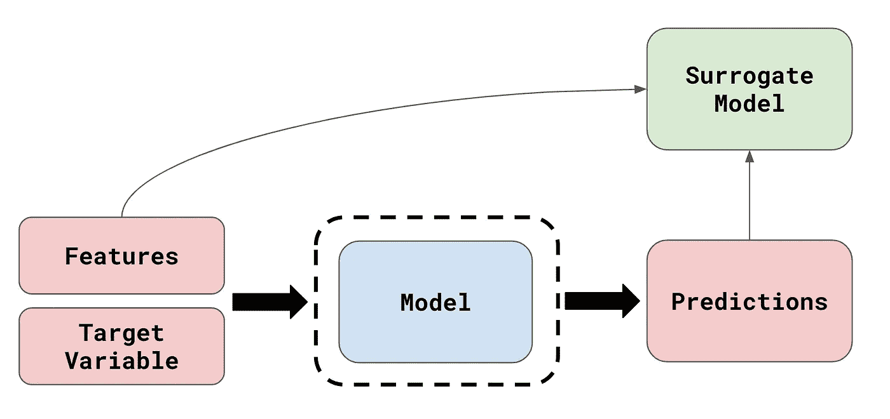
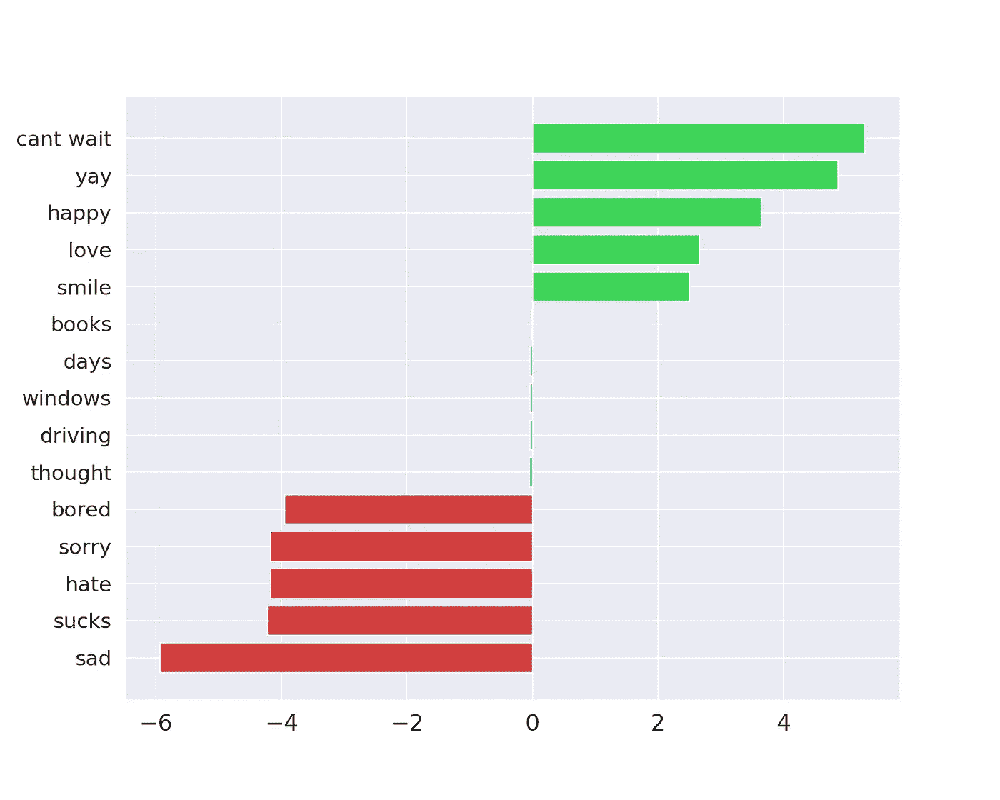

# 什么是模型不可知的方法？

> 原文：<https://towardsdatascience.com/what-are-model-agnostic-methods-387b0e8441ef>

## 所有强大的方法都可以用于任何模型

不可知论者思考上帝的存在。谢天谢地，机器学习还没有完全实现。当我们谈到不可知论方法时，我们指的是可以用于任何模型的方法。我们将详细阐述这个定义，重点是可解释性的不可知论方法。我们将讨论这些可解释性方法的不同分类。这是全球与地方的解释和置换与替代模型。一些方法不是模型不可知的。我们将通过讨论这些来结束。

来源: [flaticon](https://www.flaticon.com/free-icon/research_1284102)

# 模型不可知的方法

模型不可知的方法可以应用于任何模型。当使用模型不可知的方法时，在模型被训练之后，它可以被视为一个黑盒。换句话说，该方法不要求我们研究模型的内部工作。如果我们想在不同的模型上使用该方法，我们只需将它们交换出来。但是方法做什么呢？

首先，大多数 ***评估*** 度量是模型不可知的。以图 1 中的精度计算为例。我们首先使用模型对测试集进行预测。那么准确度就是预测正确的实际值的百分比。为了进行这种计算，我们只需将试验数据与预测值进行比较。有些模型可能比其他模型更精确，但计算结果是一样的。其他评估指标，如精确度、召回率和均方误差，都是与模型无关的。

图 1:精确度计算概述(来源:作者)

在选择模型时，模型不可知的评估方法提供了灵活性。您不必为每个模型类型开发不同的评估框架。这也允许您使用相同的指标来比较许多模型。当您想要比较模型性能时，这种一致性是非常重要的。

# 可解释的机器学习

在实践中，将 ***评估*** 度量称为模型不可知的并不常见。当我们谈论 ***可解释的 ML*** 或 ***可解释的 AI*** 方法时，这个术语最为突出。这些用于理解模型如何做出预测。我们将讨论这些方法的几个例子，以及如何对它们进行分类/分组。最后，我们将讨论一些方法在理论上是不可知论的，但在实践中并不总是如此。

*可解释 ML* 方法分类概述

## 全局方法与局部方法

我们对模型不可知方法进行分类的第一种方式是根据它们试图解释的内容。 ***局部*** 解读旨在理解个体预测是如何做出的。这就是每个模型特征改变预测的方式。我们可以使用 ***全局*** 解释来解释模型如何从整体上做出预测。这意味着我们只能对所有预测的趋势做出断言。

为了更好地理解这一点，我们在图 2 中举了一个部分依赖图(PDP)的例子。这是一种常见的 ***全局*** 可解释性方法。该图是为用于预测二手车价格的模型而创建的。在 x 轴上，我们有对汽车进行的 ***修理*** 的次数。y 轴(部分 yhat)给出平均预测价格。由此可见，汽车价格往往与维修次数成非线性关系。然而，我们不能对每辆车说同样的话。

图 2:PDP 的示例

我们不会详细介绍我们是如何创建这个 PDP 的。如果你感兴趣，下面的文章会很有用。它带你一步一步地了解情节是如何创建的。我们还讨论了其他全局模型不可知的方法。那就是互信息和特征重要性。

</finding-and-visualising-non-linear-relationships-4ecd63a43e7e>  

对于 ***局部*** 的诠释，SHAP 是一种常见的方法。在图 3 中，您可以看到单个预测的 SHAP 瀑布图。这是一个用来预测鲍鱼壳年轮数量的模型。这里我们将模型的预测值 f(x)与平均预测值 E[f(x)]进行比较。我们可以看到每个特征是如何影响预测的。例如， ***剥壳重量*** 的值使预测的环数增加了 1.81。

图 3:SHAP 瀑布图的例子

所以我们可以看到 SHAP 是如何被用来解释个人预测的。我们还可以聚合 SHAP 值，以了解模型如何从整体上进行预测。从这个意义上说，地方和全球解释之间的界限可能会模糊。你可以在图 4 的蜂群图中看到这样的例子。在这里，我们绘制了模型所做的所有预测的 SHAP 值。

图 4:使用蜂群图来聚集 SHAP 值

蜂群图只是我们聚集 SHAP 值的方法之一。下面的**视频**讨论了一些其他有用的聚合。我们将深入探讨如何解读这些图表。如果你想要更多，那就来看看我的 [**SHAP 课程**](https://adataodyssey.com/courses/shap-with-python/) **。**注册我的 [**简讯**](https://mailchi.mp/aa82a5ce1dc0/signup) :)即可免费获取

## 置换与替代模型

我们对解释方法进行分类的第二种方式是根据它们是如何计算的。 ***置换*** 方法涉及改变输入数据和测量模型预测的变化。这就是上面的 PDP 是如何创建的。对于每辆车，我们更改/置换了 ***维修*** 特征值，并记录了模型预测。然后我们取每个 ***修理*** 值的平均预测值。冰图、特征重要性和 SHAP 等其他方法都是排列方法。

另一种方法使用 ***代理模型*** ，您可以在图 5 中看到一个概述。在这里，模型首先被训练并用于进行预测。然后使用原始模型的预测来训练代理模型。也就是代替目标变量。重要的是，代理模型是一个内在可解释的模型。这些模型，如线性回归或决策树，不需要像 SHAP/PDP 这样的技术。它们可以通过直接查看模型的结构或参数来解释。

图 5:代理模型方法概述

最终，我们可以通过直接解释替代模型来理解原始模型的预测。如果我们对所有预测都这样做，它被称为 ***全局代理模型*** 。与其他全局方法一样，这些方法可以帮助我们从整体上理解原始模型。其他方法，比如 LIME，可以用来创建 ***局部代理模型*** 。这些组合排列和代理模型来训练模型对个人的预测。

## 原则与实践中的模型不可知

我们讨论的所有方法在理论上都是模型不可知的。为了实际使用它们，我们需要实现它们。一个实现不一定支持所有的建模包。例如，Friedman 的 h-statistic 是一种用于突出模型中重要交互的方法。在 Python 中，该方法没有与模型无关的实现。据我所知，scikit-learn 梯度增强模型只有一个[实现](https://pypi.org/project/sklearn-gbmi/)。

当谈到 SHAP 时，另一个考虑是有不同的方法来近似这些值。KernelSHAP 是一个真正的模型不可知的方法。但是，它明显比 TreeSHAP 慢。缺点是 TreeSHAP 只能和基于树的算法一起使用。这意味着如果你想节省时间，你需要限制自己使用这些算法。

有了 SHAP，也有可能扩展这种方法。也就是说，一个特征的贡献可以分解为它的主要和交互作用。这使我们能够分析数据中的相互作用。但是，这种实现只适用于基于树的算法。这是因为我们上面提到的计算成本。估计主效应和交互效应需要的时间太长了。

# 非不可知方法

不可知论方法的好处意味着它们是常见的。还有一些方法只能用于特定的模型。首先，我们在上面提到了固有的可解释模型。这些都可以直接解读。然而，它们的精确解释方式将取决于您使用的模型。

这方面的一个例子可以在下面的文章中找到。在这里，我们建立了一个模型来预测推文的情绪。这是使用单词袋方法和支持向量机(SVM)完成的。通过训练 SVM 的过程，训练集中的每个 N 元语法被赋予一个权重。我们通过查看这些权重来解释 SVM，从而结束本文。

</introduction-to-sentiment-analysis-f623f7d40bfa>  

您可以在图 6 中看到这些权重的一些示例。具有正权重的 n-gram 与积极情绪相关联。换句话说，如果一条推文包含这些词中的一个，我们更有可能预测到积极的情绪。同样，那些负权重的人与消极情绪有关。也有单词没有关联情感的情况。

图 6:情绪分析模型的 SVM 参数权重

以这种方式解释 SVM 是一种非不可知论的方法。我们将无法解释像决策树或随机森林这样的模型。这是因为它们没有参数权重。同样，它也不适用于神经网络。这些模型可能有参数权重，但它们太复杂，无法以这种方式可视化。

非不可知论的方法也已经被开发用于不可内在解释的模型。由于深度学习的成功，这对于神经网络来说是最常见的。一些方法包括逐像素分解和[深度提升](https://github.com/kundajelab/deeplift)。最终，这些方法只能用于神经网络。在某些情况下，它们只能用于特定的神经网络架构。

我希望这篇文章对你有帮助！你可以成为我的 [**推荐会员**](https://conorosullyds.medium.com/membership) **来支持我。你可以访问 Medium 上的所有文章，我可以得到你的部分费用。**

<https://conorosullyds.medium.com/membership>  

你可以在|[Twitter](https://twitter.com/conorosullyDS)|[YouTube](https://www.youtube.com/channel/UChsoWqJbEjBwrn00Zvghi4w)|[时事通讯](https://mailchi.mp/aa82a5ce1dc0/signup)上找到我——注册免费参加 [Python SHAP 课程](https://adataodyssey.com/courses/shap-with-python/)

## 图像来源

所有图片都是我自己的或从[www.flaticon.com](http://www.flaticon.com/)获得。在后者的情况下，我拥有他们的[保费计划](https://support.flaticon.com/hc/en-us/articles/202798201-What-are-Flaticon-Premium-licenses-)中定义的“完全许可”。

## 参考

M.T. Ribeiro，S. Singh 和 C. Guestrin，*机器学习的模型不可知可解释性【https://arxiv.org/abs/1606.05386*(2016)

C.Molnar，*可解释机器学习*(2021)[https://christophm . github . io/Interpretable-ml-book/shap . html](https://christophm.github.io/interpretable-ml-book/shap.html)

[亨尼·德·哈德](https://medium.com/u/fb96be98b7b9?source=post_page-----387b0e8441ef--------------------------------) *解释任何机器学习模型的模型不可知方法*(2020)*[https://towardsdatascience . com/Model-Agnostic-Methods-for-Interpreting-any-Machine-Learning-Model-4f 10787 ef 504](/model-agnostic-methods-for-interpreting-any-machine-learning-model-4f10787ef504)*