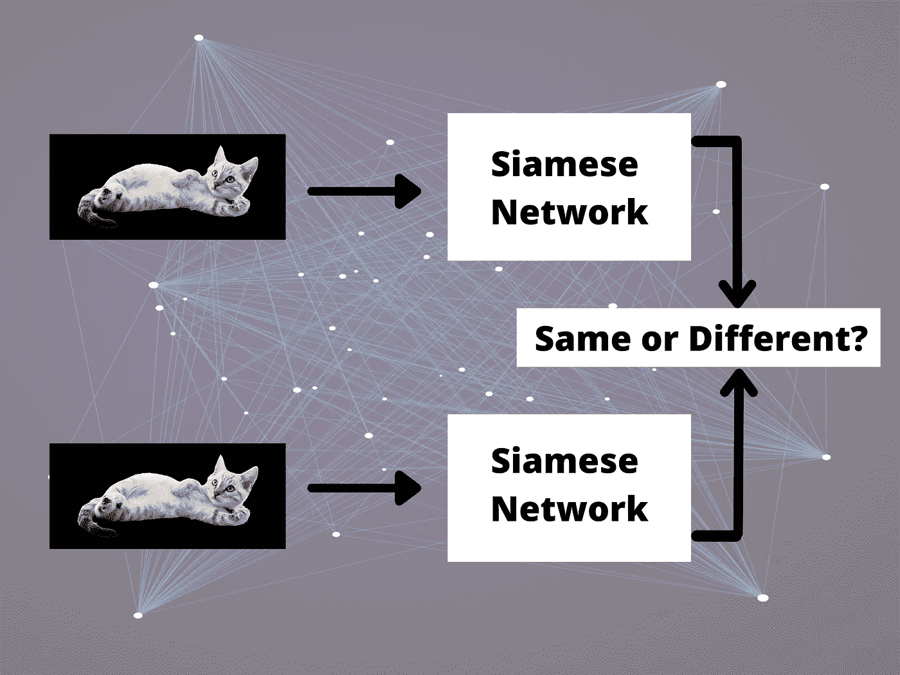
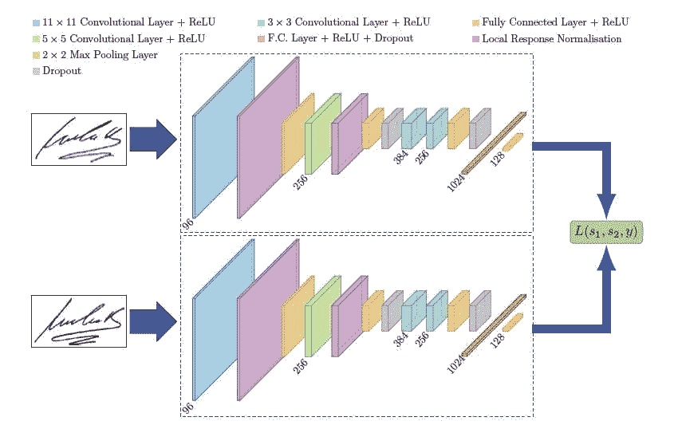
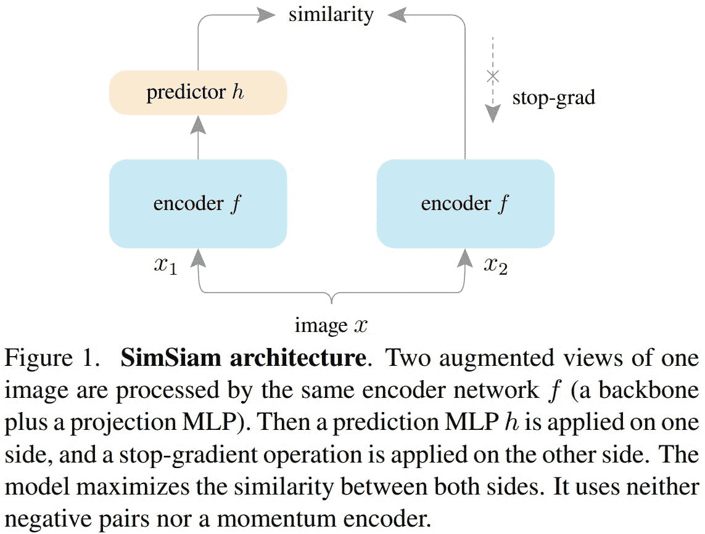

# 深度学习中的连体神经网络有哪些？

> 原文：<https://towardsdatascience.com/what-are-siamese-neural-networks-in-deep-learning-bb092f749dcb>

## 你确定你需要图像分类而不是连体网络吗？

作者制作的图像

# 连体神经网络

了解两个数据点之间的相似性非常有用。

想象一个面部识别系统，其中有一个摄像头捕捉你的面部，然后面部识别系统应该根据面部数据库来识别你是否被允许进入建筑物。

试图使用纯分类来构建这样一个系统是不可行的。

你可以使用的是连体神经网络或简称 SNNs。

连体神经网络由两个相同的子网组成，输出两个嵌入。这些嵌入然后被用作损失函数的输入。

该损失函数被设计为最小化相似输入之间的距离(属于同一个人的两个面部的两个图像)和最大化不相似输入之间的距离(两个不同人的两个面部)。

下面是一个 SNN 建筑的例子。

来自图章纸的连体建筑[2]

# 连体神经网络变得不可或缺

这种类型的架构哪里可以很厉害？为什么在某些情况下你更喜欢它而不是分类？

为了理解这一点，想象以下场景:您想要构建一个人脸识别系统。你有一些限制:

1.  你的数据库里每个人的面部只有大约 10 张照片。
2.  你没有不属于你数据库的人的面孔。

> 你的系统应该能够根据一个人的脸是否是你的数据库的一部分来告诉你他/她何时被允许进入大楼。

使用纯分类建立这样一个系统是不可能的。仅仅是因为你无法接触到世界上所有的面孔！

另一方面，如果你使用 SNN，你的系统不需要学习一张脸的样子，而是两张脸有什么不同。

这解决了我上面提到的两个约束。

# SimSiam:一种暹罗神经网络架构

连体神经网络有如此多的应用。

到目前为止，我只关注人脸识别，因为它是一个非常相关的应用程序。

但是，连体网络非常有用的另一个领域是自我监督学习(SSL)。

在 SSL 中，暹罗网络可以学习一些强大的表示，您可以稍后将其转移到另一个计算机视觉任务，如对象检测或图像分割。

**SimSiam** 是一种神经网络架构，使用暹罗网络来学习数据点之间的相似性。

为了学习这些表示法，你基本上要做的是拿一张图像，随机放大得到两个视图，然后通过主干网络传递这两个视图。

前一步骤的 2 个输出通过 MLP(多层感知器)传递。这是一种投影操作。

然后，我们使用主干的输出以及 MLP 的输出来计算余弦相似度。

它看起来像下面的图像。

目标是让网络学会最大化同一图像的两个视图之间的相似性。

这种方法的代码实现可以在 [**这里**](https://github.com/facebookresearch/simsiam) 找到。

图片来自原始纸张[1]

# 
回答您的问题

图片来自 pexels

你们中的许多人(通过 [**电子邮件**](https://app.convertkit.com/campaigns/7928871/n.mokhtari@aifee.co) 、在 [**LinkedIn**](https://www.linkedin.com/in/nour-islam-mokhtari-07b521a5/) 或在 [**Twitter**](https://twitter.com/NourIslamMo) )联系过我，问了我一些有趣的问题，所以我认为与大家分享那些问题会很棒！

***问题*** :有没有详细了解 SNN 的教程:理论和 Python 实现都有？

***我的回答*** :我不知道现在有什么好的教程，但是你可以在这里 找到一个开源的实现 [**。**](https://github.com/facebookresearch/simsiam)

*****我的回答*** :很难说哪种方法更适合克服你的过度拟合。但是你可以尝试两件事:**

*   **添加辍学层。**
*   **做数据扩充。**

# **参考**

**【1】*探究简单连体表象学习*。陈，何**

**[2]“*图章:用于书写者独立离线签名验证的卷积暹罗网络*”。Sounak Dey，Anjan Dutta，J. Ignacio Toledo，苏曼 K. Ghosh，Josep Llados，Umapada Pal**

# **关于作者**

**我是一名机器学习工程师，致力于解决具有挑战性的计算机视觉问题。加入我的 [**时事通讯**](https://nourislam.ck.page/dc3e8b7e12) **，让这样的文章直接进入你的收件箱。****