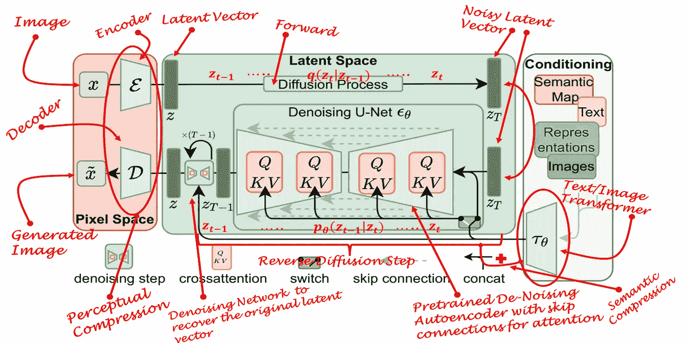
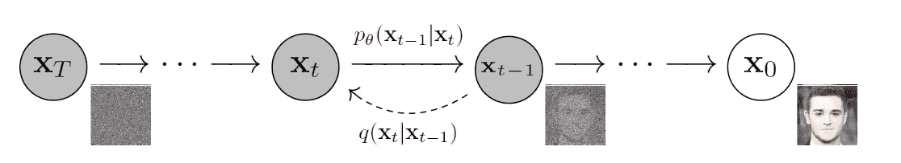
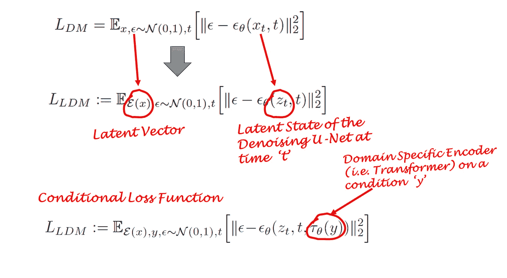
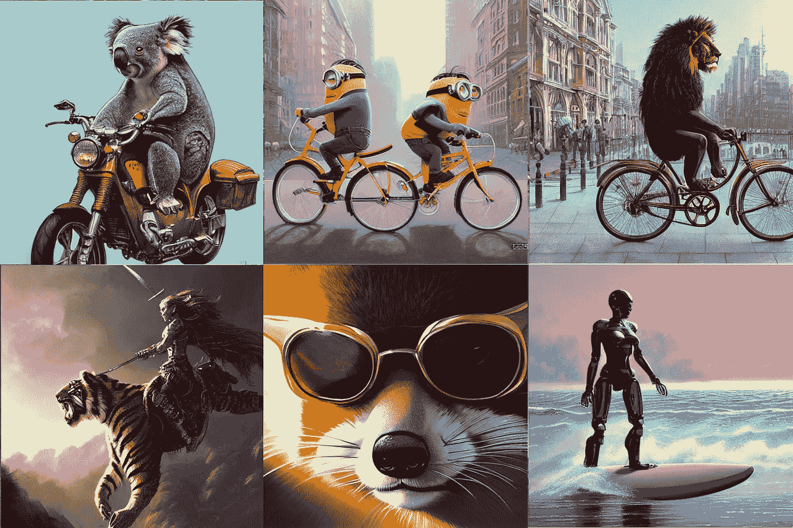
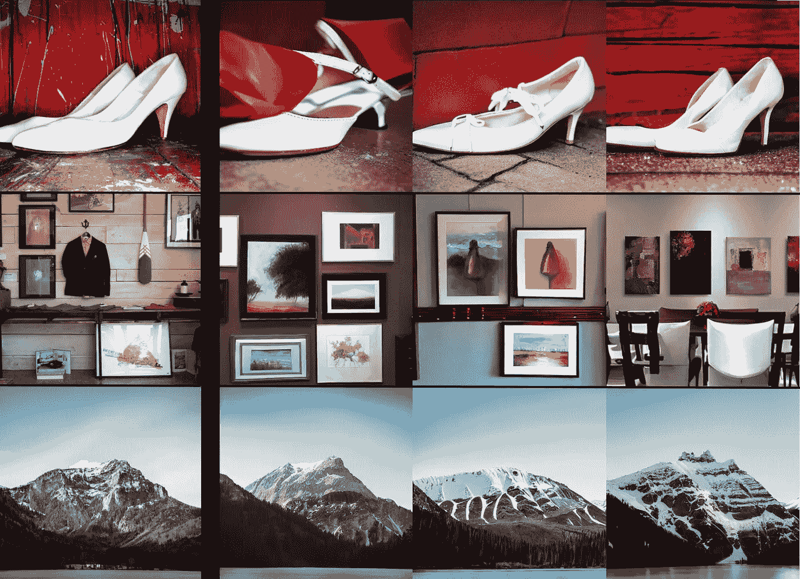
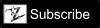

# 什么是稳定扩散模型，为什么它们是图像生成的一个进步？

> 原文：<https://towardsdatascience.com/what-are-stable-diffusion-models-and-why-are-they-a-step-forward-for-image-generation-aa1182801d46>

## **潜在扩散模型简易指南**

图 1:潜在扩散模型(基础图:[3]，概念图覆盖:作者)

在本文中，您将了解图像生成领域的最新进展。更具体地说，你将了解*潜在扩散模型(LDM)* 及其应用。这篇文章将建立在*甘斯*、*扩散模型*和*变形金刚*的概念之上。所以，如果你想更深入地挖掘这些概念，请随时查看我以前关于这些主题的帖子。

也许过去十年在计算机视觉和机器学习方面的突破是 GANs(生成对抗网络)的发明——一种引入了超越数据中已有内容的可能性的方法，这是一个全新领域的垫脚石，现在称为生成建模。然而，在经历了一个蓬勃发展的阶段后，GANs 开始面临一个平台期，其中大多数方法都在努力解决一些对抗性方法所面临的瓶颈。这不是个别方法的问题，而是问题本身的对抗性。全球农业网络的一些主要瓶颈是:

*   图像生成缺乏多样性
*   模式崩溃
*   问题学习多模态分布
*   高训练时间
*   由于问题公式化的对抗性，不容易训练

存在另一系列基于可能性的方法(例如，马尔可夫随机场),其已经存在了相当一段时间，但是由于对于每个问题来说实现和公式化是复杂的，所以未能获得重大影响。其中一种方法是“*扩散模型*”——这种方法从气体扩散的物理过程中获得灵感，并试图对多个科学领域中的相同现象进行建模。然而，在图像生成领域，它们的使用最近变得很明显。主要是因为我们现在有更多的计算能力来测试复杂的算法，否则在过去是不可行的。

标准的*扩散模型*有两个主要的过程域:*正向扩散*和*反向扩散*。在前向扩散阶段，通过逐渐引入噪声直到图像变成完全随机噪声，图像被破坏。在相反的过程中，一系列马尔可夫链*用于通过在每个时间步长逐渐去除预测的噪声来从高斯噪声中恢复数据。*

图 2:典型的扩散模型过程(来源:[1])

*扩散模型*最近在图像生成任务中表现出了显著的性能，并在图像合成等几项任务中取代了 GANs 的性能。这些模型还能够产生更多样的图像，并被证明不会遭受模式崩溃。这是由于*扩散模型*能够保持数据的语义结构。然而，这些模型对计算要求很高，训练需要非常大的内存和碳足迹，这使得大多数研究人员甚至不可能尝试这种方法。这是因为所有的马尔可夫状态都需要在内存中进行预测，这意味着大型深网的多个实例一直存在于内存中。此外，这种方法的训练时间也变得太长(例如，几天到几个月)，因为这些模型往往会陷入图像数据中细微的*难以察觉的*错综复杂中。然而，需要注意的是，这种细粒度的图像生成也是*扩散模型*的主要优势之一，因此，使用它们是一种悖论。

另一个非常著名的来自 NLP 领域的方法系列是 *Transformers* 。他们在语言建模和构建对话式人工智能工具方面非常成功。在视觉应用中，*变形金刚*已经显示出泛化和自适应的优势，这使得它们适合于通用学习。它们比其他技术更好地捕捉文本甚至图像中的语义结构。然而，与其他方法相比，*变形金刚*需要大量的数据，并且在许多视觉领域面临着性能停滞。

**潜在扩散模型**

图 3:潜在扩散模型(基础图:[3]，概念图覆盖:作者)

最近提出的一种方法，通过将 GANs 的感知能力、*扩散模型*的细节保留能力和变形金刚的语义能力三者融合在一起，充分利用了这三者。这种技术被作者称为'*潜在扩散模型* ' *(LDM)* 。事实证明，LDM 比前面提到的所有模型都更加健壮和高效。与其他方法相比，它们不仅内存效率高，而且可以生成各种各样的、非常详细的图像，这些图像保留了数据的语义结构。简而言之， *LDM* 是扩散过程在潜在空间而不是像素空间中的应用，同时结合了来自*变换器*的语义反馈。

任何生成学习方法都有两个主要阶段:感知压缩和语义压缩。

**感知压缩**

在感知压缩学习阶段，学习方法必须通过去除高频细节将数据封装成抽象表示。这一步对于构建环境的不变且健壮的表示是必要的。 *GANs* 擅长提供这样的感知压缩。他们通过将像素空间的高维冗余数据投影到一个叫做潜在空间的超空间来实现这一点。潜在空间中的潜在向量是原始像素图像的压缩形式，可以有效地用于代替原始图像。

更具体地说，自动编码器(AE)结构是捕获感知压缩的结构。AE 中的编码器将高维数据投影到潜在空间，解码器从潜在空间恢复图像。

**语义压缩**

在学习的第二阶段，图像生成方法必须能够捕获数据中存在的语义结构。这种概念和语义结构保存了图像中各种对象的上下文和相互关系。*变形金刚*擅长捕捉文字和图像中的语义结构。*变形器的*概括能力和*扩散模型的细节保持能力的组合*提供了两个世界的最佳，并给出了一种生成细粒度高度细节图像同时保持图像中语义结构的方法能力。

**知觉丧失**

LDM 中的自动编码器通过将数据投射到潜在空间来捕捉数据的感知结构。作者使用特殊损失函数来训练这种自动编码器，称为，'*感知损失*'[4–5]。该损失函数确保重建被限制在图像流形内，并降低了模糊度，否则当使用像素空间损失(例如，L1/L2 损失)时会出现模糊度。

**扩散损失**

扩散模型通过逐渐去除正态分布变量中的噪声来学习数据分布。换句话说，DMs 采用长度为 *T* 的反向*马尔可夫链*。这也意味着 DMs 可以建模为一系列时间步长的' *T'* 去噪自动编码器 *t* *=1，…，T.* 这由以下等式中的εθ表示。注意，损失函数取决于潜在向量，而不是像素空间。

图 4:潜在扩散模型损失函数解释(来源:作者)

**条件扩散**

扩散模型是依赖于先验的条件模型。在图像生成任务的情况下，先验通常是文本、图像或语义图。为了获得该条件的潜在表示，使用了将文本/图像嵌入潜在向量“τ”中的变换器(例如剪辑)。因此，最终的损失函数不仅取决于原始图像的潜在空间，还取决于条件的潜在嵌入。

**注意机制**

LDM 的主干是一个 U-Net 自动编码器，具有提供交叉注意机制的稀疏连接[6]。一个*变换器*网络将条件文本/图像编码成一个潜在嵌入，该潜在嵌入又通过一个交叉注意层映射到 U-Net 的中间层。这个交叉注意力层实现了注意力( **Q，k，v**)= soft max(**qk**t/✔**d**)**v**。而 **Q，K** 和 **V** 是可学习的投影矩阵【6】。

**文本到图像合成**

我们使用 python 中最新的官方实现 *LDM* v4 来生成图像。在文本到图像合成中， *LDM* 使用预训练的*剪辑*模型【7】，为文本和图像等多种形式提供通用的基于转换器的嵌入。然后，变压器模型的输出被输入到 *LDM* 的 python API，名为“*扩散器”*。也可以调整一些参数(例如，扩散级数、种子、图像尺寸等。).

图 5:使用文本输入的 LDM 生成的图像(来源:作者)

**图像到图像的合成**

相同的设置对于图像到图像的合成也是有效的，但是，需要输入样本图像作为参考图像。生成的图像在语义和视觉上与作为参考给出的图像相似。这个过程在概念上类似于基于风格的 GAN 模型，但是，它在保留图像的语义结构方面做得更好。

图 6:图 5:使用图像+文本输入的 LDM 生成的图像(来源:作者)

**结论**

我们已经涵盖了图像生成领域的一个非常新的发展，称为潜在扩散模型。LDM 在生成细节丰富的不同背景的高分辨率图像方面是健壮的，同时它们还保留了图像的语义结构。因此，LDM 在图像生成和深度学习方面都向前迈进了一步。如果您仍然对“**稳定**扩散模型”感到疑惑，那么它只是 LDMs 的一个更名，应用于高分辨率图像，同时使用*剪辑*作为文本编码器。

如果您想亲自尝试这种方法，您可以使用以下链接中简单易用的笔记本:

**代码:**

**订阅更新内容:**

**成为帕特里翁的支持者:**

**参考文献:**

[1] Jonathan Ho，Ajay Jain，Pieter Abbeel，“去噪扩散概率模型[”，2020](https://arxiv.org/abs/2006.11239)

[2]亚历克·拉德福德、琼·金旭、克里斯·哈拉西、阿迪蒂亚·拉梅什、加布里埃尔·戈、桑迪尼·阿加瓦尔、吉里什·萨斯特里、阿曼达·阿斯克尔、帕梅拉·米什金、杰克·克拉克、格雷琴·克鲁格、伊利亚·苏茨基弗，“[从自然语言监督中学习可转移的视觉模型](https://arxiv.org/abs/2103.00020)”，2021

[3]罗宾·龙巴赫和安德里亚斯·布拉特曼和张秀坤·洛伦茨和帕特里克·埃塞和比约恩·奥姆，《利用潜在扩散模型的高分辨率图像合成[》，arXiv:2112.10752，2021，](https://arxiv.org/abs/2112.10752)

[4]，[菲利普·伊索拉](https://arxiv.org/search/cs?searchtype=author&query=Isola%2C+P)，[阿列克谢·阿·埃夫罗斯](https://arxiv.org/search/cs?searchtype=author&query=Efros%2C+A+A)，[埃利·谢赫曼](https://arxiv.org/search/cs?searchtype=author&query=Shechtman%2C+E)，[奥利弗·王](https://arxiv.org/search/cs?searchtype=author&query=Wang%2C+O)，[作为知觉度量的深度特征的不合理有效性](https://arxiv.org/abs/1801.03924)，2018

[5] Patrick Esser、Robin Rombach、bjrn Ommer，“驯服变形金刚，实现高分辨率图像合成”T27，CVPR，2020 年

[6]阿希什·瓦斯瓦尼、诺姆·沙泽尔、尼基·帕尔马、雅各布·乌兹科雷特、利永·琼斯、艾丹·戈麦斯、卢卡斯·凯泽、伊利亚·波洛舒欣，“[注意力是你所需要的全部](https://arxiv.org/abs/1706.03762)”，2017 年

[7]亚历克·拉德福德、琼·金旭、克里斯·哈拉西、阿迪蒂亚·拉梅什、加布里埃尔·戈、桑迪尼·阿加瓦尔、吉里什·萨斯特里、阿曼达·阿斯克尔、帕梅拉·米什金、杰克·克拉克、格雷琴·克鲁格、伊利亚·苏茨基弗，“[从自然语言监督中学习可转移视觉模型](https://arxiv.org/abs/2103.00020)”，2021

8 布拉特曼等人。艾尔。，潜在扩散模型，【https://github.com/CompVis/latent-diffusion】T2，2022