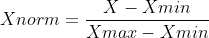

# 机器学习和数据科学中最重要的预处理步骤是什么？

> 原文：<https://towardsdatascience.com/what-are-the-most-important-preprocessing-steps-in-machine-learning-and-data-science-a7606d18f32a>

**数据科学**和**机器学习**现在已经成为最新的话题，公司正在寻找**数据科学家**和**机器学习工程师**来处理他们的数据，并为他们做出重大贡献。每当数据被提供给数据科学家时，他们必须采取正确的步骤来处理这些数据，并确保转换后的数据可以用于最佳地训练各种机器学习模型，同时确保最大的效率。


Tobias Fischer 在 [Unsplash](https://unsplash.com?utm_source=medium&utm_medium=referral) 上拍摄的照片

人们经常发现，现实世界中存在的数据常常是**不完整的**和**不准确的**，同时包含许多一些机器学习模型无法处理的异常值，从而导致次优的训练性能。同样重要的是要注意，在将数据提供给机器学习模型之前，必须处理数据中可能存在的重复行或列。解决这些问题以及许多其他问题可能是至关重要的，尤其是当想要提高模型性能和模型的概化能力时。此外，在分类任务的情况下，在感兴趣的输出类别中可能存在类别不平衡。因此，通过创建合成数据点来平衡类也是一个好方法，还有我们将在本文中讨论的其他方法。

采取正确的数据处理步骤可能是一项挑战，尤其是在这一过程可能以多种方式发生的情况下。了解数据处理步骤的适当用法可以帮助数据科学家更好地分析数据，并对数据有一个很好的理解。此外，由于他们的机器学习预测，他们可以帮助公司朝着正确的方向发展。


布雷特·乔丹在 [Unsplash](https://unsplash.com?utm_source=medium&utm_medium=referral) 上拍摄的照片

现在，让我们回顾一下预处理数据的所有各种可能的方法，并确保提供给模型的数据是完整的、准确的，并且包含最少的异常值。

## 缺少值

在现实世界中，通常不可能找到完整且没有缺失值或 **NaN** 值的数据。因此，我们可以删除包含这些缺失值的行，或者进行插补(填充缺失值)以确保 ML 模型处理这些数据。


由 [Pierre Bamin](https://unsplash.com/@bamin?utm_source=medium&utm_medium=referral) 在 [Unsplash](https://unsplash.com?utm_source=medium&utm_medium=referral) 上拍摄的照片

## 1.删除缺失值

现在是处理数据中缺失值的时候了。处理数据中缺失值的一种方法是删除那些行，如前所述。假设我们使用的是 **python** ，这是许多数据科学家在机器学习应用程序中使用的默认语言，让我们看看可以实现这一点的代码。

```
# Assuming that data is stored in 'df' variable which is mostly used by default. df.isnull()
# This returns a boolean matrix that contains True if there is presence of missing values (NaN) and False otherwise
```

让我们还考虑我们的数据中存在缺失值(这在大多数真实世界的数据集中是真实的)，我们可以删除包含这些值的行，尽管不建议这样做。但是，让我们看看这是如何实现的，以便更好地了解删除缺失值的行(nan)的情况。

```
df.dropna()
# This removes the rows that contains missing values in the dataframe that is stored as 'df' variable
```

## 2.归罪

它是用各种插补策略，如**均值**、**中位数**和**模式**插补，来替代缺失值的过程。然而，也可以通过基于领域知识给数据赋值来随机进行插补。

同样重要的是要注意，插补也可以基于机器学习预测从已经不包含缺失值的所有剩余特征中执行。通过这种方式，模型学习查找模式，并分别对特征中的未知值进行预测。

下面是一个函数，可用于通过平均值、中间值或众数插补来估算值。请随意看一看。

```
**def** mean_imputation(data, inplace **=** **False**):
    """
    This function would take the NULL values present in data and replace them with average values of the data respectively.
    """
    data**.**fillna(data**.**mean(), inplace **=** inplace)

**def** median_imputation(data, inplace **=** **False**):
    """
    This function would take the NULL values present in data and replace them with median values in our data respectively.
    """
    data**.**fillna(data**.**median(), inplace **=** inplace)

**def** mode_imputation(data, inplace **=** **False**):
    """
    This function would take the NULL values present in data and replace them with mode values of the given data respectively.
    """
    data**.**fillna(data**.**mode(), inplace **=** inplace)
```

**来源:**[Predicting-Loan-Default-Using-Machine-Learning/Home Credit Python prediction . ipynb at main suhasmaddali/Predicting-Loan-Default-Using-Machine-Learning(github.com)](https://github.com/suhasmaddali/Predicting-Loan-Default-Using-Machine-Learning/blob/main/Home%20Credit%20Python%20Prediction.ipynb)

代码实际上是从我在 GitHub 上的一个仓库中获取的。你也可以在 **GitHub** 上关注我，获取我在平台上不断分享的最新项目和见解。

[苏哈斯·马达利(苏哈斯·马达利)(github.com)](https://github.com/suhasmaddali)

正如我们之前所讨论的，还可以基于机器学习预测执行插补，这可以产生更稳健的模型和更准确的缺失值插补。

## 极端值

数据集通常包含离群值或数据点，它们的值与我们的数据中实际预期的值相差甚远。这可能是由于记录数值时的人为错误或记录特征的机器故障。当我们试图评估机器学习的指标，其中一些是**均方误差**时，数据中异常值的存在可能会显著增加误差。但是这并没有给我们模型性能的最准确的描述。


照片由[威尔·迈尔斯](https://unsplash.com/@will_myers?utm_source=medium&utm_medium=referral)在 [Unsplash](https://unsplash.com?utm_source=medium&utm_medium=referral) 上拍摄

此外，有许多机器学习模型对数据中的异常值并不稳健。因此，必须采取措施在数据处理阶段将其移除，以便在使用均方差等指标时，我们能够获得模型的真实表示，同时确保模型能够生成最佳预测，而不会出现异常值。

## 转换数据


照片由[雅各布·欧文斯](https://unsplash.com/@jakobowens1?utm_source=medium&utm_medium=referral)在 [Unsplash](https://unsplash.com?utm_source=medium&utm_medium=referral)

在填充缺失值并移除异常值后，下一步将是转换这些数据，以便在机器学习模型上进行训练变得可行。根据数据类型和业务需求，有许多方法可以转换数据。

## **1。维度缩减**

拥有高维数据(更高数量的特征)的一个挫折是有一种现象叫做**“维数灾难”**，增加的特征具有递减的回报。因此，移除那些对模型预测和输出没有显著影响的要素非常重要。降低维度有两个作用:它减少了机器学习模型对数据进行训练的时间，有时还可以从数据中删除离群值。因此，我们应该进行降维，以确保在训练后得到一个更健壮的模型。

有多种方法可以将高维数据简化为低维表示。可以使用的降维技术有**主成分分析(PCA)** 、**随机邻域嵌入(t-SNE)** 和 **UMAPs** 等。请注意，这些方法中的每一种在引擎盖下都有不同的工作方式，但最终的结果都是减少尺寸。

## 2.标准化

这也是一个很好的做法，在将数据提供给机器学习模型之前，**标准化**数据，并确保所有的输入特征都在相同的尺度上。考虑两个特征的例子:身高和体重。让我们考虑我们将要用 ML 算法预测的输出变量是**“户外活动”**。我们知道，身高可以用厘米(cm)来度量，而体重可以用公斤(kg)来度量。我们通常不能比较这两个特征，因为它们不在同一尺度上。但是，如果我们要转换这些特征，使它们代表相同的尺度，这确保了我们可以比较它们，并决定哪个特征对确定一个人的“户外活动”最有影响。

下面是如何在 Python 中实现标准化的代码片段。

```
# Using the StandardScaler() from Sklearn library
# Divided the data into X_train and X_cvscaler **=** StandardScaler()
scaler**.**fit(X_train)
X_train_standardized **=** scaler**.**transform(X_train)
X_cv_standardized **=** scaler**.**transform(X_cv)
```

**来源:**[Predicting-Loan-Default-Using-Machine-Learning/Home Credit Python prediction . ipynb at main suhasmaddali/Predicting-Loan-Default-Using-Machine-Learning(github.com)](https://github.com/suhasmaddali/Predicting-Loan-Default-Using-Machine-Learning/blob/main/Home%20Credit%20Python%20Prediction.ipynb)

## 3.正常化

正如我们在上述案例中所看到的，以不同尺度呈现的数据可能会有问题。还有一个备选策略来处理以不同比例呈现的数据。一种方法是**归一化**数据，这意味着我们从特定特征的最小值中减去当前值，并将结果除以感兴趣特征的最大值和最小值之间的差。这也是转换数据的有效方法。下面是如何得到一个好主意的等式。



作者图片

基于该等式，让我们理解给出的当前值。

Xmin =特征中存在的最小值

Xmax =特征中存在的最大值

Xnorm =作为执行此操作的结果而获得的归一化值。

## 4.扔掉

重要的是解决数据中存在的影响机器学习模型性能的异常值。减少这些异常值影响的方法之一是根据一个重要特征将数据点划分到不同的箱中。换句话说，它是将广泛的数据集分类成更相似的数据的更小的组。这确保了数据中的异常值对预测的总体影响最小。因此，这也是一种有效的数据转换方式。

## 5.使聚集

每当我们处理输出或目标变量未知的无监督机器学习时，处理这些数据的一种流行方法是**聚类**。虽然聚类可以用于无监督的机器学习，但它也可以用于有监督的机器学习。如果我们要根据某个特定的特征对数据进行聚类，我们可以将已经考虑过的数据分组。这种方法还可以转换数据，我们可以更好地从中发现模式。

## 处理不平衡数据

在机器学习中的大多数时候，在输出中出现事件的可能性很小的地方存在数据。考虑诸如银行业的**欺诈检测**、营销的**实时竞价**、**贷款违约**或**入侵检测**之类的例子，其中事件中正面案例的发生与结果相反的可能性相比是有限的。在这种情况下，重要的是处理输出类的这种数据不平衡，以便与其他组相比，没有必要偏向某一组。


Elena Mozhvilo 在 [Unsplash](https://unsplash.com?utm_source=medium&utm_medium=referral) 上拍摄的照片

有各种算法、策略或技术通常用于处理不平衡数据。让我们看看处理这种不平衡数据的各种方法。

## 1.欠采样

其工作原理是通过移除多数类中的数据点来减小数据的总体大小，使得多数类和少数类中的数据点总数相同。在这个过程中可以使用各种算法。让我们回顾一下处理这些数据的一些方法。

## 1a。接近欠采样

该方法的工作原理是考虑多数类和少数类之间的距离，并根据与少数类的最近距离对点进行采样。因此，根据少数群体的规模，我们用于模型预测的数据会有所减少。有各种不同类型的未遂事件算法。它们可以是 **NearMiss-1** 、 **NearMiss-2** 和 **NearMiss-3** 中的任一个，每个在做出考虑特定示例的决定之前以不同的方式考虑点数，等等。有关这种技术的更多信息，请随意参考下面的文章，这篇文章详细介绍了这种技术以及许多其他技术。

[不平衡分类的欠采样算法(machinelearningmastery.com)](https://machinelearningmastery.com/undersampling-algorithms-for-imbalanced-classification/)

## 1b。压缩最近邻规则欠采样

这是一种技术，当数据中的训练点数减少时，模型性能不会降低。开发这种技术主要是因为使用**K-最近邻(KNNs)** 所带来的内存限制。因此，减少了数据点的总数，从而在使用 KNN 算法进行预测之前需要更少的内存。在我们的案例中，使用这种方法时考虑了少数类和多数类示例，并对它们进行了测试，以了解省略多数类中的点如何导致模型性能的最小降低。

## 1c。欠采样的 Tomek 链接

这是一种有用的方法，是对上述压缩最近邻方法的修改。它主要计算多数类和少数类之间的**欧几里德距离**，并找到包含我们考虑的两个类之间最小欧几里德距离的那些 **tomek 对**。因此，我们只得到那些在多数类和少数类样本之间具有最低欧几里德距离的样本对。有关这种方法的更多信息，请随意访问下面给出的链接，这样您就可以很好地理解各自的主题。

[不平衡分类的欠采样算法(machinelearningmastery.com)](https://machinelearningmastery.com/undersampling-algorithms-for-imbalanced-classification/)

虽然欠采样对于减少偏差或类别不平衡可能是一件好事，但它是通过减少训练样本大小来实现的，以确保数据中存在类别平衡。但是我们正在丢失训练数据中的信息。当机器学习模型通过大量训练样本进行训练时，它们将能够很好地进行概括。在我们的例子中，我们正在减少数据的大小，这有时并不是最好的选择。

## 2.过采样

在过采样的情况下，我们将多数类作为我们的基础，然后我们尝试增加来自少数类的数据点的总数，以便最终结果是多数类和少数类的数量相等。关于如何做到这一点，有各种各样的方法和途径，其中最流行的是**击打**和**随机抽样**。让我们复习一下这些方法，以便对它们有一个详细的了解。

## 2a。重击

SMOTE 代表**合成少数过采样技术**，可用于对数据进行过采样，并创建相同数量的多数和少数类。它根据 k-最近邻算法的原理工作，以便创建合成数据点。数据点被转换到特征空间，并且找到它们的最近邻居。他们计算两个样本点之间的距离，并在连接这两个点的线段中找到合成点，以获得数据中的附加点。因此，这会导致数据过采样，并确保多数类和少数类的数量相等。

## 2b。随意采样

这是一种基于获取少数类并复制这些数据点以获得具有相同数量的多数类和少数类的数据来平衡输出类的技术。这种方法的一个缺点是，由于复制或拷贝相同的信息来创建相同数量的类，ML 模型可能倾向于过度拟合数据。

现在让我们看一下代码，根据需要，我们可以使用过采样或欠采样等技术。下面是我的信用贷款违约预测知识库中的代码片段的链接。

```
**import** imblearn 
**from** imblearn.over_sampling **import** RandomOverSampler 
**from** imblearn.under_sampling **import** TomekLinks 
**from** imblearn.over_sampling **import** SMOTE 
**from** imblearn.under_sampling **import** NearMiss
```

**‘imb learn’**是一个可用于过采样或欠采样的库。现在让我们来看一下可以用来修改数据的函数。

```
**def** sampler_function(data_x, data_y, sampler **=** 0, random_state **=** 101):

    **if** sampler **==** 0:
        sampler **=** RandomOverSampler(random_state **=** random_state)
    **elif** sampler **==** 1:
        sampler **=** TomekLinks()
    **elif** sampler **==** 2:
        sampler **=** SMOTE()
    **else**:
        sampler **=** NearMiss()
    X_transformed, y_transformed **=** sampler**.**fit_resample(data_x, data_y)

    print('Original dataset shape:', Counter(data_y))
    print('Resample dataset shape:', Counter(y_transformed))

    **return** X_transformed, y_transformed
```

**来源:**[Predicting-Loan-Default-Using-Machine-Learning/Home Credit Python prediction . ipynb at main suhasmaddali/Predicting-Loan-Default-Using-Machine-Learning(github.com)](https://github.com/suhasmaddali/Predicting-Loan-Default-Using-Machine-Learning/blob/main/Home%20Credit%20Python%20Prediction.ipynb)

在上面的代码片段中，我们定义了一个函数，它考虑了输入数据( **data_x** )、输出数据( **data_y** )以及所使用的采样技术(**采样器**)和一个**随机状态**。根据“采样器”的值，可以使用不同的采样技术来确定过采样或欠采样。选择了采样器之后，我们将数据拟合并重新采样，如上面的代码片段所示，最后我们将得到相同数量的类。

# 结论

我们已经看到了在将数据提供给 ML 模型之前执行数据预处理和数据转换的各种方法。请注意，这些是预处理数据的一些最佳方法，还可能有本文中没有介绍的其他技术。但是这些技术应该给出足够的基线，以确保人们非常详细地了解预处理的步骤。

以下是您联系我或查看我作品的方式。谢了。

**GitHub:** [苏哈斯马达利(Suhas Maddali)(github.com)](https://github.com/suhasmaddali)

**LinkedIn:** [(1)苏哈斯·马达利，东北大学，数据科学| LinkedIn](https://www.linkedin.com/in/suhas-maddali/)

**中等:** [苏哈斯·马达利—中等](https://suhas-maddali007.medium.com/)