# 在多伦多拿到停车罚单的几率有多大？

> 原文：<https://towardsdatascience.com/what-are-the-odds-of-getting-a-parking-ticket-in-toronto-1f090dd0c608>

## *探索性数据分析和简单的统计模型*

由[迈克尔·福塞特](https://unsplash.com/@michaelfousert?utm_source=unsplash&utm_medium=referral&utm_content=creditCopyText)在 [Unsplash](https://unsplash.com/s/photos/parking?utm_source=unsplash&utm_medium=referral&utm_content=creditCopyText) 上拍摄的照片

执行探索性数据分析(EDA)和构建统计模型是数据科学家的基本技能。在这篇文章中，我将探索多伦多停车罚单的数据集。我将从时间和地点的角度分析和可视化模式。在帖子的后半部分，我将提出一个简单的模型来评估在特定时间和地点获得停车罚单的机会。

这篇文章旨在向初级数据科学家展示如何探索数据集和应用贝叶斯思维。它还介绍了一些有趣的见解，关于多伦多发出的停车罚单。

我使用的公开数据可以在[多伦多公开数据](https://open.toronto.ca/dataset/parking-tickets/)获得。数据集描述称，“整个多伦多市每年大约开出 280 万张停车罚单。该数据集包含与每个日历年开出的每张停车罚单相关的不可识别信息”。

# 数据概述和预处理。

下面是五个**转置的**行车票记录。我们将使用的关键信息是违规的时间、地点和类型(描述)。

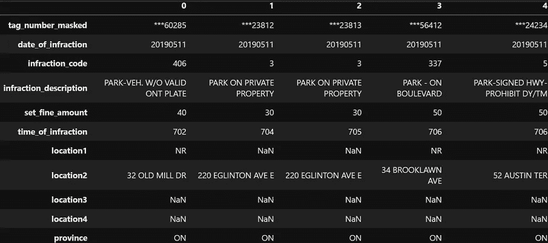

五个转置行的示例

对原始数据进行了一些基本的预处理，例如合并日期和时间列，删除时间不正确的异常行等。

如果我们绘制每日门票数量，我们可以在 2020 年 4 月左右看到明显的“covid19 下降”。我们将只使用 2019 年的数据，因为 2020 年的数据不典型。

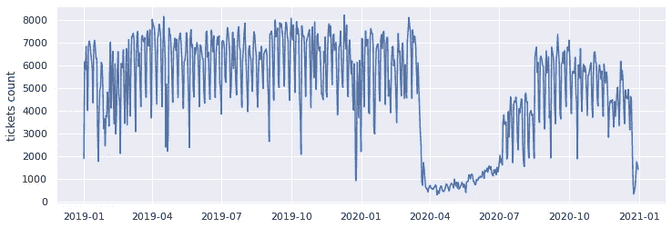

每日停车票

# 什么时候有最多的票？

让我们从时间的角度来探究这些数据。每种违规类型都有其分布。因此，我们将在一个违反类型的基础上研究时间分布。

首先，我们用 7 X 24 个单元格创建一周的热图，统计每个单元格中的票数，最后归一化热图(所有单元格之和应为 1)。因此，较暗表示百分比较高，较亮表示百分比较低。

一些有趣的观察:

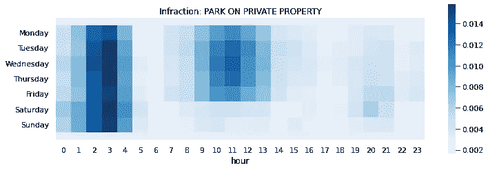

规范化停车罚单分布

清晨(早上 5 点到 7 点)或下午(下午 3 点到 6 点)是否有一个“私人财产公园”值得怀疑。

规范化停车罚单分布

晚上(早上 0 点到 7 点)几乎不会出现“未付费停车”的情况。我猜大多数机器停车场靠近办公和商业建筑，人们很少在那里过夜停车。此外，一些停车场可能会在晚上关闭，酒吧禁止进入。军官不在那些地方工作是合理的。

我们还可以将全年的门票数量视为时间序列数据，并将其分解为几个部分。例如，如果我们分解“停车时间超过 3 小时”的违规数据，并查看趋势部分，我们可以看到冬季发出的罚单较少。从季节部分，我们会看到一个周模式。有一些明显的下降(你可以在上面的线图和下面的残差图中看到它们)。它们可以用加拿大夏季的国定假日和冬季的极端天气日来解释。

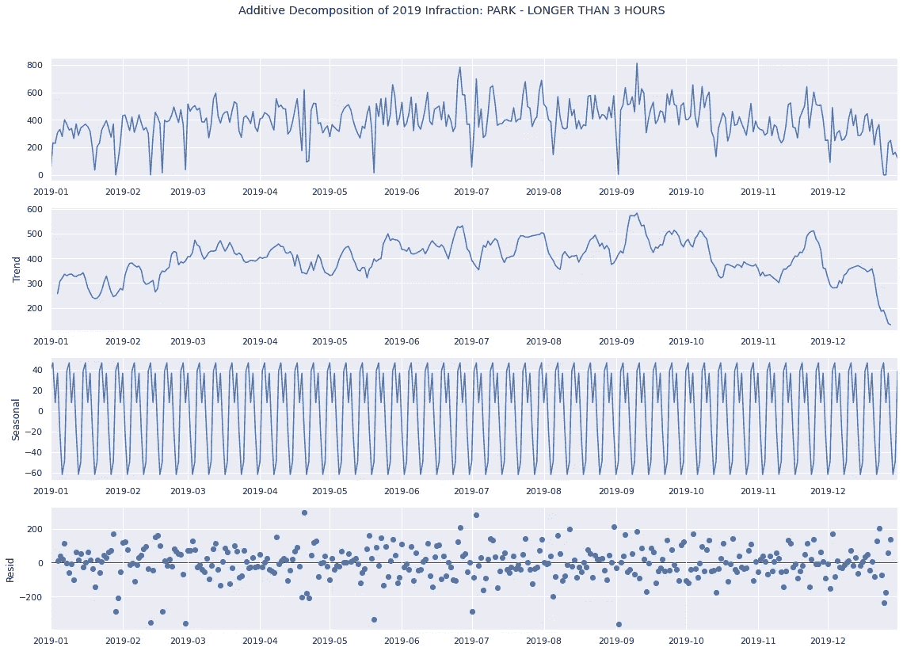

标准化后，我们可以比较前 5 种违规类型，因为这些类型的罚单数量不同。我选择基于十天移动平均线来归一化该值。

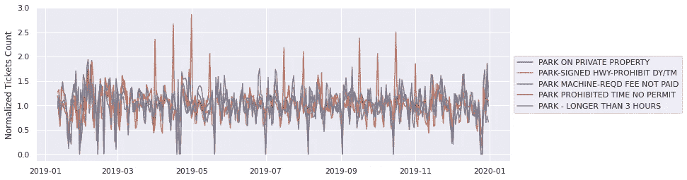

比较前 5 种违规类型的折线图

一些观察结果:

节假日和极端天气会显著减少“停车时间超过 3 小时”和“未支付停车机器所需费用”(绿色和紫色线)的门票。要点是城市通常不会在那些特殊的日子给你开罚单，因为不付钱或者停车时间太长。

“公园标志 HWY 禁止 DY/TM”类型(橙色线)有几个周期性峰值。高峰意味着该城市可能会批量发行这些罚单，或者该城市可能会加强对此类违规行为的定期检查。

# 门票最多的地点在哪里？

数据集中没有地理信息。现在，我们只能将位置视为字符串。

这份名单是门票最多的前 10 条街道。

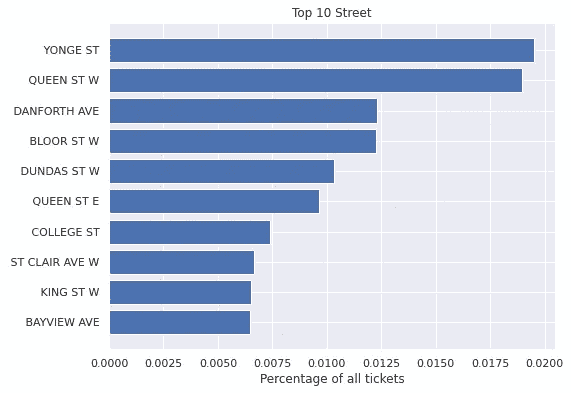

该列表显示了门票最多的前 10 个地点。

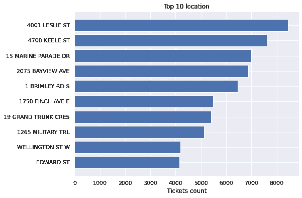

每个顶部位置都有独特的图案。例如，大多数 2075 BAYVIEW AVE (一家医院)的门票是从上午 10 点到下午 2 点的私人停车场。

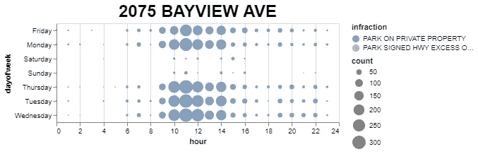

**布里姆利路南 1 号**是一个公园。在那里开停车罚单有各种各样的理由。但是大部分都是下午和晚上给的。

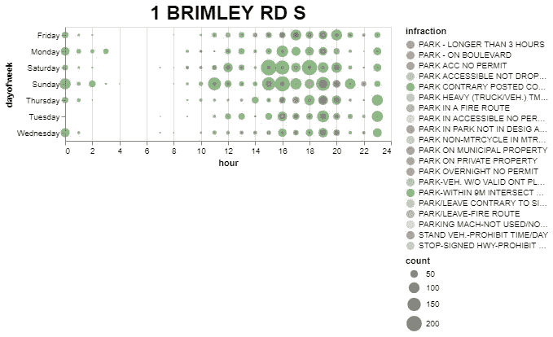

# 拿到票的概率有多大？

请注意，如果你从来没有违反停车规则，你将永远不会得到一张停车罚单。

我们假设你在一个特定的地方违反了停车规则，你可能会收到一张停车罚单。这个机会取决于停车执法人员。假设一个检查员同时检查这个地方，你会 100%得到一张票；如果没有，有 0%的机会拿到票。因此，检查的概率**给你违反停车规则**将等于得到一张罚单的概率。

基本数学是下面简单的贝叶斯方程。

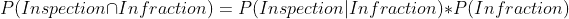

一级方程式

我们想知道我们的目标概率 P(检查|违规)。解决方案是，一旦我们有了 P(检查和违规)和 P(违规)，我们就可以得到 P(检查|违规)。

## 评估 P(检查和违规)

让我们通过结合位置和时间因素来计算这些概率。为了让事情变得简单些，让我们来挑选第一名， **4001 莱斯利街**。是北约克综合医院。以下是 2019 年的票数分布图。

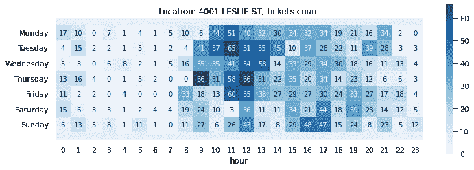

每个单元格表示 2019 年该时间段发行了多少张票。每个单元格代表一个**联合事件**的编号，意味着有人违反了法律**和**警官抓住了那个人。

我们假设一旦检查员到达现场，他们会发现所有的违规行为。所以票的总数不是一个好的概率分布的度量。由于每个时间点在一年中平均会重复 52 次，我们可以使用**每个时间点的一年中唯一的天数**除以 52 作为概率。

例如，假设在星期五上午 11 点到 12 点发行 60 张票。这 60 张罚单仅涵盖 26 周(一年中的 26 个独特的日子)，这意味着在周五上午 11 点到 12 点没有任何罚单的那几周，既没有违规，也没有检查员在那个时间出现。那么从技术上来说，我们认为**联合事件**的概率是 26/52 = 50%。

现在我们有了每个单元的联合事件 P(检查和违规)的概率。我通过将每个单元格的值与其两个相邻单元格的值进行平均来平滑结果。

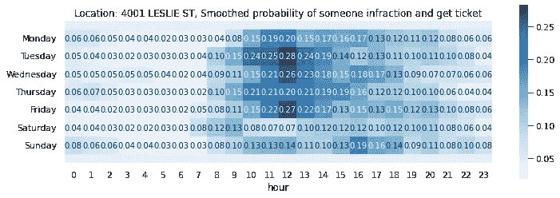

平滑的结果。每个单元格都是自身和两个相邻单元格的平均值。

## 评估 P(违规)

接下来，让我们获得每个时间点的违规概率。我们可以假设有一小部分人喜欢违反停车规则，不管时间和地点。停车的游客越多，那些“停车违规者”就越有可能到来。现在问题变成了我们是否能有停车游客数量的数据。

我在网上找到了北约克总医院 2019 年的统计数据(参考文献 3)。有 118152 名急诊患者和 170132 名门诊患者，这意味着每天约有 790 名患者。当然，不是所有的病人都需要停车；有些患者可能会多次就诊和停车。有理由相信每天停车的游客应该在 500 到 1000 之间。

我还找到了一篇关于预测急诊科每小时患者访问量的论文(参考文献 2)。关键是不同时间到达的病人数量的分布。

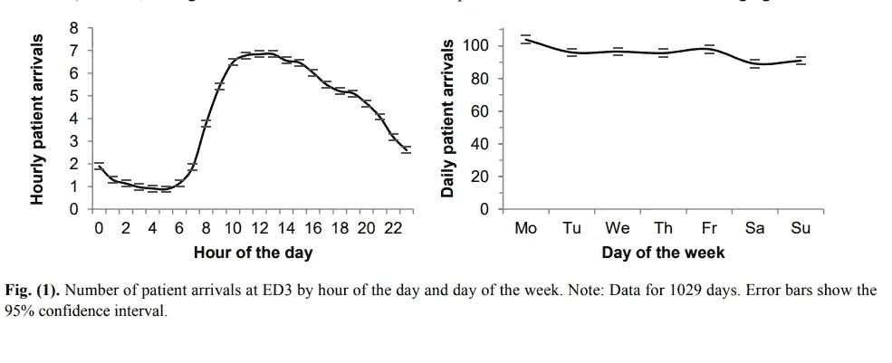

结合上述知识和信息，我为北约克综合医院创建了一个停车游客分布图。平日停车游客总数不超过 650 人，周末不超过 300 人。

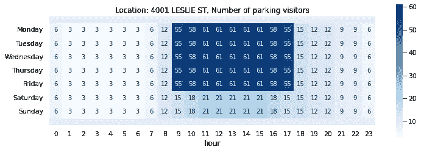

根据停车游客的数量，如果我们知道违规率，我们可以通过以下公式计算违规概率:

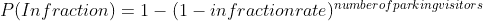

方程式 2。

不幸的是，我在网上找不到可靠的违规率。但是我们可以调整利率。下图显示 P(违规)的比率为 0.013。这一比率意味着每 1000 名停车游客中，就有 13 人违反停车规则。

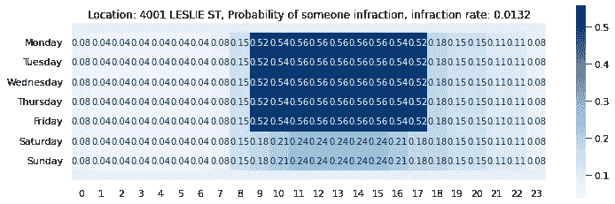

违规率不变的假设可能不成立。例如，人们可能愿意在晚上偷一个比白天稍微危险的非法停车。

为了估计每小时的违规率，我假设 P(检查|违规)总是 1，那么 P(违规)将等于 P(检查和违规)。通过用停车游客的数量求解公式 2，我们可以计算出每个时间点的违章率。不出所料，夜间的费率确实更高。

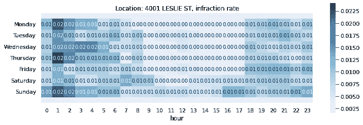

假设 P(inspection|infraction)的逻辑总是一个意思，即通过捕捉所有的违规，官员们工作得很完美。从这一假设得出的违规率可被视为最佳率；实际违规率应该高于最佳值。

## 检查 P(检查|违规)

现在，我们可以按小时平均最佳违规率，然后应用公式 1 和公式 2，得到 P(检查|违规),如下所示。

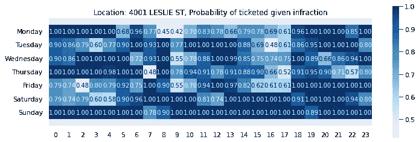

因为我们使用的是最佳违规率的平均值，大多数概率接近于 1，正如预期的那样。即使结果高估了实际可能性；我们仍然可以发现一些有趣的观察结果:

如果你违章停车，周一白天和工作日上午 9 点到 10 点收到停车罚单的几率相对较低。

*官员通常上午比下午更有可能在现场。*

请注意，结果高度依赖于停车游客分布的准确性以及如何评估违章率，这将最终确定 P(违章)。概率较低的时间段可能表明检查的机会较少，或者我们高估了 P(违规)，即某人违规的可能性。

# 结论

我研究了基于时间、地点和违规类型的多伦多停车罚单数据集。我展示了从 2019 年的数据中学到的一些令人兴奋的见解。我还提出了违规和检查的简单统计模型。我们需要有关相关位置的详细信息，以便我们可以模拟某人违反停车法规的可能性以及停车执法人员检查该地点的可能性。

感谢阅读。

## 参考资料:

[1] [多伦多公开停车罚单数据](https://open.toronto.ca/dataset/parking-tickets/)

[2] [预测急诊科每小时的患者访问量，以应对拥挤状况](https://www.researchgate.net/publication/316068771_Forecasting_Hourly_Patient_Visits_in_the_Emergency_Department_to_Counteract_Crowding) Morten Hertzum

[3] [北约克总医院统计数据](https://www.nygh.on.ca/about-us/overview/statistics-and-area-served)