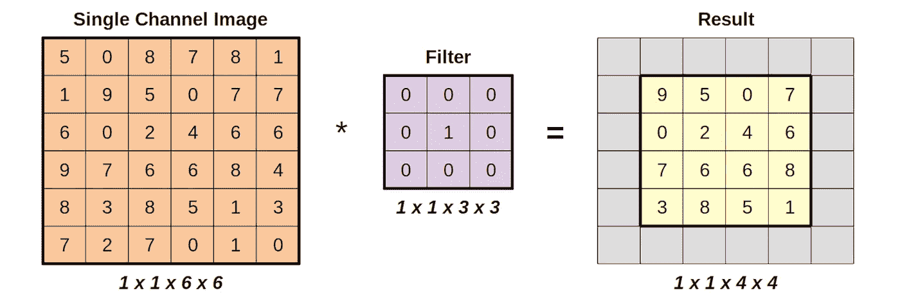
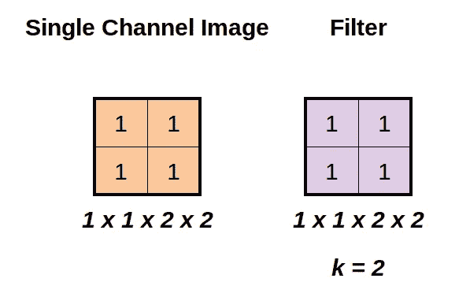
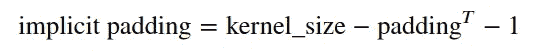
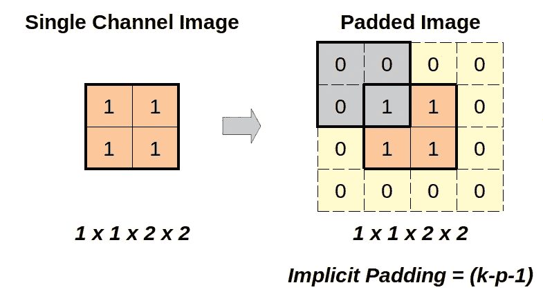
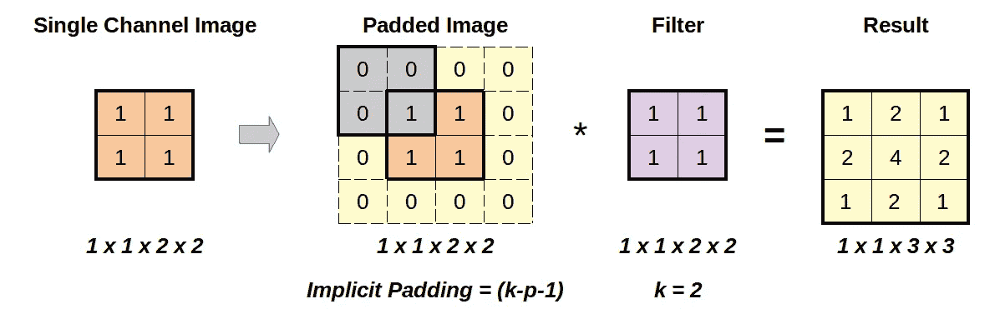
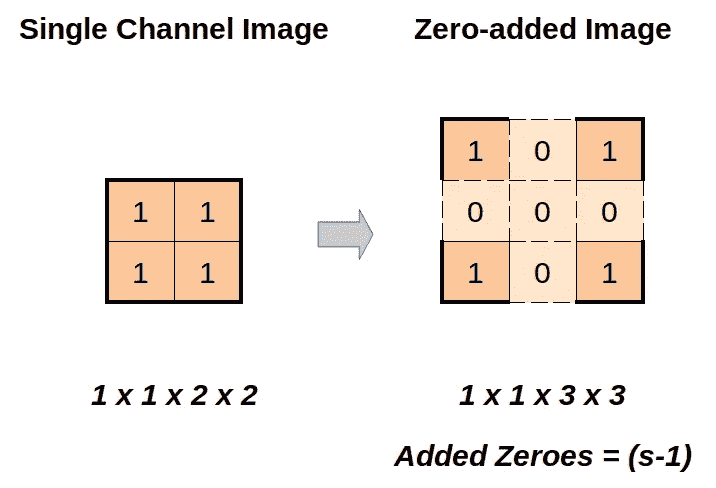
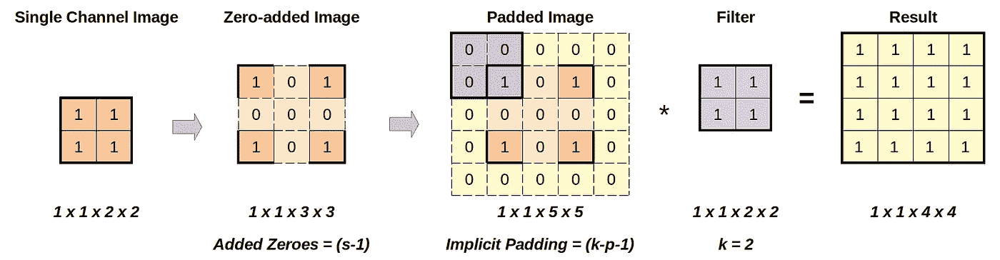
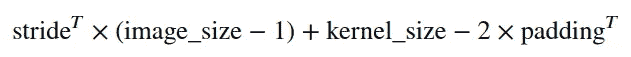

# 什么是转置卷积？

> 原文：<https://towardsdatascience.com/what-are-transposed-convolutions-2d43ac1a0771>

## 了解“反向”卷积的工作原理


在 [Unsplash](https://unsplash.com?utm_source=medium&utm_medium=referral) 上由 [Philippe D.](https://unsplash.com/@filip42?utm_source=medium&utm_medium=referral) 拍摄的照片

# 介绍

转置卷积就像卷积家族的“*丑小鸭*”。它们古怪而怪异，但转置卷积并不像看上去那样简单。

你会经常在*自动编码器*的*解码器*部分，或者 *GANs* 的*生成器*部分找到**层转置卷积**。

他们**的目的**很明确:为了**增加他们输入**的尺寸、高度和宽度。

这是与*常规卷积*的相反的*:缩小它们输入的大小、高度和宽度。*

> "所以，转置卷积是卷积的逆运算？"

# 转置卷积

上面的问题没有简单的答案，因为**卷积不能“*还原*”**，也就是说，在给定结果输出的情况下，不能检索原始值。即使是最简单的过滤器，即*身份*过滤器，在图像上进行卷积时，也会导致**一些信息永久丢失**(原始图像最外面的行和列中的数字，如下例所示):



来源:图片来自我的书《用 PyTorch 一步一步进行深度学习》，第 5 章，“卷积”

此外，已知卷积通常产生尺寸**减小**(高度和重量)的输出。虽然我们对丢失的信息无能为力，但是我们可以恢复缩小的大小！这就是一个**“转置卷积”**的作用。

> “为什么叫换位？”

我也不喜欢这个名字，但是我估计叫它“*反卷积*也不够准确，所以就是这样。退一步说，转置卷积的**算法并不那么直观**，所以让我们用 PyTorch 做几个例子来理解它是如何工作的。

在这两个例子中，我们将使用一个**单通道、2x2 图像作为输入**，以及一个同样大小的**内核/过滤器**:

```
input_image = torch.ones((1, 1, 2, 2)) # N, C, H, W
input_image
**Output:
tensor([[[[1., 1.],
          [1., 1.]]]])**kernel_size = 2
kernel = torch.ones((1, 1, kernel_size, kernel_size))
kernel
**Output:
tensor([[[[1., 1.],
          [1., 1.]]]])**
```



单通道、2x2、图像作为输入，以及相同大小的内核/滤波器。图片作者。

## 使用 1 的步幅(转置)

现在，让我们尝试一个 2D 转置卷积(`[**F.conv_transposed2d**](https://pytorch.org/docs/stable/generated/torch.nn.functional.conv_transpose2d.html)`，在 PyTorch 的函数式 API 中)，使用一个的**步幅(转置)，和一个**零**的填充(转置):**

```
import torch.nn.functional as Fstride_transp = 1
padding_transp = 0F.conv_transpose2d(input_image,
                   weight=kernel,
                   stride=stride_transp,
                   padding=padding_transp)
**Output:
tensor([[[[1., 2., 1.],
          [2., 4., 2.],
          [1., 2., 1.]]]])**
```

我不知道你，但我第一次看到那个输出，我就被它难倒了！让我们深入了解一下！

这就是转置卷积在幕后实际做的事情:

*   首先，它**用零**填充图像，尽管它**没有使用作为参数的填充(转置)**而是使用**隐式填充代替**(是啊，说到令人困惑！).



隐式填充。图片作者。

```
padding_implicit = kernel_size - padding_transp - 1
padded_image = F.pad(input_image, pad=[padding_implicit]*4)
padded_image
**Output: 
tensor([[[[0., 0., 0., 0.],
          [0., 1., 1., 0.],
          [0., 1., 1., 0.],
          [0., 0., 0., 0.]]]])**
```



用隐式填充进行填充。图片作者。

*   然后，**使用常规的 2D 卷积(`**F.conv2d**`，使用一个**的**固定步幅(**不是用作参数的步幅(转置))，在填充图像**上卷积内核/滤波器！**)

```
F.conv2d(padded_image, weight=kernel, stride=1)
**Output: 
tensor([[[[1., 2., 1.],
          [2., 4., 2.],
          [1., 2., 1.]]]])**
```

我们走吧！这与转置卷积函数产生的输出相同！下图说明了这两个步骤:



使用一步(转置)的转置卷积。图片作者。

> “好的，但是**步幅(转置)**呢？根本没用！”

接得好！事实上，它并没有被使用，这就引出了第二个例子。

## 使用 2 的步幅(转置)

我们将保持相同的输入图像和内核/过滤器，相同的零的**填充(转置)，但是我们现在将使用两个**的**步距(转置)。**

```
stride_transp = 2
padding_transp = 0F.conv_transpose2d(input_image,
                   weight=kernel,
                   stride=stride_transp,
                   padding=padding_transp)
**Output:
tensor([[[[1., 1., 1., 1.],
          [1., 1., 1., 1.],
          [1., 1., 1., 1.],
          [1., 1., 1., 1.]]]])**
```

这个输出也令人困惑，对吗？大于一个的**步幅(转置)实际上在开始时引入了 ***又一步*** :**

*   首先，**在输入图像的现有 1**之间插入 0 序列作为列和行。要插入的**列/行数**由**步距(转置)减去一个**给出。在我们的例子中，它将插入一列和一行，产生如下图像:

```
zero_added_image = torch.tensor([[[[1, 0, 1],
                                   [0, 0, 0],
                                   [1, 0, 1]]]]).float()
```



添加零的列和行。图片作者。

*   接下来，它使用一个的固定步幅执行**隐式填充**和**常规卷积，就像第一个例子一样:**

```
padding_implicit = kernel_size - padding_transp - 1F.conv2d(zero_added_image,
         weight=kernel,
         stride=1,
         padding=padding_implicit)
**Output:
tensor([[[[1., 1., 1., 1.],
          [1., 1., 1., 1.],
          [1., 1., 1., 1.],
          [1., 1., 1., 1.]]]])**
```

又来了！这与转置卷积函数产生的输出相同！下图说明了整个事情:



使用步长为 2 的转置卷积。图片作者。

上面的两个例子足以让你理解转置卷积的要点，以及如何使用它们来增加输出的大小(高度和重量)。

## 输出大小

> "有没有一种简单的方法来计算产量的大小？"

当然，给定图像和内核大小、步幅(转置)和填充(转置)，结果输出的大小遵循以下公式:



转置卷积的输出大小

# 最后的想法

转置卷积非常有用，尤其是在生成模型中，并且很容易简单地假设它们是常规卷积的“相反”操作(因为它们增加了输入的高度和宽度)，而无需过多考虑。不过，它们的内部工作方式有点复杂，所以我希望我能帮助你更好地理解它们。

如果你想了解更多 PyTorch，计算机视觉，NLP 的知识，给我自己的系列丛书， [*深度学习用 PyTorch 循序渐进*](https://pytorchstepbystep.com/) ，一试:-)

*如果您有任何想法、意见或问题，请在下面留下评论或通过我的* [*个人资料链接*](https://bio.link/dvgodoy) *页面联系。*

*如果你喜欢我的文章，请考虑使用我的推荐页面* [*注册一个中级会员*](https://dvgodoy.medium.com/membership) *来直接支持我的工作。对于每一个新用户，我从中获得一小笔佣金:-)*