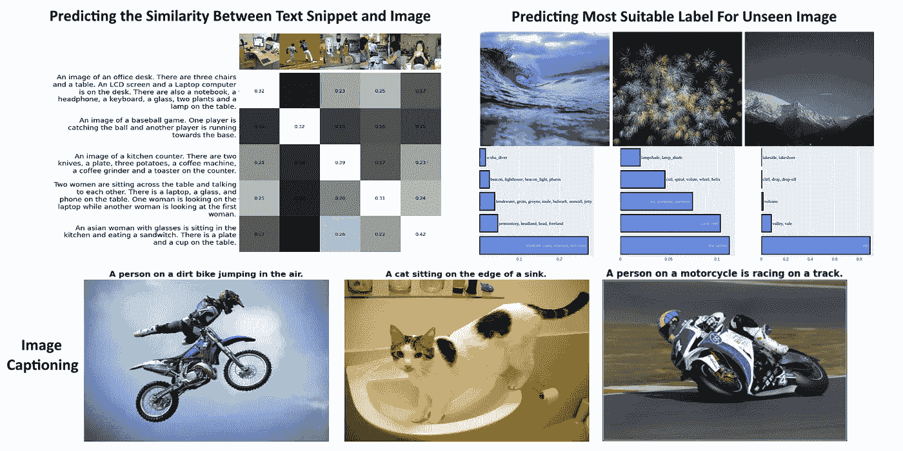
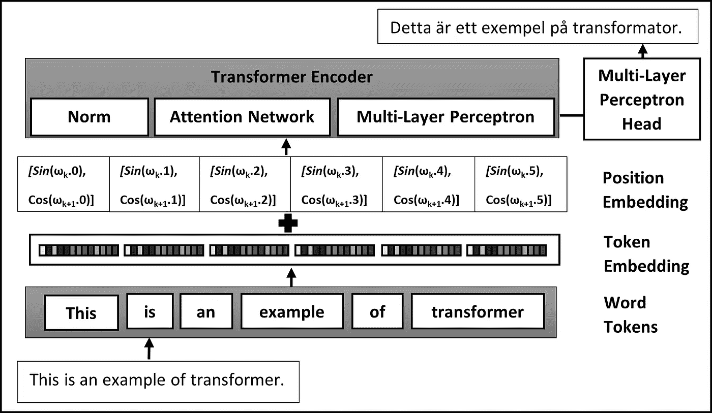
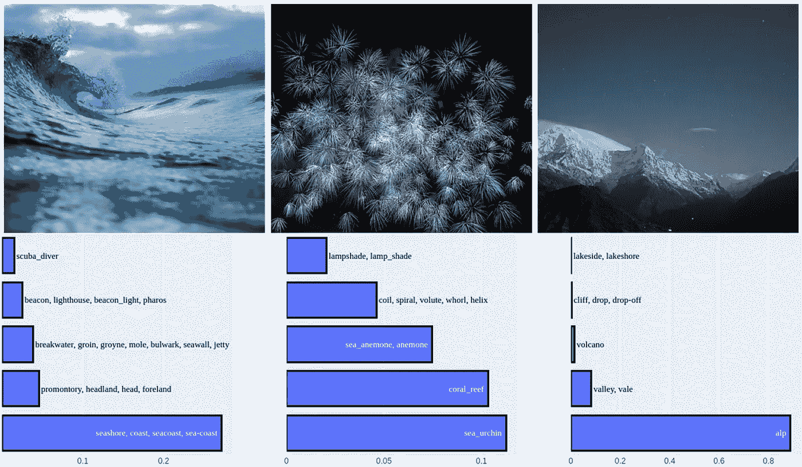
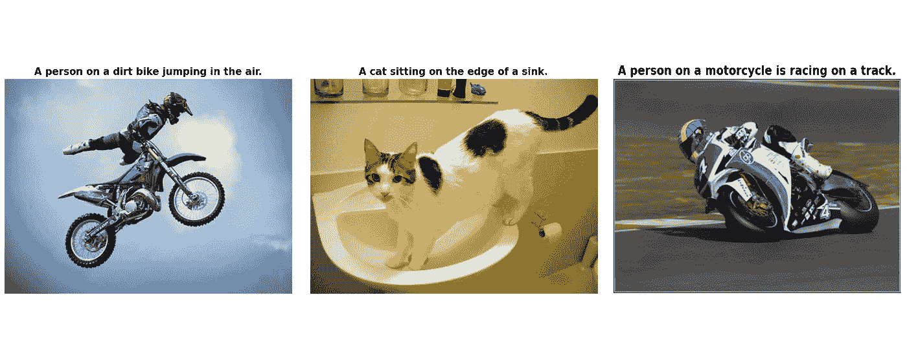
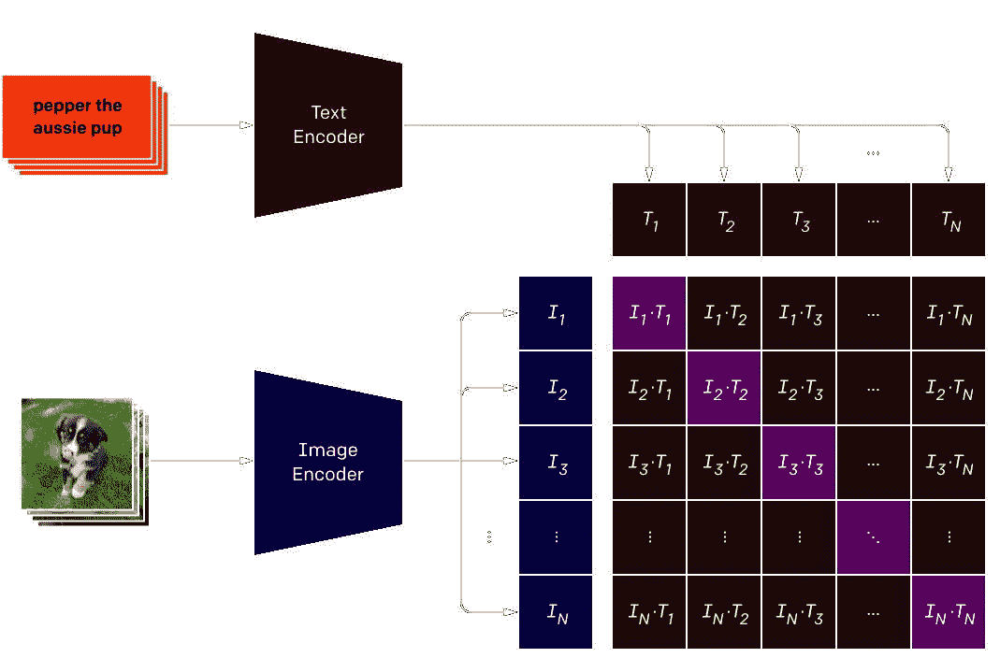
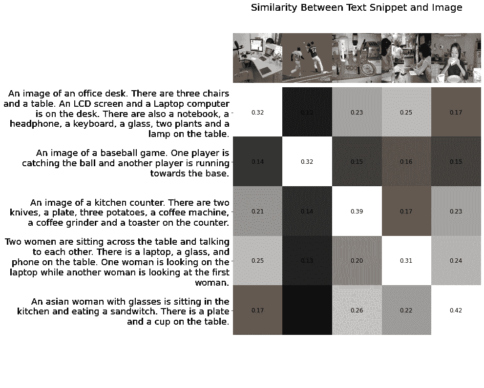

# 什么是视觉变形金刚，它们对通用学习有何重要性？

> 原文：<https://towardsdatascience.com/what-are-vision-transformers-and-how-are-they-important-for-general-purpose-learning-edd008545e9e>

## **探索概念并尝试示例应用**



图 1:行动中的视觉变形金刚(图片由作者提供)

在过去的几年里，人工智能领域取得了重大进展。生成模型是视觉领域中最成功的，然而，它们是为高度专业化的任务而构建的。每当任务改变时，这些专门的学习模型需要重建或再培训。因此，对通用学习模型的兴趣正在增加。其中一种模型叫做变形金刚。在本文中，我们简要讨论:

*   什么是变压器？
*   什么是视觉转换器(ViT)？
*   ViTs 的各种应用有哪些？
*   vit 如何用于通用学习？

**1。** **正文**变形金刚

转换器的概念起源于自然语言处理(NLP)应用，其任务是理解文本并得出有意义的结论。Transformer 模型已经实现了高性能，并且由于其简单性和可推广性，已经成为 NLP 领域中事实上的标准。



图 2:用于语言翻译的转换器示例(图片由作者提供)

在文本处理应用程序中，数据由来自一组固定词汇表的大量单词组成。在典型的变压器架构中，执行以下一系列步骤:

```
► *Text is split into a set of words called tokens.**► Each token is converted into an encoded/embedded vector (e.g. word2vec)**► The position of the word in the sequence is encoded using position embedding [1] and integrated with the word embedding.**► The embeddings are fed into the Transformer encoder.**► The encoder has a Multi-Layer Self-Attention Network (MSP) which assigns weights to tokens based on their relative importance in the sentence, hence embedding the context.**► A Multi-layer Perceptron (MLP) network follows the MSP and encodes the output from the attention network.**► There are multiple MSP and MLP blocks along with Norm layers inside the encoder.**► A final MLP-Head Layer is added outside the encoder network which provides the logits. Logits can be converted to probabilities by applying an activation layer (e.g. softmax).*
```

正如我们所看到的，变压器网络的架构是通用的，因为编码器输出不是为特定任务(例如分类)构建的，而是通过添加相应的 MLP 头来提供可用于多种应用的通用编码。这就是为什么变形金刚在迁移学习中是有用的，并且有希望实现通用的学习目标。

**2。** **【视觉变形金刚(ViT)**

Vision Transformer (ViT)的概念是 Transformer 原始概念的扩展，后者在本文前面被描述为 text transformer。这只是在图像域中的变换器的应用，在实现中稍作修改，以便处理不同的数据形态。更具体地说，ViT 使用不同的方法进行标记化和嵌入。然而，通用架构保持不变。输入图像被分割成一组图像块，称为*视觉标记*。视觉标记被嵌入到一组固定维度的编码向量中。图像中碎片的位置与编码矢量一起被嵌入，并被馈入变换器编码器网络，该网络基本上与负责处理文本输入的网络相同。在图 3 [2]中可以看到运行中的 ViT 架构示例。


图 3:用于图像分类的视觉转换器的演示(来源:[谷歌研究](https://arxiv.org/pdf/2010.11929)

ViT 编码器中有多个模块，每个模块由三个主要处理元件组成:*层范数*、*多头注意力网络(MSP)* 和*多层感知器(MLP)* 。*层规范*保持训练过程在轨道上，让模型适应训练图像之间的变化。 *MSP* 是一个网络，负责从给定的嵌入式视觉标记生成注意力地图。这些注意力地图有助于网络聚焦于图像中最重要的区域，例如物体。注意力图的概念与传统计算机视觉文献中的概念相同(例如，显著性图和阿尔法抠图)。

*MLP* 是一个两层分类网络，末端是 GELU ( *高斯误差线性单元*)。最后一个 MLP 块，也称为 *MLP 头*，用作变压器的输出。在此输出上应用 *softmax* 可以提供分类标签(即，如果应用是图像分类)。

**3。**应用**应用**

由于其通用性，ViTs 的应用几乎涵盖了视觉的所有方面。这包括图像分类、图像到文本/文本到图像生成、视觉推理、联想学习和多模态学习。在本节中，我们将通过实际例子来试验 *ViTs* 最常见和最成功的应用。

**3.1。** **【图像分类】(图像- >标签)**

图像分类是视觉中最常见的问题。图像分类任务的最新技术是基于 CNN ( *卷积神经网络*)的方法。*vit*在小型到中型数据集上没有产生可比较的性能，然而，它们在非常大的数据集上已经胜过*CNN*[3]。这是因为*CNN*比 *ViTs* 更有效地对图像中的局部信息进行编码，这是由于局部受限感受野的应用。

让我们试着用 *ViT* 做实验。我们首先加载一个已经在 imagenet 上训练过的预训练模型，然后将其应用于从互联网上收集的一组随机图像。我们为给定的图像挑选五个最可能的标签。结果可以在图 4 中看到。结果可能不是超级完美的；然而，他们很好地记住，网络不是在这些图像上训练的。



图 4:ViT 的图像分类输出(作者提供的图像)

**3.2。** **图像字幕(图像- >句子)**

通过生成描述图像内容的标题而不是一个单词的标签，可以实现更高级形式的图像分类。随着 *ViTs* 的使用，这已经成为可能。 *ViTs* 学习给定数据形态的一般表示，而不是一组粗糙的标签，因此，可以为给定图像生成描述性文本。我们将使用在 *COCO* 数据集上训练的*ViT*【4】*的实现。这种字幕的结果可以从图 5 中看出。*

**

*图 5:使用 ViT 生成图片标题(图片由作者提供)*

***3.3。** **对比语言-图像预训练(图像< - >文本片段)***

**

*图 6:具有对比语言-图像预训练的 ViT 架构(来源: [Google Research](https://arxiv.org/abs/2103.00020)*

*ViTs 的一个更高级的应用是学习图像和文本之间的联系。这是一个需要真正概括能力的应用程序，因为它需要文本和图像的抽象表示。这可以通过为文本片段和图像训练两个独立的变换编码器来实现。然后，可以通过构建余弦相似性矩阵来比较编码图像和文本特征各自的相似性。在 CLIP(对比语言图像预训练)[5]中提出了这种变换器模型的相关实现。为了进一步理解这一点，我们取了五个样本图像，并为每个图像编写了一个小的文本片段。然后利用预先训练好的 ViT 模型，将文本片段和图像分别编码成一组文本和图像特征向量。我们计算文本和图像特征之间的余弦相似度。这将产生如图 7 所示的输出。可以看出，正确的图像-文本对之间的相似度最高。这种学习方式相对来说更普遍，是迁移学习的一种形式。*

**

*图 7:图文关联学习的 ViT 结果(图片由作者提供)*

***4。** **最后备注***

*在本文中，我们解释了文本转换器和图像转换器的概念。然后，我们通过构建和实现实际的例子，探索了变压器模型的一些主要应用。如果您想更深入地研究并获得代码，那么您可以从 git 存储库中访问相应的 python 笔记本和帮助代码。[https://github.com/azad-academy/vision-transformers](https://github.com/azad-academy/vision-transformers)*

*在接下来的文章中，我们将更深入地研究迁移学习和变压器网络的一些最新进展。*

***5。** **参考文献***

*[1] Mehreen Saeed，Transformer 模型中位置编码的温和介绍，[https://machine learning mastery . com/A-Gentle-Introduction-To-Positional-Encoding-In-Transformer-Models-part-1/](https://machinelearningmastery.com/a-gentle-introduction-to-positional-encoding-in-transformer-models-part-1/)，2022 年*

*[2] Alexey Dosovitskiy，Lucas Beyer，Alexander，Dirk Weissenborn，Xiaohua Zhai，Thomas Unterthiner，Mostafa Dehghani，Matthias Minderer，Georg Heigold，Sylvain Gelly，Jakob Uszkoreit，Neil Houlsby，“一幅图像相当于 16x16 个字:大规模图像识别的变形金刚”，ICLR，2021 年*

*[3]陈湘宁、谢卓瑞、龚柏青，“当视觉变形金刚在没有预训练或强大数据增强的情况下胜过 ResNets 时[”，2022 年](https://arxiv.org/abs/2106.01548)*

*[4] Saahil 等人，CaTr:变形金刚的图像字幕，[https://github.com/saahiluppal/catr](https://github.com/saahiluppal/catr)，2020 年*

*[5] [亚历克·拉德福德](https://arxiv.org/search/cs?searchtype=author&query=Radford%2C+A)，[琼·金旭](https://arxiv.org/search/cs?searchtype=author&query=Kim%2C+J+W)，[克里斯·哈勒西](https://arxiv.org/search/cs?searchtype=author&query=Hallacy%2C+C)，[阿迪蒂亚·拉梅什](https://arxiv.org/search/cs?searchtype=author&query=Ramesh%2C+A)，[加布里埃尔·戈](https://arxiv.org/search/cs?searchtype=author&query=Goh%2C+G)，[桑迪尼·阿加瓦尔](https://arxiv.org/search/cs?searchtype=author&query=Agarwal%2C+S)，[吉里什·萨斯特里](https://arxiv.org/search/cs?searchtype=author&query=Sastry%2C+G)，[阿曼达·阿斯克尔](https://arxiv.org/search/cs?searchtype=author&query=Askell%2C+A)，[帕梅拉·米什金](https://arxiv.org/search/cs?searchtype=author&query=Mishkin%2C+P)，[杰克·克拉克](https://arxiv.org/search/cs?searchtype=author&query=Clark%2C+J)，[格雷琴·克鲁格](https://arxiv.org/search/cs?searchtype=author&query=Krueger%2C+G)*