# 从 1001 个 A/B 测试中可以学到什么？

> 原文：<https://towardsdatascience.com/what-can-be-learned-from-1-001-a-b-tests-361a4b6e40a7>

## 对测试持续时间、样本大小、提升、功效、置信阈值和连续测试的表现进行深入了解的荟萃分析

卢克·切瑟在 [Unsplash](https://unsplash.com?utm_source=medium&utm_medium=referral) 上的照片

典型的 A/B 测试运行多长时间？有百分之多少的 A/B 测试会产生“赢家”？在线控制实验达到的平均升力是多少？顶级转化率优化专家在为网站和移动应用提供有效干预方面有多出色？

使用 Analytics-Toolkit.com 统计分析平台分析的 1001 个 A/B 测试的元分析旨在提供这些和其他与在线 A/B 测试相关的问题的答案。演示文稿的布局如下:

1.  [背景和动机](#8266)
2.  [数据和方法](#2f46)
3.  [基本测试特性](#aa06)
4.  [高级测试参数](#b665)
5.  [结果统计](#fe38)
6.  [顺序测试的效率](#2edb)
7.  [外卖](#18b0)

对主要发现和简要概述感兴趣的人可以直接跳到[“要点”](#18b0)。

*所有图片和图表，除非特别注明，均由 Analytics-toolkit.com**提供*

# *背景和动机*

*A/B 测试，也称为在线控制实验，是在线业务中证据和风险管理的黄金标准。它们是估计不同类型干预的因果影响的首选工具，通常目标是改善网站或应用程序的性能，并最终改善业务成果。因此，A/B 测试的作用主要是作为一种管理业务风险的工具，同时应对创新和改进产品或服务的持续压力。*

*考虑到这一把关者角色，A/B 测试的执行方式至关重要，这种方式可以产生可靠的结果，同时平衡误报和漏报结果的业务风险和回报。A [2018 元分析](https://blog.analytics-toolkit.com/2018/analysis-of-115-a-b-tests-average-lift-statistical-power/)[1]115 个公开可用的 A/B 测试揭示了与在线受控实验的规划和分析相关的重大问题。也就是说，大多数测试(70%)出现了[动力不足](https://www.analytics-toolkit.com/glossary/underpowered-test/)，提出了与**去向不明** [**窥视**](https://www.analytics-toolkit.com/glossary/peeking/) 和**低统计功效**相关的问题。第一种可能会导致估计值过高，对假阳性率缺乏控制，而第二种可能会导致无法检测到真正的改进，并因样本量不足而错过从测试中学习的机会。*

*自分析工具包于 2014 年推出以来，解决这些问题和促进稳健的统计实践一直是开发 A/B 测试统计工具背后的主要驱动力。在 2017 年，提出并实施了[顺序测试方法(敏捷)](https://www.analytics-toolkit.com/glossary/agile-a-b-test/)来解决窥视背后的动机，以提供效率并提高测试的 ROI，而不损害统计的严谨性。2021 年底，发布了一个经过彻底改革的平台，其目标之一是解决 A/B 测试结果不佳的第二个主要原因——统计能力不足。改革的其他目标包括防止或尽量减少在线 A/B 测试中应用统计方法的其他常见错误。*

*鉴于上述情况，当前的元分析有多个**目标**:*

1.  *提供一个结果无偏见的分析，改善以前的研究，可能遭受选择性报告问题。*
2.  *产生一个更强大的，因此更有价值的分析。*
3.  *检查顺序测试的真实表现，顺序测试本质上取决于测试干预的未知真实效果。*
4.  *揭示关于关键数据的新见解，如测试持续时间、样本大小、置信阈值、测试功效，并探索测试干预的效果分布。*
5.  *检验 Analytics Toolkit 测试计划和分析向导在多大程度上可以鼓励 A/B 测试中的最佳实践，并减轻测试不足的问题。*

# *数据和方法*

*该分析中的数据来自自 2021 年末推出新的分析工具包平台以来进行的 **1，001 次测试**的样本。数据集包含固定样本测试和顺序测试(敏捷测试)，90%的测试属于后一种类型。*

*最初测试的较大样本被筛选，以便只包括在此期间进行了三次以上 A/B 测试的用户的测试。基本原理是尽量减少对平台没有足够经验的用户的测试比例，以及在探索软件功能时输入的测试比例，因为这些测试可能包含有问题的数据。*

*基于测试计划和实际记录的观察之间的极端不匹配，删除了 46 个异常值。据认为，这种不匹配很可能表明对顺序测试方法不熟悉或执行非常差，使得从这些方法中得出的统计数据有问题。这些异常值的去除对敏捷效率数字产生了最大的实质性影响，带来了 3–4 个百分点的积极影响..*

*此外，估计升力超过 100%的 22 项测试被删除，因为这些结果很可能不是基于声音质量的实际数据。在所有三个屏幕之后，剩余的测试数是 1，001。*

*鉴于 Analytics Toolkit 大多数用户的已知特征，A/B 测试很可能代表由**高级和专家 CRO 从业者**以及那些对统计知识和理解高于平均水平的人进行的测试。*

# *基本测试特征*

*A/B 测试的分析样本的基本特征包括测试持续时间、样本大小和每次测试的测试变量数量。测试持续时间提供了有关测试外部有效性的信息。样本大小提供了估计的统计能力和质量的概念，而变异数是从业者在所谓的 A/B/N 测试中测试一个以上变异与对照的频率的简单度量。*

# *试验时间*

*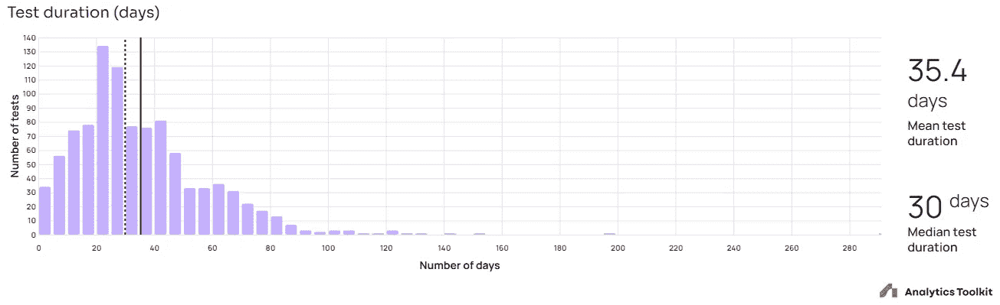*

*测试持续时间的分布*

*所有 A/B 测试持续时间的算术平均值为 **35.4 天**，等于五周。中位数是 30 天，这意味着一半的测试持续不到一个月。大多数测试跨越了一个时间框架，这个时间框架允许对任何结果进行良好的概括。*

*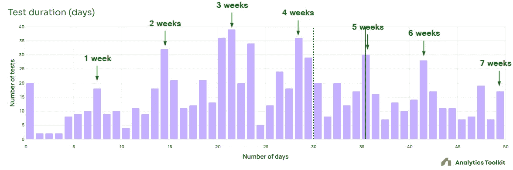*

*在 50 天截断的测试持续时间的分布*

*放大图表显示了与在**整周间隔**上监控的测试相对应的显著峰值:在 7 天(1 周)、14 天(2 周)、21 天(3 周)等等，直到 49 天(7 周)，在这一点上，由于数据量低，该模式不再可见。似乎大量的测试都是按照[外部有效性](https://www.analytics-toolkit.com/glossary/generalizability/)的最佳实践进行的，这应该会导致任何结果的更好的普遍性。*

# *样本量*

**

**每次测试的用户数量，为方便使用，图表截断为 100 万**

*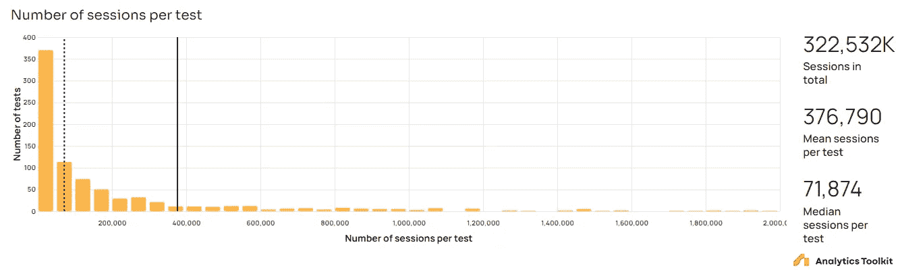*

**每次测试的会话数，为方便使用，图表截为 2，000，000**

*对于以用户为主要衡量标准的测试，平均样本量为 217，066 个用户，但中位数仅为 60，342 个用户。对于基于会话指标的测试，平均样本量为 376，790 个会话，而中位数为 72，322 个会话。*

*这种类似幂律的分布并不令人惊讶，因为幂律分布描述了用户和参与度在网络属性和移动应用之间的分布。*

*如果没有主要指标的基线率和标准偏差的背景，样本大小本身没有什么意义，但我们可以有把握地说，抽样测试包括足够数量的用户或会话，以避免与非常小的样本大小相关的统计复杂性。*

# *变体数量*

*在 Analytics Toolkit 平台上进行的绝大多数测试(88%)只包括一个测试变量和一个控制变量。只有 10%包含两个变体，只有 2%包含三个或更多变体。似乎大多数专业转换率优化者更喜欢用一个单独的、经过深思熟虑的干预来计划测试，而不是花更多的时间一次性测试一组更多样化的想法。人们可以推测，这反映了对快速实现的增量改进的偏好，而不是花费更长时间的更复杂的测试，每个测试都带有更高的不确定性。*

# *高级测试参数*

*高级测试参数反映了数据集中 A/B 测试最重要的**统计设计**的关键方面。*

# *置信阈值*

*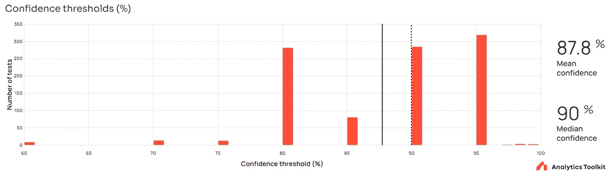*

**使用的置信度阈值分布**

*置信度阈值的分布表明，在大多数测试中，阈值在 80%和 95%之间，只有少数例外。置信阈值在这个范围内稍微均匀分布的事实与用户利用向导或他们自己的风险回报计算来达到与手头情况匹配的特定阈值的情况并不矛盾。高于 95%的少数阈值可能对应于在有利于变体的错误结论的情况下具有更高风险的测试。*

*这种良好实践可以与“默认”应用 95%置信度阈值方法的一刀切方法形成对比。从商业角度来看，后者通常是次优的。*

*置信阈值分布似乎表明了 A/B 测试中两种类型风险的合理平衡，并且可以被视为这些测试的商业效用的积极因素。然而，这些数据本身并不是决定性的。*

# *统计能力*

*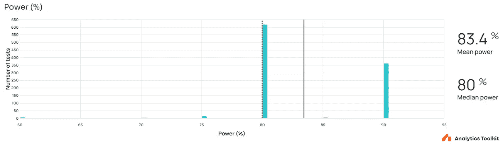*

**统计功效的分布(相对于所选择的感兴趣的最小效应)**

*绝大多数测试的功率为 80%,然而也有少数大约三分之一的测试的功率为 90%。这是令人鼓舞的，因为 80%的功率提供了相当低的检测感兴趣的目标最小效应的真实效应的机会。在计划测试时，最好探究感兴趣的最小效应和功效曲线 90%点处的最小可检测效应之间的关系。*

# *最小可检测效应*

*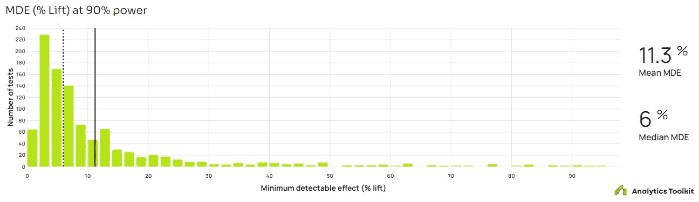*

**最小可检测效应分布**

*90%功率下最小可探测效应的分布如下图所示，平均值为 11.3%，升力中值为 6%。*

*三分之二的试验具有低于 10%升力的最小可检测效应，这明显多于之前荟萃分析中大约四分之一的试验[1]。6%的中值意味着半数试验的 MDE 低于 6%的相对升力。这可能是向导的指导和使用该工具的实践者的经验共同作用的结果。仅凭手头的数据很难理清这两者。*

*上述数字可以被解释为暂时支持 2018 年荟萃分析[1]中观察到的至少一些不切实际的 mde 与未说明的窥视有关的结论。*

*无论如何，这些都是非常令人鼓舞的数字，尤其是根据下一节的调查结果。*

# *结果统计*

*提升估计是固定样本检验的简单无偏最大似然估计，也是序贯检验的偏倚缩减最大似然估计。*

# *积极成果的百分比*

*大约 **33.5%的所有 A/B 测试具有统计显著性结果，其中一个变体优于对照**。这高于之前的荟萃分析[1]中观察到的 27%，也高于 Kohavi、Tang 和 Xu (2020 年)在第 112 页[2]的综述中报告的行业平均值的上限。鉴于本荟萃分析的纳入标准中没有结果偏倚，这一数字可以被视为被测试观点及其实施(也称为干预)相对较高质量的证据。*

*考虑到 Analytics Toolkit 用户的众所周知的概况，其中高级和专家 CRO 从业者的比例过高，这种高比例的“赢家”并不完全令人惊讶。它显示了积累的知识和经验的**价值**,并可能意味着这些专业人员更善于筛选出糟糕的想法和/或表明他们对决策者的影响力，即哪些想法进入了测试阶段。*

# *提升估计*

*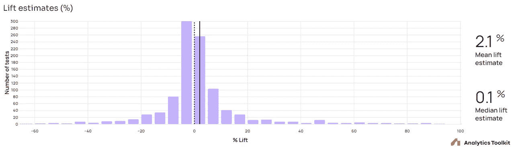*

**升力估算分布**

*尽管上面的数字很乐观，一种解释所有 A/B 测试的提升估计值的方法是，显示这些精英专业人员产生和实施为在线业务带来重大价值的想法的能力有限。**中值提升估计值仅为 0.08%，而平均值为 2.08%** ( [标准误差](https://www.gigacalculator.com/calculators/standard-deviation-calculator.php)为 0.552%)。这意味着近一半的测试干预措施没有影响或有负面影响。即使在积极的估计增长中，大多数也低于 10%。另一方面，大多数估计的负面影响也只有不到 10%的影响。*

*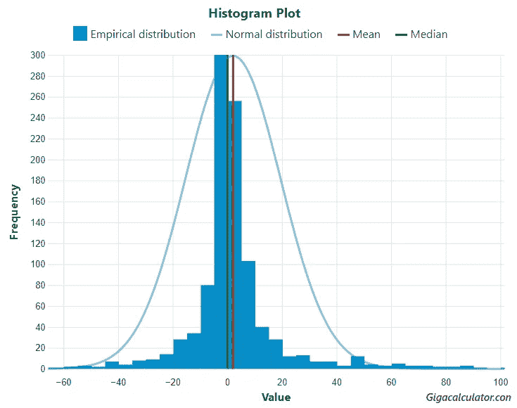*

**与具有相同均值的正态分布相比较的升力估算分布
(由 GIGAcalculator.com 提供)**

*使用 p 值< 0.0000001 on all five of the battery of tests supported by GIGAcalculator’s [正态性检验计算器](https://www.gigacalculator.com/calculators/normality-test-calculator.php)，提升估计值显然不是正态分布的。尾巴很重，向正端倾斜。零左右的估计主导了形状。*

*上述数据表明，影响用户行为是很难的。影响用户执行一个想要的动作和让他们偏离他们想要实现的目标是一样困难的。然而，正中值和平均值反映了测试的干预措施具有比掷硬币更好的产生积极效果的可能性，与零的差异具有统计学意义(p = 0.000084h0:%升程≤ 0)，相关的 95%区间跨度为[1.172%，+∞)。*

*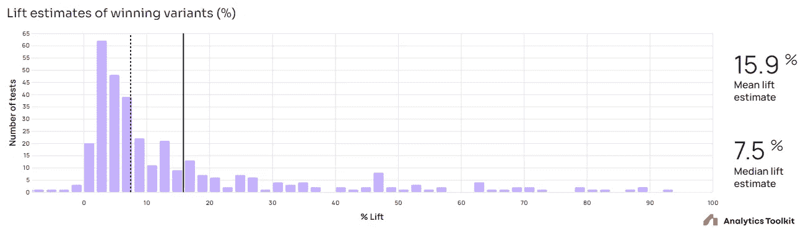*

**统计显著性检验的最佳变量的提升估计值**

*在具有统计意义的积极结果中，中值提升估计值是可观的 **7.5%** ，而平均值是巨大的 **15.9%** ！[标准差](https://www.analytics-toolkit.com/glossary/standard-deviation/)为 19.76%，均值的置信区间如下:95%CI [13.76%，17.98%]；单侧 95%CI [14.1%，+∞]。这意味着带有“获胜”变体的测试可能会给企业带来巨大的价值。*

*在少数情况下，获胜变体的提升估计低于零，这反映了非劣性测试。鉴于一些积极的估计也来自非劣效性测试，上述提升的潜在好处可能比数字显示的更大。*

*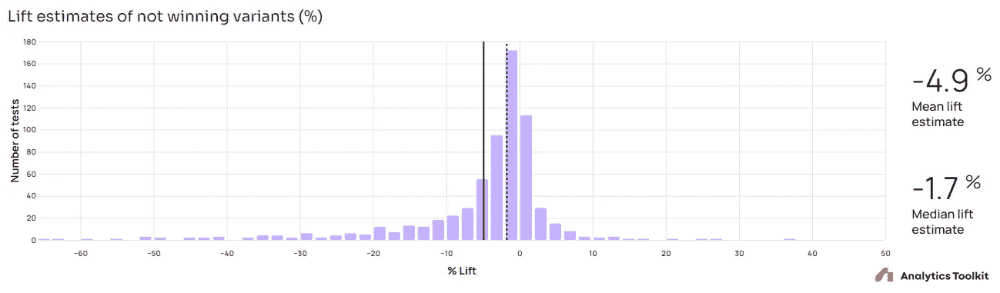*

**统计非显著性检验的最佳变量的提升估计值**

*在没有统计显著结果的试验中，大多数具有负的估计升力，而一些具有正的估计升力。平均值为 **-4.9%** ，中位数为 **-1.7%** ，这些数据说明了为什么执行 A/B 测试如此重要(SD = 10.8%，95%CI [-5.70%，-4.07%]，单侧 95%CI (-∞，-4.201))。在许多情况下，不太可能在非实验环境中检测到如此小的影响，因为任何类型的观察性事后评估(变化影响估计)都涉及更大的不确定性。*

# *顺序测试的效率*

*本节中的统计数据反映了顺序测试及其性能的各个方面。为某个最大目标样本量和达到该目标的若干中期评估计划了连续实验，但可能在任何评估时停止(“提前”)，这取决于到该点为止的观察数据。顺序测试的效率取决于所执行的顺序测试的类型、测试计划以及测试干预的真实效果大小和方向。*

# *平均停止阶段*

*使用 AGILE 的连续评估在线实验平均计划用于 10.8 个监控阶段。这些测试平均在第 5.6 次分析时停止，表明它们在最大计划测试持续时间/样本量的一半时停止。这与顺序测试的预期性能相一致，这意味着人们可以安心地为测试计划更长的最大运行时间，因为如果结果相对于感兴趣的最小效果过于积极或过于消极，测试将会提前终止。*

# *实际运行时间与最大运行时间*

*顺序 A/B 测试的停止阶段和实际运行时间取决于测试干预的真实效果大小和方向。实际运行时间占各自最大运行时间的百分比分布如下所示。*

*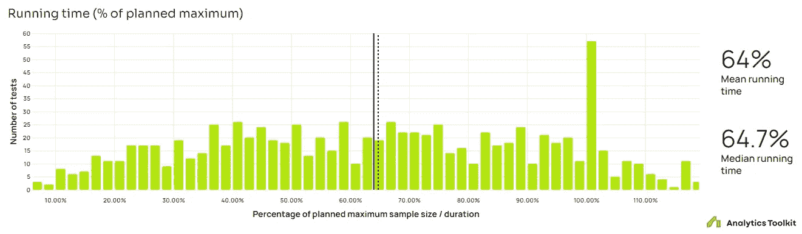*

**测试运行时间与计划最大值的分布**

*平均值和中间值几乎相同，分别为 64%和 64.7%，这意味着测试平均在不到最大计划运行时间的三分之二时停止。*

*有 57 个测试在其最大运行时间的 100%处停止，这表明只有 2 个监控阶段的测试数量高于预期，和/或计划的测试数量非常完美(单位时间内非常稳定的用户或会话率)，和/或测试出于任何原因进入事后阶段。两阶段测试是一个小因素，但很难区分其他两个。因此，这些很可能代表了人工测试(例如，为了比较估计值和固定样本分析的目的，事后重新分析测试)，而不是使用 AGILE 计划和分析的实际测试。*

*如果假设是这种情况，那么这些测试会使分布向上倾斜，而真正的平均值和中间值大约是最大运行时间的 62%,这稍微提高了性能。然而，大多数这样的测试实际上是人为的可能性被认为是足够低的，不能保证完全排除在分析之外。*

# *性能对比等效固定样本测试*

*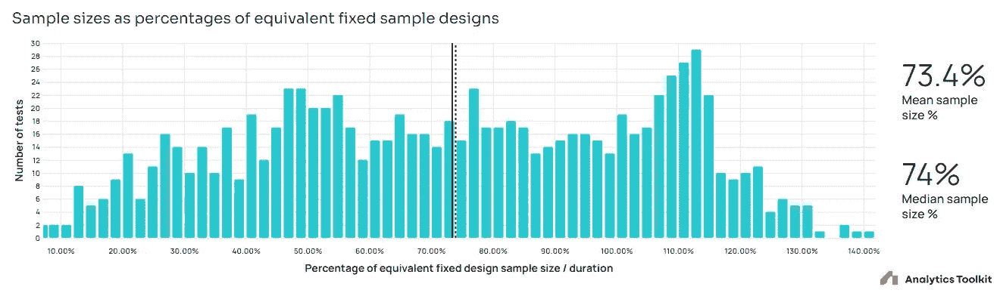*

**相当于固定样本设计百分比的样本量分布**

*性能与固定样本当量的关系反映了性能与最大运行时间的关系，峰值出现在固定样本当量的 105%到 115%之间，因为在 5 到 12 次分析之间的大多数测试中，5–15%是预期的最坏情况样本量膨胀。序贯检验的平均样本量和中值样本量分别是同等固定样本检验的 73.4%和 74%。**这使得平均节省的时间和用户暴露在 26%左右。**如果从数据中移除 105%和 115%之间的意外峰值，这些数字将提高到约 71.5%和约 **28.5%** 。*

*据我所知，这是第一次对在线 A/B 测试中真实干预的稳健频率主义序贯测试方法的实际性能进行元分析。它证明了使用顺序测试优于固定样本测试的优势，尽管这种影响相对于估计值有所减弱，这主要是因为所有测试的估计升力分布远非正常，密度明显集中在零附近。*

# *外卖食品*

*荟萃分析通过提供一个比以前的荟萃分析多近十倍的结果无偏的测试集合来实现其前两个目标。它还提供了使用 Analytics Toolkit 测试计划和分析向导的积极效果的临时证据。*

*现实场景中顺序测试优势的证据是大量的，至少支持 26%的运行时间/样本量性能提升，测试的 ROI 可能有更大的提高，因为在测试中，由于有效性或无效性而提前停止的真实效果的大小不成比例。*

*荟萃分析还得出以下**关键数据**:*

*   *33.5%的 A/B 试验产生了具有统计学意义的阳性结果，平均效果为 15.9%，而其中一半的估计效果大于 7.5%。*
*   *所有测试的中值升力估计为 0.08%，平均值为 2.08%，证明了 CRO 专业技术的优势，与零相比具有显著的统计学差异。*
*   *对于大多数测试，估计升力接近于零，这对于功率分析和样本量规划具有重要意义。重要的是，它证明了对随机对照试验的需求，该试验具有优于观察方法的稳健统计估计，而观察方法检测这种微小变化的能力要差得多。*
*   *就平均效率改进而言，与同等的固定样本规模测试相比，真实场景中的顺序测试至少有 26%的优势*
*   *88%的测试是简单的 A/B 测试，只有 12%是 A/B/N 测试，大多数测试只有两个变量，这表明专家 cro 更喜欢保持简单和迭代，而不是运行更复杂的测试。*
*   *典型的测试持续时间约为一个月，或四到五周，平均来说，表明结果具有良好的普遍性。*
*   *A/B 测试平均包括 60，342(中值)到 217，066(平均值)个用户，以及 72，322(中值)到 376，790(平均值)个会话。*
*   *大多数在线实验都是在 80%到 95%的置信度下进行的。*
*   *一半的 A/B 测试有 90%的概率检测到 6%或更低的真实影响，而平均 MDE 为 11.3%，这表明更好的测试成为顶级专业人士的标准。*

*假设分析中的大多数测试是针对关键业务指标执行的，很少是针对不太连续的用户操作，那么可以推断出测试比直接实现的好处。**在两家希望实施相同变革的相同公司中，仅实施通过 A/B 测试的变革的公司将比仅实施所有变革的公司实现快数倍的增长。它也会变得更加顺畅，这在商业中至关重要。**前者的优势来自于只实施平均提升 15.9%的成功测试，而后者的平均提升仅超过 2%，尽管成功测试导致实施了所有提议变更的三分之一以上。*

*虽然最后一个结论可能有点夸张，但它应该是说明统计开销时测试的显著边际效益的主要例子。准备、运行和分析测试的各种开销需要单独考虑，典型的规模经济在起作用。*

## *参考*

*[1]，g . z .(2018)“115 个 A/B 测试的分析:平均 Lift 为 4%，大多数缺乏统计功效”[在线]在[https://blog . analytics-toolkit . com/2018/Analysis-of-115-A-B-Tests-Average-Lift-Statistical-Power/](https://blog.analytics-toolkit.com/2018/analysis-of-115-a-b-tests-average-lift-statistical-power/),[ 2]科哈维，唐，徐(2020)《可信的在线对照实验:A/B 测试实用指南》，剑桥:剑桥大学出版社。ISBN:978–1–108–72426–5。土井:10.1017988686861*

**原载于 2022 年 10 月 18 日 https://blog.analytics-toolkit.com**的* [*。*](https://blog.analytics-toolkit.com/2022/what-can-be-learned-from-1001-a-b-tests/)*