# 我们能从后验分布中学到什么？

> 原文：<https://towardsdatascience.com/what-can-we-learn-from-posterior-distributions-43671a2cb960>

## 贝叶斯后验概率的频率主义解释

假设我们观察到了来自未知分布 *q* 的 *N* [独立同分布](https://en.wikipedia.org/wiki/Independent_and_identically_distributed_random_variables) (iid)样本 *X = (x1，…，xN)* 。统计学中的一个典型问题是“样本集 *X* 告诉我们关于分布 *q* 的什么信息？”。

[参数统计方法](https://en.wikipedia.org/wiki/Parametric_statistics)假设 *q* 属于一个参数分布族，并且存在一个参数 *θ* 其中 *q(x)* 等于所有 *x 的参数分布*p(x |θ)*；*比如 *p(。|θ)* 可以是单位方差的正态分布，其中 *θ* 表示其均值。在这个设定中，问题“关于 *q* ，X 告诉了我们什么？”被翻译成“关于参数 *θ* ，我们有 *q = p(。|θ)* ？”。

[回答这个问题的贝叶斯方法](https://en.wikipedia.org/wiki/Bayesian_inference)是使用概率论的规则，并假设 *θ* 本身是一个随机变量，具有[先验分布](https://en.wikipedia.org/wiki/Prior_probability) *p(θ)* 。先验分布 *p(θ)* 是我们在之前对 *θ* *的假设和猜测的形式化。在这种情况下，我们可以将参数和数据的联合概率分布写在一起:*

使用这个公式， *X* 捕获的关于 *θ* 的所有信息可以在[后验分布](https://en.wikipedia.org/wiki/Posterior_probability)中进行总结

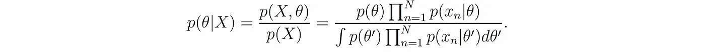

**方程式 1。**后验分布

贝叶斯统计是美丽的，自洽的，优雅的:一切都是使用概率论的规则自然得出的，假设总是清晰明了的。但往往看起来神秘而令人费解:(一)关于底层分布 *q* 我们真的能从后验分布 *p(θ|X)* 中学到什么？以及(ii)如果我们的假设不成立，例如，如果 *q* 不属于我们考虑的参数族，该信息的可靠性如何？

在本文中，我的目标是获得关于这两个问题的一些直觉。我首先分析当样本数 *N* 很大时后验分布的渐近形式——这是一种研究贝叶斯推理的频率主义方法。第二，我展示了一般理论如何应用于高斯家族的简单情况。第三，我使用模拟和分析，对于三个案例研究，后验分布如何与数据的基本分布相关，以及这种联系如何随着 *N* 的增加而变化。

# 理论:大 *N* 的渐近情况

等式 1 中的后验分布的对数可以重新表示为

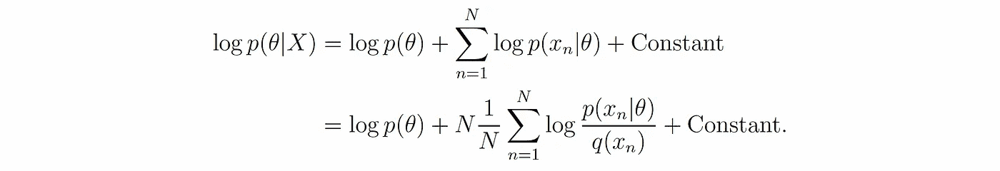

**方程式 2。**对数后验分布

等式 2 中的常数(相对于 *θ* )仅对于归一化后验概率分布是重要的，并不影响它如何作为 *θ* 的函数而变化。对于较大的 *N* ，我们可以使用大数定律，并通过下式近似等式 2 中的第二项([对数似然](https://en.wikipedia.org/wiki/Likelihood_function)的总和)

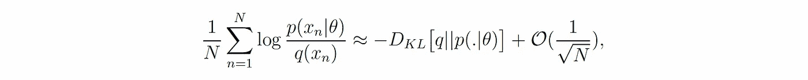

其中 *D-KL* 是 [Kullback-Leibler 散度](https://en.wikipedia.org/wiki/Kullback%E2%80%93Leibler_divergence)并且测量真实分布 *q* 和参数分布 *p(.|θ)* 。然而，重要的是要注意，只有当 *log p(x|θ)* 的均值和方差(相对于 *q* )对于某个参数 *θ* 是有限的时，近似才有效。我们将在下一节中进一步讨论这个条件的重要性。

如果 *p(θ)* 在参数空间上具有完全的[支持](https://en.wikipedia.org/wiki/Support_(mathematics))(即，总是非零)，那么 *log p(θ)* 总是有限的，并且对于大的 *N* ，等式 2 中的主导项是 *D-KL [q || p(。|θ)]* 乘以 *N.* 这意味着增加样本数 *N* 会使后验分布 *p(θ|X)* 越来越接近该分布

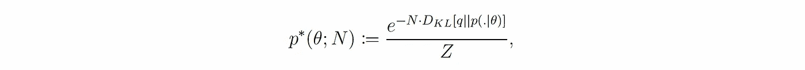

**方程式 3**

其中 *Z* 是归一化常数。*p *(θ；N)* 是一个有趣的分布:它的最大值是散度 *D-KL [q || p(.|θ)]* 最小(即当 *p(。|θ)* 尽可能接近 *q* ，其对*D-KL【q | | p(。|θ)]* 随着样本数 *N* 的增加而增加(即，随着 *N* 的增加，其最大值附近变得更加“狭窄”)。

## 当假设正确时

当假设正确并且存在一个 *θ** 时，我们有 *q = p(。|θ*)* ，那么

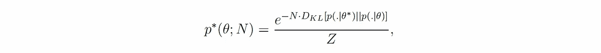

其中*D-KL【p(。|θ*) || p(。|θ)】*是 *θ* 和 *θ** 之间的伪距离。因此，随着 *N* 的增加，后验分布集中在真实参数 *θ** 附近，为我们提供了完全识别 *q —* 所需的所有信息，见脚注。

## 当假设是错误的时候

当没有 *θ* 时，我们有 *q = p(。|θ)* ，那么我们永远无法识别真正的底层分布*q*——仅仅是因为我们没有在正确的地方搜索！我们强调，这个问题不限于贝叶斯统计，并扩展到任何参数统计方法。

虽然在这种情况下我们永远无法完全确定 *q* ，但是后验分布仍然提供了关于 *q* 的信息:如果我们将 *θ** 定义为 *q* 在参数族空间上的伪投影的参数:

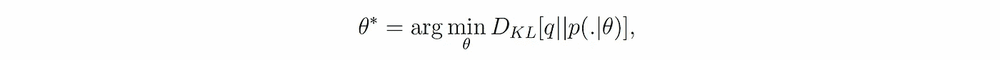

然后，随着 *N* 的增加，后验分布集中在 *θ** 附近，给我们足够的信息来识别参数族中的最佳候选值*q*——参见 footnote⁴.

## 中间总结

随着 *N* 的增加，后验分布集中在参数 *θ** 附近，该参数描述了参数族中最接近实际分布 *q* 的分布。如果 *q* 属于参数族，那么最接近 *q* 的分布就是 *q* 本身。

# 示例:高斯分布

在上一节中，我们研究了大量样本的后验分布的一般形式。在这里，我们研究一个简单的例子，看看一般理论如何应用于具体情况。

我们考虑一个简单的例子，其中参数分布是高斯分布，单位方差和平均值等于 *θ* :

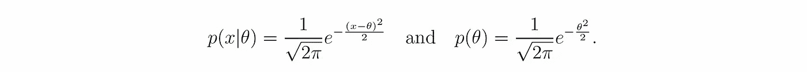

为简单起见，我们将标准正态分布视为先验 *p(θ)* 。使用等式 1，很容易表明后验分布为

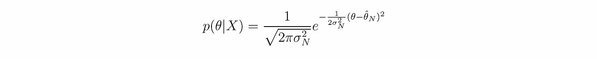

随着

现在，我们还可以确定*p *(θ；N)* (见等式 3)并将其与后验分布进行比较:只要真实分布的均值和方差 *q* 是有限的，我们就有

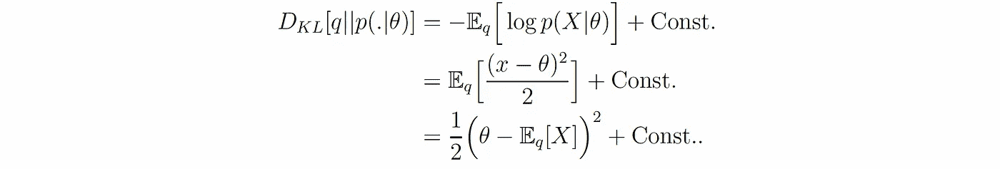

因此，我们可以写出(使用等式 3)

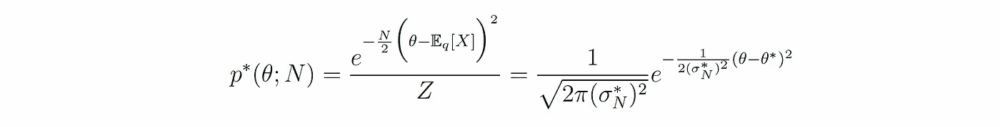

随着

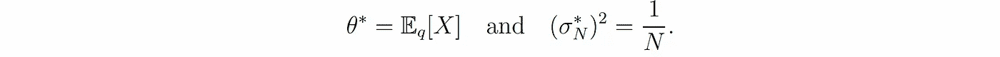

**方程式 4**

如一般理论所料，我们可以用*p *(θ；N)* 为大 *N* 因为

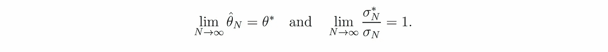

总而言之， *p(θ|X)* 集中在基础分布 *q* 的真实均值附近——如果它存在的话。

# 模拟:好的、坏的和丑陋的

我们的理论分析有两个关键的假设:(i) *N* 很大，以及(ii)log*p(x |θ)*的均值和方差(相对于 *q* )对于某些 *θ* 是有限的。在本节中，我们使用模拟来研究如果这些假设不成立，我们的发现有多可靠。

为此，我们考虑上一节中示例的简单设置，即具有单位方差的高斯分布族。然后，我们考虑 *q* 的三种不同选择，分析后验 *p(θ|X)* 随着 *N* 增加的演化。

另外，我们还看看[最大后验概率(MAP)估计值](https://en.wikipedia.org/wiki/Maximum_a_posteriori_estimation) *q-MAP-N* *= p(。 *q* 的|θ-hat-N)* 随着 *N* 的增加而演化，其中 *θ-hat-N* 是 *p(θ|X)* 的最大化器。这有助于我们理解，通过查看后验 distribution⁵.的最大化器，我们可以多么精确地识别真实分布

## 好:[高斯分布](https://en.wikipedia.org/wiki/Normal_distribution)

对于第一种情况，我们考虑最好的情况，即 *q* 属于参数族，并且满足所有假设:

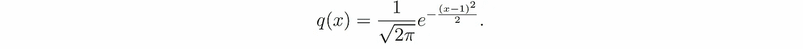

**方程式 5。**等价于 q(x)=p(x|θ=1)

我们从 *q* 抽取 10000 个样本，通过将抽取的样本对 *N = 1* 到*10000*逐一相加，得到后验分布 *p(θ|X=(x1，…，xN))* 和 MAP 估计 *q-MAP-N —* (图 1)。我们观察到当 *N* 增加(图 1，左侧)时 *p(θ|X)* 集中在真实参数周围，并且 MAP 估计收敛到真实分布 *q* (图 1，right)⁶.

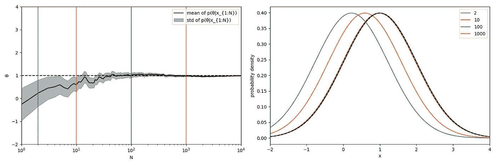

**图一。高斯分布为 q.** 左图:作为 n 的函数的后验分布的均值(黑色实曲线)和标准差(灰色阴影区域)黑色虚线表示 q=p(.|θ=1).后验分布收敛于真实参数。垂直彩色线条显示 N=2、10、100 和 1000。右图:N=2、10、100 和 1000 时 *q* 的 MAP 估计值(彩色曲线)。黑色虚线表示真实的分布 q。

## 坏:[拉普拉斯分布](https://en.wikipedia.org/wiki/Laplace_distribution)

对于第二种情况，我们考虑将单位均值的拉普拉斯分布作为真实分布:

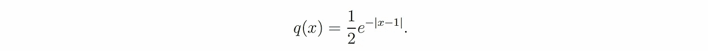

在这种情况下， *q* 不属于参数族，但它仍然具有有限的均值和方差。因此，根据理论，后验分布应该集中在参数族上 *q* 的伪投影的参数 *θ** 周围。以高斯族为例， *θ** 始终是底层分布的均值，即 *θ* = 1* (见等式 4) *。*

我们的模拟显示随着 *N* 的增加 *p(θ|X)* 确实集中在 *θ* = 1* 附近(图 2，左侧)。然而，MAP 估计收敛到一个与真实分布 *q* (图 2，右)完全不同的分布，这仅仅是因为我们在高斯分布中搜索拉普拉斯分布！这本质上是任何参数统计方法的问题:**如果搜索错了地方，就找不到正确的分布！**

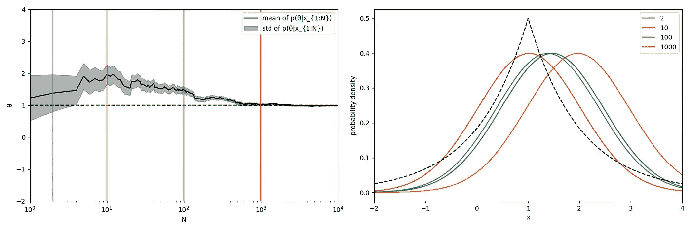

**图二。拉普拉斯分布为 q.** 左图:后验分布的均值(黑色实曲线)和标准差(灰色阴影区域)为 n 的函数，黑色虚线表示 q 在参数族上的伪投影对应的参数，即θ*=1(见方程 4)。后验分布收敛于θ*。垂直彩色线条显示 N=2、10、100 和 1000。右图:N=2、10、100 和 1000 时 q 的 MAP 估计值(彩色曲线)。黑色虚线表示真实的分布 q。

## [柯西分布](https://en.wikipedia.org/wiki/Cauchy_distribution)

对于我们的第三种也是最后一种情况，我们选择最差的情况，并将柯西分布(著名的[重尾分布](https://en.wikipedia.org/wiki/Heavy-tailed_distribution))视为真实分布:

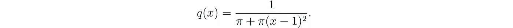

在这种情况下， *q* 不属于参数族，但更关键的问题是柯西分布没有明确定义的均值或有限方差:所有理论的假设都被违反了！

我们的模拟显示， *p(θ|X)* 并不收敛于任何分布(图 3，左侧): *p(θ|X)* 的标准差趋于零，并集中在其均值附近，但均值本身并不收敛，而是从一个值跳到另一个值。问题是基本的:柯西分布和高斯分布之间的 KL 散度是无限的，与它们的参数无关！换句话说，根据 KL 散度，所有的高斯分布都与 *q* 等距(且无限远)，所以不存在挑哪一个作为其估计的偏好！

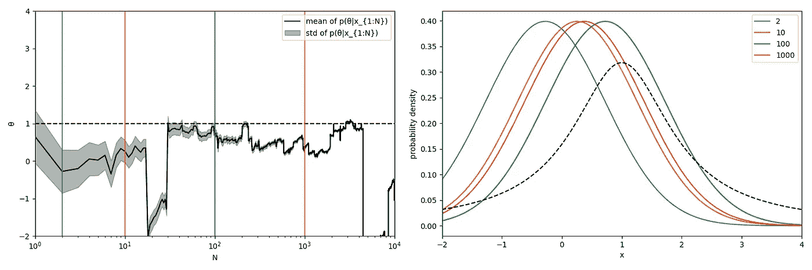

**图三。柯西分布如 q.** 左图:作为 n 的函数的后验分布的均值(黑色实曲线)和标准差(灰色阴影区域)，黑色虚线表示 q 的中值:如果 q 有均值，那么由于对称性，该均值将等于 1。后验分布不收敛于任何分布，其均值从一个值跳到另一个值。垂直彩色线条显示 N=2、10、100 和 1000。右图:N=2、10、100 和 1000 时 q 的 MAP 估计值(彩色曲线)。黑色虚线表示真实的分布 q。

# 结论

如果我们假设的参数分布族与真实分布 *q* 没有*太大差异*，那么后验分布总是集中在一个参数周围，该参数在某种程度上提供了关于 *q* 的信息。然而，如果 *q* 不在参数族中，该信息可能只是边缘信息，并不真正有用。最坏的情况是当 *q* 与*参数族中的任何分布*相差太大时:在这种情况下，后验分布是无信息的。

# 承认

感谢 [Johanni Brea](https://scholar.google.ch/citations?user=nZ0m0xUAAAAJ&hl=de) 、 [Navid Ardeshir](https://mathblasphemy.netlify.app/) 、Mohammad Tinati、 [Valentin Schmutz](https://scholar.google.com/citations?user=I2ihecwAAAAJ&hl=en) 、 [Guillaume Bellec](http://guillaume.bellec.eu/) 和 [Kian Kalhor](https://scholar.google.com/citations?user=1VhZtgoAAAAJ&hl=en) 对相关主题的多次讨论。

# 代码:

用于分析的所有代码(用 [Julia](https://julialang.org/) 语言)可以在[这里](https://github.com/modirshanechi/medium_notes/blob/master/MediumRandomNotes/notebooks/Gaussian%20Posterior.ipynb)找到。

# 脚注:

有多个优秀的开放存取教科书，感兴趣的读者可以在其中找到更多关于贝叶斯统计的信息:布拉德利·埃夫隆和特雷弗·哈斯蒂的[1] " [计算机时代统计推断](https://hastie.su.domains/CASI/)；安德鲁·格尔曼等人的[2] " [贝叶斯数据分析](http://www.stat.columbia.edu/~gelman/book/)；大卫·麦凯的[3] " [信息论、推断和学习算法](https://www.inference.org.uk/itila/)。此外，参见脚注 3 和 4 以及本[在线课程](https://web.stanford.edu/class/archive/stats/stats200/stats200.1172/lectures.html)。

一个有趣的练习是估计 *p(θ|X)* 和*p *(θ；N)* 都是。作为提示，请注意，您可以在*p *(θ；的最大化器周围使用不同分布的泰勒展开式。N)* 。好奇的读者可能也想思考这些结果告诉我们关于参数 *θ的最大似然估计的什么。*

要了解更多关于贝叶斯推断的渐近一致性，你也可以看看 [Barron et al. (1999)](https://projecteuclid.org/journals/annals-of-statistics/volume-27/issue-2/The-consistency-of-posterior-distributions-in-nonparametric-problems/10.1214/aos/1018031206.full) 和 [Walker (2004)](https://projecteuclid.org/journals/annals-of-statistics/volume-32/issue-5/New-approaches-to-Bayesian-consistency/10.1214/009053604000000409.full) 这两个众所周知的例子。

要了解更多关于模型错误设定下的统计推断，可以看看[kle ijn and van der vaart(2006)](https://projecteuclid.org/journals/annals-of-statistics/volume-34/issue-2/Misspecification-in-infinite-dimensional-Bayesian-statistics/10.1214/009053606000000029.full)、[kle ijn and van der vaart(2012)](https://projecteuclid.org/journals/electronic-journal-of-statistics/volume-6/issue-none/The-Bernstein-Von-Mises-theorem-under-misspecification/10.1214/12-EJS675.full)、 [Wang and Blei (2019)](https://arxiv.org/abs/1905.10859) 等几个众所周知的例子。

⁵我们还可以研究[后验预测分布](https://en.wikipedia.org/wiki/Posterior_predictive_distribution)*q-PPD-n(x)**= p(x | x)=∫p(x |θ)p(θ| x)dθ*如何随着 *N* 的增加而演变。在我们同时具有高斯先验和高斯似然的设置中，我们有 *q-MAP-N(x)* *=* 正常 *(x|μ=θ-hat-N，σ =1)* 和 *q-PPD-N* *=* 正常 *(x|μ=θ-hat-N，σ =1+1/(N+1))* 。因此，我们对 *q-MAP-N* 的所有定性观察对于 *q-PPD-N* 也是正确的。

⁶有趣的练习给感兴趣的读者:你能计算出作为 *q* 方差函数的收敛速度吗？根据你的计算，你在图中看到的有意义吗？