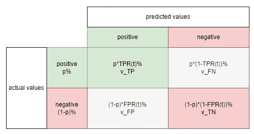
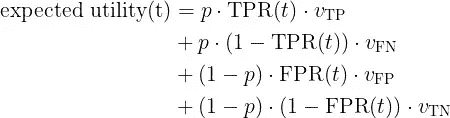
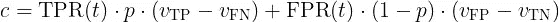
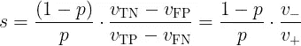
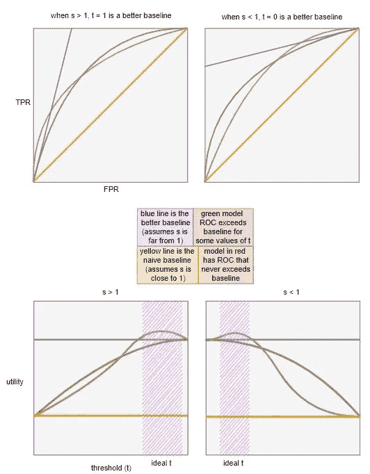

# 科学家能从经济学家那里学到什么

> 原文：<https://towardsdatascience.com/what-data-scientists-can-learn-from-economists-a08b40c13fee>

我最近看到两篇文章(第一部分 [1](http://nicolas.kruchten.com/content/2016/01/ml-meets-economics/) 和第二部分 [2](http://nicolas.kruchten.com/content/2016/04/ml-meets-economics2/) )将 ROC 图背后的思想归纳为一个更广泛的经济学驱动的模型选择框架。这是一个更广泛的值得关注的话题的一部分，但通常被完全排除在讨论之外。事实上，“像经济学家一样思考”的能力是大多数数据科学家应该拥有的绝对必要的*技能*，而且它是可以学习的。请记住，对于局外人来说，数据科学家就像谚语中的拿着锤子的人，对他来说，每个问题都像钉子。我们应该学会展示我们的“模型”为一个给定的用例提供的真正价值(如果有的话),并且用我们的观众能够理解的术语来表达。换句话说，我们应该根据每美元能产生多少*效果来评估我们的模型，但是我们经常仅仅停留在效果上(例如，高精度，AUC，等等)，而忽略了美元(货币成本和收益)。让我们改变这种心态。*

每当我们在复杂的权衡面前犹豫不决时，一个想法是尝试快速**利弊分析**:对于每一个可能的结果，我们写下利弊，并找到一种方法将它们添加到一个单一的“目标”中，以表达我们对每个结果的总体满意程度。经济学家称之为**效用**。效用通常用货币术语来表达，但在更抽象的层面上，效用表达的是我们从给定结果中获得的净“收益”或“满意度”(如果效用为负，则是“不满意度”)。由于多种结果是可能的，我们可以通过给每种结果分配一个概率来表达我们的不确定性，并通过对所有可能结果的效用进行平均来计算**预期效用**。

同样，如果机器学习模型的预期效用大于它试图取代的任何过程，那么它就值得部署，这被称为**基线**。基线可能是某个人抛硬币决定的，但这在实践中不太可能。更有可能的是基于规则的过程或现有的机器学习模型，我们声称新模型可以对其进行改进。对于这篇文章，我们把重点放在**二进制分类**和 **ROC 图**作为我们的例子，因为它传达了主要思想，并且有一个很好的视觉效果，但是我们可以在其他上下文中应用类似的思想。

要复习二进制分类和 ROC 图，请阅读[上一篇文章](/the-intuition-behind-roc-plots-614a6053af83)。从那篇文章中得出的结论是，我们在比较机器学习模型时必须小心，因为在竞争目标之间存在**权衡**，例如最大化**真阳性**，同时最小化**假阳性**。由于经济学大致上是研究人们在面临约束和不确定性时如何做出决策，因此在相互竞争的目标之间找到正确的平衡是大多数经济学家非常熟悉的事情。解决方案在于使用**期望效用**来驱动数据科学中的**模型选择**，从而改进传统的评价指标。让我们现在进入杂草。

因为我们的例子是基于二进制分类，一个好的起点是我们的老朋友**混淆矩阵**。回想一下， **TP** s、 **FN** s、 **FP** s 和 **TN** s 的计数取决于阈值 **t** ，标准化度量 **TPR** 和 **FPR** 也是如此，它们可以从计数中导出。我们现在向混淆矩阵中的每个单元格添加两种数据点(如下所示):

*   在第一行中，我们有每个单元的预期比例，它取决于由 **TPR(t)** 和 **FPR(t)** 判断的**类比例**(正类的 **p** 和 **1-p** )和**模型性能**。
*   在第二行，我们得到了这个单元的效用。例如，如果结果是 **TP** ，那么 **v_TP** 是与该结果相关的效用，给我们左上角的单元格。通常能够定义这样一个效用函数是经济学家被雇佣的首要原因，但是我们认为这样一个函数的存在是理所当然的。在制造环境中，一个 **TP** 是我们卖给一个满意客户的工作产品。一个 **FN** 是我们丢弃的工作产品，因为我们的模型被错误地识别为有缺陷，一个 **FP** 是我们的模型遗漏的有缺陷的产品，我们把它卖给了一个不知情的客户，最后一个 **TN** 是我们由于我们的模型识别的实际故障而丢弃的产品。我们可以开始想象在每种情况下计算成本的方法，但是我们在这里关心的是由 **v_TP** 、 **v_FN** 、 **v_FP** 和 **v_TN** 给出的最终结果。这些代表了每种情况导致的收益(温暖和模糊的感觉，如果你喜欢的话)或损失(下沉的恐惧的感觉，如果你喜欢的话)。所以效用可以是正的，也可以是负的。**预期效用**是这四个值的加权平均值，按每个值的概率加权。

作者图片

注意，我们使用了这样一个事实:FNR(t) = 1-TPR(t) 和 **TNR(t) = 1-FPR(t)** 来将期望效用写成 TPR 和 FPR 的函数。由于 **TPR** 和 **FPR** 是阈值 **t** 的函数，**预期效用**也是 **t** 的函数，连同其他输入。因此，我们可以通过两种方式来可视化预期效用:(1)绘制效用曲线(称为**无差异曲线**)作为 **TPR** 和 **FPR** 的函数，以便我们可以在 ROC 空间中可视化它，以及(2)绘制预期效用作为 **t** 的函数，以便我们可以在模型选择期间找到 **t** 的最佳值。我们将在这里两者都做，但首先让我们做一些数学。

当两个结果具有相同的预期效用时，我们说我们对这两个结果不感兴趣。因此，为了在 ROC 空间中可视化效用，我们可以通过将期望效用设置为某个常数，并根据 **TPR** 和 **FPR** 求解该方程，来绘制无差异曲线。由于 **TPR** 和 **FPR** 是相互竞争的目标，我们应该看到一个*正*斜率，表明 **TPR** 中*增加*的任何收益至少在一定程度上被由于 **FPR** 增加而产生的*成本*抵消。无差异曲线的斜率 s 决定了我们愿意用 TPR**换取 FPR**的比率。我们如何找到 s？我们采用上面的期望效用方程，将其设置为某个常数，然后尝试根据 **TPR** 和 **FPR** 重写它，将所有其他项移动到左侧的单个常数，我们称之为 **c** 。经过所有的代数重组后，结果如下:****

现在我们从基础微积分中知道一个写为 **c = yb + xa** 的方程在 **x-y 空间**中是**线性**并且有一个**斜率**由 **-a/b** 给出。这意味着将期望效用设置为等于某个常数描绘出无差别“曲线”，即在 **TPR-FPR 空间**中的*直线*。线的斜率由下式给出

斜率有一个直观的意义，所以让我们解开它。正如我们在上面看到的，它被分成两部分:第一项**是类比例的比率(负对正)，第二项**是正确分类的效用减去错误分类的效用的比率(负对正)。因此，第一项考虑了每一类的相对权重，第二项考虑了每一类的相对“性价比”。我们现在拥有了像经济学家一样评估我们的模型所需要的一切。****

回想一下，由于 **TPR** 和 **FPR** 之间的权衡，导致 **s > 0** 。在机器学习课程中，我们了解到，对于二元分类，我们可以绘制 ROC 图，并使用 45 度线作为我们的**基线**，我们认为这是通过投掷**无偏硬币**来随机猜测类别的“模型”。但实际上，即使对于基线来说，这也是一个相当低的门槛，只有当 **s** 接近 1 时才有意义。否则，我们需要使用一个不那么幼稚的基线。这通过 ROC 空间中的蓝色无差别曲线(顶部两个图)或通过绘制预期效用与阈值 **t** (底部两个图)来显示:

作者图片

*   当 **s = 1** 时，组成 **s** 的两个术语之间有一种平衡，这意味着每个类别的相对比例由我们对其进行正确分类所获得的“有利可图”来平衡。在这种情况下，**黄线**可以作为我们的基线。请注意，按照这个标准，绿色和红色模型都很好地超越了基线。
*   在 ***左侧*** 我们有 **s > 1** ，这意味着(a) **负面类别**比正面类别多，或者(b)就效用而言，正确分类负面类别比正确分类正面类别多，或者(a)和(b)都成立。在这种情况下，一个好的起始基线是设置 **t = 1** ，这意味着我们**总是拒绝**，导致 **FPR = 0** 和 **TPR = 0** ，我们可以使用它们作为输入来计算预期效用并描绘出**蓝色**所示的无差异曲线，作为我们的新基线。请注意，无论 **t** 如何，红色模型总是低于基线，而绿色模型在接近 1 的 **t** 的一些值(对应于 ROC 图的*左下角*)超过基线。
*   在右手边的*上，我们有 **s < 1** ，这意味着(a) **正类**超过负类，或者(b)就效用而言，正确分类正类超过正确分类负类，或者(a)和(b)都成立。在这种情况下，一个好的起始基线是设置 **t = 0** ，这意味着我们**总是接受**，导致 **FPR = 1** 和 **TPR = 1** ，我们可以使用它们作为输入来计算预期效用并描绘出**蓝色**所示的无差异曲线，作为我们的新基线。请注意，无论 **t** 如何，红色模型总是低于基线，而绿色模型在 **t** 的某些值接近 0 时超过基线(对应于 ROC 图中的*右上角*)。*

*事后看来，这一切似乎很直观，但使用无差异曲线，我们将这一想法形式化。相当令人印象深刻！总之，通过测量预期效用，我们能够在模型选择过程中做出更明智的决策，以业务约束为指导，而不仅仅是测试数据上的模型性能。*