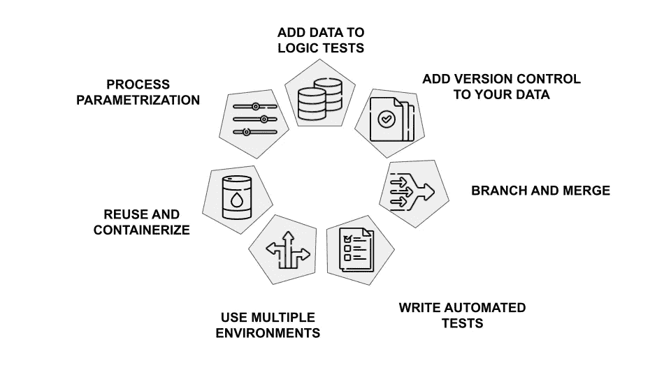
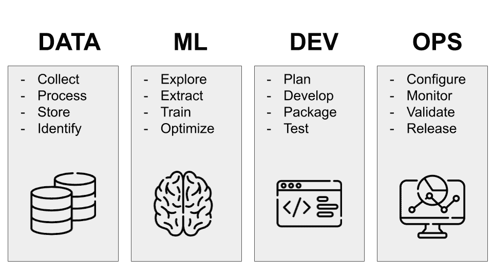

# DataOps 到底是什么

> 原文：<https://towardsdatascience.com/what-dataops-is-exactly-c895a47421ae>

## 软件部署

## DataOps 概述以及它与其他开发运维实践的不同之处

照片由[法比奥](https://unsplash.com/@fabioha?utm_source=medium&utm_medium=referral)在 [Unsplash](https://unsplash.com?utm_source=medium&utm_medium=referral) 上拍摄

很难夸大数据在现代企业中的重要性。作为一个新的流行词，DataOps 旨在帮助组织克服数据分析过程中的障碍。**但是这种新兴的实践到底是什么，它如何帮助企业更好地利用他们的数据？**在本文中，我们将通过观察 DataOps 的各个方面并研究它补充其他 DevOps 和 MLOps 实践的方式，来探索 data ops 变得有多重要。

文章组织如下:

*   什么是数据操作
*   数据操作的七个步骤
*   数据操作 vs 操作
*   数据操作工具

# 1 什么是数据操作

DataOps 是将 DevOps 原则应用于数据生命周期的结果。DataOps 的基本理念是，**“如果您围绕这一点构建一个系统，使大量监控、部署和协作实现自动化，您的工作效率就会大大提高，您的客户也会更加满意，最终您会做得更好。”**

DataOps 专注于三个流程:

*   **减少错误**，提高您的客户数据信任度。实际上，你应该监控所有的软件，目的是检查你正在做的事情。
*   **部署的周期时间，**这涉及到你能以多快的速度将新模型、新数据集和新可视化从你的脑海中带入生产。这一方面涉及速度和风险。
*   **提高团队生产力**，减少会议和协作的次数。

所有先前定义的过程都是可度量的，您应该度量它们。例如，您应该衡量回答以下问题的指标:

*   你的团队做了多少工作？
*   东西多久坏一次？
*   你把新东西投入生产的速度有多快？

这些都是非常重要的指标。与其说是关于数据科学或数据工程。你总是优化整体而不是局部。这个想法是向人们展示你的工作，从他们那里获得反馈，然后重复这个反馈。

# 2 数据运营的七个步骤

数据操作包括以下七个步骤:

作者图片

*   **向逻辑测试添加数据，**从 DevOps 移至 DataOps。
*   把你的代码放到版本控制中。不要把它放在你硬盘的某个地方或者文件共享上。您可以使用 Github 或 GitLab 之类的框架。
*   **分支合并**。当你在开发中改变一些东西时，运行自动化测试来判断回归或影响分析。如果你改变了后端的一些东西，你能够以一种非常简单的方式判断前端是否坏了。
*   **编写在生产中运行的自动化测试**。您应该测试您的代码是否按预期运行。
*   **使用多种环境**。许多开发人员在生产级别处理同一个项目可能会导致冲突。因此，每个团队成员都可以在项目的本地副本上工作是很重要的。
*   **再利用和集装箱化**。您应该重用您的代码，并使它在您的本地机器上独立工作。由于这个原因，你应该用容器包装你的软件，比如 docker。
*   **过程参数化**，让你的软件管道灵活应对变化。

你可以在[这个链接](https://em360tech.com/sites/default/files/2020-07/Data-Kitchen_WP_7Steps_710816A_LR.pdf)找到更多关于数据操作七个步骤的信息。

要运行您的测试，您可以使用诸如 Great Expectations 这样的工具。然而，您也可以自己编写测试，在很多方面都非常简单。例如，您可以进行行数检查，或者编写 SQL 查询来进行测试。

所以整个想法是这些测试:

*   应该自动完成，
*   处于版本控制中
*   生产期间运行，
*   在开发过程中运行。

实际上，大约 10%的工作应该是开发自动化测试。

# 3 数据操作与多操作

DataOps 和 MLOps 有什么区别？它们是一样的还是不同的？

对此有两个答案。**从一个工程师的角度来看，答案是否定的**也是同样的想法。只是 DevOps 应用于数据，所以你叫它 DataOps 或者 MLOps。

**从更一般的角度来看，答案是肯定的。**您可以使用术语 DataOps 来包含数据、模型、可视化和治理。DataOps 的目标是优化整体，而不仅仅是一个部分。

更正式的说法是，DataOps 是构建组织的数据基础架构的概念，这种方式不仅能让您的组织表现更好，还能更加敏捷。不仅仅是有好的数据；这是关于拥有值得信赖和可靠的数据。

数据运营可以带来以下好处:

*   提高数据质量
*   提高数据速度
*   提高数据效率
*   提高数据的准确性
*   提高使用相同数据集的团队或部门之间的一致性(即减少错误)

下图显示了数据、机器学习、开发和运营的具体重点:

作者图片

# 4 个数据操作工具

DataOps 工具自动化并简化了数据生命周期的所有部分。它们提高了组织数据管理的灵活性，并加快了用户数据分析的速度。

有四种类型的数据操作工具:

*   **一体化工具**，专注于数据管理，如数据摄取、转换、分析和可视化。
*   **DataOps 编排工具**，允许您以集中的方式管理复杂的数据管道。
*   **组件工具**，只关注整个管道的单个组件。
*   **案例专用工具**，专注于特定领域。

一些流行的数据操作工具包括[远大前程](https://greatexpectations.io/)、[数据表单断言](https://dataform.co/blog/data-assertions)、[蒙特卡洛](https://www.montecarlodata.com/)和 [dbt 测试](https://docs.getdbt.com/docs/building-a-dbt-project/tests)。

# 摘要

恭喜你！您刚刚学习了数据操作背后的基本概念！

DataOps 方法对任何公司来说都是一个强大的工具，值得花时间来了解该框架及其优势。要记住的最重要的事情是，这个实践是关于协作的。

它是关于建立一种文化，在这种文化中，从工程师到数据科学家的每个人都与他们的利益相关者一起工作，以便更快、更有效地产生数据驱动的结果。

这篇文章的内容受到了克里斯托弗·伯格在 DataTalks.Club 的播客插曲 [Storytime for DataOps](https://datatalks.club/podcast/s08e05-storytime-for-dataops.html#the-essence-of-dataops) 的启发。

*原贴于* [*DataTalks。*](https://datatalks.club/blog/what-dataops-exactly.html) *俱乐部。*

# 相关文章

</how-to-run-a-data-science-project-in-a-docker-container-2ab1a3baa889>  </model-evaluation-in-scikit-learn-abce32ee4a99>  </how-to-build-a-web-app-with-data-ingested-through-versatile-data-kit-ddae43b5f62d>  

# DevOps 和 MLOps 是一回事吗？

DevOps(开发和运营)是一组尝试在开发和运营团队之间建立协作的最佳实践，目的是尽可能自动化软件部署过程。

在过去十年中，DevOps 部门取得了很大进展，达到了… [继续阅读](/are-devops-and-mlops-the-same-thing-c21961a43a56)。