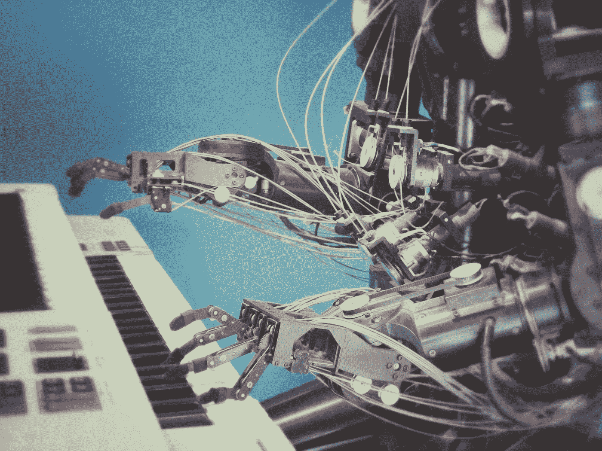

# 1966 年制造的一个聊天机器人告诉了我们关于人类语言的什么？

> 原文：<https://towardsdatascience.com/what-did-a-chat-bot-made-in-1966-tell-us-about-human-language-886613a16a7f>

## 语言是人类智力水平的典型标志。但是对计算机来说，进行对话到底有多难呢？

亚历山大·沙托夫在 [Unsplash](https://unsplash.com?utm_source=medium&utm_medium=referral) 上拍摄的照片

今年早些时候，谷歌的一名工程师发表了一项声明:他认为 LaMDA——谷歌的内部语言模型——具有感知特征。伴随公告的是几页文字记录，包括他和机器之间的对话。这些对话极其逼真，就好像是两个人之间的对话。这些文字记录在主要的新闻网络上被大量报道，争论着 LaMDA 是否真的有自我意识和智慧。许多机器学习和人工智能研究人员，如 [Yann Lecun](https://www.nytimes.com/2022/06/12/technology/google-chatbot-ai-blake-lemoine.html) 、[戴密斯·哈萨比斯](https://www.youtube.com/watch?v=6HZUn4qpP_A)和 [Yannic Kilcher](https://www.youtube.com/watch?v=mIZLGBD99iU) ，都持否定立场。他们认为 LaMDA 是一个令人印象深刻的语言模型，但远非真正的智能。

这在人工智能领域并不是新闻。50 多年前，另一个聊天机器人是使用基本的语言规则创建的。令人惊讶的是，它愚弄了比预期更多的人，让他们认为它是智能的。

# 治疗师

Joseph Weizenbaum 静静地看着他的测试对象向计算机终端输入命令。测试对象正在与伊莱扎对话，伊莱扎是一个被设计成治疗师的计算机程序。

那是在 1966 年左右。在这一点上，Weizenbaum 已经在计算机上工作了很长时间。他开始从事模拟计算机的工作，模拟计算机使用真空管和液压系统代替晶体管。他帮助开发了早期的数字计算机，后来在 1955 年开发了第一台银行计算机。无论如何，他是计算机领域的先驱。

但韦岑鲍姆本质上是一个人道主义者。他经常想知道智能的本质以及人和机器之间的关系。即使在那个时候，人工智能作为一个领域已经开始蓬勃发展。提出了建立和判断智力的竞争性技术和定理。其中最著名的可能是图灵测试。在图灵测试中，人类会通过与未知系统对话来评估该系统，并根据对话的质量来判断该系统是否具有人类智能。

在 [Unsplash](https://unsplash.com?utm_source=medium&utm_medium=referral) 上由 [Ugi K.](https://unsplash.com/@wizzyfx?utm_source=medium&utm_medium=referral) 拍摄的照片

图灵测试的简单性可能会让韦岑鲍姆产生怀疑。毕竟，这是一个非常主观的测试，完全基于语言。所以他研究了分割语言的不同方法，以便将陈述转换成答案。以下面的语句为例:

> *看来* **你***讨厌* **我**。

Weizenbaum 注意到，通过只识别重要的单词和短语，如“你”和“我”,并丢弃其余的，句子可以形式化为

> *X*你 Y我。

然后可以转化成一个问题

> *为什么你觉得我****讨厌你****？*****

****他还可以对单词和短语的重要性进行排序。拿下面这句话来说:****

> ******我**知道大家都在嘲笑我**我**。****

****单词“我”和“我”被突出显示，但是 Weizenbaum 注意到当人们使用“每个人”时，他们经常谈论特定的人。因此，短语“每个人”具有更高的优先级，可以使用不同的答案****

> *****谁特别嘲笑过* **你** *？*****

****这是韦岑鲍姆会话体系的基础。他把这个程序命名为伊莱扎，以剧中学习如何与他人交谈的主角“皮格马利翁”命名。伊莱扎用过各种剧本，其中最成功的叫做《医生》。医生模仿了颇有影响的心理学家卡尔·罗杰斯的治疗风格。****

****这让我们回到了 1966 年。韦森鲍姆正在观察他的实验对象与伊莱扎的互动。受试者在屏幕上打字，伊莱扎回复了医生的脚本:****

> ****人类:男人都一样。****
> 
> ****电脑:用什么方式？****
> 
> ****人类:他们总是为这样或那样的事情烦我们。****
> 
> ****计算机:你能想出一个具体的例子吗？****
> 
> ****人类:嗯，我男朋友让我来的。****
> 
> ****电脑:你男朋友让你来的****
> 
> ****人类:他说我大部分时间都很沮丧。****
> 
> ****电脑:听说你很沮丧，我很难过****
> 
> ****人类:是真的。我不开心。****

********

****照片由[艾蒂安·布朗热](https://unsplash.com/@etienneblg?utm_source=medium&utm_medium=referral)在 [Unsplash](https://unsplash.com?utm_source=medium&utm_medium=referral) 上拍摄****

****过了一会儿，这个人转过身来，礼貌地请 Weizenbaum 走出房间，以便给她一些隐私。这让 Weizenbaum 大吃一惊——他的测试对象使用一个不到 200 行代码的程序，体验了一次接近真实的治疗过程！****

# ****到底发生了什么？****

****伊莱扎去说服许多其他人，他们正在与它进行有意义的对话。20 世纪 70 年代的一则轶事说，一位销售主管与它交谈，认为他在与麻省理工学院的一位客户交谈。伊莱扎可能不是真正的智能，今天我们可以构建更高级的语言模型，但它在构建自然语言系统方面教会了我们许多宝贵的经验。****

## ****语言模型不一定要好到可信****

********

****威廉·纳瓦罗在 [Unsplash](https://unsplash.com?utm_source=medium&utm_medium=referral) 上的照片****

****伊莱扎如此成功的原因后来被描述为伊莱扎效应。事实证明，人类倾向于给我们连接的计算机程序赋予人类的特征。这就是为什么史蒂夫·乔布斯想让麦金塔说“你好”的原因。这也是为什么尽管语言模型直到最近才变得好，但聊天机器人已经在商业上存在了很长时间。ELIZA 中使用的启发式方法——扫描重要的单词，然后对它们进行排序以确定响应——现在仍在许多聊天机器人中使用。假设你正在为一家披萨外卖公司编写一个聊天机器人。您首先收到一个提示。****

> *****我要一份* **大披萨** *配* ***芝士*** *和* **腊肠** **浇头送来** **尽快** *。*****

****然后，你可以扫描重要的词，并提供适当的答复。****

> *****一份* **大披萨*****芝士** *配* **意大利腊肠** *，马上来！你要把它* **送到哪里** *？******

*****也许 ELIZA 最令人惊讶的方面是它是多么简单——它的整个工作过程用了不到 10 页的篇幅来描述。正如 Ian Goodfellow 在《深度学习》一书中所说:*****

> *****在许多情况下，使用简单但不确定的规则比复杂但确定的规则更实际[……]*****

## *****通过图灵测试容易吗？*****

**********

*****布雷特·乔丹在 [Unsplash](https://unsplash.com?utm_source=medium&utm_medium=referral) 上的照片*****

*****许多人认为 ELIZA 应该被认为是第一个通过图灵测试的程序。许多人用伊莱扎作为例子，说明图灵测试在判断智力方面是不完全的。还记得 LaMDA，那个对话被发表的语言模型吗？你会说对话的质量意味着 LaMDA 有类似智力的东西吗？这仅仅是一个统计结果，仅仅是一个算法的结果吗？还是两者是一回事？*****

*****1980 年，哲学家约翰·塞尔提出了一个名为“中国房间”的思想实验。在中文教室里，有一个人拿着一本中文字典和一本规则书。规则手册包含了强大的人工智能语言模型的执行步骤。这个人对中文一无所知，每次他从房间外的一个说中文的人那里得到提示时，他都会使用规则书做出适当的反应。如果遵循书中的所有规则，他能做出可信的反应，那么他真的能理解正在交谈的内容吗？塞尔认为，这个人显然没有，规则书也没有，因此简单的交谈和通过图灵测试并不意味着理解。*****

*****中国室遇到了很多批评和赞扬。在此，我仅举一个批评:前提定义不清。前提认为理解和遵循指令是两回事。这种批评说它们是一样的，“理解/意识”是许多复杂指令共同作用的结果。*****

# *****韦岑鲍姆的警告*****

**********

*****[附身摄影](https://unsplash.com/@possessedphotography?utm_source=medium&utm_medium=referral)在 [Unsplash](https://unsplash.com?utm_source=medium&utm_medium=referral) 上拍照*****

*****伊莱扎开启了 NLP 的革命。然而，Weizenbaum 用一种有点阴暗的观点看待他的创作。有一次，他试图让 ELIZA 记录它的交互，这样他可以在以后检查它们。他立即遭到了研究对象的抵制，称这类似于侵犯他们最深的隐私。他发现，人类将秘密透露给不思考的机器是反乌托邦的症状和标志。对他来说，是高度工业化的世界将人们禁锢在加压的环境中，让他们如此容易地与像伊莱扎这样的算法联系起来。因为人类不理解他们与之互动的计算机系统，他们把他们所知道的唯一特征——他们自己——归因于伊莱扎。*****

*****在晚年，Weizenbaum 对人工智能和计算机的影响感到更加消极。他明确区分了决策(计算机)和选择(人类)，并认为计算机的能力是有限的。Weizenbaum 死于 2008 年，在现代神经网络革命之前。人们一定想知道他会如何看待如今机器学习的应用，或者 GPT 或 LaMDA 等语言模型。*****

# *****来源*****

*****[1]魏曾鲍姆，约瑟夫。"计算机能力和人类理性:从判断到计算."(1976).*****

*****[2]约瑟夫·韦岑鲍姆。"伊莱扎——一个研究人机自然语言交流的计算机程序."美国计算机学会的通讯 9.1(1966):36–45。*****

*****[3][https://spectrum . IEEE . org/why-people-required-privacy-to-confident-in-the-world-first-chatbot](https://spectrum.ieee.org/why-people-demanded-privacy-to-confide-in-the-worlds-first-chatbot)*****