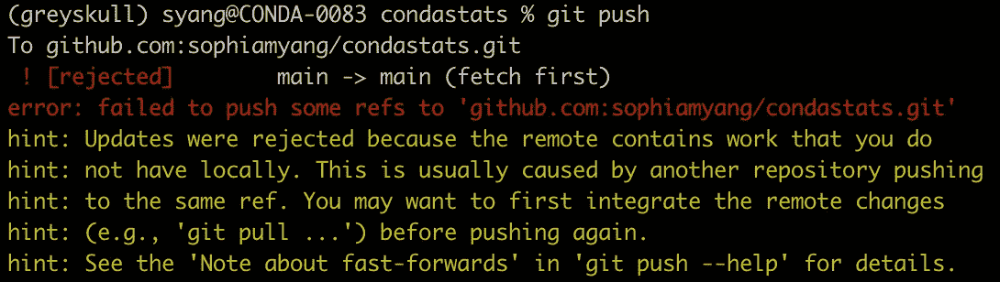
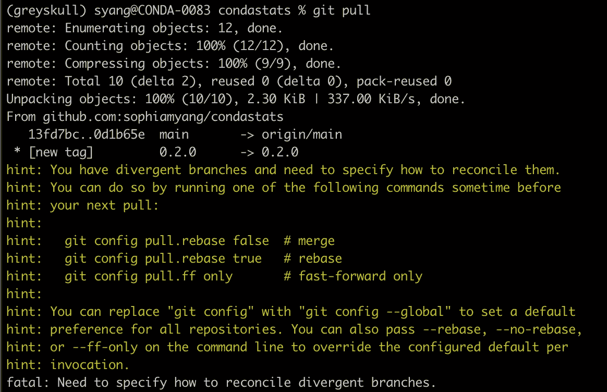
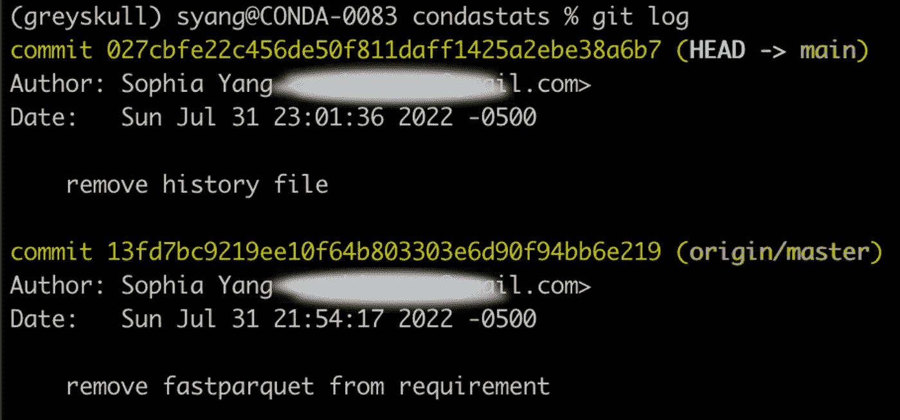
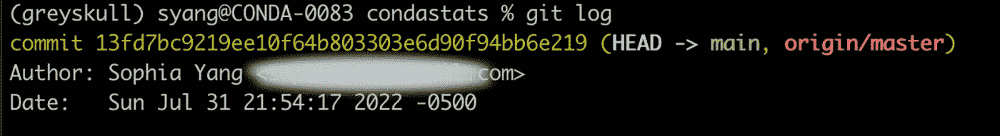
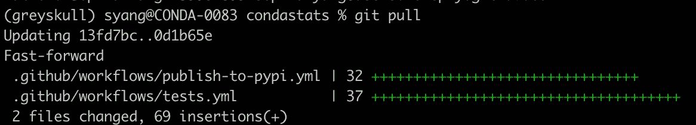
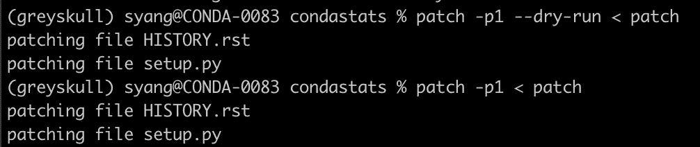
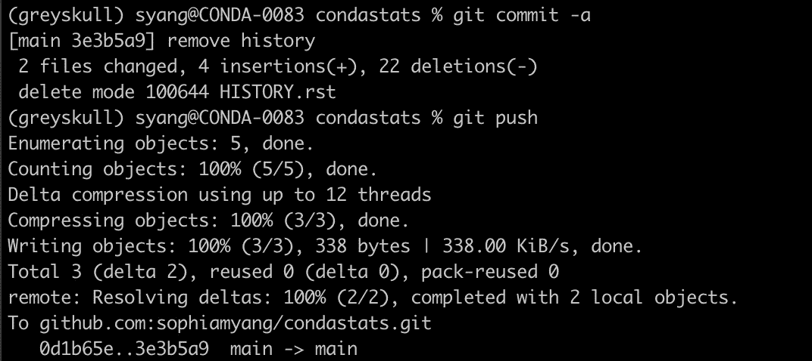

# 当 Git 出错时，你会怎么做？

> 原文：<https://towardsdatascience.com/what-do-you-do-when-git-goes-wrong-a50d20595a80>

## 如何安全地恢复最新提交


吉姆·威尔逊在 [Unsplash](https://unsplash.com/s/photos/revert?utm_source=unsplash&utm_medium=referral&utm_content=creditCopyText) 上拍摄的照片

你有没有遇到过这样的情况，当你的 git 严重出错，你需要拼命恢复？我发现自己偶尔会遇到这种情况，人们似乎也会遇到同样的问题。许多新的 Git 用户在第一次遇到这种情况时可能会感到绝望。因此，在本文中，我将向您展示当 git 出错时该做什么，以及如何安全地修复它。

# Git 问题

长话短说，我忘记了为我的代码使用分支，并且没有首先做`git pull`从远程存储库中获取所有的更改就提交了我的更改。结果是:

*   `git push`被拒。



*   `git pull`也不行。



# 解决方案

上面的“提示”里有一些很好的建议。但有时我们想做的只是撤销最近的提交。与此同时，我们可能仍然需要最近一次提交所做的更改，并且不想丢失它们。有多种方法可以做到这一点。我是这样做的:

*   我检查我的`git log`，它显示了我所有的提交历史:



*   然后，我复制并粘贴我的最新提交 ID。我执行`git diff commit_id > patch`来保存最近提交到文件的差异。这一步非常重要。这允许我们将最近提交的更改保存到一个单独的文件中。


*   然后我做了一个`git reset --hard HEAD^`来回复到之前的提交。注意这是一个**危险区域**。您将丢失最近提交的内容。


*   现在，当我们再次检查`git log`时，我们确实处于之前的提交状态:



*   然后我们终于可以做一个`git pull`



*   如果我们仍然想要应用我们最近提交的更改，我们想要做什么？请记住，我们已经将差异保存在补丁文件中。在这里，我们可以运行`patch -p1 < patch`来应用这些更改。我先做了一次预演，以确保一切正常。



*   现在我们可以在`git diff`中看到文件变更，我们可以使用`git commit -a`提交所有变更，使用`git push`成功推送变更。



# 摘要

总之，下面是我为解决冲突和保存文件更改而执行的 git 命令:

```
# get the id of the lastest commit
git log# save the diff from the latest commit to a patch file
git diff 13fd7bc9219ee10f64b803303e6d90f94bb6e219 > patch # revert to the previous commit
git reset — hard HEAD^ # confirm that we are at the previous commit
git log # fetch changes from repo
git pull# apply file changes from the path file
patch -p1 — dry-run < patch 
patch -p1 < patch # check git diff on the file changes
git diff # commit changes
git commit -a # push changes
git push
```

让我知道你在这种情况下通常做什么，如果你有任何建议。请随意与我分享您使用 git 的有趣经历！:)