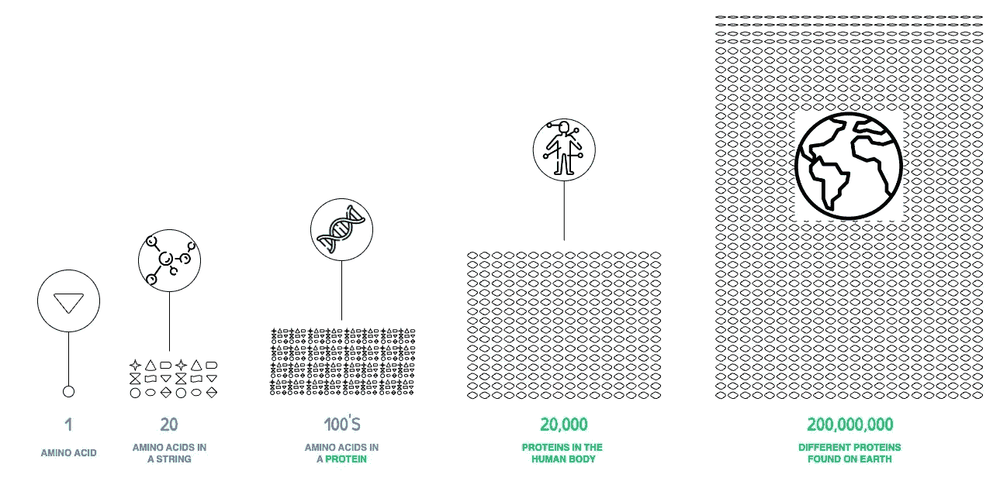
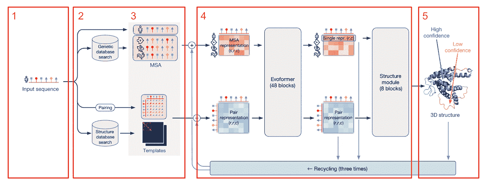
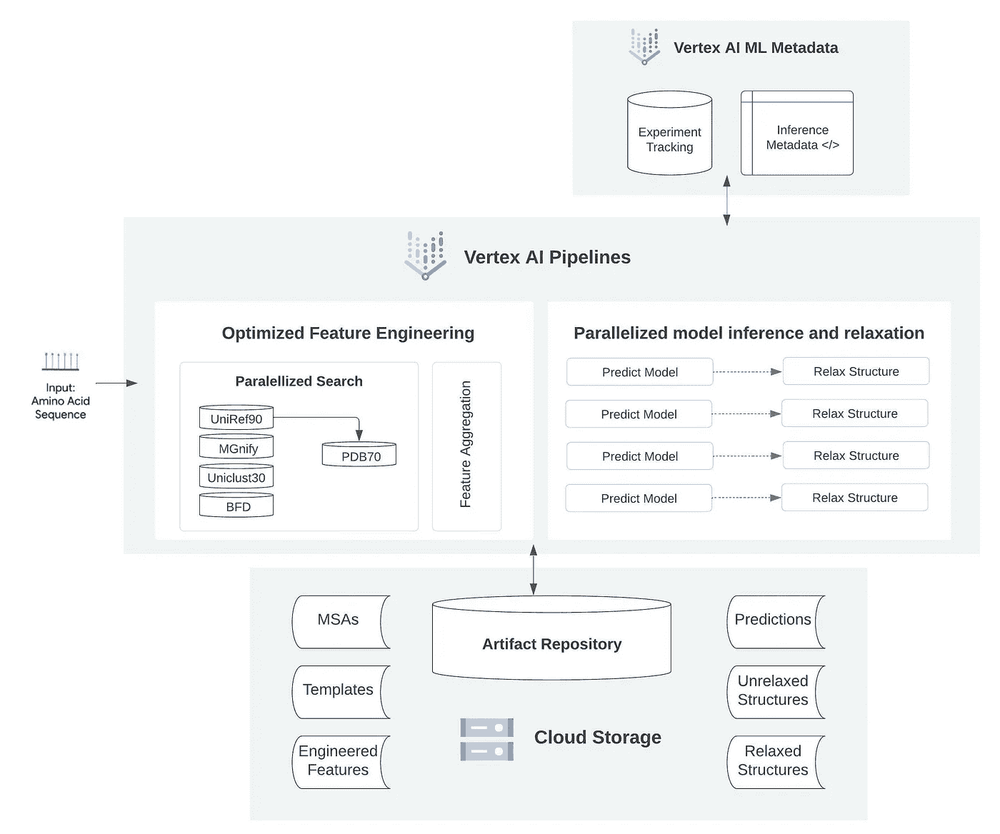
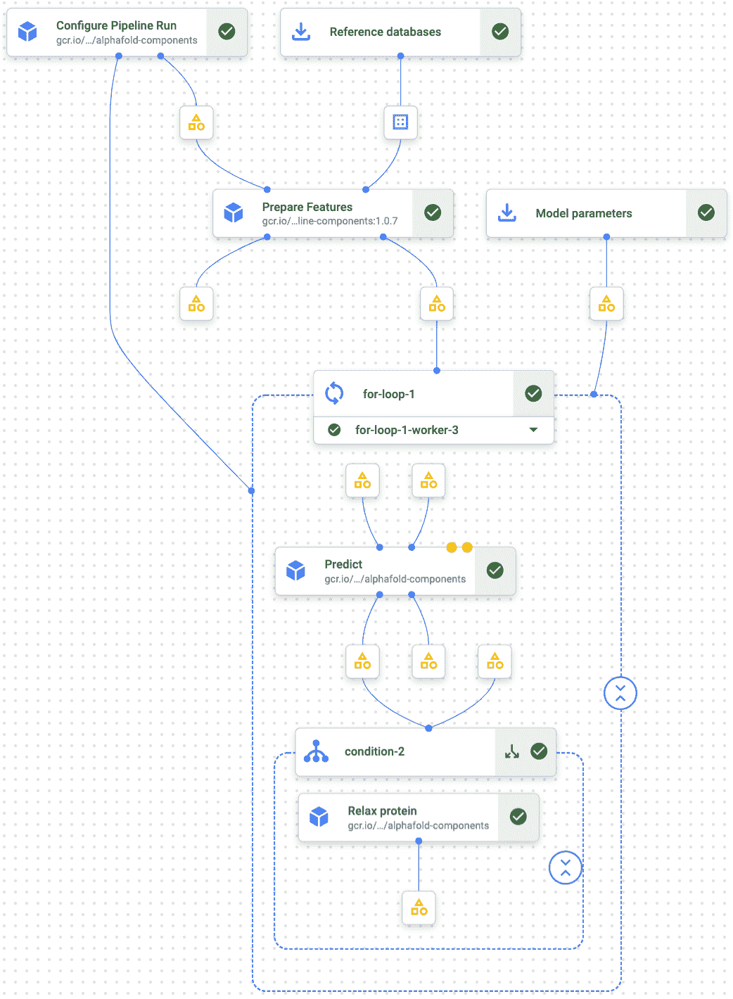

# AlphaFold 是做什么的？

> 原文：<https://towardsdatascience.com/what-does-alphafold-do-60b6370dafe4>

## 利用人工智能的力量来理解蛋白质是如何折叠的

在 [Unsplash](https://unsplash.com/?utm_source=unsplash&utm_medium=referral&utm_content=creditCopyText) 上由[阿尼鲁德](https://unsplash.com/@lanirudhreddy?utm_source=unsplash&utm_medium=referral&utm_content=creditCopyText)拍摄的照片

# TL；速度三角形定位法(dead reckoning)

*   我试图给蛋白质折叠一个简单的解释，
*   为什么我们想要预测它是如何发生的，
*   AlphaFold 如何使用神经网络，一种机器学习(ML)技术来解决蛋白质折叠问题，
*   并给出了一个在 Google Cloud 上使用 Vertex AI 进行批量推理的参考架构……**走吧！** ➡️

## 🤔什么是蛋白质折叠，为什么它是一个难题？

每种蛋白质都是由一系列[氨基酸](https://en.wikipedia.org/wiki/Amino_acid)结合在一起组成的。这些氨基酸相互作用形成形状，这些形状在更大的范围内折叠起来成为复杂的三维结构，基本上是我们星球上所有生命的基石。

蛋白质潜在的折叠方式多得难以想象。因此，弄清楚它们如何以一致的方式快速折叠是非常棘手的。目前，已知的蛋白质超过 2 亿种，而且每年都有更多的蛋白质被发现。每一个都有独特的 3D 形状，决定了它的工作方式和功能。

图 1:不同尺度的氨基酸。作者插图。

能够可靠地预测蛋白质将如何折叠开启了许多强大的用例，例如发现治疗疾病的新药，并总体上帮助我们更好地理解生物学如何工作。但几十年来，人们一直认为做出这种预测所需的计算能力远远超出了现有能力。

然而，利用他们设计算法的经验，可以在几个小时内学习复杂的游戏，如国际象棋和围棋，Deepmind 的研究人员开发了一种名为 AlphaFold 的机器学习引擎，可以预测蛋白质折叠的方式。最新版本(AlphaFold2)现在可以在几分钟内大规模预测蛋白质的形状，并精确到原子的精度！🤯

这是一项重大突破，凸显了人工智能对科学的影响。这项工作已经发表在《自然》杂志上，并赢得了生命科学、数学和基础物理领域的突破性奖项。👉 ***详见延伸阅读。***

## alphafold 是如何工作的？

毫无疑问，蛋白质折叠背后的科学和推导蛋白质结构预测的实验过程是复杂的。所以我会尽我所能简化这个过程以及它在 AlphaFold 中的工作方式。

蛋白质折叠的一个关键假设是，预测它将如何折叠的所有必要信息都可以从氨基酸序列及其所处的环境中获得。

就 ML 模型而言，您可以将氨基酸序列视为我们的输入变量，而“环境”由模型的参数决定。最终结构的输出预测，或蛋白质将如何折叠，是由前者决定的。

*图 2:蛋白质折叠的 AlphaFold 架构，来源:Jumper 等，2021 [2]，作者注释。*

**这里有一个(非常😅)蛋白质折叠如何在 AlphaFold 上工作的粗略分类:**

1.提供氨基酸序列作为 AlphaFold 算法的输入，

2.进行一些数据预处理以产生包含在氨基酸序列中的骨架原子。原子最初被赋予随机坐标。

3.搜索结构和模板数据库，以便:

3a。找出对应于氨基酸序列的结构。这有助于检测氨基酸序列中更可能发生变化的部分，并收集这些“突变”之间的关系。

3b。基于现有模板识别可能具有相似结构的蛋白质，并构建结构的初始表示用于成对比较。这个模型代表了哪些氨基酸可能相互接触。

4.MSA 和成对结构(3a。& 3b。)通过一个名为“Evoformer”的深度学习模型，该模型有 48 个神经网络模块，用于在氨基酸序列和几何结构的成对结构特征之间交换信息，这有助于在几次迭代中完善模型。接下来是另一个称为“结构模块”的深度学习模块，它有 8 个神经网络块来构建输入序列的最终 3D 蛋白质结构。

重新运行步骤 3 和 4 三次

5.最终的输出结果是一个精确的折叠蛋白质结构，其中每个原子都有相应的坐标。

## 🔮顶点人工智能的 AlphaFold 批量推理

**“计算密集型”是什么意思？😮‍💨**

正如你可能已经从上一节中收集到的，从 AlphaFold 获得预测需要大量的[特征工程](https://developers.google.com/machine-learning/glossary#feature-engineering)，因为它从基因和结构库中提取了大量的补充数据。所有这些都需要万亿字节的内存来存储，以便在预测期间使用。

然后，你有一个非常密集的神经网络，用来创建自己的预测。理想情况下，你需要大量的 GPU(甚至是 [TPUs](https://developers.google.com/machine-learning/glossary#TPU) )来加速神经网络中每个节点进行的数学计算。大多数人没有运行像 AlphaFold 这样的 ML 模型所需的物理基础设施…

但是不要害怕！通过云的力量，任何人都可以运行 AlphaFold 算法！具体来说，在谷歌云平台(GCP)上使用 Vertex AI。

Vertex AI 将用于构建 ML 的 GCP 服务集中在一个统一的 UI 和 API 下，以简化大规模构建、训练和部署机器学习模型的过程。

下面的例子涵盖了一些最近发布的功能，如 Vertex AI Pipelines，它们通过编排您的 ML 工作流来帮助您自动化、监控和管理您的 ML 系统——这是实现机器学习操作的关键起点( [MLOps](https://medium.com/p/5bf60dd693dd) )。

**你可以这样做**

*图 3:顶点 AI 上 AlphaFold 批量推理的参考架构。作者插图。*

**先决条件:**

1.将功能工程过程中引用的 MSA 和结构模板加载到 Google 云存储(GCS)中。您还可以使用 GCS 来存储您的氨基酸输入数据。
2。使用代表特征工程过程和神经网络的开源代码来构建顶点 AI 管道。

*图 AlphaFold 批量推理的通用顶点 AI 流水线，来源:谷歌云【4】*

**基于图 3 中描述的架构组件，图 4 中所示步骤的总结:**

1.触发管道运行
1a。负载输入和
1b。参考数据
2。运行特征工程管线(存储在 GCS 中)
3。将特征和模型参数输入管道以获得预测
3a。重复给定次数的迭代
4。对预测的结构进行[琥珀色](https://www.ncbi.nlm.nih.gov/pmc/articles/PMC1989667/)松弛(可选)
5。预测的蛋白质结构排名
6。将模型预测存储在 GCS 中

现在你有了它，如果你想看看样本代码和你需要开始做的一切，就去 [GitHub 库](https://github.com/GoogleCloudPlatform/vertex-ai-alphafold-inference-pipeline)。

# 🏁包裹

作为一个可能对蛋白质折叠非常陌生的人，我不指望你在看完这篇文章后突然成为一名基因研究者！另一方面，如果你已经在这个领域工作，我希望这是一个学习如何应用人工智能来帮助解决一些自然最深层的奥秘的实用起点！

**本岗位目标:**

*   提高对一个令人着迷(但非常复杂)的话题的认识，并努力让这个话题变得更容易理解
*   强调这样一个事实，你不需要一个满是超级计算机的实验室来完成像 AlphaFold 这样的 ML 系统所需要的计算密集型工作。

如果你对蛋白质折叠和 AlphaFold 有了基本的了解，我在这里的工作就完成了！下次再见，感谢您的阅读和支持🙏🏼。

# 🗃参考资料&进一步阅读

[1] Deepmind，Highlighted Research，[https://www . deep mind . com/Research/highlight-Research/alpha fold](https://www.deepmind.com/research/highlighted-research/alphafold)

[2] Jumper，j .，Evans，r .，Pritzel，a .等.用 AlphaFold 进行高度精确的蛋白质结构预测.自然 596，583–589(2021)(CC BY 4.0)。【https://doi.org/10.1038/s41586-021-03819-2 

[3]使用顶点人工智能管道运行 AlphaFold 批量推理，谷歌云博客文章，[https://Cloud . Google . com/Blog/products/AI-machine-learning/alpha fold-batch-inference-with-Vertex-AI-Pipelines](https://cloud.google.com/blog/products/ai-machine-learning/alphafold-batch-inference-with-vertex-ai-pipelines)

[4] Google 云平台，GitHub repository (Apache-2.0 许可证):[https://GitHub . com/Google Cloud Platform/vertex-ai-alpha fold-inference-pipeline # readme](https://github.com/GoogleCloudPlatform/vertex-ai-alphafold-inference-pipeline#readme)