# C3.ai 是做什么的？

> 原文：<https://towardsdatascience.com/what-does-c3-ai-do-305880b737c8>

# C3.ai 是做什么的？

## 与前玛奇纳一起深入研究无代码 ML

刘玉英在 [Unsplash](https://unsplash.com/s/photos/robot?utm_source=unsplash&utm_medium=referral&utm_content=creditCopyText) 上的照片

# TL；速度三角形定位法(dead reckoning)

C3.ai 是一家软件公司，提供一系列 ML 驱动的解决方案，这些解决方案是为特定行业量身定制的，目标是更大的公司。他们的一款产品名为“Ex 玛奇纳”，这是本文的重点，旨在:

*   一个易于使用的，可视化的，无代码的构建 ML 模型的环境。
*   目标用户受众是“[公民数据科学家](https://www.tibco.com/reference-center/what-is-a-citizen-data-scientist)”，他们通常是不具备数据科学专业知识，但仍希望能够利用预测性 ML 模型功能的业务用户。

## ⚡️趣闻

“Ex 玛奇纳”一词来源于拉丁语“deus ex machina”(或“机器中的上帝”)，指的是突然出现或被引入一种情况中的人或事物，它为一个显然无法解决的难题提供了一种人为的或人为的解决方案。[1]

# 🤹🏼‍♂️公民数据科学家工作流程

就像我之前的“T2 是做什么的？”帖子，我决定给前玛奇纳自己一个旋转。

为了在我的修补中应用一点结构，我提出了一个简化的工作流，它可能代表了普通公民数据科学家所走的道路:

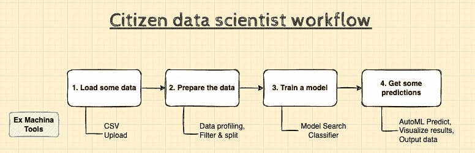

图 1:公民数据科学家工作流程，作者的插图。

无需编写任何代码或了解很多关于 ML 的知识，您可能会想…

*   加载一些数据，
*   可能做出一些改变或者为模型训练准备数据，
*   训练一个模型，最后，
*   用那个模型预测一些事情。

当我深入这个产品的内部工作时，我们将回头参考这些步骤。

# 🚀启动并运行

C3.ai 最近[宣布与 GCP](https://c3.ai/partners/googlecloud-partnership/)合作。普通读者会知道这是我首选的云，所以我想看看能不能通过 GCP 市场来提升它:

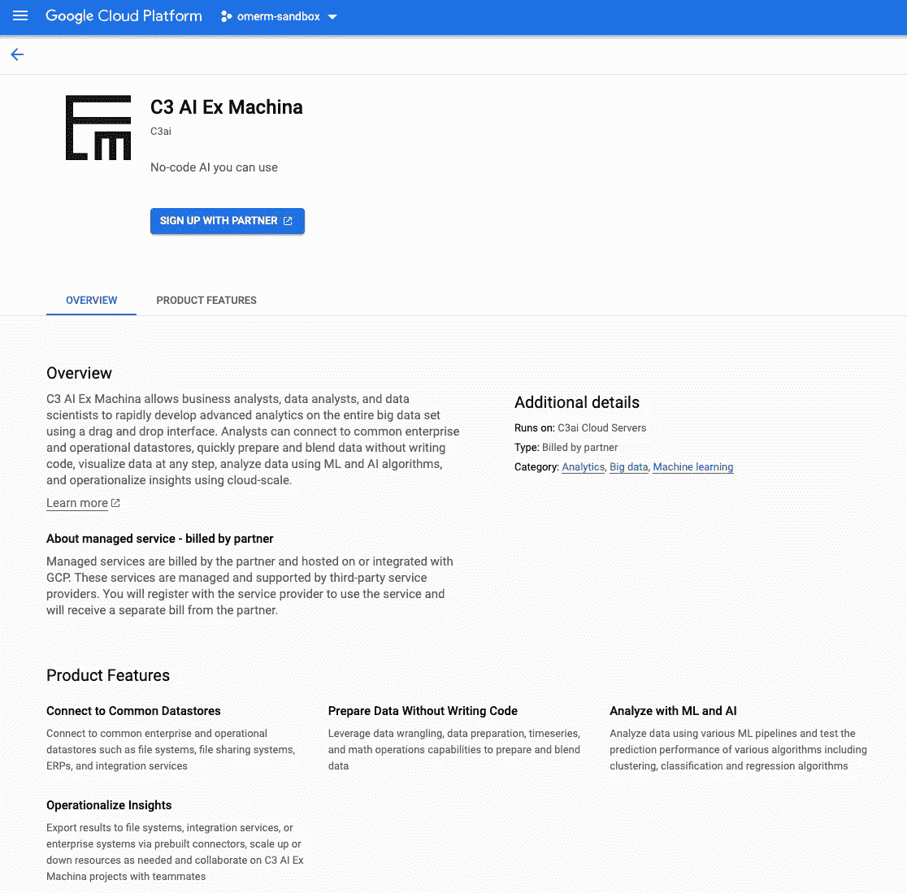

图 2: GCP 市场，C3 AI Ex 玛奇纳

搜索“C3.ai”很快就出现了一个市场产品列表，包括玛奇纳以外的产品。不像有些产品可以让你不用离开 GCP 就可以启动并运行，我看到了一个注册链接。

这会将您带到一个外部登录页面，您可以在那里注册 14 天的免费试用。所以我就是这么做的！

Ex 玛奇纳作为按用户订阅服务提供，可用作托管在 C3.ai 服务器上的托管服务。如果您选择他们的“企业”订阅层，您也可以将其部署在您选择的基础架构或云上。

注册后，您可以通过 C3.ai 托管的网站登录 Ex 玛奇纳。

您首先看到的是左侧带有导航的仪表板，在主页上有几个部分，其中包含示例工作流、您最近的项目和资源:

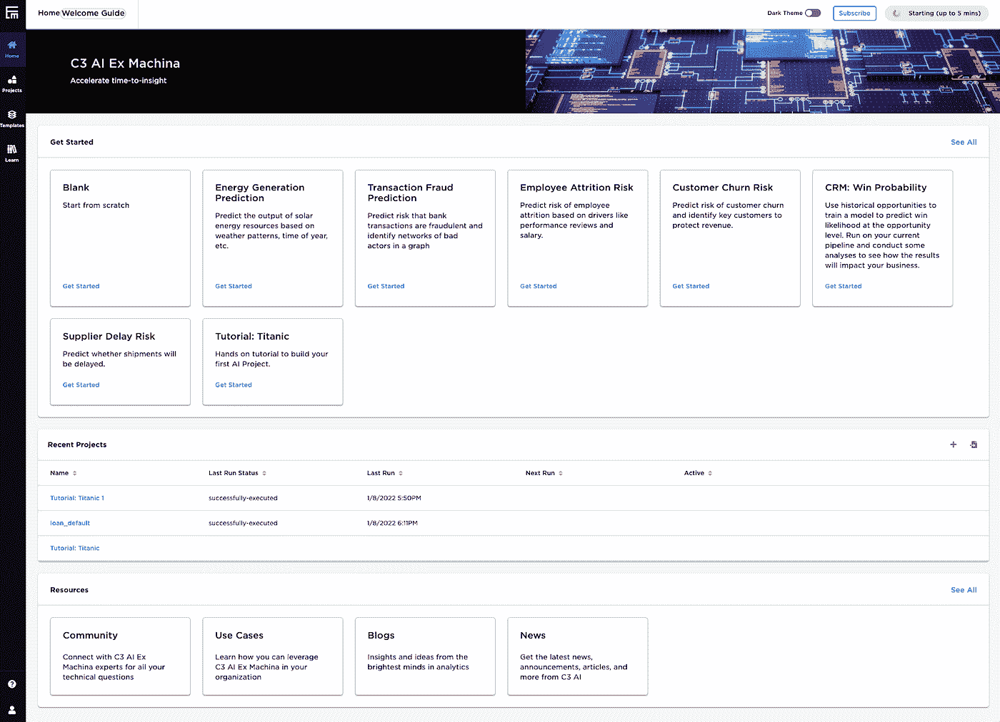

图 3: C3 AI Ex 玛奇纳，主页/欢迎页面

项目是您构建 ML 工作流的地方，使用拖放工具放置在画布上。

在创建或加载项目之前，您必须确保您的“环境”正在运行(参见主页左上方):

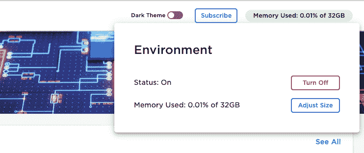

图 4: C3 艾 Ex 玛奇纳，环境状况

您可以为不同大小的“环境”付费，根据您的需求选择更多内存。这些环境似乎是由 C3.ai 托管和管理的。我将在文章的最后谈到定价。

现在，让我们来构建我们的公民数据科学家工作流！

# ⛽️ 1.加载一些数据

第一步是创建一个新项目(参见“最近的项目”面板右上角的“+”符号)。

在新创建项目的画布右侧，您会看到一个“节点”类别列表，这些类别与您可能要执行的不同任务相关。您可以独立运行节点，也可以作为一个端到端的工作流运行节点。

展开“输入数据”类别会显示几个不同的数据源子类别，为了简单起见，我选择了 CSV 文件上传:

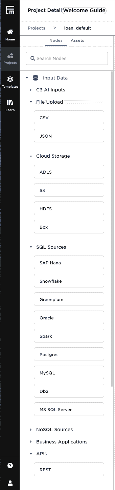

图 5: C3 人工智能 Ex 玛奇纳项目，输入数据节点

你点击节点，并将其拖到画布上进行配置，即告诉它从哪里上传文件，跳过标题行，以及使用哪个分隔符。

在这种情况下，我使用 Kaggle 数据集进行[贷款违约预测](https://www.kaggle.com/kmldas/loan-default-prediction/version/2):

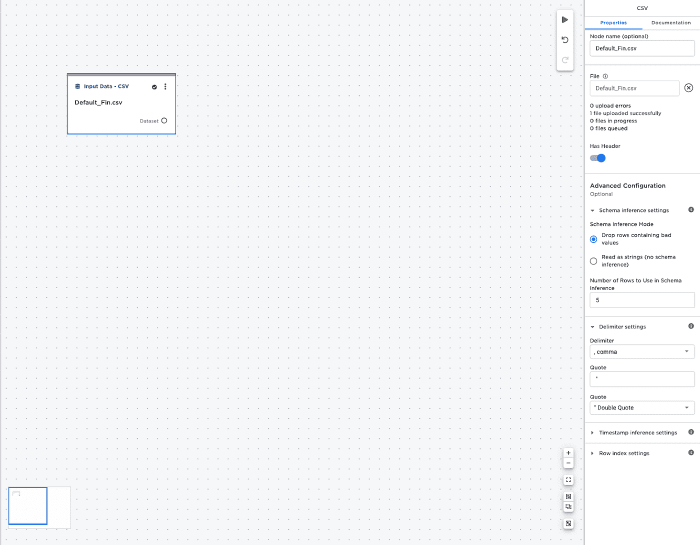

图 6: C3 艾 Ex 玛奇纳，项目，画布视图

配置好节点并点击 Run 按钮后，您可以通过双击节点来查看数据示例:

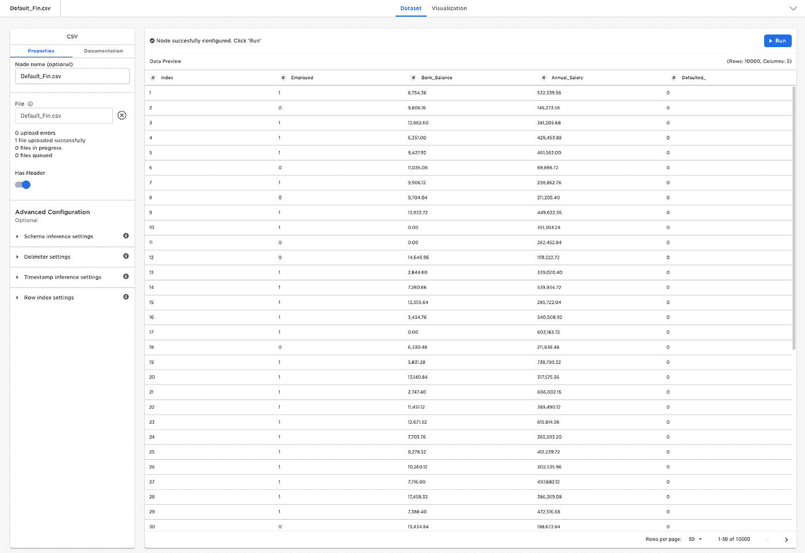

图 5: C3 人工智能 Ex 玛奇纳，输入数据节点细节

# 👩🏾‍🍳 2.准备数据

在我们训练一个 ML 模型之前，通常需要一些数据准备，除非你使用一个干净的、精选的数据集(就像这个例子！).

至少，我们可能希望进行一些数据分析，以了解我们加载的数据集中是否有缺少或不一致的值的列。

对于这个任务，我查看了“分析”类别下的“描述列”节点，将它拖到我们的画布上:

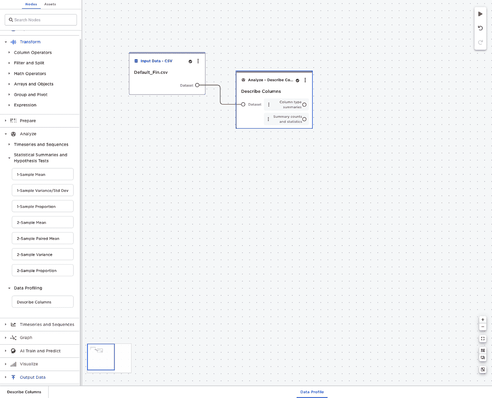

图 6: C3 艾 Ex 玛奇纳，描述列节点

运行并双击“Describe Columns ”(描述列)节点，使我们能够构建数据的可视化配置文件，并提取我们可能感兴趣的关键摘要:

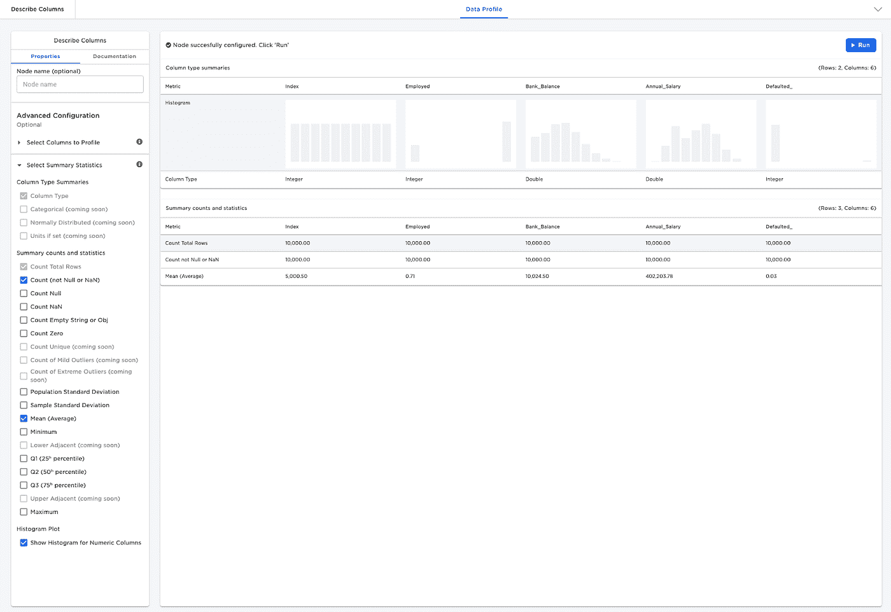

图 7: C3 AI Ex 玛奇纳，描述列节点细节

假设我们对要用于模型训练的数据集感到满意，将数据集随机分成单独的训练集和测试集通常是个好主意。

我们这样做是因为它有助于我们了解模型在对以前从未见过的数据进行预测时的表现。如果您想了解更多信息，请点击[此处](https://developers.google.com/machine-learning/crash-course/training-and-test-sets/video-lecture)。

我不相信 Ex 玛奇纳会在模型训练之前自动分割您的数据集，所以我使用了“变换”类别下的“随机分割”节点来实现这一点，使用默认配置:

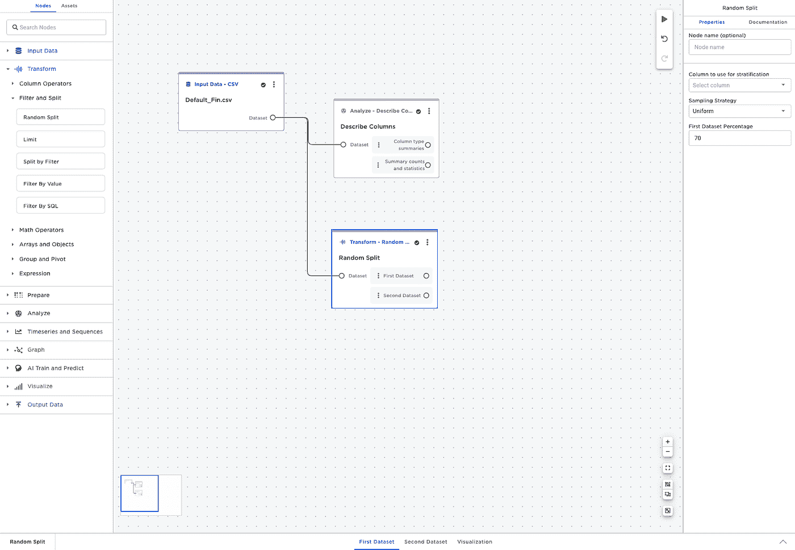

图 8: C3 人工智能 Ex 玛奇纳，随机分割节点

# 🏆 3.训练模特

加载并准备好我们的训练数据后，是时候训练我们的 ML 模型了。

戴上公民数据科学家的帽子，我决定坚持使用“AutoML”类别的节点，特别是“模型搜索分类器”，它可以在一个步骤中训练多个模型:

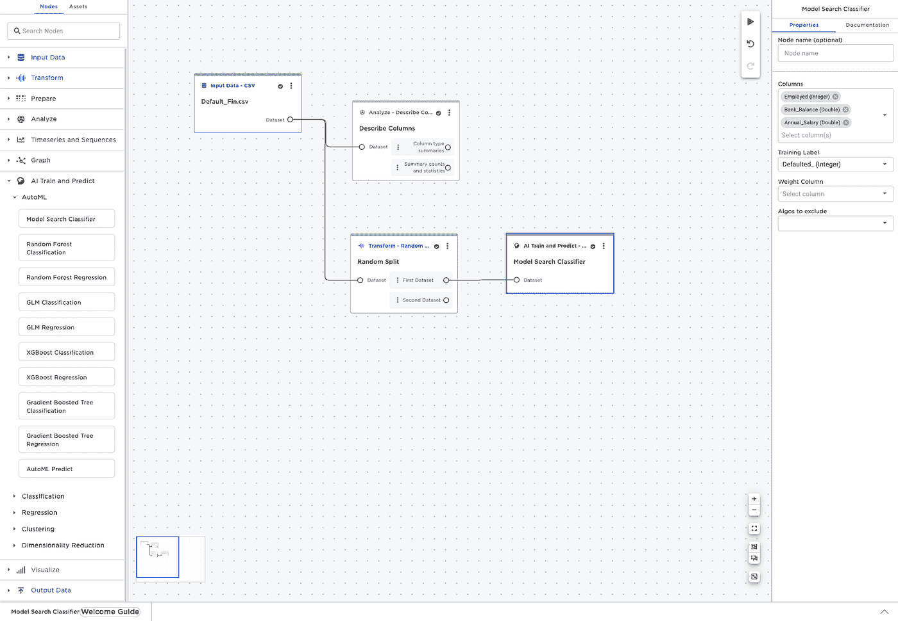

图 9: C3 人工智能 Ex 玛奇纳，模型搜索分类器节点

在配置了要用来为模型定型的列和目标列之后，可以钻取到该节点。

对于我要使用的数据集，列是:

*   **‘就业’**，这是一个布尔型，1=就业，0 =失业。
*   **‘银行余额’**，贷款申请人的银行余额。
*   **‘年薪’**，贷款申请人的年薪。

训练标签(我们希望我们的模型预测的内容)是:

*   **默认**，这是一个布尔 1 =默认 0 =过去没有默认。

点击“Train ”,将根据您选择的指标创建一个车型排行榜。然后，您可以挑选最好的，保存起来供以后使用:

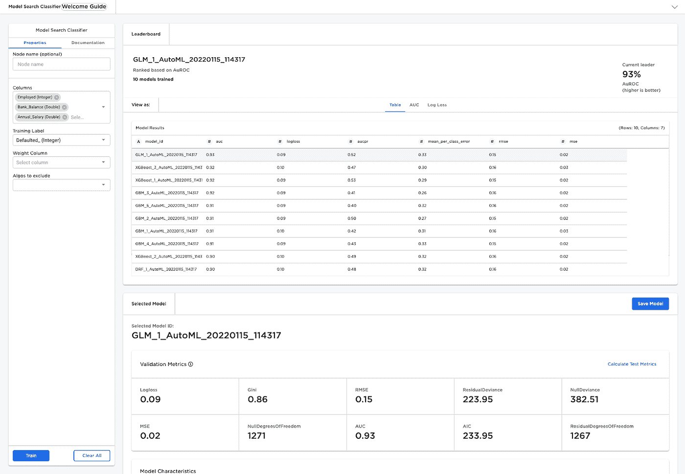

图 10: C3 人工智能 Ex 玛奇纳，模型搜索分类器节点细节-1

向下滚动模型选择面板，您还可以获得关于所选模型的一些信息。例如特征重要性和在训练期间使用的任何参数:

图 11: C3 人工智能 Ex 玛奇纳，模型搜索分类器节点细节-2

# 🤖 4.获得一些预测

现在是激动人心的部分，得到一些预测！

再次坚持使用“AutoML”类别的节点，我将“AutoML Predict”拖到画布上，确保它与我的测试数据集相连接。您所需要做的就是为新列命名，在该列下，您希望从您的模型中捕获预测输出，并且实际上是从那些先前保存的数据中使用的模型:

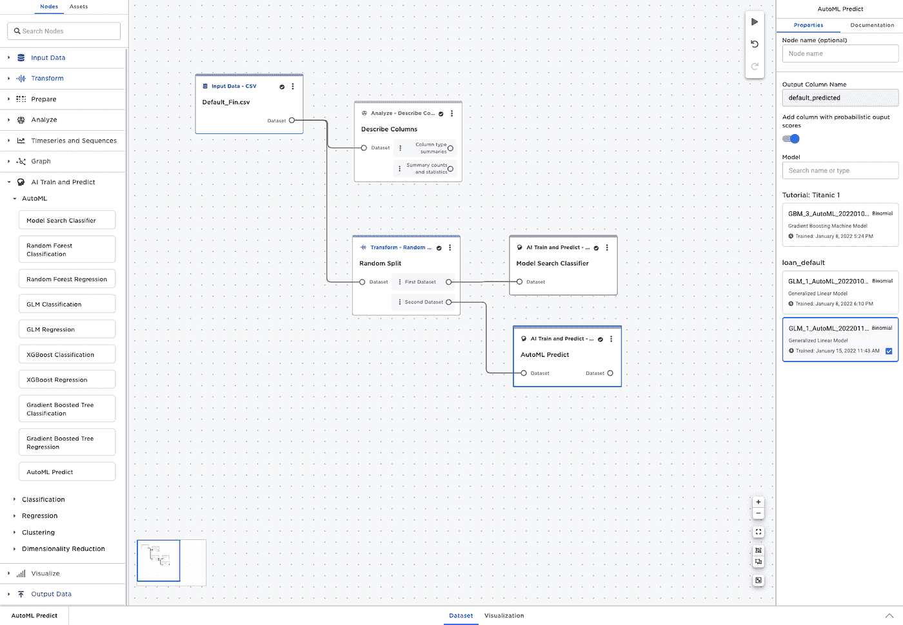

图 12: C3 人工智能 Ex 玛奇纳，自动 ML 预测节点

运行“AutoML Predict”节点并双击后，您可以看到一个更新的数据样本，其中有一个新列显示模型预测，即贷款申请人是否可能违约:

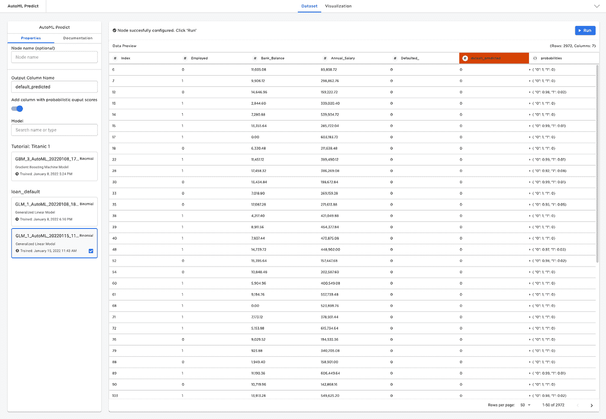

图 13: C3 人工智能 Ex 玛奇纳，自动 ML 预测节点细节

这个视图中似乎没有任何评测统计，这让我有点失望。点击“Vizualisations”选项卡(上面截图的顶部中间)可以构建不同的图表，但没有明显的“现成”信息告诉我该模型在我的测试数据集上的表现如何。

最终，我们的公民数据科学家将希望将预测(或从 ML 中获得的洞察力)纳入他们的业务中，就像通常的任务一样。因此，我们可能需要将数据从玛奇纳转移到其他适合执行进一步分析的地方，或者可能需要构建一个仪表板或报告。

在撰写本文时，与当今市场上可用的大量数据源、BI 和分析工具相比，节点的“输出”类别看起来有些有限。我还注意到缺少直接输出到 BigQuery 和 Google 云存储的节点…这可能是试用版的限制？

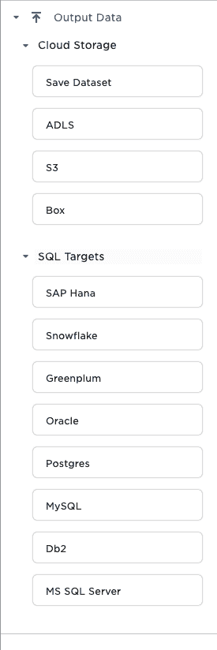

图 14: C3 人工智能 Ex 玛奇纳，输出数据节点

在我看来，AWS S3、Azure ADLS 和 Snowflake 这样的大型企业数据仓库公司都在名单中。我确实尝试了雪花连接，但无法让它工作(在这篇文章的下一部分会有更多)。

如果没有“It 支持”，我们的公民数据科学家不太可能连接到这些目标中的大多数。因此，尝试贴近角色，并通过“自动预测”节点选项使用“导出到 CSV 选项”:

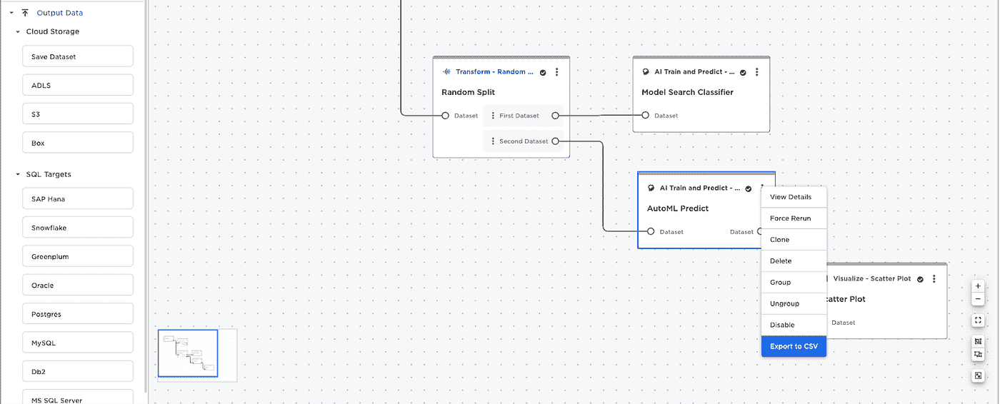

图 15: C3 人工智能 Ex 玛奇纳，自动 ML 预测节点—导出到 CSV

现在你知道了，我们的工作流程已经完成，从加载数据到从 ML 模型获得一些预测— **而无需编写任何代码！**

# ⚖️初步印象

以下是我对 Ex 玛奇纳实验的一个简短总结:

## 设置:

启动和运行试验相当简单。

我确实尝试过将示例工作流中的预测推送到雪花数据库表中，但收效甚微。

我在雪花中创建了一个数据库、表和模式，并且能够在 Ex 玛奇纳成功测试连接:

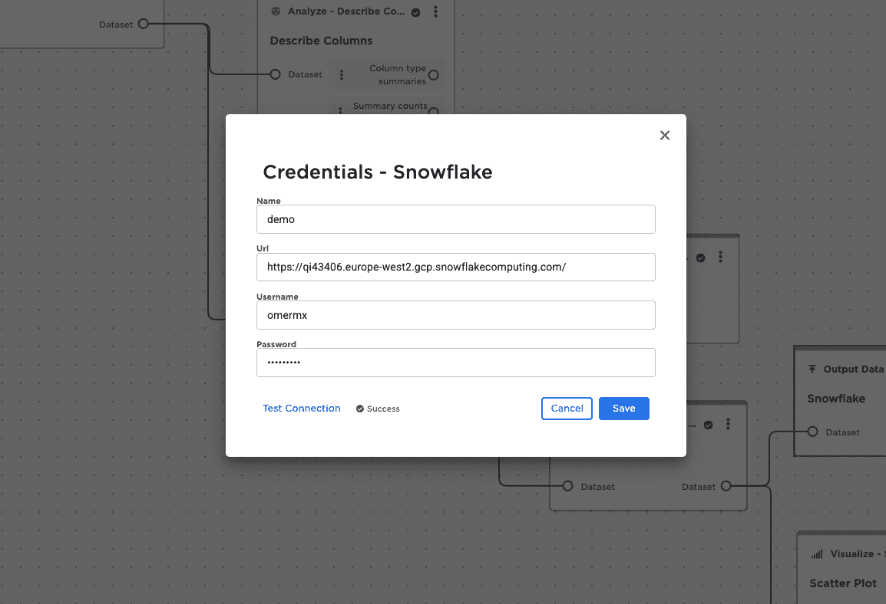

图 16: C3 AI Ex 玛奇纳，输出数据—雪花节点—创建凭证

但是当我试图通过运行“输出数据—雪花”节点来实际写出一些数据时，我得到了一个非常无用的错误消息:

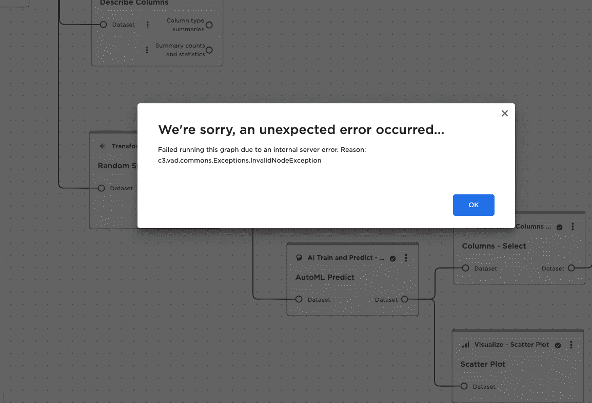

图 17: C3 人工智能 Ex 玛奇纳，输出数据—雪花节点—运行错误— 1

就是这样，没有迹象张贴到文件或任何简单的方法来提高支持票。在画布上，节点的配置中有一个不同的错误消息，但它似乎与雪花无关:

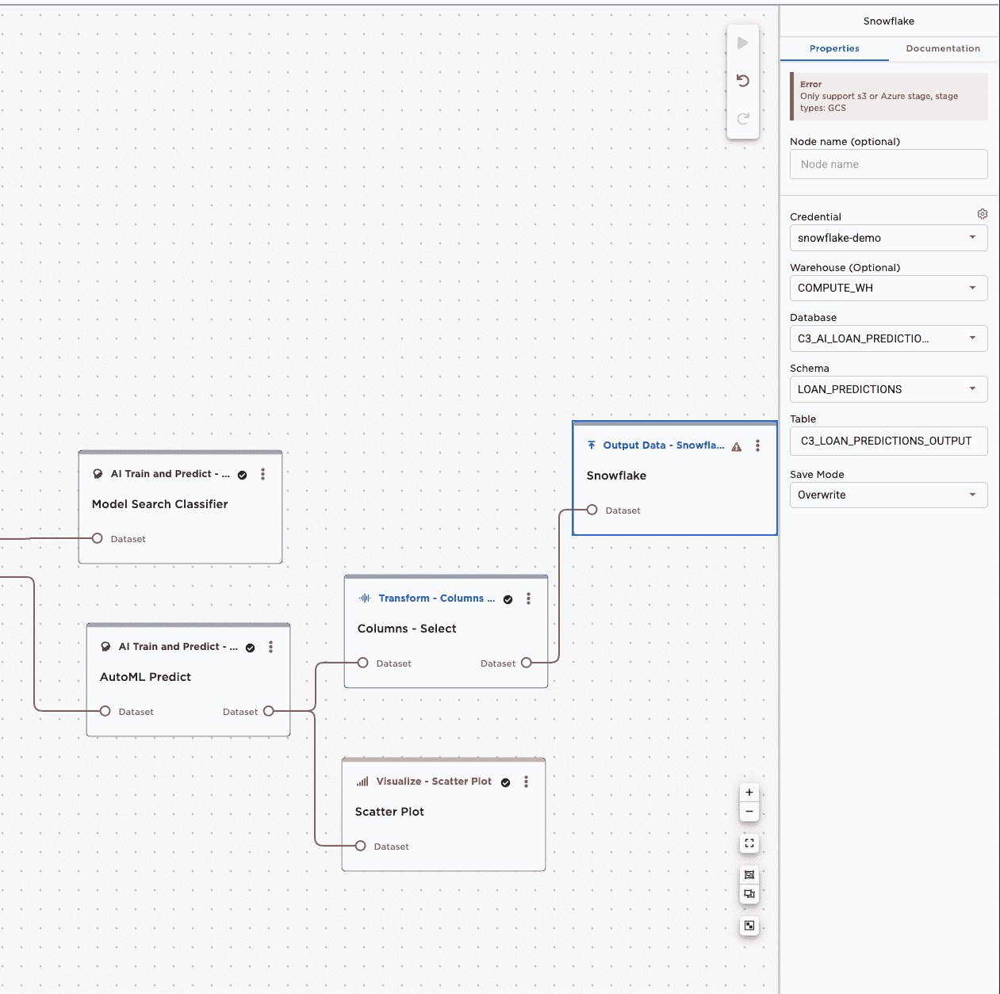

图 18: C3 人工智能 Ex 玛奇纳，输出数据—雪花节点—运行错误— 2

我发现文档迷你站点相当稀疏，很少涉及我认为配置某些工具所需的细节。在上下文中，节点级别的文档通常是不存在的:

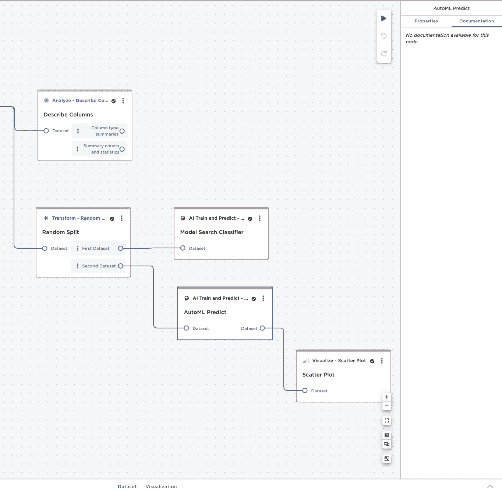

图 19: C3 AI Ex 玛奇纳，AutoML 预测节点—文档选项卡

虽然大多数节点都很直观，但我认为在产品文档方面肯定还有改进的空间。

## **易用性:**

“拖放”工作流范式并不新鲜，但 Ex 玛奇纳是我见过的第一个专注于 ML 的云原生例子。对于公民数据科学家来说，这是一个很好的切入点。

很高兴看到一些广泛的模型评估和可解释性特性作为 AutoML 节点的一部分，但也许它们会出现在未来的迭代中。

## **费用:**

Ex 玛奇纳按用户订购服务提供，有免费、团队、专业和企业选项(用于在您自己的基础架构上部署):

图 20: C3 AI Ex 玛奇纳，订阅计划

团队版和专业版在个人版的基础上增加了一些额外的功能。一些亮点是协作、SSO 和身份提供者集成，您还可以获得更多内存，并且可以添加到项目的 AutoML 节点数量没有限制。

还提供了一些基本的调度和模型管理功能，但还没有接近对整个 MLOps 生命周期的支持。

## **总体:**

Ex 玛奇纳[最初在大约一年前推出](https://c3.ai/new-c3-ai-ex-machina-customers-experience-success-with-no-code-ai-anyone-can-use/#:~:text=Since%20its%20January%202021%20launch,%2C%20marketing%20analysis%2C%20and%20more.)，所以与公民数据科学产品领域的其他大玩家如 [Alteryx](https://www.alteryx.com/products/alteryx-machine-learning) 和 [KNIME](https://www.knime.com/) 相比，它仍然相对不成熟。

在纯粹的“自动”方面，有一些竞争对手，如 H20.ai、DataRobot 和 GCP Vertex AI。它们提供了类似的“无代码”体验，但在自动化常见任务方面要复杂得多，例如数据准备、模型选择、可解释性，甚至是生产模型。

目前，Ex 玛奇纳感觉自己处于市场上最好的“拖放式”和 AutoML 产品之间。

除了文档和数据输出设置方面的一些问题，我认为 Ex 玛奇纳为想要构建并从 ML 模型中获得洞察力的公民数据科学家提供了一个伟大的无代码工具。

如果 C3.ai 继续通过增加功能和改善用户体验来投资于该产品，它可能成为一个新兴市场的有力竞争者。

🙏🏼再次感谢您阅读我的帖子，如果您有任何问题或反馈，请联系我们！

# 📇参考

[1]布里安妮卡，《杀出重围》，[https://www.britannica.com/art/deus-ex-machina](https://www.britannica.com/art/deus-ex-machina)