# 你最喜欢的电影是什么样子的？

> 原文：<https://towardsdatascience.com/what-does-your-favorite-movie-look-like-8c7b4a13ee94>

## 如何将任何视频转换成反映其配色方案的图像

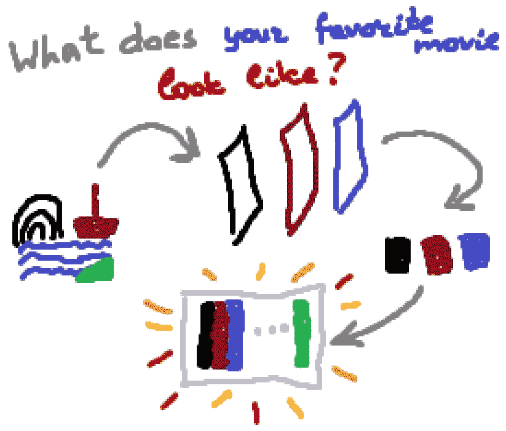

你最喜欢的电影是什么样子的？作者图片

你有没有想过你最喜欢的电影是什么样子的？嗯，你肯定知道它看起来像什么，因为你很可能不止一次地看过它，但是它在静态下看起来如何，或者它如何使用单一图像可视化？

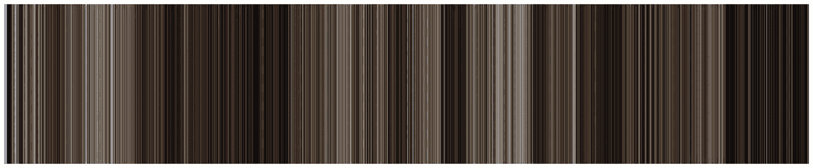

怪物史莱克 2 电影的配色方案。作者图片

我提出了一种使用机器学习算法来创建反映任何视频配色方案的图像的方法。这不仅是一个有趣的项目，也是给你热爱电影的朋友和熟人的**无尽的礼物创意来源**:首先，它是非常*个人和独特的*，其次，它是*高度可定制的*，因为你可以使用这个图像作为任何你可以订购打印的东西的打印:帽子、t 恤、毛巾、帆布等。等。

# 如何阅读这篇文章

为了方便起见，让我简要描述一下本文的所有主要部分，以便您知道从哪里开始，并在将来成功地导航:

*   在**问题陈述**部分，我会告诉你我要用这个项目解决什么问题；
*   在**算法和实现细节**部分，我将告诉你我是如何使用 Python 实现这个项目的，以及它的库: [moviepy](https://zulko.github.io/moviepy/) 和 [scikit-learn](https://scikit-learn.org/stable/) 。如果你不熟悉 Python 或一般的编程，不要害怕跳过这一节*，因为使用项目代码不需要你具备任何特定的知识；*
*   在**用户指南**部分，你会找到最终程序的用户指南和带源代码的 [GitLab 库的链接；](https://gitlab.com/Winston-90/movie_color_scheme)
*   在**图库**部分，您可以看到程序根据不同电影生成的结果图像。开始时看一下这里，看看这个程序能够做什么；
*   在**结果和结论**部分，我总结了已完成的工作，并分享了我对可能改进的想法。

现在，当你知道以什么顺序阅读这篇文章时，让我们开始吧！

# 问题陈述

我想写一个程序，将一些视频文件作为输入，输出一个图像，反映给定视频的配色方案。结果图像的一些特征也由附加参数设置。

要查看程序能够生成的示例图像，请参见**图库**部分。

# 算法和实现细节

让我们将初始问题分解成子问题，并一步一步地回顾算法:

1.  首先，我们需要**将提议的视频转换成图像列表；**
2.  对于给定列表中的每张图片，我们需要**通过分析图片提取最流行的颜色**；
3.  最后，有了颜色列表，我们需要**合成最终的图像。**

让我们更详细地讨论这些步骤，并查看执行它们的代码。请注意**gists 中的代码不要直接使用**，这里只是给大家一个大概的概念。我试图保持它尽可能简单，同时存储库中的结果代码在某种程度上被优化并包装在类中。

## 1.将视频转换为图像列表

首先，我们需要将给定的视频转换成一组图像，以便将来进行分析。有了[电影库](https://zulko.github.io/moviepy/)就很容易了。

首先，我们读取 moviepy 对象中的视频。使用`duration`属性获取以秒为单位的视频持续时间，并设置`step`变量以确定我们希望提取视频帧的频率，我们使用 *for 循环*获取当前时间戳中的图像(使用 [*get_frame* 函数](https://zulko.github.io/moviepy/ref/VideoClip/VideoClip.html#moviepy.video.VideoClip.VideoClip.get_frame))并将其添加到结果列表中。

`start`变量需要一点偏移，因为所有的视频在第 0 秒开始黑屏。

## 2.分析图像颜色

当我们将一个视频“切片”成一系列图像时，我们需要分析其中哪些颜色是最流行的。让我简单地告诉你我们将如何做。

总体思路是对图像使用聚类算法。聚类是将相似的数据点分组到组(或聚类)中的任务。在我们的例子中，数据点是图像的像素，特征是三个 RGB 颜色值。

在聚类算法为我们计算了聚类之后(这意味着它分析了所有图像像素并基于一种颜色创建了前 k 个像素组，其中 k 是聚类的数量)，我们可以使用这些聚类代表来获得最流行的颜色。最简单的方法是应用基于*质心*概念的聚类算法。聚类中的质心只是一个聚类的几何中心(可以解释为给定组中最常见的元素)。有几种基于质心的聚类算法；我选了 [*K-Means*](https://scikit-learn.org/stable/modules/clustering.html#k-means) (也可以是 [*MeanShift*](https://scikit-learn.org/stable/modules/clustering.html#mean-shift) 、 [*亲和传播*](https://scikit-learn.org/stable/modules/clustering.html#affinity-propagation) 等。):它迭代地更新聚类质心，直到收敛。

K-均值算法的收敛性。[公共领域](https://en.wikipedia.org/wiki/K-means_clustering#/media/File:K-means_convergence.gif)

## 了解更多关于集群的资源

如果您想了解关于如何使用聚类从图像中提取颜色的更多详细信息，可以查看以下文章:

  

如果您想从总体上了解更多关于聚类算法的知识，请查看我的聚类备忘单文章，它将为您提供关于聚类算法动物园和聚类分析的总体情况:

  

## 回到实践中

但是让我们继续练习吧。让我们以下图为例进行颜色分析:

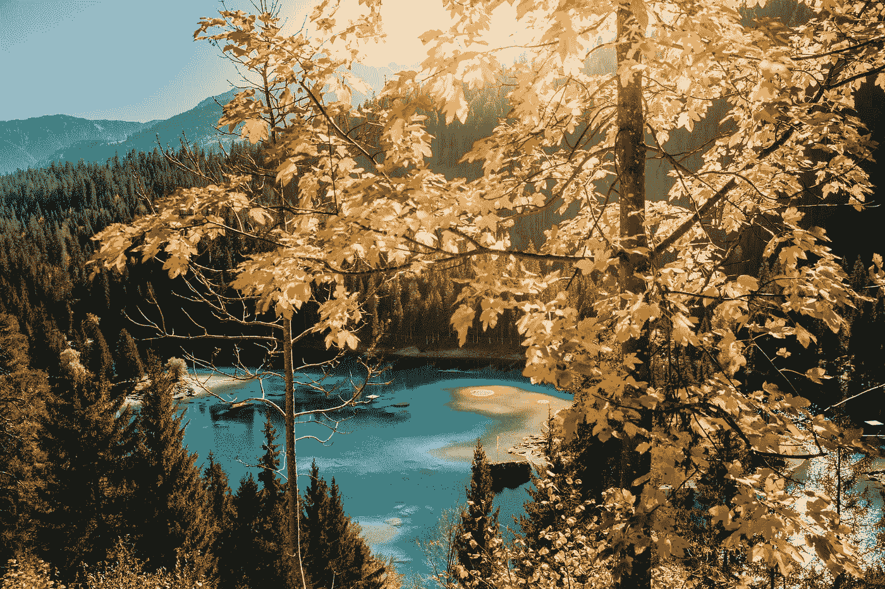

凯文·施密德在 [Unsplash](https://unsplash.com/?utm_source=unsplash&utm_medium=referral&utm_content=creditCopyText) 上的照片

使用不同的 k 值通过聚类算法运行此图像，您将获得以下输出:

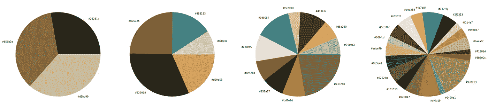

上图中 3、5、10 和 20 种最受欢迎的颜色。作者图片

正如你所看到的，使用太少的颜色不能反映真实的画面，使用太多的颜色会使结果变得嘈杂。在我的实验中，我设置了 5 种颜色。

让我们看看代码并讨论实现细节。

我们首先对给定的图像进行预处理:将其调整为较小的尺寸，以使算法运行得更快，并根据 scikit-learn 对象的期望将其重新整形为 2D 数组。然后，我们训练一个聚类算法，获得聚类质心的坐标，并根据流行度对结果颜色进行排序，将它们从 RGB 转换为十六进制以便于可视化。

如果你想更好地理解代码和每个变量的类型和形状，请看看[这个交互式 Jupyter 笔记本](https://gitlab.com/Winston-90/movie_color_scheme/-/blob/main/video_color_scheme_demo.ipynb)，里面有演示代码和更详细的注释。

## 3.合成生成的图像

现在问题仍然很小:有了一组颜色，我们只需要合成最终的图像。

要做到这一点，我们需要一些简单的坐标计算，我已经在下面可视化了。

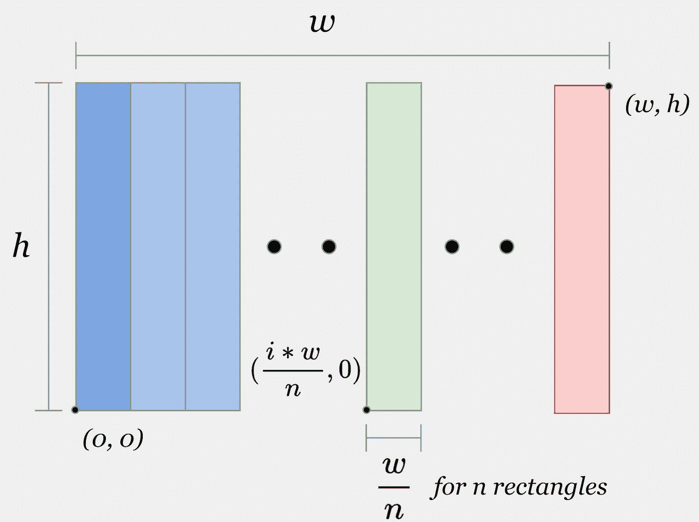

坐标计算的可视化。作者图片

我们知道，在 matplotlib 约定中，图像左下角点的坐标为 *(0，0)* ，右上角点的坐标为 *(w，h)* (如果图像的宽度等于 *w* ，高度等于 *h* )。

我们需要依次画出 n 个矩形，每次稍微向右移动。我将使用的 Matplotlib Rectangle 类使用三个参数绘制一个矩形:左下角的坐标、宽度和高度。

每个矩形的宽度和高度是相同的:高度等于图像的高度，宽度是图像的宽度除以矩形的数量。左下点的坐标等于索引 *i* 与图像宽度除以矩形数量的乘积。通过将 *i* = 0，1，2 代入上述公式来确保这一点。

请注意，图像宽度和高度是以英寸为单位设置的，而不是以像素为单位。请参考[带有演示代码的同一个 Jupyter 笔记本](https://gitlab.com/Winston-90/movie_color_scheme/-/blob/main/video_color_scheme_demo.ipynb)进行交互可视化。

为了简单起见，在上面的例子中，我明确指定了一个颜色列表。事实上，对于每张图片，我都保存了所有的前 k 种颜色。有了这些信息，您可以根据分析结果创建不同的颜色选择方法。

我已经实现了由`mode`参数选择的两个选项。如果`mode="popular"`，我们就选择最流行的颜色。但是如果`mode="sample"`，我们根据给定的分布采样颜色。因此，即使对于同一视频，您也可以获得不同的结果，使图像更加多样化。

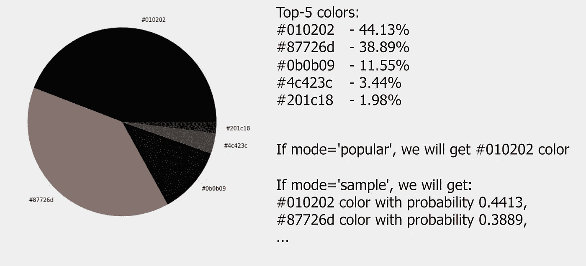

使用[蝙蝠侠预告片](https://www.youtube.com/watch?v=mqqft2x_Aa4)中的一帧解释模式参数。作者图片

# 用户指南

让我们来谈谈如何使用这个程序。您可以在下面的资源库中找到代码:

  

在设置好环境并安装了所需的库之后，就可以像我们通常在 Python 脚本中所做的那样，通过设置参数来使用程序:`python main.py --parameter1 value --parameter2 value`。让我们回顾一下程序参数。

## 程序参数列表

必需的参数:

*   `video_path`:要处理的视频文件的路径；
*   `result_path`:保存结果图像的路径(包括。png)；
*   `width`:结果图像的宽度，英寸。默认值:25；
*   `height`:生成图像的高度，英寸。默认值:5。

不太重要的参数(您可以只使用默认值):

*   `mode`:选择颜色的模式。如果是‘流行的’——返回最流行的颜色，否则根据分布抽样颜色。默认值:“样本”；
*   `start`:开始视频处理的时间(秒)。默认值:1；
*   `step`:以秒为单位步进。默认值:1；
*   `number_of_colors`:从每幅图像中提取的颜色数(聚类数)。默认值:5；
*   `compress_to`:预处理过程中调整图像大小的像素数。默认值:200；
*   `verbose`:如果为真，显示结果图像。默认值:False
*   `delete_after`:如果为真，处理后删除临时文件。默认值:False。

## 保存中间结果

我还需要提到一个可以节省您时间的实现细节。由于分析阶段需要很长时间，拒绝保存中间结果将不是一个好的解决方案。

因此，我保存了*图像数组*和*颜色数组*，以便您稍后可以重现实验。例如，如果您设置了`mode="sample"`，但没有发现结果图像非常吸引人，您可以只运行最后一个阶段，提供保存的颜色数组文件的路径(注释掉 *main.py* ) **中相应的代码行)，而不需要从头开始运行整个分析**。

对于*videoname.mp4*，这些文件将被命名为 *videoname_images.pkl* 和 *videoname_colors.pkl* 并保存在`tmp`文件夹中。

# 走廊

在这个部分中，您可以找到基于不同电影的程序输出。所有提供的高分辨率图像你也可以在回购中找到。

让我先分析一下我在文章开头给你看的《怪物史莱克 2》的配色方案，以基本证明这种方法是可行的，并且能够引起真正的电影爱好者的兴趣。让我们放大来回顾前 10 分钟:

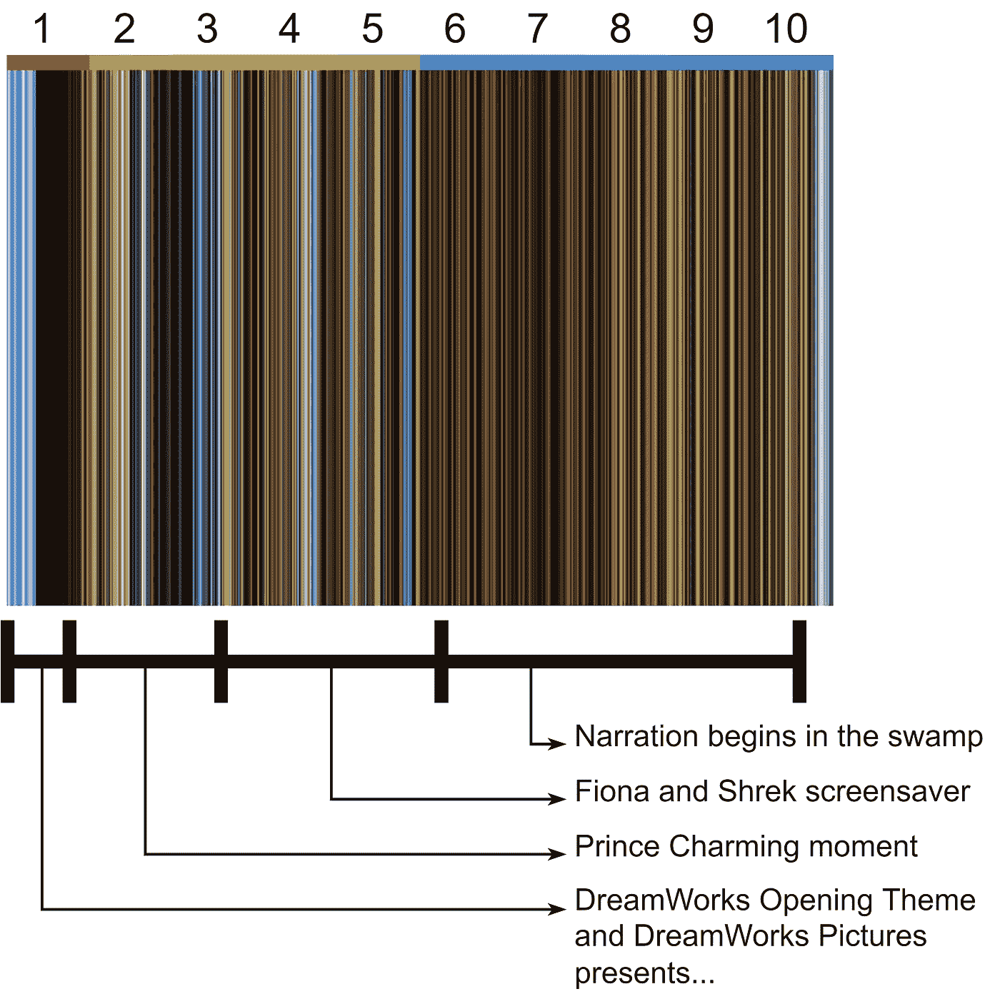

《怪物史莱克 2》前 10 分钟色彩分析。图片作者。

这里的步长参数等于它的默认值 1，所以上图中的每个小矩形都是视频中的一秒。

漫画以梦工厂的开场主题开始，一个孩子坐在月亮上扔鱼竿。这是发生在*浅蓝色* *背景*中的。黑色背景上的白色小标题写着梦工厂的礼物……然后就出现了。

接下来是一个带有故事书的小故事和白马王子据称拯救了菲奥娜的时刻，之后是一个关于菲奥娜和史莱克的电影的真正的屏幕保护程序，顺便提一下，这里有许多关于各种文化作品的参考资料。之后，叙述实际上开始于沼泽，以适当的色调。

我们继续看*指环王*。第二部电影的色彩设计和第三部电影明亮的结尾吸引了我的眼球。

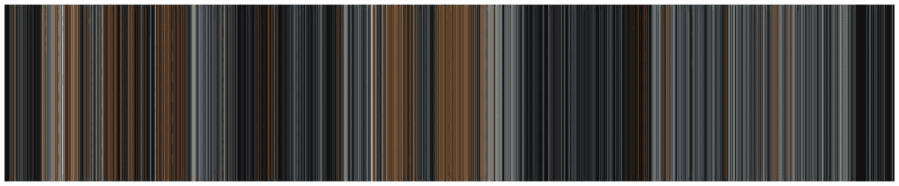

指环王-指环联盟。作者图片

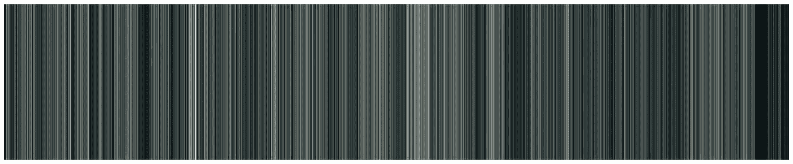

指环王-双塔。作者图片

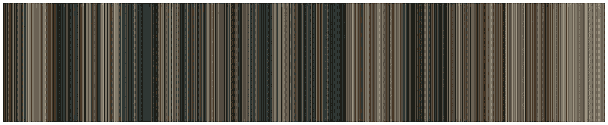

指环王-王者归来。作者图片

我也分析了所有的*哈利波特*电影。第三部电影的标题在这里最引人注目——它们很轻(以掠夺者地图为背景)。在最后一部电影中，哈利和邓布利多谈话的那个精彩瞬间也历历在目。

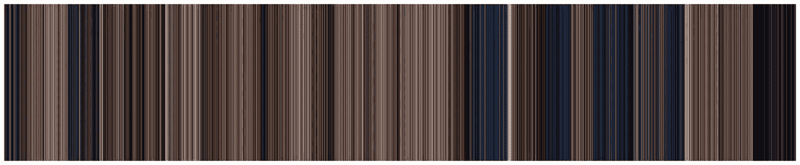

哈利波特与魔法石。作者图片

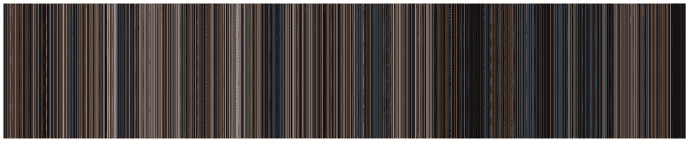

哈利波特与密室。作者图片

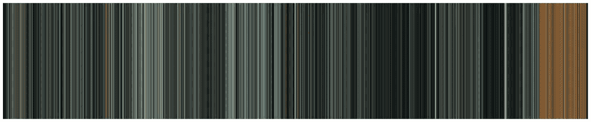

哈利波特与阿兹卡班的囚徒。作者图片

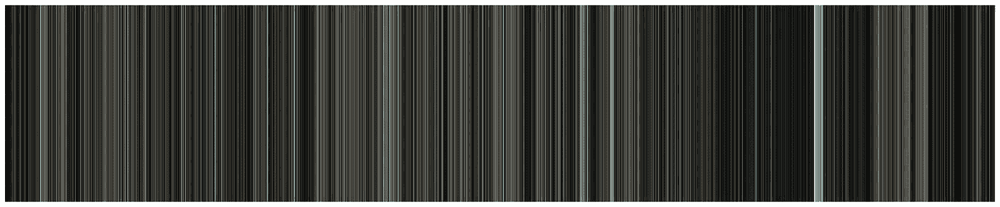

哈利波特与火焰杯。作者图片

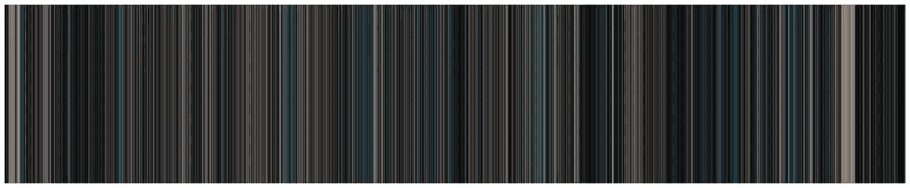

哈利波特与凤凰社。作者图片

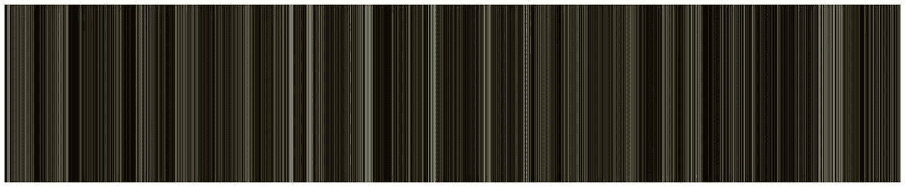

哈利波特与混血王子。作者图片

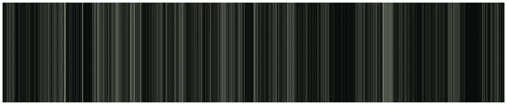

哈利·波特与死亡圣器(上)。作者图片

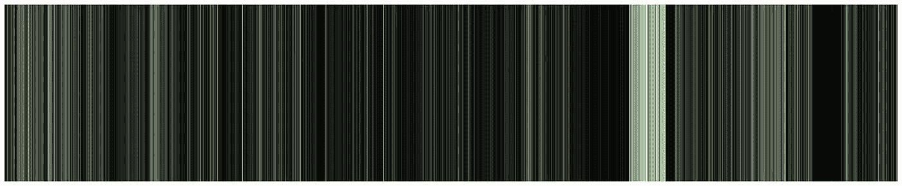

哈利·波特与死亡圣器第二部。作者图片

只要有一点想象力，你就可以根据这些图像创作出迷人的艺术作品。我不太擅长这个，但让我告诉你一个大概的想法。

由此可知:

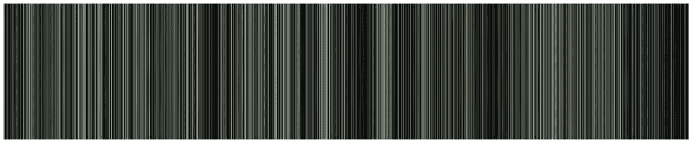

搏击俱乐部，1999 年。作者图片

对此:

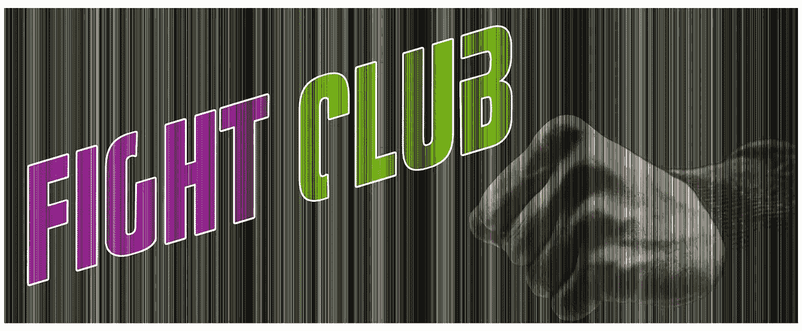

搏击俱乐部艺术图片:[公共领域](https://commons.wikimedia.org/wiki/File:Fight_Club_logo1.png)和照片由 [NEOSiAM 2021](https://www.pexels.com/photo/left-fist-635356/)

# 结果和结论

最后，让我稍微讨论一下所做的工作。

## 支持的视频格式

这个程序使用 [*moviepy* 库](https://zulko.github.io/moviepy/)进行视频处理，所以支持 FFmpeg 支持的各种视频格式，像. mp4，.mpeg，。avi，。mov，。mkv 等。参见此处的完整列表[(多路复用器部分)](https://en.wikipedia.org/wiki/FFmpeg#:~:text=of%20re%2Dencoding.-,Muxers,-%5Bedit%5D)。

有时我会遇到 moviepy 视频读取错误，将视频文件从一种格式转换为另一种格式通常会有所帮助。我用了一个免费的 VLC 视频播放器。

## 执行时间

正如我们上面讨论的，该程序包括三个主要阶段——从视频中提取图像，分析它们，并编辑最终图像。

第一个和最后一个阶段进行得相当快。图像的编辑几乎在瞬间发生，而视频到图像的转换通常不超过两分钟。

但是图像分析需要很多时间，通常情况下，它是**大约与视频的持续时间**相同(对于 1 秒的步骤)。要缩短这一时间，您可以:

*   将`step`参数设置为较大的值(例如 2 或 3)。这将允许您在最终图像中使用较少的矩形获得不太精确的可视化效果，但会显著提高执行速度。
*   将`number_of_colors`或`compress_to`参数设置为较小的值，尽管这样会产生较差的结果，不推荐使用。

由于这个项目是业余的，只是为了兴趣和乐趣，它有许多缺点和未来工作的巨大领域。例如，聚类算法的优化实现和 GPU 的使用可以大大减少运行时间。

## 结论

很久以前，我就有了这个项目的想法。很久都没找到时间实现，后来开始写代码，遇到错误和未知。当代码准备好的时候，我花了*20 多个小时*来处理你在上面看到的流行电影。最后，我整理了一下思路，把它们转移到这篇文章上。

虽然实现并非没有缺点(它可以工作得更快，并且我没有删除黑条，这在黑暗电影中可能是一个问题)，但我对结果非常满意。设定目标，并面临挫折，但最终实现你想要的是一个人能经历的最好的感觉之一。

# 感谢您的阅读！

*   我希望这些材料对你有用。[在 Medium](https://medium.com/@andimid) 上关注我，获取更多类似的文章。
*   如果您有任何问题或意见，我将很高兴得到任何反馈。在评论中问我，或者通过 [LinkedIn](https://www.linkedin.com/in/andimid/) 或 [Twitter](https://twitter.com/dimid_ml) 联系我。
*   为了支持我作为一名作家，并获得数以千计的其他媒体文章，使用[我的推荐链接](https://medium.com/@andimid/membership)获得媒体会员资格(不收取额外费用)。