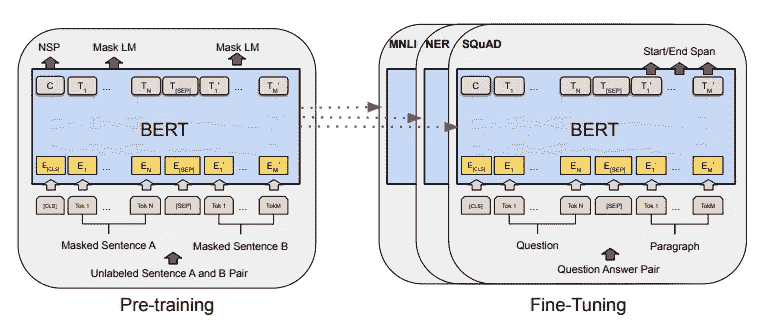
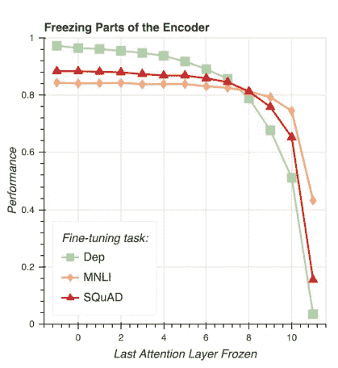
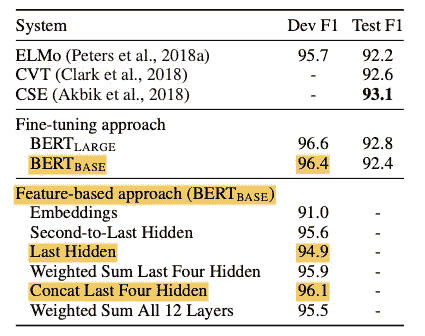
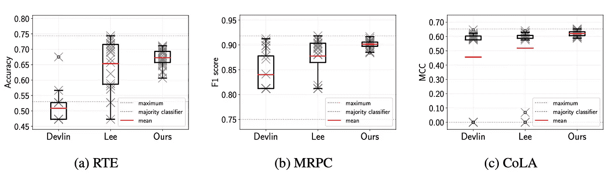

# 当我们微调伯特时，到底会发生什么？

> 原文：<https://towardsdatascience.com/what-exactly-happens-when-we-fine-tune-bert-f5dc32885d76>

## 对最近的一些 BERTology 研究的进一步观察

预训练/微调方法的说明。3 个不同的下游 NLP 任务，MNLI、NER 和 SQuAD，都是通过对特定任务进行微调，用相同的预训练语言模型来解决的。图片鸣谢:德夫林等人 2019。

谷歌的 [BERT](https://arxiv.org/pdf/1810.04805.pdf) 是自然语言建模中的一个范式转变，特别是因为引入了预训练/微调范式:在以无监督的方式对大量文本数据进行预训练后，模型可以用相对较少的标签对特定的下游任务进行快速微调，因为一般的语言模式已经在预训练期间学习过了。

作者 Jacob Devlin 等人写道，微调 BERT 是“直截了当的”，只需在最终 BERT 层之后添加一个附加层，并在几个时期内训练整个网络。作者在标准的 NLP 基准问题 GLUE、SQuAD 和 SWAG 上展示了强大的性能，这些问题在使用 ADAM optimizer 进行了 2-3 个时期的微调之后，探索了自然语言推理的不同方面，学习率在 1e-5 到 5e-5 之间，这是一种在研究社区中普遍采用的方法。

由于其显著的成功，这种预训练/微调范例已经成为该领域的标准做法。然而，从科学的角度来看，我们实际上并没有很好地理解微调过程。微调过程中哪些图层会发生变化？我们需要微调吗？结果有多稳定？让我们深入一些在最初的伯特论文之后的最近的“伯特学”研究。

## 微调过程中哪些图层会发生变化？

冻结前 8 层 BERT 对 MNLI 和 SQuAD 上的微调性能影响不大。图片来源:Merchant et al 2020。

BERT 背后的直觉是，早期层学习与下游任务几乎没有关联的通用语言模式，而后期层学习特定于任务的模式。这种直觉符合深度计算机视觉模型，早期层学习边缘和拐角等通用特征，后期层学习特定特征，如面部检测情况下的眼睛和鼻子。

这种直觉已经被另一个谷歌团队 Amil Merchant 等人在他们的作品“[中实验性地证实了，在微调过程中 BERT 嵌入发生了什么？](https://arxiv.org/pdf/2004.14448.pdf)“他们的技术之一被称为部分冻结:他们在微调过程中保持早期 BERT 层冻结，即固定，并测量当改变冻结层的数量时，下游任务的性能会改变多少。它们表明，即使冻结 12 个 BERT 层中的前 8 个(即仅调整后 4 个)，MNLI 和小队任务的性能也不会显著下降。

这一发现证实了这样的直觉，即最后一层是最特定于任务的，因此在微调过程中变化最大，而早期层保持相对稳定。该结果还意味着，实践者可以通过冻结早期层而不是在微调期间训练整个网络来潜在地节省计算资源。

## 我们需要微调吗？

基于特征的方法的性能接近于在 CoNLL-2003 上的微调模型。图片鸣谢:德夫林等人 2019。

除了微调，我们是否可以简单地将预训练的 BERT 模型中的嵌入内容作为下游模型中的特征？毕竟，微调在计算上仍然很昂贵，因为 BERT 模型中有大量的自由参数，在 BERT-base 的情况下有 110 万个，在 BERT-large 的情况下有 340 万个。此外，在具有大量下游任务的应用中，共享一组可以在下游进行调整的公共权重会更经济。

Devlin 等人将这种方法称为“基于特征的方法”，他们发现，实际上，它可以执行接近微调的模型。特别地，在最终分类层之前，他们将预训练的 BERT 嵌入馈送到随机初始化的 2 层 BiLSTM 网络中，并在 CoNLL-2003 命名实体识别基准问题集上测量性能。有趣的是，他们发现使用倒数第二个隐藏的 BERT 层比最终层效果更好，这表明最终层因此过于接近预训练任务，因此来自早期层的嵌入更有用。事实上，作者报告了使用所有最后 4 个隐藏层作为特征时的最佳结果:F1 得分为 96.1%，仅比微调的 BERT 模型低 0.3%。

研究员马修·彼得斯等人在《[调还是不调？使预先训练的表征适应不同的任务](https://arxiv.org/pdf/1903.05987.pdf)，得出类似的结论。他们考虑了 5 种不同的 NLP 任务，并将标准微调方法与基于特征的方法进行了比较，其中他们使用所有 12 个 BERT 层作为下游神经网络模型中的特征。他们发现，对于围绕命名实体识别、情感分析和自然语言推理的任务，基于特征的方法与微调模型的性能接近(精度在 1%以内)。语义文本相似性任务是一个例外，在这个任务中，微调比基于特征的方法要好得多(2–7%)。

## 微调稳定吗？

按照 Devlin 等人(最左边的点)和 Mosbach 等人(最右边的点)的微调方法，对 25 个随机种子的模型性能进行了微调。莫斯巴赫的方法始终能产生更稳定的结果。图片鸣谢:莫斯巴赫等人 2021。

BERT 的问题之一是所谓的*微调不稳定性*现象:研究人员观察到，用不同的随机种子开始微调训练工作会导致非常不同的结果，其中一些可能很差。为了解释这种不稳定性，一些从业者建议使用不同的种子运行许多微调作业，并在拒绝集合中挑选最好的一个，但这种做法可能会导致拒绝集合中的过度拟合。

为什么微调 BERT 这么脆？这个问题已经由两个小组研究过，马里乌斯·莫斯巴赫和他的合作者，在他们的工作“[关于微调 BERT](https://arxiv.org/pdf/2006.04884.pdf) 的稳定性”，和张天翼等人在“[重温少样本 BERT 微调](https://arxiv.org/abs/2006.05987)”中，都得出了相似的结论。

首先，有优化器的问题。最初的 ADAM 优化器包括一个“偏差校正项”，该项隐含地添加了一个预热机制，有效地降低了训练过程开始时的学习率。然而，在 BERT 的张量流实现中，作者排除了这一项。Mosbach 等人和 Zhang 等人都表明，这解释了微调不稳定性的一部分:在重新添加偏差校正项后，微调结果更加稳定，这可能是因为该项添加了隐式预热阶段。

第二，是训练时期的数量。Mosbach 等人和 Zhang 等人都表明，当训练超过“标准”3 个时期时，微调不稳定性就会消失，如 Devlin 等人的论文中所做的那样。莫斯巴赫等人甚至推荐对 20 个时期进行微调。直觉上，这个结果是有意义的:即使我们选择了最差的种子，我们也应该能够收敛到与最佳种子相同的全球潜在最小值，只是需要更长的时间。

## 结论

让我们用 3 个要点总结一下这些经验:

*   伯特的层次是分等级的。早期的 BERT 层学习更多的通用语言模式，相当于深度视觉模型中的棱角，而后期的 BERT 层学习更多的任务特定模式。
*   **微调并不总是必要的。**相反，基于特征的方法是一种可行且廉价的替代方案，我们只需提取预先训练的 BERT 嵌入作为特征。然而，重要的是不要只使用最后一层，至少要使用最后 4 层，或者全部。
*   **当遵循 Devlin 等人的方法时，微调是脆弱的**这种*微调不稳定性*已被证明在训练大量时期时消失，并且当使用原始 ADAM 优化器而不是 Devlin 等人使用的修改版本时消失。

