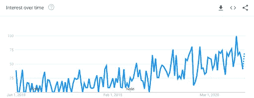
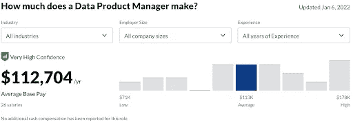
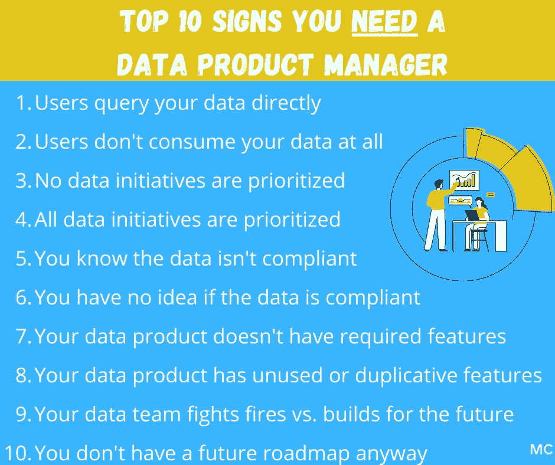

# 优秀的数据产品经理做什么——为什么你可能需要一个

> 原文：<https://towardsdatascience.com/what-good-data-product-managers-do-and-why-you-probably-need-one-27694d086610>

## 意见，数据团队

## 打开现代数据团队中最新的数据角色:数据产品经理

***本文与*** [***阿图古普特***](https://www.linkedin.com/in/atulgupte/) ***合著。***

我们与之交谈的公司都在努力构建他们的数据产品或平台。这包括[迁移到雪花](https://www.montecarlodata.com/how-to-migrate-to-snowflake-like-a-boss/)，与数据块集成，向[数据网格](https://www.montecarlodata.com/data-mesh-fad-or-fab/)移动，或者通常投资于他们的数据堆栈。

我们越来越多地看到数据部门将他们的团队结构现代化，由数据产品经理来负责这些项目。

这些数据产品经理负责识别内部用户数据体验中的差距，并通过与数据和分析团队合作来弥补这些差距。它们推动项目的优先顺序和总体愿景，以发展组织有效运营数据的内部能力。

Tableau 的首席数据官温迪·特纳-威廉姆斯(T21)认为这是一个非常重要的角色。好的产品需要好的产品经理。

“从我的角度来看，数据产品经理实际上是我最想聘用的角色之一。我喜欢他们真正创造愿景，然后推动工程师实现这一愿景，”温迪在最近的一次谈话中说。“对我来说，这是一个重要的组成部分，因为我倾向于关注能够创造故事、与我们的内部客户甚至我们的产品团队互动的数据产品经理。”

在本文中，我们将介绍:

*   什么是数据产品
*   数据产品经理是做什么的？他们需要什么技能？
*   产品经理需要什么背景？他们向谁报告？
*   数据产品经理与产品经理
*   数据产品经理与数据科学家
*   数据产品经理的未来

# 什么是数据产品经理？角色是如何演变的？

21 世纪初，LinkedIn、网飞和优步等公司遇到了问题。整个组织的团队都在大规模地处理数据，而且是大量的数据。

数据为他们的产品路线图提供动力，推动管理层决策，并为他们的付费营销活动提供信息。

内部和外部数据在公司内外流动。对于如何使用这些数据以及由谁使用这些数据，有一些法规、指导方针和限制。但没有人负责开发数据解决方案，以使分析具有可操作性、可扩展性和可访问性。

因此，创建了产品数据经理这一角色来回答以下问题:

*   存在哪些数据？
*   谁需要这些数据？
*   这些数据从哪里流入/流出？
*   这些数据有什么用？
*   有没有一种方法可以更容易地处理/访问这些数据？
*   这些数据是否合规和/或可操作？
*   我们如何更快地让数据对公司更多的人有用？

# 什么是数据产品？

当然，没有一个数据产品——或者几个数据产品——就不可能有一个数据产品经理。

但是定义一个数据产品却异常困难。事实是，许多东西都可以被视为数据产品，从 Looker 仪表板或 Tableau 报告，到 A/B 测试平台，甚至是多层[数据平台](https://www.montecarlodata.com/the-quick-and-dirty-guide-to-building-your-data-platform/)。

[Yelp 的数据实验负责人 Eric Weber 建议](https://ericdataproduct.substack.com/p/data-products-arent-all-the-same)“以一种通用的方式谈论数据产品可以产生通用的结果。数据产品是一个有用的想法，但要让它真正创造价值，我们必须深入细节……”

所以说具体点。不管该产品可视化/处理/投入工作的数据是什么，它都应该**提供**特定的结果:

*   提高数据可访问性(当人们需要时，在他们需要的地方提供表面数据)
*   增加数据民主化(使人们更容易操纵数据)
*   更快的数据投资回报(更快的洞察力)
*   为数据团队/数据消费者节省时间
*   更精确的见解(即实验平台)

同样，数据产品应该具有一些重要的特征或品质。

*   **可靠性和可观察性**。SaaS 产品的可接受停机时间是关于“多少个 9”的讨论 99.9%或 99.999%的可用性。正如软件工程师使用 Datadog 或 New Relic 等产品来跟踪 SaaS 产品性能一样，数据产品经理需要[解决方案来近乎实时地识别和解决数据产品性能问题](https://www.montecarlodata.com/product/) [s](https://www.montecarlodata.com/product/) 。
*   **可扩展性**。数据产品应该随着组织和需求的增长而扩展弹性。
*   **延展性**。虽然数据产品可能是通过集成不同的解决方案构建的，但它需要保持与 API 轻松集成的能力，并且足够灵活，能够以最终用户喜欢的所有不同方式使用数据。
*   **可用性**。伟大的 SaaS 产品专注于提供伟大的用户体验。它们很容易学习，使用起来很有趣，完成工作也很快。
*   **安全与合规**。数据泄露代价高昂，令人痛苦，监管罚款也是如此。
*   **发布规程和路线图**。SaaS 产品不断发展和改进。路线图是在未来至少一年内制定的，并有强大的质量保证流程进行更新。

# 数据产品经理是做什么的？他们需要什么技能？

数据产品经理负责数据民主化和加快数据本身的价值实现。他们设计、构建和管理数据平台或一套特定数据工具的跨职能开发，以服务于多个客户。

例如，Atul 为优步的数据分析、数据知识和数据科学平台定义了产品战略和方向。在任职期间，他领导了一个项目来改进组织的[数据科学工作台](https://eng.uber.com/evolution-ds-workbench/)，数据科学家利用该工作台来简化协作。

数据科学家目前正在自动验证和核实申请加入优步平台时所需的工人文档。对于机器和深度学习来说，这是一个伟大的项目，但问题是数据科学家通常会达到可用计算的极限。

传统的工程项目负责人可能试图添加更多的虚拟机或延长项目时间表，而 Atul 研究了多种解决方案，并确定虚拟 GPU(当时是一种新兴技术)为一种可能的解决方案。

虽然价格不菲，但 Atul 的领导证明了支出的合理性。该项目不仅为公司节省了数百万美元，还支持了一项关键的竞争优势。

这种积极主动的方法让优步开始构建他们需要的基础，以便在 GPU 可用时立即加以利用。价值实现时间大大加快，这是优秀数据产品经理的标志。

# 数据产品经理需要什么背景？他们向谁报告？

虽然您不需要编写代码，但如果没有经过技术培训，这是一项很难完成的工作。这是一个需要理解复杂系统并与非常专业的同事一起工作的角色。

如果候选人有与客户交谈的经验，也会有所帮助。这可能表明他们擅长翻译需求和向不同的受众讲述故事。

常见的数据产品经理背景包括:

*   后端工程(想要设定愿景的经理或优秀工程师)
*   传统 B2B 产品管理
*   内部工具产品管理
*   数据分析师

一个数据产品经理挣多少钱？根据 Glassdoor 的数据，数据产品经理的平均工资为 112，704 美元。

一些数据产品经理依赖于数据分析师和数据科学家。其他人与运营团队、软件工程师一起工作，或者在更大的公司里，与行政人员一起工作。

无论报告的结构如何，数据产品经理使数据消费者更容易理解和民主化，而不是数据本身，而是从数据中收集的见解。

# 数据产品经理与产品经理

处理数据涉及到大多数产品管理形式所特有的技能。

在为公司构建数据平台时，您必须考虑各种数据角色:工程师、数据科学家、产品经理、业务功能用户和总经理。(图片由 Atul Gupte 提供)

您不是与传统客户合作，而是与数据消费者合作。这些员工使用的产品能够理解您公司的数据，无论是内部产生的、第三方的还是其他的。

换句话说，数据产品经理是一个产品经理角色**，专门负责**构建内部数据工具或服务于内部数据消费者的数据产品。

# 数据产品经理与数据科学家

这两种角色的主要区别在于，数据科学家试图在现有产品或解决方案中收集见解。例如，“为什么用户不注册？”

另一方面，数据产品经理致力于通过发现“数据的最佳结果是什么，以及我们如何实现这一结果”来增强工程师、业务利益相关者和执行领导的能力

例如，优步在用户每次出行时都会收集数据。数据科学家将能够帮助预测用户可能抱怨或跳转到另一个拼车应用程序的价格点，以及价格如此之高的原因。

数据项目经理将关注数据还可以做什么，它可以与什么其他数据结合，如何确保数据是可靠的，机器学习模型是否足够，等等。

# 数据产品经理的未来

数据团队正变得越来越分散和分散，从数据治理经理到分析工程师，出现了更多的角色。

与此同时，数据生产者和数据使用者之间的距离越来越大，需求呈指数增长。这在一定程度上是因为组织的所有部门越来越依赖数据。

数据产品经理的未来将非常类似于传统的产品经理:一个跨越孤岛并激励团队和谐相处的指挥。

他们将是数据团队成员、数据消费者和产品构建者之间的关键连接点。它们将弥合数据产品和数据即服务之间的鸿沟。他们将确定用户的需求，监控开发，传播愿景，协调利益相关者，并对项目进行优先排序。

因此，组织将从应对数据火灾的被动姿态转变为构建内部数据能力作为竞争优势的主动姿态。

进步的数据产品经理将严格检查好的数据产品的质量，并设定他们自己的衡量标准(我们对[停机时间和数据质量](/data-quality-youre-measuring-it-wrong-8863e5ae6491)有一些建议)。

将调查数据产品用户满意度，测量停机时间，并记录发布流程。这一切都将与商业价值联系起来，并在整个公司传播。

这对任何数据专业人员来说都是一个激动人心的未来。

***在 LinkedIn 上连接*** [***巴尔***](https://www.linkedin.com/in/barrmoses/) ***和*** [***阿图***](https://www.linkedin.com/in/atulgupte/) ******

*您是否正在为您的组织开发和管理数据产品？ [***伸手到蒙特卡洛***](https://www.montecarlodata.com/request-a-demo/) ***。****