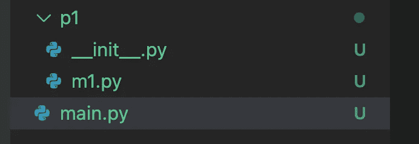
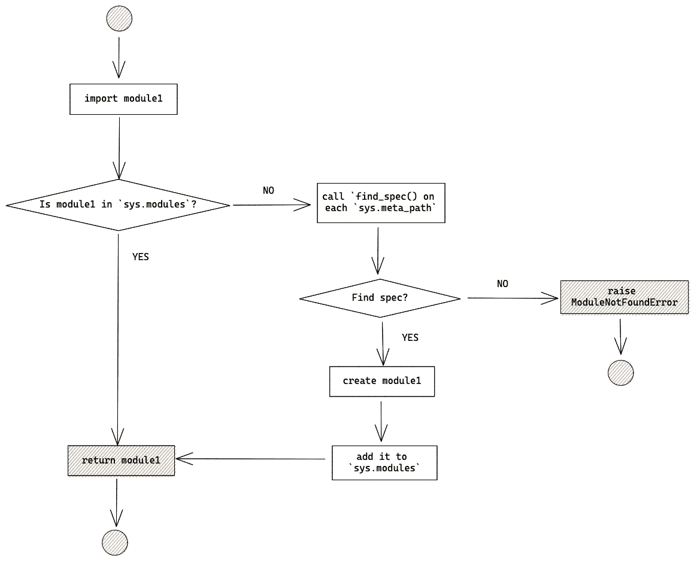
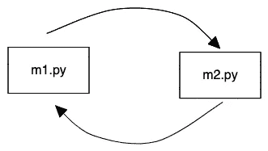
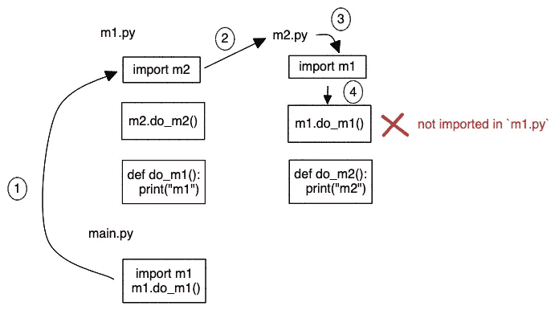

# 导入 Python 模块会发生什么？

> 原文：<https://towardsdatascience.com/what-happens-when-you-import-a-python-module-ad6c0efd2640>

## 深入研究进口系统


照片由[迈克·范·登博斯](https://unsplash.com/@mike_van_den_bos)从 [Unsplash](https://unsplash.com/) 拍摄

可用性是衡量代码质量的关键指标之一。它是指代码可以在不同的程序中以最小的改动使用的程度。在 Python 中，我们使用`import`从模块中导入代码。但是你有没有好奇过`import`是如何在幕后实现的？在本文中，我们将深入探讨 Python 的导入系统。我们还会讨论一个有趣的问题:循环导入。喝杯茶，让我们直接进入正题。

## 模块 v.s .包

Python 被组织成模块和包。**模块是一个 Python 文件，包是模块的集合。**考虑以下导入模块的示例:

```
import random
random.randint(1,10)
```

`[random](https://docs.python.org/3/library/random.html)`是 Python 内置的模块。在第一行中，它导入`random`模块并使其可用，然后它访问`randint()`。如果您打开一个 IDE 并调试导入，您将看到代码位于`random.py`文件中。

也可以这样导入`randint`:

```
from random import randint
randint(1,10)
```

让我们来看一个包中的例子:

```
import pandas
pandas.DataFrame()
```

乍一看，你真的分辨不出它是模块还是包。但是如果您调试导入，它会将您重定向到`[pandas](https://github.com/pandas-dev/pandas/tree/main/pandas).__init__.py`而不是`pandas.py`。一个包包含子模块或递归子包，而`__init__.py`是包的入口点。

但不是唯一的方法，像`importlib.import_module()`和内置`__import__()`这样的函数也可以使用。

```
>>> import importlib
>>> importlib.import_module('random')
<module 'random' from '/Users/xiaoxu/.pyenv/versions/3.9.0/lib/python3.9/random.py'>>>> __import__('random')
<module 'random' from '/Users/xiaoxu/.pyenv/versions/3.9.0/lib/python3.9/random.py'>
```

## 包裹。__init__。巴拉圭

那么什么是`__init__.py`？

> 一个[常规 Python 包](https://docs.python.org/3/reference/import.html#regular-packages)包含一个`__init__.py`文件。当包被导入时，这个`__init__.py`文件被隐式执行，它定义的对象被绑定到包的名称空间中的名称。该文件可以留空。

让我们看一个例子。我有一个这样的文件夹结构。`p1`是我的包，`m1`是子模块。



文件夹结构(由[高](https://medium.com/u/2adc5a07e772?source=post_page-----ad6c0efd2640--------------------------------)创建)

在`m1.py`中，我有一个变量`DATE`，我想在`main.py`中使用它。我将创建几个版本的`__init__.py`，看看它如何影响`main.py`中的导入。

```
# m1.py
DATE = "2022-01-01"
```

**案例 1:清空** `**__init__.py**` **文件。**

由于导入`p1`时`__init__.py`文件为空，所以没有导入子模块，所以不知道`m1`的存在。如果我们使用`from p1 import m1`显式导入`m1`，那么`m1.py`中的所有内容都将被导入。但是，我们实际上不是导入一个包，而是导入一个模块。可以想象，如果您的包有很多子模块，您需要显式地导入每个模块，这可能会非常繁琐。

```
# main.py
import p1
p1.m1.DATE>> AttributeError: module 'p1' has no attribute 'm1'from p1 import m1
from p1 import m2, m3 ...# needs to explictly import every submodulem1.DATEWorks!!
```

**情况 2:导入** `**__init__.py**` **文件**中的子模块

我们从`__init__.py`文件中的`m1`导入所有内容，而不是将其留空。然后，`main.py`文件中的`import p1`会识别`m1.py`中的变量，你可以直接调用`p1.DATE`而不知道它来自哪个模块。

```
# __init__.py
from .m1 import * # or from p1.m1 import *
from .m2 import * # main.py
import p1
p1.DATE
```

你可能已经注意到了`m1`前面的*点*。这是一个告诉它在当前包中搜索的快捷方式。这是一个相对进口的例子。一个等价的绝对导入将像`from p1.m1 import *`一样显式地命名当前包。

不过有一个警告。如果包中的另一个子模块包含相同的变量，后面导入的子模块将覆盖前面的子模块。

拥有一个非空的`__init__.py`的好处是当客户端导入包时，所有的子模块都已经可用，所以客户端代码看起来更整洁。

## Python 如何找到模块和包？

在 Python 中查找模块和包的系统被称为**导入机制**，它由查找器、加载器、缓存和编排器组成。



进口机械(由高创造)

1.  **搜索模块中缓存的** `**sys.modules**`

每次导入模块，首先搜索的是`sys.modules`字典。键是模块名，值是实际的模块本身。`sys.modules`是一个缓存的字典，如果模块在那里，那么它将被立即返回，否则，它将在系统中被搜索。

回到前面的例子。当我们导入`p1`时，两个条目被添加到`sys.modules`。顶层模块`__init__.py`和子模块`m1.py`。

```
import p1
import sys
print(sys.modules){
'p1': <module 'p1' from '/xiaoxu/sandbox/p1/__init__.py'>,
'p1.m1': <module 'p1.m1' from '/xiaoxu/sandbox/p1/m1.py'>
...
}
```

如果我们导入它两次，第二次导入将从缓存中读取。但是如果我们故意从`sys.modules`字典中删除条目，那么第二次导入将返回一个新的模块对象。

```
# read from cache
import p1
import sys
old = p1
import p1
new = p1
assert old is new# read from system
import p1
import sys
old = p1
del sys.modules['p1']
import p1
new = p1
assert not old is new
```

**2。搜索模块规格**

如果模块不在`sys.modules`字典中，那么它需要被一列[元路径查找器](https://docs.python.org/3/library/sys.html#sys.meta_path)对象搜索，这些对象有它们的`find_spec()`方法，以查看模块是否可以被导入。

```
import sys
print(sys.meta_path)
[   <class '_frozen_importlib.BuiltinImporter'>,
    <class '_frozen_importlib.FrozenImporter'>,
    <class '_frozen_importlib_external.PathFinder'>]
```

`BuiltinImporter`用于内置模块。`FronzenImporter`用于定位冻结的模块。`PathFinder`负责查找位于这些路径之一的模块。

*   `sys.path`
*   `sys.path_hooks`
*   `sys.path_importer_cache`
*   `__path__`

让我们看看`sys.path`里有什么。

```
import sys
print(sys.path)
[   '/xiaoxu/sandbox',
    '/xiaoxu/.pyenv/versions/3.9.0/lib/python39.zip',
    '/xiaoxu/.pyenv/versions/3.9.0/lib/python3.9',
    '/xiaoxu/.pyenv/versions/3.9.0/lib/python3.9/lib-dynload',
    '/xiaoxu/.local/lib/python3.9/site-packages',
    '/xiaoxu/.pyenv/versions/3.9.0/lib/python3.9/site-packages']
```

`PathFinder`将使用`find_spec`方法寻找模块的`__spec__`。每个模块都有一个规范对象，它是模块的元数据。其中一个属性是`loader`。`loader`指示输入机械在创建模块时使用哪个加载器。

```
import p1
print(p1.__spec__)ModuleSpec(name='p1', loader=<_frozen_importlib_external.SourceFileLoader object at 0x1018b6ac0>, origin='/xiaoxu/sandbox/p1/__init__.py', submodule_search_locations=['/xiaoxu/sandbox/p1'])
```

**3。加载模块**

一旦找到模块规范，导入机器将使用 loader 属性初始化模块，并将其存储在`sys.modules`字典中。您可以阅读这个[伪代码](https://docs.python.org/3/reference/import.html#loading)来理解在导入的加载部分发生了什么。

## Python 循环导入

最后我们来看一个进口的有趣问题:循环进口。当两个或多个模块相互依赖时，就会发生循环导入。在这个例子中，`m2.py`依赖于`m1.py`，而`m1.py`依赖于`m2.py`。



模块依赖(由[高](https://medium.com/u/2adc5a07e772?source=post_page-----ad6c0efd2640--------------------------------)创建)

```
# m1.py
import m2
m2.do_m2()def do_m1():
  print("m1")# m2.py
import m1
m1.do_m1()def do_m2():
  print("m2")# main.py
import m1
m1.do_m1()AttributeError: partially initialized module 'm1' has no attribute 'do_m1' (most likely due to a circular import)
```

Python 无法从模块`m1`中找到属性`do_m1`。那么为什么会出现这种情况呢？该图说明了这一过程。当`import m1`时，Python 逐行遍历`m1.py`。它找到的第一个东西是`import m2`，所以它去导入`m2.py`。第一行是导入`m1`，但是因为 Python 还没有遍历`m1.py`中的所有内容，所以我们得到了一个半初始化的对象。当我们调用哪个 python 没有看到的`m1.do_m1()`时，会引发 AttributeError 异常。



循环进口(由[高](https://medium.com/u/2adc5a07e772?source=post_page-----ad6c0efd2640--------------------------------)创造)

**那么如何修复循环导入呢？**一般来说，循环导入是糟糕设计的结果。大多数时候，这种依赖关系实际上并不是必需的。一个简单的解决方案是将两种功能合并到一个模块中。

```
# m.py
def do_m1():
  print("m1")
def do_m2():
  print("m2")# main.py
import m
m.do_m1()
m.do_m2()
```

有时，合并的模块会变得非常大。另一个解决方案是推迟`m2`的导入，以便在需要时导入。这可以通过将`import m2`置于功能`def do_m1()`中来实现。在这种情况下，Python 会加载`m1.py`中的所有函数，然后只在需要的时候加载`m2.py`。

```
# m1.py
def do_m1():
  import m2
  m2.do_m2()
  print("m1")def do_m1_2():
  print("m1_2")# m2.py
import m1def do_m2():
  m1.do_m1_2()
  print("m2")# main.py
import m1
m1.do_m1()
```

许多代码库使用延迟导入不一定是为了解决循环依赖，而是为了加快启动时间。来自 [Airflow](https://airflow.apache.org/docs/apache-airflow/stable/best-practices.html#top-level-python-code) 的一个例子是不要编写构建 Dag 所不需要的顶级代码。这是因为顶级代码解析速度对 Airflow 的性能和可伸缩性都有影响。

```
# example from Airflow doc**from** **airflow** **import** DAG
**from** **airflow.operators.python** **import** PythonOperator

**with** DAG(
    dag_id="example_python_operator",
    schedule_interval=**None**,
    start_date=pendulum.datetime(2021, 1, 1, tz="UTC"),
    catchup=**False**,
    tags=["example"],
) **as** dag:

    **def** print_array():
        **import** **numpy** **as** **np**  
        *# <- THIS IS HOW NUMPY SHOULD BE IMPORTED IN THIS CASE*

        a = np.arange(15).reshape(3, 5)
        print(a)
        **return** a

    run_this = PythonOperator(
        task_id="print_the_context",
        python_callable=print_array,
    )
```

## 结论

一如既往，我希望这篇文章对你有用，并能给你启发。我们认为 Python 中的许多东西都是理所当然的，但是当发现它内部是如何工作的时候，就变得有趣了。希望你喜欢，干杯！

## 参考

[https://alone-djangonaut . com/how-python-import-machinery-works](https://alone-djangonaut.com/how-pythons-import-machinery-works)