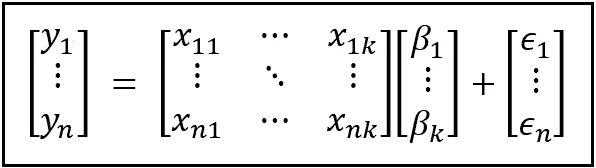
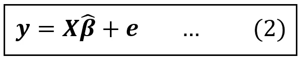
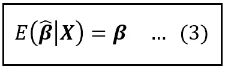
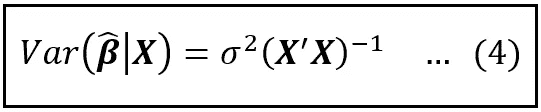
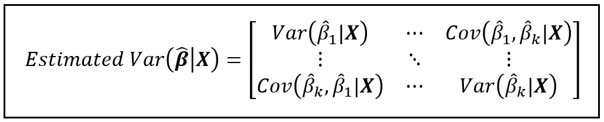
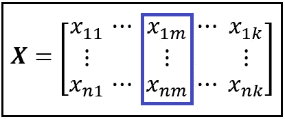
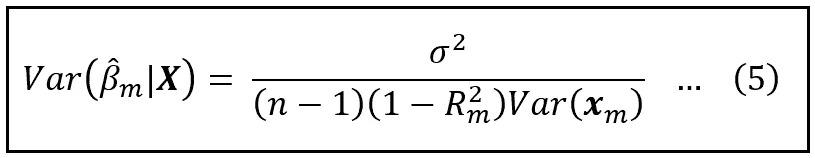
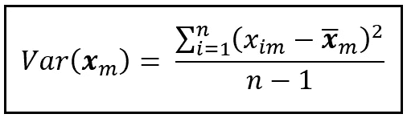
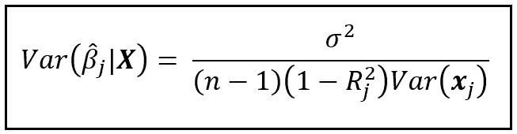

# 当你在回归模型中包含不相关的变量时会发生什么？

> 原文：<https://towardsdatascience.com/what-happens-when-you-include-irrelevant-variables-in-your-regression-model-77ab614f7073>

图片由 [Ernesto Velázquez](https://pixabay.com/users/3345557-3345557/) 来自 [Pixabay](https://pixabay.com/photos/darts-board-target-game-accuracy-6594496/) ( [Pixabay 许可](https://pixabay.com/service/license/))

## 你的模型失去了精确性。我们会解释原因。

[在上一篇文章](/what-happens-when-you-omit-important-variables-from-your-regression-model-966830590d53)中，我们看到了遗漏重要变量如何导致回归模型的系数变得[有偏差](/understanding-estimation-bias-and-the-bias-variance-tradeoff-79ba42ab79c)。在本文中，我们将研究这种情况的相反情况，也就是说，用完全多余的变量填充回归模型会对回归模型造成损害。

# 什么是无关和多余的变量？

回归变量被认为是不相关的或多余的有几个原因。以下是描述这些变量的一些方法:

*   **无法解释模型响应变量( ***y*** )中任何方差**的变量。
*   一个变量，它的**回归系数** ( *β_m* ) **在某个指定的 *α* 水平上是统计上不显著的**(即零)。
*   与模型中其余回归变量高度相关的**变量。由于其他变量已经包含在模型中，因此没有必要包含与现有变量高度相关的变量。**

向回归模型中添加不相关的变量会导致系数估计变得不太精确，从而导致整个模型失去精度。在本文的其余部分，我们将更详细地解释这一现象。

人们很容易在模型中填入许多回归变量，以期达到更好的拟合。毕竟，人们可能会推测，如果一个变量被判断为不相关，训练算法(如普通的最小二乘法)会简单地将其系数压缩到接近零。此外，可以表明，线性模型的 R 平方(或非线性模型的伪 R 平方)只会随着模型中回归变量的每次添加而增加。

不幸的是，在这种情况下，虽然 R 平方(或伪 R 平方)不断上升，但模型越来越不精确。

我们将使用线性回归模型作为我们的工作台来解释精度逐渐下降的原因。

# 经典的线性模型作为我们的工作台

经典线性回归模型的方程可以表示如下:

线性回归模型(图片来自作者)

下面是上述等式的矩阵形式:

线性回归模型的矩阵形式(图片由作者提供)

式(1)中， ***y*** 为**因变量**， ***X*** 为**回归变量**， ***β*** 为 *k* **回归系数** *β_1，β_2，β_3，…，β_k* 包含*种群水平**是 ***y*** 的观测值与 ***y*** 的建模值之差。回归模型的误差项***【ϵ】***反映了因变量 ***y*** 中回归变量 ***X*** 无法解释的方差部分。***

我们将假设误差项向量*中的 *n* 个误差项*ϵ_i**【I = 1 到 n】*中的每一个误差项都围绕某个平均值(假设该平均值为零)变化，并且每个误差项围绕其平均值的方差平均为某个值σ 。因此，假设误差具有零均值和恒定方差σ ***。****

*如果模型中包含正确的回归变量集，它们将能够解释 ***y*** 中的大部分方差，从而使误差项的方差**非常小。另一方面，[如果重要变量被忽略](/what-happens-when-you-omit-important-variables-from-your-regression-model-966830590d53)，那么*y 中原本能够解释的方差部分现在将泄漏到误差项中，导致方差**变大。******

***在大小为 *n* 的数据集上求解(也称为“拟合”或训练)线性模型，产生*的*估计值*，我们将其表示为 ***β_cap。*** 因此，拟合的线性模型方程如下:****

****

**上式中， ***e*** 是**残差**(又名**残差**)的列向量。对于第*次*观测，残差 *e_i* 为第*次*次 *y_i* 观测值与对应的第*次*拟合(预测)值 *y_cap_i* 之差。 *e_i=(y_i — y_cap_i)***

**在我们进一步寻求发现无关变量对模型的影响之前，我们将陈述以下重要的观察结果:**

## **估计回归系数β_cap 是具有均值和方差的随机变量**

**让我们来理解为什么会这样:每次我们在大小为 *n* 的不同随机选择的数据集上训练模型时，我们都会得到一组不同的系数*真值的估计值。因此，估计系数的向量***β_ cap =****【β_ cap _ 1，β_cap_2，…，β_ cap _ k】*是一组具有某种未知概率分布的随机变量。如果训练算法不产生[有偏估计](/what-happens-when-you-omit-important-variables-from-your-regression-model-966830590d53)，则该分布的平均值(也称为期望值)是系数*的真实群体水平值的集合。****

***具体来说，估计系数***【β_ cap】，*** 的 [***条件*期望**](/understanding-conditional-variance-and-conditional-covariance-8b661067fc18) 是它们的真实总体值***【β】***，这里的条件是对回归矩阵 ***X.*** 这可以表示如下:***

****

**估计系数的条件期望是真实的总体水平值***【β】****(图片由作者提供)***

**[**可以看出，**](/a-deep-dive-into-the-variance-covariance-matrices-of-classical-linear-regression-models-4322b2cdc8e6)[*****β_ cap***的条件方差**](/understanding-conditional-variance-and-conditional-covariance-8b661067fc18) 可以通过下面的等式计算:**

****

**估计回归系数的条件方差公式(图片由作者提供)**

**在上面的等式中:**

*   *****β_cap*** 是大小为*(k×1)*的拟合回归系数的列向量，即 *k* 行和 *1* 列，假设模型中有 *k* 个回归变量，包括截距，也包括任何无关变量。**
*   *****X*** 是大小为 *(n x k)* 的回归变量矩阵，其中 *n* 是训练数据集的大小。**
*   *****X’***是 ***X*** 的转置，即 ***X*** 的行列互换。就好像 ***X*** 已经侧过来了。因此***X’***的大小为 *(k x n)* 。**
*   ***σ* 是回归模型的误差项 ***ϵ*** 的方差。在实践中，我们使用拟合模型的残差 ***e*** 的方差 *s* 作为 *σ* 的无偏估计。 *σ* 和 s 是标量(因此没有用**粗体**字体描述)。**
*   *****X'X*** 是 ***X*** 与其转置的矩阵相乘。由于*的大小为*(n X k)**的大小为*(k X n)****【X’X***的大小为 *(k x k)* 。****
*   ***(-1)* 的上标表示我们取了这个 *(k x k)* 矩阵的[逆](https://mathworld.wolfram.com/MatrixInverse.html)，是另一个大小为 *(k x k)* 的矩阵。**
*   **最后，我们用误差项 ***ϵ*** 的方差 *σ* 来缩放这个逆矩阵的每个元素。**

**等式(4)给出了回归模型系数的方差-协方差矩阵 。如上所述，这是一个 *(k x k)* 矩阵，如下所示:**

****

**回归系数的方差-协方差矩阵(作者图片)**

**沿主对角线向下的元素，即从方差协方差矩阵的左上角到右下角的元素，包含 *k* 回归系数***β_ cap****=【β_ cap _ 1，β_cap_2，…，β_ cap _ k】*的*估计值*的方差。该矩阵中每隔一个元素 *(m，n)* 都包含估计系数 *β_cap_m 和β_cap_n 之间的协方差。***

**主对角线元素的平方根是回归系数估计的标准误差。我们知道 [**区间估计理论**](/interval-estimation-an-overview-and-a-how-to-guide-for-practitioners-e2a0c4bcf108) 认为标准误差越大，估计的精度越小，估计周围的置信区间越宽。**

> **估计系数的方差越大，估计的精度越低。因此，由训练的模型生成的预测的精度较低。**

**检查由上述观察产生的两个边界情况很有用:**

***Var(β_cap_m|X) = 0 :* 此时，系数估计的方差为零，因此系数估计的值等于系数的总体值*β_ m。***

***Var(β_cap_m|X) = ∞ :* 在这种情况下，估计是无限不精确的，因此相应的回归变量完全不相关。**

**我们来考察 *mth* 回归变量在 ***X*** 矩阵中的情况:**

****

****X** 中的 mth 回归变量(作者图片)**

**该变量可由列向量***x***T42 _ m 表示，大小为 *(n x 1)* 。在拟合的模型中，其回归系数为*β_ cap _ m。***

**该系数即*Var(β_ cap _ m****| X****)的方差是式(4)方差协方差矩阵的 *mth* 对角元素。该差异可表示如下:***

**

*mth 拟合回归系数的方差(作者图片)*

*在上式中，*

*   **σ* 是模型误差项的方差。在实践中，我们使用拟合模型的残差的方差 *s* 来估计 *σ* 。*
*   **n* 是数据样本数。*
*   **R _m* 是线性回归模型的 R 平方，其中因变量是第*个*回归变量***X****_ m*，解释变量是 ***X*** 矩阵中的其余变量。于是， *R _m* 就是***X****_ m*对其余 ***X*** 的回归的 R 平方。*
*   **Var(****x****_ m)*是***x****_ m*的方差，它由通常的方差公式给出如下:*

**

*第 m 个回归变量的方差(图片由作者提供)*

*在我们分析等式(5)之前，让我们回忆一下，对于第*个*回归变量， *β_cap_m* 的方差越大，估计的精度越低，反之亦然。*

*现在让我们考虑以下场景:*

## *场景 1*

*在这种情况下，我们将假设变量***x****_ m*恰好与模型中的其他变量高度相关。*

*在这种情况下，用剩余的***×1.0*回归***X****_ m*得到的 R 平方 *R _m* ，将接近 *1.0* 。在等式(5)中，这将导致分母中的*(1-R _ m)*接近于零，从而导致 *β_cap_m* 的方差非常大，因此不精确。因此，我们有以下结果:***

> *当您加入与模型中其他回归变数高度相关的变数时，这个高度相关变数在定型模型中的系数估计会变得不精确。相关性越大，估计系数的不精确性越高。*

*回归变量之间的相关性称为**多重共线性**。*

> *回归变量之间存在多重共线性的一个众所周知的后果是系数估计精度的损失。*

## *场景 2*

*现在考虑第二个回归变量 ***x*** *_j* ，使得 ***x*** *_m* 与***x****_ j*高度相关。等式(5)也可用于计算***x****_ j*的方差，如下所示:*

**

*第 j 个拟合回归系数的方差 *β_cap_j(图片由作者提供)**

**R _j* 是***X****_ j*对其余***×X***(包括***X****_ m*)的线性回归的 R 平方值。由于***x****_ m*被假设为与***x****_ j*高度相关，如果我们从模型中省略掉***x****_ m*，那么*R _ j*【1—*R _ j】将会显著减少包含高度相关变量***x****_ m*会增加 *β_cap_j* 的方差(即降低精度)。这表明包含高度相关变量如***x****_ m*的另一个重要结果:**

> *当添加与模型中其他回归变量高度相关的变量时，会降低模型中所有回归变量的系数估计精度。*

## *场景 3*

*考虑第三种情况。不管 ***x*** *_m* 是否与模型中的任何其他变量特别相关，模型中的 ***x*** *_m* 的存在将导致 *R _j* ，这是模型的 R 平方，在该模型中，我们对其余部分进行回归***X****_ j*这种行为源于 R 平方的公式。从等式(5)我们知道，当 *R _j* 增大时，等式(5)的分母变小，导致 *β_cap_j* 的方差增大。如果***x****_ m*也不能解释因变量 ***y*** 中的任何方差，则这种影响，即 *β_cap_j* 的精度损失尤其明显。在这种情况下，将***x****_ m*添加到模型中并不会减少模型的误差项 ***ϵ*** 的方差*。回想一下，误差项包含了 ***y*** 中 ***X*** 无法解释的方差部分。因此，当***X****_ m*是一个不相关变量时，它加入到模型中只会导致等式(5)的分母减少，而不会导致等式(5)的分子补偿性减少，从而导致所有 *j* 的*Var(β_ cap _ j |****X****)*因此，我们有了另一个重要的结果:**

> **向回归模型中添加不相关的变量会使所有回归变量的系数估计变得不太精确。**

**最后，让我们回顾一下等式(5)揭示的另外两件事:**

****

**第 m 个拟合回归系数的方差(图片由作者提供)**

**分母中的 *n* 是数据集大小。我们看到，训练模型的数据集越大，系数估计值的方差越小，因此精度越高。这似乎很直观。极限情况是当模型在整个群体上训练时。**

> **估计回归系数的精度随着训练数据集大小的增加而提高。**

**此外，我们看到一个回归变量如 ***x*** *_m* 的方差越大，其回归系数估计值的方差越小。乍一看，这似乎不太直观。我们可以通过注意到几乎没有可变性的变量无法解释因变量 ***y*** 的可变性来理解这种影响，反之亦然。对于这种很大程度上“刚性”的变量，训练算法将无法正确估计它们对模型输出可变性的贡献(通过回归系数量化)。**

***如果您喜欢这篇文章，请关注我的*[***Sachin Date***](https://timeseriesreasoning.medium.com)*以获得关于回归、时间序列分析和预测主题的提示、操作方法和编程建议。***