# 当你忽略回归模型中的重要变量时会发生什么

> 原文：<https://towardsdatascience.com/what-happens-when-you-omit-important-variables-from-your-regression-model-966830590d53>

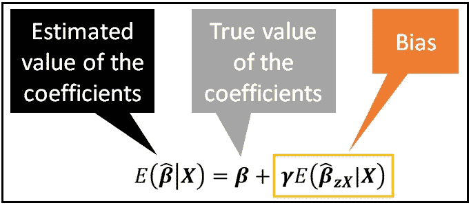

省略可变偏差(图片由作者提供)

## 我们将了解什么是遗漏变量偏差，并使用真实数据集说明其计算

我们将研究在线性回归模型中没有包括重要变量的后果。举例来说，我们将基于汽车特征的真实世界数据集进行讨论。我们的目标是在统计建模中形成一个众所周知的结果，称为**省略变量偏差**，并使用样本数据集说明计算。

# 汽车数据集

以下数据包含 205 辆汽车的规格，摘自 1985 年版的沃德汽车年鉴。每行包含一组 26 个关于单个车辆的规格。


汽车数据集(来源:[加州大学欧文分校](https://archive.ics.uci.edu/ml/datasets/automobile)

我们将考虑由以下变量组成的数据子集:
城市 _ 英里数
汽车 _ 体积
整备质量
发动机 _ 尺寸

原始数据集中不存在 Car_Volume 变量。它是我们添加的一个新变量，如下:Car_Volume = Length*Width*Height。

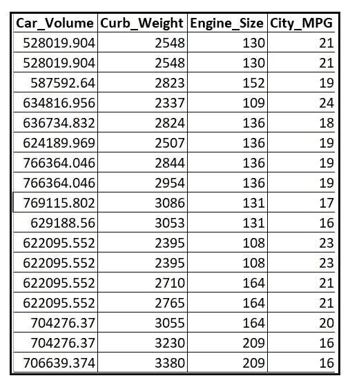

汽车数据集的子集(来源:[加州大学欧文分校](https://archive.ics.uci.edu/ml/datasets/automobile))

上述 4 变量版本的数据集可从此处 下载 [**。**](https://gist.github.com/sachinsdate/bd617730c4655a01779e1dd86ff30bbe)

## 回归目标

我们的回归目标是使用**线性回归模型**回归**发动机尺寸**和**整备质量**的**城市行驶里程**。模型方程为:

*city _ mpg =β_ 1****+****β_ 2 *汽车 _ 体积+β_ 3 *整备 _ 重量+β_ 4 *发动机 _ 尺寸+ ϵ*

回归模型的误差项 *ϵ* 代表建模者无法测量的所有因素的影响。

上述方程的矩阵形式如下:

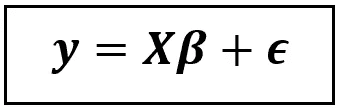

线性回归模型的方程(图片由作者提供)

*哪里，*

*   ***y*** 是一个*【n×1】*大小的列向量，包含 *City_MPG 的观测值。n* 是数据点的数量。
*   ***β*** 是一个*【4×1】*大小的回归模型系数列向量 *β_1、β_2、β_3* 、 *β_4* 对应于*截距、汽车 _ 体积、整备 _ 重量*和*发动机 _ 大小。*
*   *是一个*【n×4】*大小的矩阵，包含回归变量的值。这个矩阵的第一列是 1 的列，它充当截距 *β_1 的占位符。**
*   **是模型的回归误差的一个*【n×1】*大小的列向量。**

**让我们用矩阵来说明回归模型的方程是怎样的:**

**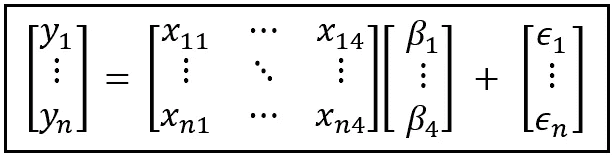**

**包含三个变量和一个截距的线性回归模型(图片由作者提供)**

**在 ***X*** 矩阵中，由列向量***X _ 1 =****【X _ 11，…X _ n1】'*表示的第一列是 1 的列。假设样本量为 *n* ，上述矩阵表示等价于写出以下 *n* 回归方程组:**

**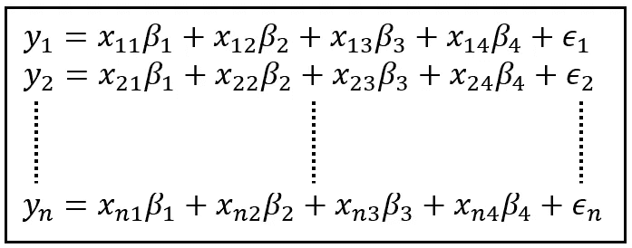**

**四个变量和误差项的 n 个回归方程系统(图片由作者提供)**

**现在，假设我们将这个方程组分成两部分，如下所示:**

****

**分成两部分的 n 方程系统(图片由作者提供)**

**下面是上述划分的矩阵表示:**

**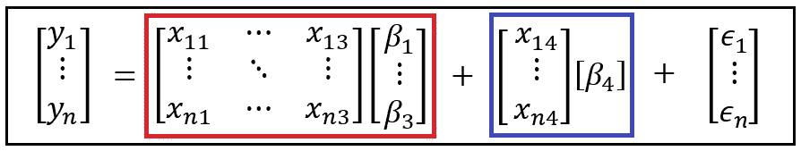**

**分成两部分的 n 方程系统(图片由作者提供)**

**一般来说，我们可以将上述划分表示如下:**

**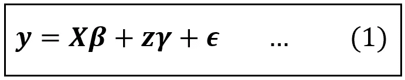**

**分区线性回归模型(图片由作者提供)**

**我们已经用变量*替换了分割出来的回归变量***x****_ 4*，这是一个*【n×1】*列向量。***γ****(γ)是代替回归系数 *β_4 的*【1×1】*“矩阵”。*****

*当一个人在一组 *n* 个样本的数据集上训练(也称为“拟合”)上述线性模型时，拟合的模型可以表示如下:*

*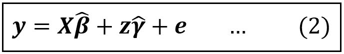*

***拟合的**分段线性回归模型(图片由作者提供)*

*注意**和 ***γ*** 上的帽或帽子“^”符号表示它们是拟合值，即 ***β*** 和 ***γ*** 的相应群体水平值的估计值。同样在等式(2)中，残差的列向量 ***e*** 代替回归误差的列向量 ***ϵ.****带*残差 *e_i* 是带观测值 *y_i* 的*和来自拟合模型的对应*带*预测值之间的差值。****

*我们现在已经为解决当你忽略回归变量时会发生什么的问题做好了准备。*

# *省略回归变量的影响*

*让我们重新看看汽车数据集的回归模型:*

**city _ mpg =β_ 1****+****β_ 2 *汽车 _ 体积+β_ 3 *整备 _ 重量+β_ 4 *发动机 _ 尺寸+ ϵ**

*以下是拟合模型的方程式:*

**City _ MPG =β_ 1 _ cap****+****β_ 2 _ cap *汽车 _ 体积+β_ 3 _ cap *整备 _ 重量+β_ 4 _ cap *发动机 _ 尺寸+ e**

*假设我们在构建模型时没有包含变量 *Engine_Size* 。这类似于从等式(1)中省去项 ***zγ*** 或者从等式(2)中省去项 ***zγ_cap*** 。*

*如果我们求解方程(2)的其余部分，即***y****=****xβ_ cap****+****e***，通过最小化残差的平方和 ***e*** ，它具有一个漂亮的闭合形式解，可以表示为*

*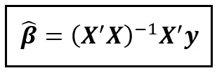*

****y****=****xβ_ cap****+**e**(图片由作者提供)**

*在上面的等式中:*

*   ****β_cap*** 是大小为*(k×1)*的拟合回归系数的列向量，假设模型中有 *k 个*回归变量，包括截距，但不包括我们忽略的变量。*
*   ****X*** 是大小为 *(n x k)* 的回归变量矩阵。*
*   ****X'*** 是**X**的转置，即 ***X*** 的行列互换。就好像 ***X*** 已经侧过来了。因此 ***X'*** 的大小为*(k×n)*。因此， ***X'X*** 的大小为 *(k x k)* 。回想一下大小为*(k x n)**(n x k)*的两个矩阵的乘积是大小为 *(k x k)* 的矩阵。*
*   ****y*** 是大小为*(n×1)*的观测值的列向量。*

**(****X ' X****)*，大小为 *(k x k)* ，当与大小为 *(k x n)* 的***【X '***相乘时，产生大小为 *(k x n)* 的矩阵，当与大小为 ***y*** 相乘时*

*在上面的等式中，我们将等式(1)中的 ***y*** 替换为***xβ****+****zγ****+****【ϵ***:*

*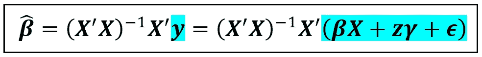*

*用***xβ****+****zγ****+****ϵ***(图片由作者提供)*

*接下来，我们将蓝色括号中的术语分配如下:*

*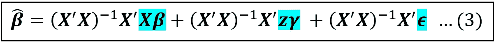*

*分发括号中的术语后(图片由作者提供)*

*等式(3)的 R.H.S .上的第一项可以简化为简单的 ***β*** 如下:*

*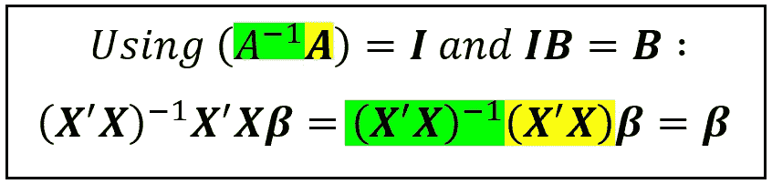*

*第一个术语的简化(图片由作者提供)*

*在上面的简化中， ***I*** 是一个大小为*(k×k)*的单位矩阵。 ***I*** 是数字 *1* 的矩阵等价。一个矩阵 ***A*** 与 ***A*** 的逆矩阵相乘等于 ***I*** ，同理， *(n)*(1/n)=1* 。*

*让我们用 ***β*** 代替等式(3)的第一项，并将简化的等式(3)重述如下:*

*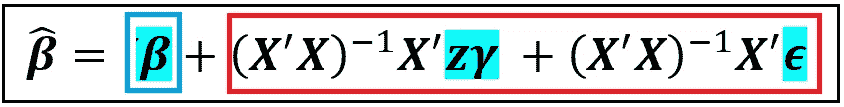*

*方程式(3)的简化版(图片由作者提供)*

*上面的等式给了我们第一个提示，变量***【z】****的省略可能会导致系数向量 ***β_cap*** 的拟合值偏离其真实群体值***β****，偏离量等于红色框中各项的值。***

***让我们回忆一下，拟合回归模型中的[系数估计值是随机变量](/an-illustrated-guide-to-the-variance-covariance-matrices-used-in-regression-analysis-3eb5a5dd2cff)，它有一个平均值(也称为期望值)和围绕平均值的方差。***

***因此，我们感兴趣的不是 ***β_cap*** 的点估计。相反，我们应该计算下面的 [**条件估计值**](/understanding-conditional-variance-and-conditional-covariance-8b661067fc18)***β_ cap***的条件均值:***

***E(****β_ cap****|****X****)***

**相应地，让我们对上述等式两边的条件期望如下:**

**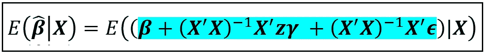**

**接受双方的条件期望后(图片由作者提供)**

**上面等式的 R.H.S .上的蓝色表达式可以使用恒等式*E(****A****+****B****+****C****)= E(****A***)**

**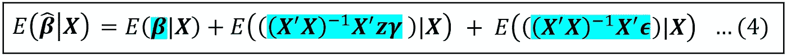**

**去掉条件期望操作符后(图片由作者提供)**

**右边第一项*E(****β| X****)*简单来说就是*，即常数的系数的真实总体值。***

***在我们考察右边的第二项之前，让我们用恒等式*E(****ABC****)= E(****A****E(****B****)E(****C****)*假设随机变量***

***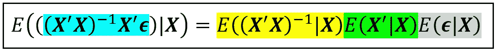***

***等式(4)的第三项使用期望乘积规则简化(图片由作者提供)***

***现在我们得出一个重要的观察结果。***

***线性回归模型的主要假设之一是误差***【ϵ***，以回归变量 ***X*** 为条件，具有零均值。***

****错误是外生的**这一属性意味着*灰色的期望 e(****【ϵ】****|****x****)=****0***，其中 ***0*** 是大小为*的列向量绿色的期望是简单的***X***’(它是 ***X*** 的转置)并且它的大小是 *(k x n)* 。因此，绿色和灰色位相乘在一起就是大小为*(k×1)*的列向量 ***0*** 。最后，黄色位是大小为 *(n x k)* 的 ***X*** 与其大小为 *(k x n)* 的转置的乘积的倒数。因此，黄色位相当于一个大小为 *(k x k)* 的矩阵。这个矩阵与*(k×1)*列零向量的乘积就是一个大小为*(k×1)*的列零向量。***

*因此，等式(4)中的第三项实际上消失在大小为*(k×1)*的零的列向量中。*

*到目前为止，我们已经表明，在等式(4)中，右边的第一项是列向量**而第三项是列向量 ***0*** ，两者的大小都是*(k×1)****。******

**现在我们来看等式(4)的第二项。简单来说，我们就用恒等式*E(****AB****)= E(****A****)E(****B****)*:**

**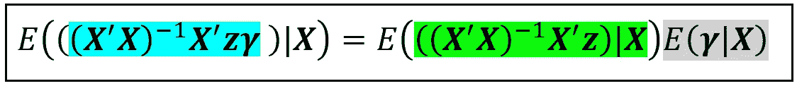**

**等式(4)的第二项使用期望乘积规则简化(图片由作者提供)**

**灰色项简单来说就是 ***γ*** ，因为它是 ***z*** 的系数的总体水平值，因此它的期望(均值)与它本身相同。**

**将 R.H.S .上期望值内的绿色位与 ***y*** 对***×***的最小二乘回归的闭合形式解进行比较会有所帮助(如下所示):**

****

*****y****=****xβ_ cap****+****e****(图片由作者提供)***

**很容易看出，绿色位其实是*省略变量* ***z*** *对* ***X*** *的最小二乘回归的封闭形式解！***

**因此，我们可以将等式(4)的第二项表达如下:**

**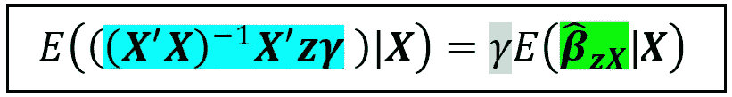**

****z** 对 **X** 的回归的拟合系数 ***β* _zX** 的期望值(图片由作者提供)**

**在上述等式的 R.H.S 中:**

*   ***γ* *γ* 是一个标量，因此没有**加粗**。**
*   *****β_cap_zX*** 是从回归*z 到*X 中剩余变量的拟合回归系数的向量。****

***现在，我们可以将所有的部分放在一起，并在从回归中省略变量***【z***时，说明回归的拟合系数***【β_ cap】****y*on**的期望值公式:*****

***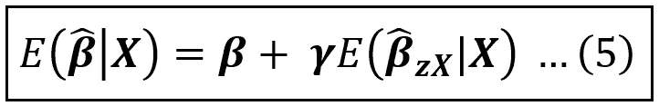***

***当变量从回归中省略时，拟合系数的期望值(图片由作者提供)***

***在等式(5)中， ***β_cap_zX*** 为大小为*(k×1)*的列向量，其中 *k* 为模型中回归系数的个数(不包括***z***)*γ*为标量。因此，当我们从模型中省略诸如 ***z*** 之类的变量时，得到的模型的拟合系数从其真实总体值*偏离*，偏离量与*z 与*中剩余变量的协方差成比例，如*E(****β_ cap _ zX*所示*******

**这一分析表明了以下两种情况:**

## **省略的变量 z 与 x 中的其余回归变量相关。**

**在这种情况下，*E(****β_ cap _ zX****|****X****)*是非零向量。由此，我们得出以下重要结果:**

> **当省略的变量与回归模型中的其余变量相关时，剩余回归模型的最小二乘估计不再是无偏的。因此，它不再是蓝色的。**

## **省略的变量 z 与其余的回归变量 X 不相关**

**在这种情况下，列 vector*E(****β_ cap _ zX****|****X****)*包含全零。因此，方程 R.H.S .的第二项。(5)消失，剩余模型的拟合系数的期望值等于群体值 ***β*** *。***

> **当省略的变量与回归模型中的其余变量不相关时，剩余回归模型的最小二乘估计器继续保持无偏，因此，它保持蓝色**。****

**即使省略的变量与回归变量的其余部分不相关，省略它也是要付出代价的。**

**如果被省略的变量 ***z*** 中的方差已经“解释”了响应变量 ***y*** 中的一些方差，那么省略 ***z*** 会导致这个无法解释的方差漏入模型的误差项***【ϵ***，导致误差的方差更大并且 [***R 平方***](/the-complete-guide-to-r-squared-adjusted-r-squared-and-pseudo-r-squared-4136650fc06c) 到**

**这个结果有一个直观的方面。如果我们继续从模型中移除相关变量，我们最终将只剩下回归的截距，这将我们带到**均值模型**，即*y _ I*=*β_ 1*+*ϵ_i*，其中 *β_1* 是 ***y*** 的均值。*中所有无法用 ***y*** 均值解释的方差，都会溢出到误差项 ***ϵ*** 的方差中。***

**让我们回到我们的汽车数据集和回归模型:**

***city _ mpg =β_ 1****+****β_ 2 *汽车 _ 体积+β_ 3 *整备 _ 重量+β_ 4 *发动机 _ 尺寸+ ϵ***

**我们来考察省略 *Engine_Size* 的效果。根据等式(5)，我们需要回归*汽车体积*和*整备质量*上的*发动机尺寸*(加上截距)。**

**我们将使用 Python 库 [Pandas](https://pandas.pydata.org/) 将数据集加载到内存中:**

```
****import** pandas **as** pd
**from** patsy **import** dmatrices
**import** numpy **as** np
**import** scipy.stats
**import** statsmodels.api **as** sm
**import** matplotlib.pyplot **as** plt

***#Read the automobiles dataset into a Pandas DataFrame***df = pd.read_csv(**'automobile_uciml_4vars.csv'**, header=0)**
```

**让我们打印出前几行:**

```
*****#Print the first few rows of the data set***print(df.head())**
```

**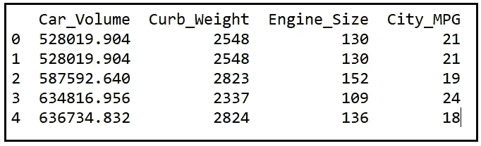**

**autos 数据集的前几行(图片由作者提供)**

**为了判断省略*发动机 _ 尺寸*的影响，让我们回归*发动机 _ 尺寸*对*汽车 _ 体积*和*整备质量*的影响。**

```
*****# Here's the model expression in Patsy syntax. The intercept's presence is implied.***model_expr = **'Engine_Size ~ Car_Volume + Curb_Weight'

*# carve out the X and y matrices using Patsy***y_train, X_train = **dmatrices**(model_expr,df, **return_type**=**'**dataframe**'**)***# Build an OLS regression model using Statsmodels*** olsr_model = sm.**OLS**(**endog**=y_train, **exog**=X_train)***# Fit the model on (y, X)*** olsr_results = olsr_model.**fit**()***#Print the training summary of the fitted model*** print(olsr_results.**summary**())**
```

**以下是培训总结:**

**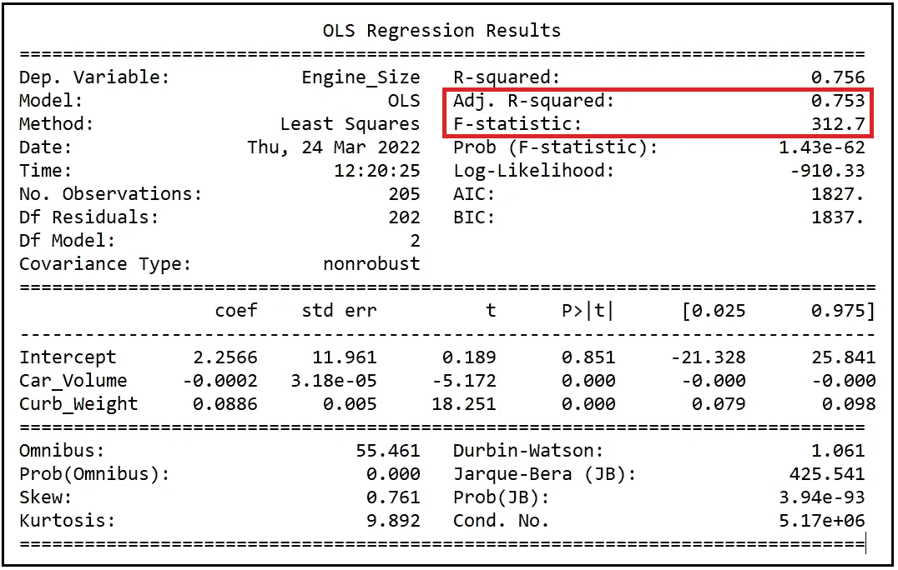**

**根据汽车体积和整备质量回归发动机尺寸的训练总结(图片由作者提供)**

**调整后的 R 平方值 0.753 和显著的 F 统计值 312.7 使我们相信*发动机尺寸*与*汽车体积*和*整备质量密切相关。***

**因此，等式(5)表明，如果我们从以下回归模型中省略变量 *Engine_Size* :**

***city _ mpg =β_ 1****+****β_ 2 *汽车 _ 体积+β_ 3 *整备 _ 重量+β_ 4 *发动机 _ 尺寸+ ϵ***

**然后城市 _MPG 对*汽车 _ 体积*和*整备 _ 重量*的最小二乘线性回归*将产生拟合系数***β_ cap****=【β_ 1 _ cap，β_2_cap，β_ 3 _ cap】*，即*将显著偏离它们的真实人口值****β****=]****

*让我们使用等式(5)使用如下两步程序来估计该偏差:*

***第一步:**我们将首先回归*汽车 _ 体积、*整备 _ 重量、*发动机 _ 尺寸*(加上*截距* ) *:**

```
*model_expr = 'City_MPG ~ Car_Volume + Curb_Weight + Engine_Size'y_train, X_train = dmatrices(model_expr, df, **return_type**='dataframe')olsr_model = sm.**OLS**(**endog**=y_train, **exog**=X_train)olsr_results = olsr_model.**fit**()**print**(olsr_results.**params**)*
```

*我们看到以下输出:*

```
*Intercept      44.218699
Car_Volume      0.000019
Curb_Weight    -0.012464
**Engine_Size     0.008221**
dtype: float64*
```

*在上面的输出中， *Engine_Size* (高亮显示)的估算系数为 **0.008221** 。这个值代替了等式(5)中的 *γ* 。注意，在等式(5)中， *γ* 是该系数的真实总体值，而在实践中，我们使用其估计值 **0.008221。***

***步骤 2:** 我们现在将*汽车 _ 体积*和*整备 _ 重量*上的*发动机 _ 尺寸*(加上*截距*):*

```
*model_expr = 'Engine_Size ~ Car_Volume + Curb_Weight'y_train, X_train = dmatrices(model_expr, df, **return_type**='dataframe')olsr_model = sm.**OLS**(**endog**=y_train, **exog**=X_train)olsr_results = olsr_model.**fit**()**print**(olsr_results.**params**)*
```

*我们看到以下输出:*

```
*Intercept      2.256588
Car_Volume    -0.000165
Curb_Weight    0.088617
dtype: float64*
```

*这是列向量*E(****β_ cap _ zX****|****X****):**

**

*截距、汽车体积和整备质量(按此顺序)的拟合系数的期望值，从汽车体积*和整备质量*回归*发动机尺寸*(加上*截距*)(图片由作者提供)*

*根据等式(5)，如果我们通过 *γ* (来自步骤 1)缩放该向量，如果我们从模型中省略 *Engine_Size* ，我们将得到回归模型系数估计中引入的偏差估计:*

*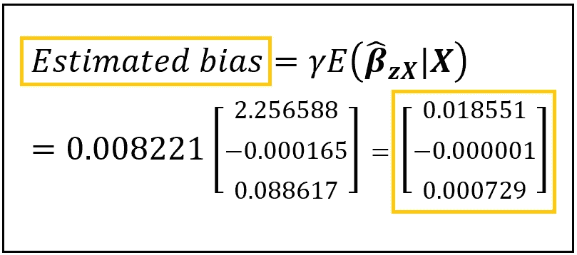*

*在截距、汽车体积和整备质量(按此顺序)的系数估计中引入的估计偏差，因为从回归模型中忽略了发动机尺寸(图片由作者提供)*

*通过不忽略所讨论的变量来解决偏差问题是很有诱惑力的。但这可能会导致另一个问题。如果省略的变量与模型中的其他变量相关(如 *Engine_Size* is)，那么将它添加回去会导致**多重共线性**，这种情况会降低系数的精确度。那是另一篇文章的主题！*

*敬请期待，造型快乐！*

# *参考文献、引文和版权*

## *数据集*

*[**汽车数据集**](https://archive.ics.uci.edu/ml/datasets/automobile) **引用:** Dua，d .和 Graff，C. (2019)。UCI 机器学习知识库[http://archive . ics . UCI . edu/ml]。加州欧文:加州大学信息与计算机科学学院。(CC BY 4.0) [**下载链接**](https://gist.github.com/sachinsdate/bd617730c4655a01779e1dd86ff30bbe)*

**如果你喜欢这篇文章，请关注我的*[***Sachin Date***](https://timeseriesreasoning.medium.com)*获取关于回归、时间序列分析和预测主题的提示、操作方法和编程建议。**