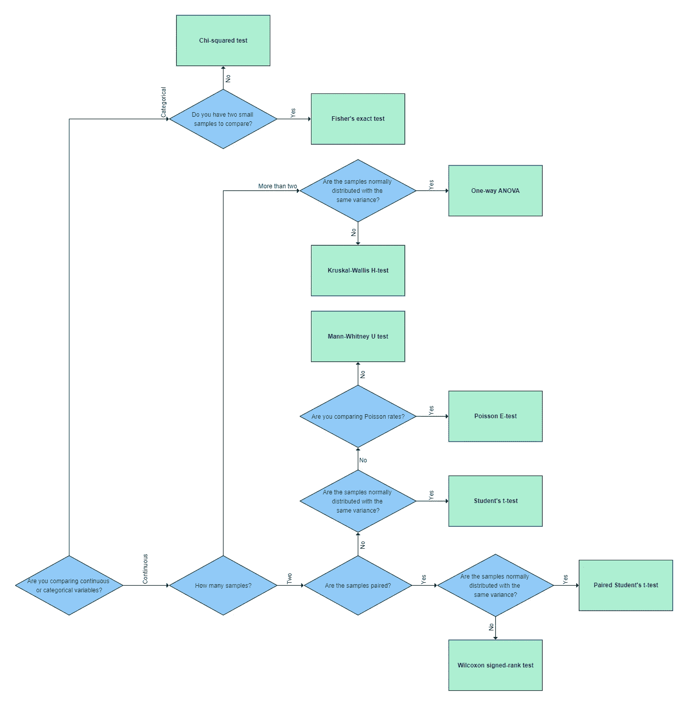

# 我的 A/B 实验应该使用什么假设检验？

> 原文：<https://towardsdatascience.com/what-hypothesis-test-should-i-use-for-my-a-b-experiment-2cfc7fd3537b>

## 选择正确测试的快速参考指南

Javier Allegue Barros 在 [Unsplash](https://unsplash.com?utm_source=medium&utm_medium=referral) 上拍摄的照片

对于任何数据从业者来说，在运行 A/B 实验后选择假设检验可能是势不可挡的。两个流行的 Python 库 [scipy](https://docs.scipy.org/doc/scipy/reference/stats.html#statistical-tests) 和 [statsmodels](https://docs.scipy.org/doc/scipy/reference/stats.html#statistical-tests) ，已经为所有类型的用例实现了数百个假设测试。

这篇文章是你分析 A/B(/C)实验所需的最常见假设检验类型的快速参考指南。作为一名数据科学家，我在 11 月份经常使用这些测试。

我们将讨论两个或更多样本中连续变量和分类变量的参数和非参数检验。我在下面包含了一个流程图，以帮助您确定使用什么测试。由于每种方法都有几个不同的输入参数，因此在执行测试时请阅读文档。

如需进一步阅读，请查看我的其他文章，了解[为什么您应该运行 A/B 实验](https://medium.com/@rtkilian/how-a-b-testing-helps-microsoft-and-why-you-should-consider-it-too-c975f2922ffe)和[如何设置 A/B 测试](https://medium.com/towards-data-science/a-quick-reference-checklist-for-a-b-testing-40f533cfb523)。您还可以在此处找到测试[的详细说明，在此处](/a-b-testing-a-complete-guide-to-statistical-testing-e3f1db140499)[找到测试](/the-ultimate-guide-to-a-b-testing-part-3-parametric-tests-2c629e8d98f8)的详细说明，在此处找到测试[的详细说明。](/the-ultimate-guide-to-a-b-testing-part-4-non-parametric-tests-4db7b4b6a974)

作者图片

# “学生”t 检验

t 检验是一种参数检验，用于确定两个连续样本的平均值之间是否存在显著差异。

**假设**

*   每个样本中的观察值都是独立的
*   每个样本中的观察值近似呈正态分布
*   每个样本中的观察值具有相同的方差

**假设**

*   H0:两个样本的平均值是相等的
*   H1:两个样本的平均值不相等

资源

*   [学生的 t-test，维基百科](https://en.wikipedia.org/wiki/Student%27s_t-test)
*   [scipy.stats.ttest_ind](https://docs.scipy.org/doc/scipy/reference/generated/scipy.stats.ttest_ind.html)
*   [韦尔奇的方差不等样本 t 检验，维基百科](https://en.wikipedia.org/wiki/Welch%27s_t-test)

# 曼－惠特尼实验

Mann-Whitney U 检验是一种非参数检验，用于确定两个连续样本的分布是否相同。Mann-Whitney U 检验是学生独立样本 t 检验的非参数版本。

**假设**

*   每个样本中的观察值都是独立的
*   每个样本中的观察值是连续的或有序的，并且可以排序
*   每个样本的分布形状大致相同

**假设**

*   H0:每个样本的分布都是一样的
*   H1:每个样本的分布都不一样

**资源**

*   [曼-惠特尼 U 检验，维基百科](https://en.wikipedia.org/wiki/Mann%E2%80%93Whitney_U_test)
*   [scipy . stats . mannwhitney Yu](https://docs.scipy.org/doc/scipy/reference/generated/scipy.stats.mannwhitneyu.html)

# 配对学生 t 检验

配对学生 t 检验是一种参数检验，用于确定两个配对连续样本的均值之间是否存在显著差异。

**假设**

*   每个样本中的观察值都是独立的
*   每个样本中的观察值近似呈正态分布
*   每个样本中的观察值具有相同的方差
*   每个样本的观察值是成对的

**假设**

*   H0:两个配对样本的平均值是相等的
*   H1:两个配对样本的平均值不相等

**资源**

*   [学生配对样本的 t 检验，维基百科](https://en.wikipedia.org/wiki/Student%27s_t-test#Dependent_t-test_for_paired_samples)
*   [scipy.stats.ttest_rel](https://docs.scipy.org/doc/scipy/reference/generated/scipy.stats.ttest_rel.html)

# Wilcoxon 符号秩检验

Wilcoxon 符号秩检验是一种非参数检验，用于确定两个成对连续样本的分布是否相同。Wilcoxon 检验是配对学生 t 检验的非参数版本。

**假设**

*   每个样本中的观察值都是独立的
*   可以对每个样本中的观察值进行排序
*   每个样本的观察值是成对的

**假设**

*   H0:配对样本的分布是相同的
*   H1:配对样本的分布是不一样的

**资源**

*   [Wilcoxon 符号秩检验，维基百科](https://en.wikipedia.org/wiki/Wilcoxon_signed-rank_test)
*   [威克斯](https://docs.scipy.org/doc/scipy/reference/generated/scipy.stats.wilcoxon.html)

# 方差分析检验(ANOVA)

单向 ANOVA 检验是一种参数检验，用于确定两个或多个连续样本的平均值之间是否存在显著差异。

**假设**

*   每个样本中的观察值都是独立的
*   每个样本中的观察值近似呈正态分布
*   每个样本中的观察值具有相同的方差

**假设**

*   H0:两个或更多样本的平均值是相等的
*   H1:样本的一个或多个平均值不相等

**资源**

*   [方差分析(ANOVA)，维基百科](https://en.wikipedia.org/wiki/Analysis_of_variance)
*   [scipy.stats.f_oneway](https://docs.scipy.org/doc/scipy/reference/generated/scipy.stats.f_oneway.html)

# 克鲁斯卡尔-沃利斯 H 检验

Kruskal-Wallis H 检验是一种非参数检验，用于确定两个或多个连续样本的中位数之间是否存在显著差异。它是单向 ANOVA 检验的非参数等效方法。

**假设**

*   每个样本中的观察值都是独立的
*   每个样本中的观察值具有相同的方差

**假设**

*   H0:两个或更多样本的中位数是相等的
*   H1:样本的一个或多个中位数不相等

**资源**

*   [Kuskal-Wallis 单因素方差分析检验，维基百科](https://en.wikipedia.org/wiki/Kruskal%E2%80%93Wallis_one-way_analysis_of_variance)
*   [scipy.stats.kruskal](https://docs.scipy.org/doc/scipy/reference/generated/scipy.stats.kruskal.html)

# 卡方检验

卡方检验检验列联表中两个或更多分类变量的独立性。

**假设**

*   样本中的观察值是独立的
*   列联表中每个单元的观察频率和预期频率至少为 5

**假设**

*   H0:变量是独立的
*   H1:变量不是独立的

**资源**

*   [卡方检验，维基百科](https://en.wikipedia.org/wiki/Chi-squared_test)
*   [scipy . stats . chi2 _ 偶然性](https://docs.scipy.org/doc/scipy/reference/generated/scipy.stats.chi2_contingency.html)
*   [熊猫.交叉表](https://pandas.pydata.org/docs/reference/api/pandas.crosstab.html)

# 费希尔精确试验

像卡方检验一样，Fisher 精确检验用于检验列联表中两个分类变量的独立性。当样本量较小时，使用费希尔精确检验代替卡方检验。

**假设**

*   样本中的观察值是独立的

**假设**

*   H0:变量是独立的
*   H1:变量不是独立的

**资源**

*   [费雪的测试，维基百科](https://en.wikipedia.org/wiki/Fisher%27s_exact_test)
*   [scipy . stats . fisher _ exact](https://docs.scipy.org/doc/scipy/reference/generated/scipy.stats.fisher_exact.html)

# 泊松电子检验

泊松精确检验(E-检验)检验两个泊松率之间是否有显著差异。

**假设**

*   样本中的观察值是独立的

**假设**

*   H0:泊松比是一样的
*   H1:泊松率是不一样的

**资源**

*   [顾，吴，唐，舒坎 2008:检验两个泊松比，生物统计学杂志 50 (2008) 2，2008](https://onlinelibrary.wiley.com/doi/10.1002/bimj.200710403)
*   [stats models . stats . rates . test _ poisson _ 2 index](https://www.statsmodels.org/dev/generated/statsmodels.stats.rates.test_poisson_2indep.html)

# 结论

本文回顾了在分析 A/B 实验时最有可能使用的假设检验。我们讨论了测试最适合什么情况，需要满足什么假设，如何解释结果，并提供了实现测试所需的代码和资源。

感谢[机器学习大师](https://machinelearningmastery.com/statistical-hypothesis-tests-in-python-cheat-sheet/)启发了这篇文章。

我错过了什么吗？告诉我，我会更新名单。

喜欢你读的书吗？跟我上 [**中**](https://medium.com/@rtkilian) 。否则， [**推我**](https://twitter.com/rtkilian) 或者在 [**LinkedIn**](https://www.linkedin.com/in/rtkilian/) 上加我。

你可以在 [GitHub](https://github.com/rtkilian/data-science-blogging/blob/main/what-hypothesis-test-ab.ipynb) 上找到这篇文章中用到的所有代码。