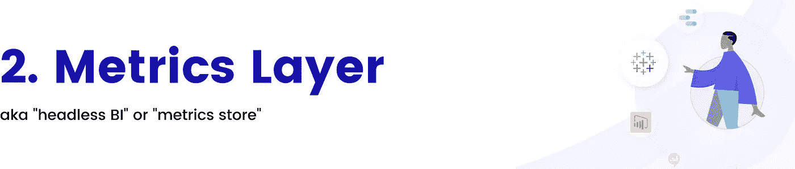
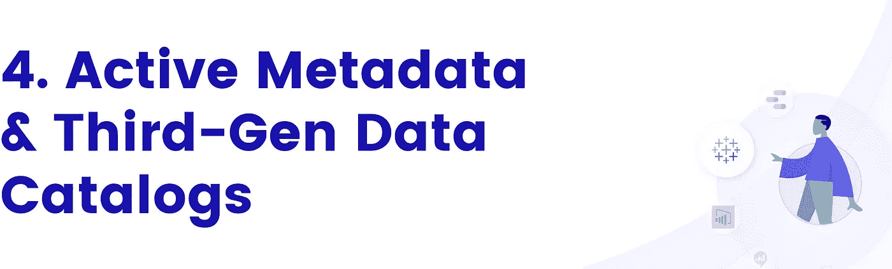
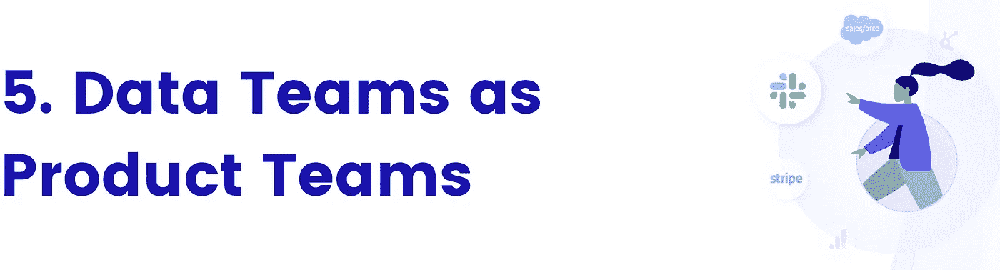

# 我错在哪里:回顾我对现代数据堆栈的 2022 年预测

> 原文：<https://towardsdatascience.com/what-i-got-wrong-looking-back-at-my-2022-predictions-for-the-modern-data-stack-f18a2b94f9f6>

## 我们在数据世界的起点和现在的位置

迈克·科诺诺夫在 [Unsplash](https://unsplash.com/?utm_source=unsplash&utm_medium=referral&utm_content=creditCopyText) 上拍摄的照片

今年年初，我对 2022 年现代数据堆栈的未来做了一些[大胆的预测](/the-future-of-the-modern-data-stack-in-2022-4f4c91bb778f)。

我不想用一系列新的预测来开始 2023 年——说实话，[我还是会做](https://prukalpa.medium.com/the-future-of-the-modern-data-stack-in-2023-b08c2aed04e2)——我想停下来回顾过去一年的数据。我们做对了什么？什么不尽如人意？我们完全错过了什么？

每年的这个时候，随着社交媒体充斥着崇高的预测，人们很容易认为这些预测背后的人是无所不知的专家。但实际上，我们只是普通人。人们多年来一直埋在数据世界中，是的，但仍然容易出错。

这就是为什么今年，我不只是在内部做这项练习，而是向公众开放。

以下是我对 2022 年以来六大趋势的思考——哪些是对的，哪些是完全错的。

**结论:大部分是真实的✅，但进展比预期缓慢的❌**

**TL；DR** :我们确实看到了很多围绕“数据网格平台”的市场整合，但是实现实践和工具堆栈比我们预期的要落后得多。不过，数据网格仍在我的考虑范围之内，并将成为 2023 年的主要趋势。

# 我们开始的地方

以下是我今年年初说的话:

> *“在 2022 年，* ***我认为我们将会看到大量平台更名，并作为‘终极数据网格平台’提供服务*** *。但问题是，数据网格不是一个现成的平台或服务。这是一个设计概念，其中包含一些精彩的概念，如分布式所有权、基于域的设计、数据可发现性和数据产品运输标准，所有这些都值得在您的组织中尝试实施。*
> 
> 因此，我的建议是:作为数据领导者，重要的是在概念层面坚持首要原则，而不是相信你很快就会在市场上不可避免地看到的炒作。
> 
> 如果一些团队(尤其是较小的团队)可以通过基于雪花和 dbt 构建的完全集中的数据平台实现数据网格架构，而其他团队将利用相同的原则在复杂的多云环境中整合他们的“数据网格”,我不会感到惊讶。"
> 
> (所有片段均来自《T2 2022 年现代数据堆栈的未来》报告。)

# 我们现在在哪里

我关于公司将围绕数据网打造自己品牌的预测完全实现了。我们在[starbrust](https://www.starburst.io/platform/features/data-products/)、 [Databricks](https://www.databricks.com/blog/2022/10/19/building-data-mesh-based-databricks-lakehouse-part-2.html) 、 [Oracle](https://www.oracle.com/integration/what-is-data-mesh/) 、 [Google Cloud](https://services.google.com/fh/files/misc/build-a-modern-distributed-datamesh-with-google-cloud-whitepaper.pdf) 、 [Dremio、](https://www.dremio.com/blog/enabling-a-data-mesh-with-an-open-lakehouse/)、 [Confluent](https://developer.confluent.io/learn-kafka/data-mesh/intro/) 、 [Denodo](https://www.denodo.com/en/solutions/by-use-case/data-mesh-enabled-data-virtualization) 、 [Soda](https://www.soda.io/resources/introducing-a-new-domain-specific-language-for-data-reliability) 、 [lakeFS](https://lakefs.io/blog/data-mesh/) 、 [K2 View](https://www.k2view.com/platform/data-mesh-architecture/) 等等中看到了这一点。

数据网从想法到现实的转变也取得了进展。Zhamak Dehghani 与 O'Reilly 一起出版了一本关于数据网格的书，真实的用户故事正在数据网格学习社区中增长。

结果是关于如何实现数据网格的两种越来越流行的理论:

*   **通过团队结构**:基于分布式领域的数据团队，负责发布数据产品，由中央数据平台团队提供支持，为分布式团队提供工具
*   **Via“Data as a product”**:负责创建数据产品的数据团队——即把数据治理推向“左边”，更接近数据生产者而不是消费者。

虽然这一进步是显著的，但它最终没有将指针移动得足够远，数据网格与一年前一样模糊。数据人员仍然渴望清晰和具体。例如，在 Starburst 关于数据网格的会议上，聊天中最常见的问题是“我们如何实际实现数据网格？”

虽然我预计，今年，我们作为一个社区将更接近于“如何实现数据网格”的讨论，但我们仍然停留在去年的位置。我们仍处于早期阶段，因为团队需要弄清楚实现数据网格的真正含义。尽管现在越来越多的人接受了这个概念，但是对于如何在操作中实现数据网格，确实缺乏真正的操作指导。

这仅仅是由于网格工具组仍然是不成熟的。虽然有很多品牌重塑，但我们仍然没有一个关于如何实现数据网格的最佳参考架构。

## **结论:大部分是真实的✅，但比预期的❌要慢**

**TL；DR:** dbt 实验室的语义层如期上线。对于指标层来说，这是一个巨大的进步，但我们仍在等待看到对数据团队使用指标的方式的全面影响。度量层有望成为 2023 年的重要趋势。

# 我们开始的地方

以下是我今年年初说的话:

> *“我对指标层最终成为现实感到非常兴奋。几个月前，来自 Fivetran 的 George Fraser 有一个不受欢迎的观点，认为* [*所有的度量商店都将演变成 BI 工具*](https://twitter.com/frasergeorgew/status/1468986410464002053?s=20) *。虽然我不完全同意，但我确实相信没有与 BI 紧密集成的度量层不太可能变得普遍。*
> 
> *然而，现有的 BI 工具并没有真正地将外部指标层集成到他们的工具中…这使得这成为一个先有鸡还是先有蛋的问题。独立的度量层将努力鼓励 BI 工具采用它们的框架，并将被迫像多年前被迫构建的* [*Looker 一样构建 BI。*](https://twitter.com/frasergeorgew/status/1468993284554969088?s=20)
> 
> 这就是为什么我对 dbt 宣布进军指标层感到非常兴奋。dbt 已经有足够的分布来鼓励至少现代 BI 工具(例如，预置、模式、Thoughtspot)深度集成到 dbt metrics API 中，这可能会给较大的 BI 玩家带来竞争压力。
> 
> *我还认为，指标层与转换过程如此紧密地交织在一起，这在直觉上是有意义的。* ***我的预测是，我们将在 2022 年看到 metrics 成为更多转换工具中的一等公民。***

# *我们现在在哪里*

*作为度量层的领导者，我把钱投在了 dbt 实验室上，而不是 BI 工具上——事实证明这是对的。*

*dbt Labs 的[语义层](https://www.getdbt.com/blog/frontiers-of-the-dbt-semantic-layer/)如期推出(在公开预览中)，同时还有来自 Hex、Mode、Thoughtspot 和 [Atlan](https://atlan.com/) (美国！).这是现代数据堆栈向前迈出的一大步，无疑为 metrics 成为一等公民铺平了道路。*

*我们没有做对的是接下来发生的事情。我们认为，随着 dbt 的语义层，度量层将被火箭发射到日常数据生活中。然而，实际上，进展被更多地度量，度量层获得的牵引力比预期的要少。*

*在某种程度上，这是因为基础技术比我预期的启动时间要长。毕竟语义层是 10 月份刚刚在 [dbt Coalesce](https://coalesce.getdbt.com/) 发布的。*

*这也是因为改变人们编写指标的方式是很难的。公司不可能一夜之间就切换到指标/语义层。变更管理过程是巨大的，更有可能的是，转换到度量层将需要几年时间，而不是几个月。*

**

*结论:大部分是真实的✅，但也开始走向新的方向❌*

***TL；正如预期的那样，这个领域正开始与 ETL 和数据摄取整合。然而，与此同时，reverse ETL 现在正试图重塑自己的品牌并扩大其类别。***

# *我们开始的地方*

*以下是我今年年初说的话:*

> *“我对解决现代数据堆栈中‘最后一英里’问题的一切都感到非常兴奋。我们现在谈论的更多的是如何在日常运营中使用数据，而不是如何存储数据——这是一个令人难以置信的迹象，表明数据堆栈的基本构建模块(存储、转换等)已经变得多么成熟！*
> 
> *我不确定的是反向 ETL 是否应该是一个独立的空间，或者仅仅是与一个数据摄取工具结合，因为数据输入和输出的基本功能是如此的相似。像 Hevo Data 这样的公司已经开始在同一产品中提供摄取和反向 ETL 服务，而 ***我相信我们可能很快就会在该领域看到更多的整合(或更深入的走向市场合作伙伴关系)*** *。”**

# *我们现在在哪里*

*我的大预测是，我们将在这一领域看到更多的整合，这肯定会如预期的那样发生。最值得注意的是，数据摄取公司 Airbyte [收购了开源反向 ETL 产品 Grouparoo](https://airbyte.com/blog/airbyte-acquires-grouparoo-to-accelerate-data-movement) 。*

*与此同时，其他公司通过推出 Hevo Data 的 [Hevo Activate](https://hevodata.com/activate/) (将反向 ETL 添加到该公司现有的 ETL 功能中)和 Rudderstack 的[反向 ETL](https://www.rudderstack.com/blog/announcing-rudderstack-reverse-etl/) (其早期 Warehouse Actions 产品线的更名版本)巩固了他们在反向 ETL 领域的立足点。*

*然而，一些反向 ETL 的主要参与者今年并没有倾向于整合，而是专注于重新定义和扩展他们自己的类别。最新的流行词是“数据激活”，这是“客户数据平台”(CDP)类别的一个新说法，由像 [Hightouch](https://hightouch.com/) 和 [Rudderstack](https://www.rudderstack.com/) 这样的公司推动。*

*这是他们的主要论点——在一个数据存储在中央数据平台的世界里，我们为什么需要独立的 CDP？相反，我们可以从仓库中“激活”数据来处理传统的 CDP 功能，如发送个性化电子邮件。*

*简而言之，他们已经从谈论“推动数据”转向用数据实际驱动客户用例。这些公司仍然在谈论反向 ETL，但它现在是他们更大的数据激活平台中的一个特性，而不是他们的主要描述符。(值得注意的是， [Census](https://www.getcensus.com/) 抵制了这种趋势，在其网站上坚持使用反向 ETL 类别。)*

**

***判决结果:大部分属实** ✅*

***TL；这一类别随着分析师和公司的买入而持续爆发。虽然还没有一个占主导地位的赢家，但这个领域已经开始在传统数据目录和现代目录之间划出清晰的界限(例如，活动元数据平台、用于数据操作的数据目录等)。***

# *我们开始的地方*

*这是我们今年年初说的:*

> **“数据世界将永远是多样化的，而人员和工具的多样化将永远导致混乱。我可能有偏见，因为我毕生致力于在元数据领域建立一家公司。但是我真的相信* ***让混乱的现代数据堆栈变得有序的关键在于我们如何使用和利用元数据来创建现代数据体验*** *。**
> 
> *[*Gartner*](https://atlan.com/gartner-active-metadata-press/) *用一句话概括了这一类别的未来:“独立的元数据管理平台将从扩充的数据目录转向元数据‘随处’编排平台。”**
> 
> **2.0 代的数据目录是被动的、孤立的，而 3.0 代的数据目录建立在这样一个原则之上，即无论用户何时何地需要，上下文都必须可用。第三代目录将利用元数据来改进 Looker、dbt 和 Slack 等现有工具，而不是强迫用户使用单独的工具，最终实现智能数据管理系统的梦想。**
> 
> **虽然 2021 年该领域已经有了大量的活动和资金，* ***我很确定我们将在 2022 年看到一个占主导地位的真正的第三代数据目录(也称为*** [***活动元数据平台***](/the-anatomy-of-an-active-metadata-platform-13473091ad0d) ***)的崛起。****

# *我们现在在哪里*

*鉴于这是我的空间，我并不惊讶这个预测是相当准确的。然而，令我惊讶的是，这个空间的表现超出了我最大的预期。*

*活动元数据和第三代目录的发展速度比我预期的还要快。与去年只有少数人谈论它的时候相比，这是一个巨大的转变，来自整个数据生态系统的大量公司现在都在竞争这个类别。(以 [Hevo Data](https://hevodata.com/learn/data-catalog-3-0/) 和 [Castor](https://www.castordoc.com/blog/data-catalog-benchmark-for-mid-market-companies) 采用“数据目录 3.0”语言为例。)少数人拥有支持他们言论的技术。但就像数据网格的早期一样，当专家和新手在一个仍在定义的空间中表现得同样博学时，其他人则不然。*

*今年让这个领域爆炸的部分原因是分析师如何抓住并放大了现代元数据和数据目录的想法。*

*在 2021 年发布新的[活动元数据市场指南](/the-gartner-magic-quadrant-for-metadata-management-was-just-scrapped-d84b2543f989)后，Gartner 似乎已经进入了活动元数据领域。在今年的[会议](/key-takeaways-from-gartner-data-analytics-summit-2022-ec908f9599df)上，活动元数据作为关键主题之一出现在 Gartner 的主题演讲中，也出现在本周几乎一半的不同主题和类别的演讲中。*

*G2 在年中发布了新的“[主动元数据管理](https://www.g2.com/articles/active-metadata-management-category-on-g2)”类别，标志着“新一代元数据”。他们甚至称之为“数据目录的第三阶段”，与这种新的“第三代”语言保持一致。*

*同样，Forrester [放弃了](/forrester-changed-the-way-they-think-about-data-catalogs-and-heres-what-you-need-to-know-139e13a5869d)关于“机器学习数据目录”的 Wave 报告，为“数据运营的企业数据目录”让路，标志着他们对成功的数据目录应该是什么样子的想法发生了重大转变。作为其中的一部分，Forrester 颠覆了他们的 Wave 排名，将所有以前的领导者移到了底层或中间层，这是市场开始分离现代目录(例如活动元数据平台、数据操作的数据目录等)的一个主要标志。)来自传统的数据目录。*

**

***判决:没有成真** ❌*

***TL；博士**:虽然我很希望这已经成为现实，但我们在这一趋势上取得的进展远低于我的预期。12 个月后，我们差不多又回到了起点。*

# *我们开始的地方*

*这是我们今年年初说的:*

> ****“在 2021 年所有被炒作的趋势中，这是我最看好的一个。*** *我相信，在未来十年，数据团队将成为组织结构中最重要的团队之一，为经济前沿的现代数据驱动型公司提供动力。**
> 
> **然而，现实情况是，如今的数据团队陷入了服务陷阱，* [*他们的数据项目只有 27%是成功的*](https://www.capgemini.com/gb-en/resources/cracking-the-data-conundrum-how-successful-companies-make-big-data-operational/) *。我认为解决这个问题的关键在于“数据产品”思维模式的概念，数据团队专注于为团队的其他成员构建可重用、可复制的资产。这将意味着在用户研究、可扩展性、数据产品运输标准、文档等方面进行投资。”**

# *我们现在在哪里*

*回想起这一个就心痛。在我所有的预言中，这一个没有实现(还没有？🤞)让我无比难过。*

*尽管嘴上这么说，我们离数据团队作为产品团队运作的现实还很远。虽然数据技术今年已经成熟了很多，但在数据的人性化方面，我们并没有比去年取得更大的进步。在数据团队如何从根本上运作(他们的文化、流程等)方面，还没有太多进展。*

**

***判决结果:大部分属实** ✅*

***TL；正如预测的那样，这个空间今年继续扩张并分裂。然而，明年它将何去何从，以及它是否会与相邻类别合并，仍是一个悬而未决的问题。***

# *我们开始的地方*

*这是我们今年年初说的:*

> **“我相信在过去的两年中，数据团队已经意识到提高生产力的工具不是必须的，而是必须的。毕竟，数据专业人员是你有史以来最受欢迎的雇员之一，所以他们不应该浪费时间在排除管道故障上。**
> 
> ****那么，数据可观测性在未来会成为现代数据堆栈的关键部分吗？绝对的。*这是我不太确定的。***
> 
> *理想情况下，如果你把所有的元数据都放在一个开放的平台上，你应该能够把它用于各种用例(比如数据编目、可观察性、血统等等)。我去年在我关于元数据湖的文章中写了这个想法。*
> 
> *也就是说，如今，这些领域需要大量的创新。 ***我的感觉是，在我们看到未来几年的整合之前，我们将在 2022 年继续看到分裂。”****

# *我们现在在哪里*

*最大的预测是这个空间将继续增长，但以一种分散而非整合的方式——这确实发生了。*

*数据可观测性保持不变，并在 2022 年继续增长。这一领域的参与者数量正在持续增长，现有公司越来越大，新公司成为主流，每个月都有新工具推出。*

*例如，在公司新闻中，有一些主要的 Ds 系列(蒙特卡洛[$ 1.35 亿](https://techcrunch.com/2022/05/24/monte-carlo-raises-135m-series-d-at-1-6b-price-showing-that-unicorn-rounds-are-still-a-thing/)、解开[$ 5000 万](https://techcrunch.com/2022/09/27/unravel-data-lands-50m-to-make-sense-of-complex-data-stacks/))和 Bs 系列(Edge Delta[$ 6300 万](https://techcrunch.com/2022/05/03/edge-delta-rakes-in-63m-for-its-distributed-approach-to-data-observability/)、Manta[$ 3500 万](https://techcrunch.com/2022/05/26/manta-a-data-observability-startup-raises-35m-to-grow-its-workforce/))。*

*至于工具方面，Acceldata [开源了其平台](https://martechseries.com/analytics/data-management-platforms/acceldata-open-sources-data-platform-and-data-observability-libraries/)，Kensu [推出了数据可观测性解决方案](https://www.datanami.com/this-just-in/kensu-launches-1st-360-data-observability-solution/)，AWS 将[可观测性特性](https://www.datanami.com/2022/11/30/aws-bolsters-glue-etl-tool-with-data-observability-ray-support/)引入亚马逊 Glue 4.0，纠结[分拆出另一家专注于可观测性的公司](https://www.prnewswire.com/news-releases/entanglement-inc-announces-the-launch-of-sequre-inc-its-first-spin-out-company-focused-on-commercializing-novel-zero-trust-enterprise-cybersecurity-and-data-observability-capabilities-validated-by-the-united-states-army-301680243.html)。*

*在思想领导领域，蒙特卡洛和 T2 的 Kensu 和 O'Reilly 都出版了关于数据可观察性的重要书籍。*

*让事情变得更复杂的是，许多与行业相邻或处于早期阶段的公司也一直在扩张并巩固他们在这一领域的角色。例如，在数据质量领域起步之后，Soda 现在是数据可观察性领域的主要参与者。类似地，Acceldata 开始于日志可观察性，但现在它将自己标榜为“现代数据堆栈的数据可观察性”。自 2021 年分别推出[系列](https://news.ycombinator.com/item?id=29226864)和[系列 B](https://techcrunch.com/2021/09/23/bigeye-providing-data-quality-automation-closes-second-round-this-year-with-45m/) 以来，Metaplane 和 Bigeye 也越来越引人注目。*

*像去年一样，我仍然不确定数据可观测性将走向何方——走向独立还是与数据可靠性、活动元数据或其他类别合并。但在高层次上，它似乎正在向数据质量靠拢，重点是确保高质量的数据，而不是活跃的元数据。*

**

*随着 2022 年 12 月的临近，我们惊讶地发现数据世界发生了如此大的变化。*

*就在 9 个月前的 3 月，数据委员会(T8)成立了，我们在那里讨论了数据世界的方方面面。我们把所有热门镜头放在我们的[技术](https://benn.substack.com/p/we-all-have-an-audience)、[社区](https://twitter.com/tayloramurphy/status/1507250119892160543)、[氛围](https://roundup.getdbt.com/p/keep-data-council-weird?s=r)和[未来](https://twitter.com/juansequeda/status/1506709882845736967)——因为我们可以。我们处于增长模式，寻找下一个新事物，争夺看似无限的数据馅饼中的一块。*

*现在我们处在一个不同的世界，一个经济衰退、裁员和预算削减的世界。我们正在从增长模式转向效率模式。*

*不要误解我的意思，我们仍然处于数据的黄金时代。就在几周前，雪花[宣布](https://investors.snowflake.com/news/news-details/2022/Snowflake-Reports-Financial-Results-for-the-Third-Quarter-of-Fiscal-2023/default.aspx)收入创纪录，同比增长 67%。*

*但是作为数据领导者，我们在这个数据的黄金时代面临着新的挑战。随着大多数公司开始谈论效率，我们如何才能考虑使用数据在我们的工作中发挥最大效率？数据团队如何才能成为其组织中最有价值的资源？*

*我仍在试图弄清楚这将如何影响现代数据堆栈，我迫不及待地想尽快分享我的想法。但我可以肯定的一点是，2023 年将是数据世界中值得纪念的一年。*

***2023 年现代数据堆栈的未来报告出来了！** [**在这里阅读**](https://prukalpa.medium.com/the-future-of-the-modern-data-stack-in-2023-b08c2aed04e2) **或** [**下载 PDF**](https://atlan.com/resources/future-of-modern-data-stack-report-2023/) **。***

***准备好接受关于这些趋势的辛辣观点和专家见解了吗？我们为 2023 年的第一次大数据辩论召集了一个超级明星小组(鲍勃·穆利亚、巴尔·摩西、本·斯坦西尔、道格拉斯·兰尼和特里斯坦·汉迪)。** [**观看这里的录音。**](https://atlan.com/great-data-debate/)*