# 我对图形神经网络的了解

> 原文：<https://towardsdatascience.com/what-i-learned-about-graph-neural-networks-e17bb0d70a7f>

## 卷积和注意机制在图中的应用

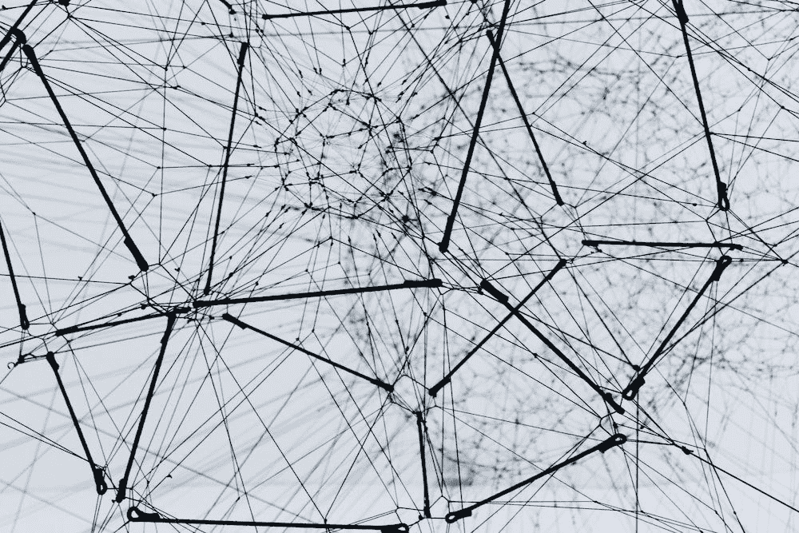

一个美学网络，图片来自 [Alina Grubnyak](https://unsplash.com/photos/ZiQkhI7417A)

近年来，图形神经网络在机器学习领域迅速获得牵引力，变得适用于各种任务。毫无疑问，社交网络的出现在 GNNs 的成功中发挥了重要作用，然而它们也适用于生物学、医学和其他领域，在这些领域中，图代表了基本的实体。

我总是被新兴的技术和方法所吸引，因此我决定尝试并学习一些相关知识。此外，为了让知识沉淀下来，我决定写这篇文章来记下我在这次旅程中遇到的所有概念。

有条不紊地组织所有的内容可能对将来的快速复习有用，或者有希望为其他需要学习资源的人服务。

现在说的够多了，让我们从基本面开始吧！

# 什么是图？

如果你正在读这篇文章，你很可能已经知道什么是图，所以我不会在这上面花太多时间。

图是由**节点** *V* 组成的结构 *G* ，它们之间通过**边** *E* 连接。

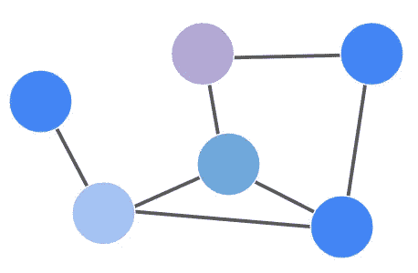

图表示例

节点可以有*特性*，更好地描述节点本身。例如，如果节点代表人，那么他们的特征可以是年龄、性别、身高等等。

节点之间的边表示关系，即两个节点如果有关系就是连接的(想想 Instagram 上的*跟*的概念)，如果关系对称，它们可以是无向的，如果关系不对称，它们可以是有向的。

正如我所说的，我不打算深入讨论这个问题，因为这不在本文的范围之内，但是为了便于阅读，我需要介绍一些术语。

# 图形神经网络简介

鉴于图形结构在我们的日常生活中如此丰富(社交网络、地图、用户-产品交互……)，研究人员开始寻找能够处理它们的深度学习架构。在过去 10 年的 DL 研究中，卷积神经网络成为最幸运的架构之一，它工作于图形的一个特殊例子:图像。

图像可以被认为是图形的特殊情况，其中像素代表以网格组织的节点，它们的灰度/RGB 值是它们的特征。

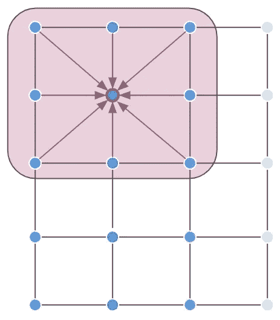

网格形式的图像示例。卷积的工作原理是聚合邻域的像素值。

当您对一组像素应用卷积时，您将汇总从卷积居中的像素及其所有相邻像素获得的信息。

现在，**您不能直接在图形**上应用卷积，因为图形节点没有固有的顺序(与图像不同，图像中的像素由其在图像中的坐标唯一确定)。

因此研究人员想知道:*我们能推广图上的卷积运算吗？*

他们提出了两类方法:

*   **频谱法**:顾名思义，它们与频域有关。它们保留了卷积的严格概念，但理解起来有点棘手。尽管在数学上更合理，但由于计算成本，它们很少被使用。
*   空间方法:它们代表了光谱方法的一个体面的近似，尽管没有数学上的严格。更容易理解的是，它们基于这样一个概念，即每个节点都应该从自己和它的 K 跳邻居那里收集信息。

就我个人而言，我看了看光谱方法，但由于它们不是今天最常用的，我决定不给它们太多的空间，而支持空间方法，我将在这篇文章中涉及更多。

# **我们开始吧:图卷积网络**

深度学习和卷积在图上应用的第一个成功例子出现在 [Kipf & Welling，2017](https://arxiv.org/abs/1609.02907) 中，其中介绍了**图卷积网络**。

他们算法背后的主要思想如下:

*   将线性投影应用于节点的所有特征向量
*   你汇总它们(平均值、总和、串联…)
*   将一个节点的投影与其相邻节点的投影组合在一起。

以下是公式中的过程:

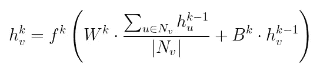

方程式 1，GCN 层，归功于[https://distill.pub/2021/understanding-gnns/](https://distill.pub/2021/understanding-gnns/)

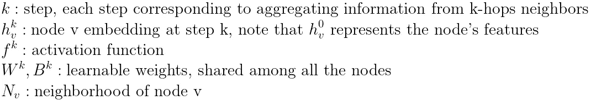

等式 1 是前面列出的步骤的数学表达式。每个节点的嵌入是通过将每个邻居投影到另一个空间，平均(但也可以使用其他类型的聚合)，并将它们与节点本身的投影相结合而获得的。最后一步，像在 DL 中一样，是激活函数传递。

这太棒了，不是吗？然而，当我读它的时候，我对你是如何编码的感到有点困惑。好的，我有一个图，但是我如何有效地找到每个节点的邻居，以便组合它们的特征？简单，你用**邻接矩阵**一*一*！

邻接矩阵 *A* ，大小为 *N* ( *N* 为节点数)，描述节点如何连接: *A(v，u)* = 1 如果节点 *v，u* 连接。
例如，如果您只想汇总一个节点的所有邻居(也称为单跳节点)的功能，您只需:

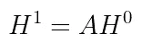

等式 2，1 跳功能聚合

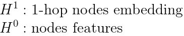

现在，**如果您在 k 步上不断迭代该过程，您将从 k 跳邻居**聚集特征，并且上面的表达式可以容易地表达如下，其中已经添加了线性投影:

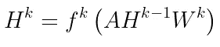

方程 3，矩阵形式的 GCN 层

*请注意，原始论文没有使用简单邻接矩阵 a。作者应用了一些提高性能的规范化技巧，但为了便于学习，这足以理解概念。*

因此**参数 *k* 调节你想从**学习的层数和跳数。这是一件不太明显但相当聪明的事情！但是……我该如何选择 *k* ？

**GCNs** 的一个奇特之处在于，它们**通常不是深层网络**，相反，它们更可能是非常浅层的(大多数时候 2 层就够了！).到今天为止，为什么浅层网络工作得更好还不清楚，但这背后有一些直觉:

*   如果网络是强连接的，单个节点只需几跳就可以到达大多数其他节点
*   许多学习任务依赖于这样的假设，即来自近节点的信息比来自远节点的信息更相关

这很酷，对吧？看起来几个层(以及参数)就能达到目的！是的，但是由于图形的大小，gcn 通常会处理可伸缩性问题。想想在一个有数百万个节点的图上应用等式 3:邻接矩阵将是巨大的！幸运的是，有论文探索了这种大图的学习技巧，比如 [GraphSAGE](https://arxiv.org/abs/1706.02216) 。

# 你能用 GCNs 做什么？

一旦您建立了自己的网络，您就可以开始解决以下任务了:

*   **节点分类**，即对图中每个节点的分类
*   **图形分类**，即对整个图形的分类
*   **链路预测**，即预测两个节点是否连通
*   **节点聚类**，即根据节点的特征和/或连接性对节点集合进行分组

我发现图形网络特别吸引人的地方是它们可以在两种不同的环境中使用:

*   归纳学习:在训练时，你完全不知道测试集节点，就像你处理标准的机器学习问题一样
*   转导学习:在训练时，你确实能看到你的测试集节点，因为它们是你的图形结构的一部分。但是，您不能使用它们的标签来计算和最小化您的成本函数

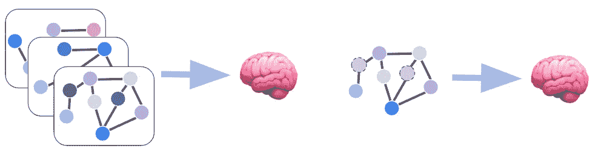

归纳学习(左)与直推学习(右)。在归纳设置中，数据集由多个图形组成。在直推式设置中，数据集由单个图的所有节点组成，但其中一些节点的标签被屏蔽掉了。

直推式方法是我不习惯的，因为在我通常的 ML 项目中，我从不使用我的验证/测试集进行训练。然而，图学习可能也需要来自这些集合的信息，因为它们是图结构的一部分，并且它们的特征被组合来计算每个节点的嵌入！

例如，如果给你一个用户网络，你的目标是预测他们是否是机器人，你可能会直推式地做:你将通过使用整个网络作为输入，对每个节点进行分类。然而，只有标签的子集(对应于训练集)将用于计算和最小化成本函数。

另一方面，对于图分类，您通常通过归纳来学习:您的数据集由一组图(而不是单个节点)组成，您可以将这些图分为训练集、验证集和测试集。您的网络将被优化以将每个图分配到正确的类。

成功的 GCNs 应用示例如下:

*   [用于网络规模推荐系统的图卷积神经网络](https://arxiv.org/abs/1806.01973ù)
*   [用于目标定位的图形神经网络](https://ebooks.iospress.nl/volumearticle/2775)
*   [用图卷积网络建模多药副作用](https://arxiv.org/abs/1802.00543)

# GCNs 中的注意机制:图注意网络

正如我们之前解释的，GCNs 学习的步骤之一包括从邻居那里聚集信息。**这个聚合步骤可以以这样一种方式加权，以便将重要性分配给邻居**，这就是**注意机制**和 [**图形注意网络**](https://arxiv.org/abs/1710.10903) 背后的思想。

该方法允许每个节点了解要关注哪些邻居，并在聚集步骤中为每个邻居指定不同的关注权重。

注意力层是这样工作的:

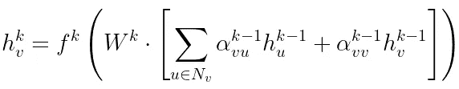

等式 4，图形注意力网络中的注意力层，归功于[https://distill.pub/2021/understanding-gnns/](https://distill.pub/2021/understanding-gnns/)

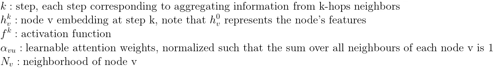

基本上，**注意力机制为网络的每一条边学习一个权重**。

在这个例子中，我们将注意力权重的计算简化为单个注意力头的情况。然而，你可能在同一层有多个注意力头，以不同的方式关注邻居。

与标准的 GCNs 不同，**聚合系数是动态计算的**，允许网络决定收集信息的最佳方式，尽管投入了一些计算能力。

这些系数是如何计算的？这个想法是学习一个评分函数 *S* ，它给每条边分配一个分数。这是通过对由给定边链接的节点的线性投影求和，将它们通过评分函数 *S* 和*a 激活步骤来完成的。最后，对一个给定节点的所有邻居的分数进行归一化，获得注意力权重。*

*在公式中:*

*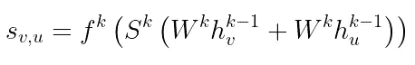*

*等式 5，边缘分数计算，归功于[https://distill.pub/2021/understanding-gnns/](https://distill.pub/2021/understanding-gnns/)*

*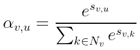*

*等式 6，注意力分数计算，归功于[https://distill.pub/2021/understanding-gnns/](https://distill.pub/2021/understanding-gnns/)*

*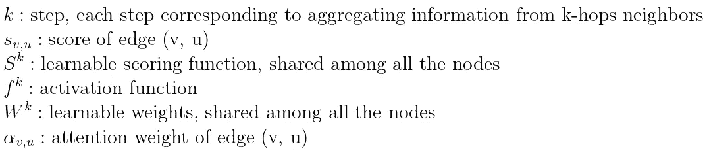*

*实现的方式有点复杂，不过，我建议看看[这个回购](https://github.com/gordicaleksa/pytorch-GAT)。*

# *结论*

*暂时就这样了。而且只是现在。我希望在接下来的几周里浏览更多的资源，因为仍然有一些方法我还没有探索到，甚至还没有看到。*

*我希望我让你相信图形学习是值得你花时间的。谁知道呢，也许它可以成为你下一个项目的可能选择。我花了一些时间来吸收所有这些东西，因为它不像其他 DL 主题那样熟悉，所以不要责怪自己，如果不是一开始一切都非常清楚(但如果是的话，也许我做得很好！).*

*感谢阅读！*

*除非另有说明，所有图片均为作者所有。*

*访问我的[个人页面](https://alessandropaticchio.github.io/)或通过 [LinkedIn](https://www.linkedin.com/in/alessandro-paticchio-a3b6b7138/) 联系我！*