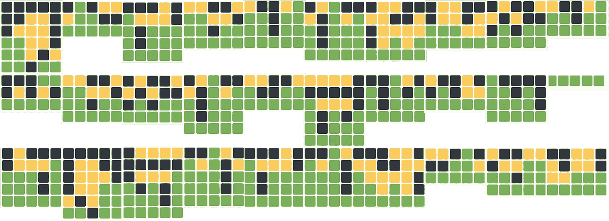
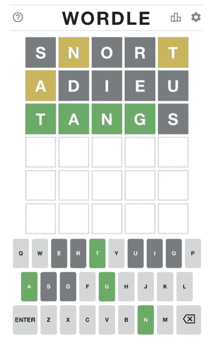
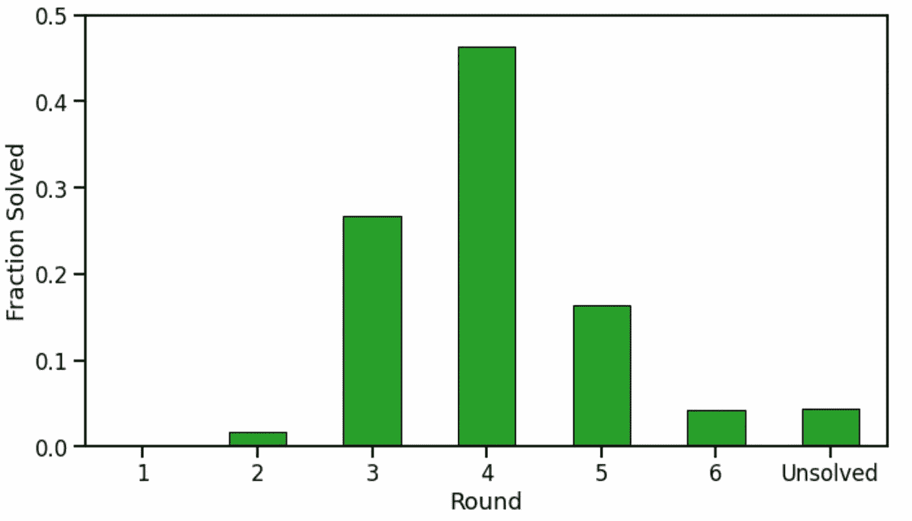
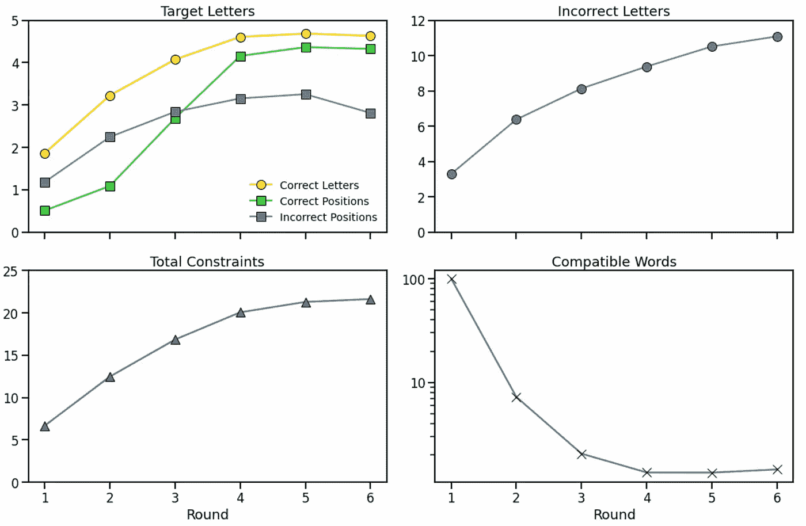
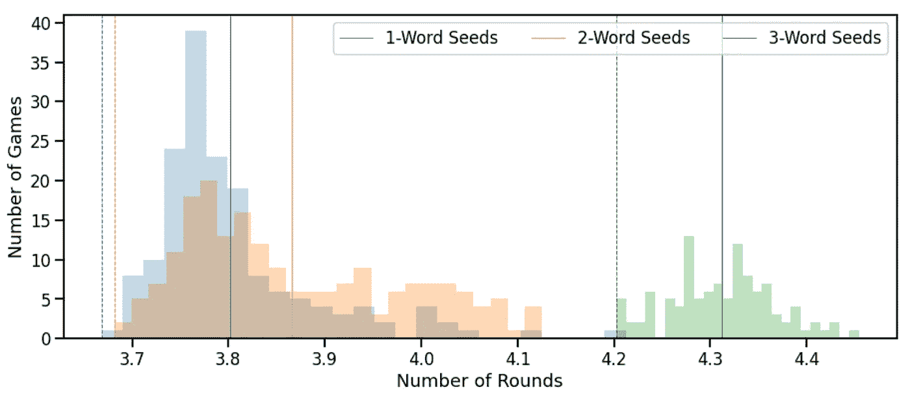
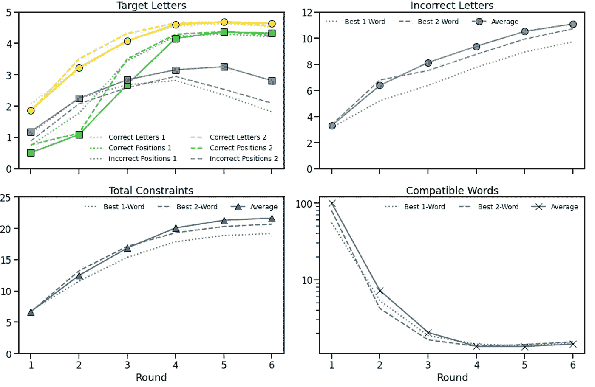

# 我从玩了一百多万个单词游戏中学到了什么

> 原文：<https://towardsdatascience.com/what-i-learned-from-playing-more-than-a-million-games-of-wordle-7b69a40dbfdb>

# 我从玩了一百多万个单词游戏中学到了什么

## 小心！这篇文章包含了一些剧透

图片作者。

好吧，完全公开:我实际上没有玩过一百万个 Wordle 游戏，但我写了一个 Wordle 模拟器。为什么？因为我想更多地了解游戏的动态，并评估人们在网上讨论的一些策略，特别是那些讨论“*在单词*开头使用的最佳单词[的](https://www.wired.com/story/best-wordle-tips/)。以下是对所采取的方法的描述以及我从中学到的东西。

> 注意:在这篇文章中，我将讨论一些好的单词猜测。我不会掩饰这些话，因为它们已经在别处、网上和媒体上被广泛讨论过了。然而，我会掩饰通过这种分析发现的小说“最佳”单词，以便读者可以在没有收到不受欢迎或不想要的提示的情况下阅读文章。在文章的最后，我将为那些感兴趣的人揭示这些新单词。这并不是说有任何启示，但我想尊重那些对这里采取的方法感兴趣，但不希望任何可能破坏他们未来生活乐趣的暗示的人。

# TLDR；

下面讨论的对 [Wordle](https://www.powerlanguage.co.uk/wordle/) 的模拟近似于一个强大的 Wordle 玩家，为了这个分析，我模拟了超过 100 万个游戏，使用了超过 400 个不同的(精心挑选的)种子/起始单词集。完整的技术细节和发现将在下面讨论，但主要结果的总结包括以下内容:

*   平均 95%的目标单词可以在 6 次猜测内解决，平均游戏时间大约为 4 轮。
*   到第三次猜测的时候，一个好的玩家将会找到大约 4 个目标字母，其中 2 或 3 个在正确的位置上。
*   并非所有的*目标单词*都被同等地创建。在模拟中，*挂钩*和*舱口*在 90%的情况下未能解决，而*升起*和*外星人*总是被解决，并且通常在 3 个回合内。
*   你用来开始写单词的种子单词很重要。即使对于这里测试的精心选择的单词，我们也发现有些单词比其他单词更好。一些起始词/种子词能够在 80%的时间里在 4 轮>内解决一个典型的单词，相比之下，其他种子词只能解决 60%的时间。
*   提供的数据表明，从一个或两个单词的正确组合开始比依靠一个好的三个单词的组合更好，因为使用固定的第三个单词意味着你将忽略可以从前两次猜测中收集到的有用信息。然而，最好的一个单词开头并不比最好的两个单词开头好多少，即使你会忽略第一轮的一些信息。
*   有一个可识别的单个单词和一对单词，它们提供了一个明显比其他测试单词更好的单词开头；当对大量的 Wordle 游戏进行评估时，这些'*最佳*'种子导致最短的平均游戏时间(每场游戏约 3.6 回合)，其中很大一部分(46%-48%)游戏在 3 回合内完成。

# 什么是沃尔多

[Wordle](https://www.powerlanguage.co.uk/wordle/) 是一款简单却引人注目的在线猜词游戏，最近在互联网上风靡一时。玩家每天有一次玩单词游戏的机会，每天都会选择一个新的目标单词。

目标是让玩家根据一系列最多 6 次的猜测，推断出一个 5 个字母的*目标*单词。对每个猜测进行评估并进行颜色编码，以指示哪些字母(如果有的话)包含在目标单词中(黄色)，哪些字母在正确的位置上(绿色)，以及哪些字母在目标单词中不存在(灰色)。这样，随着每一个新的猜测，玩家得到更多关于目标单词的提示。玩家可以选择使用或忽略一些或所有这些提示来产生他们的下一个猜测；有一个(更具挑战性的)游戏版本，玩家必须用每个新的猜测来满足所有当前的提示。

来自 https://www.powerlanguage.co.uk/wordle/[的文字截图](https://www.powerlanguage.co.uk/wordle/)

上面的例子显示了一个正在进行的游戏，在 3 轮(猜 3 次)之后，在猜对目标单词之前。第一次猜测显示' *n* 和' *t* '在目标单词中，尽管位置不正确，第二次猜测表明' *a* 也是目标单词的一部分，尽管不是它的第一个字母。这前两个猜测也排除了一些字母的进一步考虑(“ *s* ”、“ *o* ”、“ *r* ”、“ *d* ”、“ *i 【T21”)、“ *e* ”、“ *u* ”)。有了这些提示，玩家在第三轮取得了很好的进展，猜中了“ *t* ”、“ *a* ”、“ *n* ”、“ *g* ”，都在正确的位置上，只剩下一个字母来完成游戏。*

# 世界模拟器

编写一个 Wordle 模拟器需要一个合适的 5 个字母的英语单词的数据集。我通过汇集一些不同的在线词典和数据集建立了这样一个数据集，包括一个常见英语单词的数据集和一个常见 T2 人名的数据集。这些数据集是公开的，容易获得。我从英语单词数据集中剔除了人名，并选择了一组 2500 个常见的 5 字母单词，我认为这是 Wordle 使用的数据集的一个很好的近似，尽管毫无疑问它并不完美。

至于模拟器的逻辑:给定一个目标单词，基本思想是迭代多达 6 次猜测，将每次猜测与目标单词进行比较，并更新越来越多的关于被发现在目标单词之内或之外的字母及其正确和不正确位置的约束。这些约束可用于在挑选下一个猜测时排除不兼容的单词。每个猜测必须是数据集中的一个单词，当玩家猜中正确的单词或猜不到时，游戏停止。

为了帮助指导下一个猜测的选择，模拟器根据可能的适合性对兼容的单词进行评分。为此，我目前使用数据集中单词的唯一字母的(固定)频率之和。这样，字母更频繁的兼容单词比字母更不常见的单词更容易被选择。按照现在的情况，模拟器总是选择下一个猜测，该猜测与迄今为止学习到的所有约束的*兼容。这种方法可能会以一种更符合强大的 Wordle 玩家的方式来模拟游戏，对于未来的工作来说，削弱模拟器的游戏风格以更好地接近普通玩家可能是有意义的。做到这一点的一种方法可能是在如何选择新单词中增加一些随机性，或者可能是通过放松一些约束，使得不是每个选择的单词总是保证满足所有当前的约束。我会把这个留给以后的工作。*

# 世界开幕式

Wordle 的一个不寻常的特点是玩家的第一个单词必须在没有任何关于目标单词的信息的情况下选择，这导致了很多关于最佳第一个单词的猜测。有些词可能比其他词更好吗？寻找并坚持一个好的开场白值得吗？

具有更多独特字母的单词应该比具有重复字母的单词表现更好，理由是更多独特字母意味着有更多机会与目标单词匹配？例如，像“ *mamma* ”这样的单词，有两个独特的字母，与所用数据集中 48%的单词至少有一个字母相同。把这比作一个像“*承认*”这样的词。它的 5 个独特的字母(包括“ *mamma* ”的“m”和“a”)意味着它有一个与大约 82%的潜在目标单词匹配的单个字母。换句话说，如果您以' *admit* '开始下一个单词，那么您将在大约 82%的情况下生成与目标单词的单个字母匹配，平均而言' *admit* '将生成 1.29 个正确的字母匹配。

这种策略的一个变体是使用含有大量元音的单词，因为大多数，但不是全部(*synth*’、 *lynch* 等)。)5 个字母的单词包含元音。一个很好的候选词是' *audio* '，使用它作为您的第一个单词将在大约 91%的情况下生成至少一个匹配的字母——我们将这种重叠称为单词的*覆盖范围*,因此我们会说' *audio* ' *覆盖了* 91%的目标单词——平均而言，您可以期望找到大约 1.33 个与目标单词匹配的正确字母

语言学家对沃尔多也有很多看法。最近的一篇[文章](https://www.theguardian.com/commentisfree/2022/jan/11/secret-winning-wordle-word-game)强调了各种语言限制是如何共同决定似是而非的字母顺序的: *tr* 可以用在单词的开头，但不能用在结尾，而“ *ng* 可以用在结尾，但不能用在开头。在选择开头词时，这并不可行，但这样的观察可能有助于以后的猜测。

然后是[数学家](https://www.theguardian.com/games/2022/jan/11/wordle-creator-overwhelmed-by-global-success-of-hit-puzzle)，他们指出考虑字母概率可能是有用的，因为重叠更有可能出现在有许多常见(高概率)字母的单词中，例如' *e* '、 *s* '或' *t'* 。如上所述，我们可以通过计算每个单词的唯一字母的频率/概率之和来给每个单词打分，然后挑选得分高的单词，如*roas*t，作为我们的初步猜测，同时避开得分低的单词，如*edged*，即使*edged*包含一直流行的字母*e*。“roas”的覆盖率刚刚超过 92%，平均来说，它将提供 1.75 个字母匹配。相比之下，*的覆盖率略高于*，平均只有 0.75 个字母匹配。

这种字母概率的想法把我们带到了一个重要的数学分支，叫做[信息论，](https://en.wikipedia.org/wiki/Information_theory)，它提供了一个管理信息和消息的编码和传输的规则的正式处理。一个关键的概念是 [*熵*](https://en.wikipedia.org/wiki/Entropy_(information_theory)) 的概念，它也可以用来估计一条消息中包含的信息量——与其含义无关——高熵词，如“*rose*”也是很好的候选词(95%的覆盖率，平均有大约 1.95 个字母重叠)。

# 沃尔多集合覆盖问题

到目前为止，我们一直在谈论最初的单词猜测——用来让我们开始的单个单词——但是后续的猜测呢？我们必须在接下来的所有回合中靠自己的手段吗？或者有没有固定的第二个和第三个词可以在大多数情况下有所帮助？原来，理论计算机科学中的一个重要问题， [*套盖问题*](https://en.wikipedia.org/wiki/Set_cover_problem) ，在这里可以帮到我们。从一个角度来看，下面是这个问题的一个版本:

> 保证与每个可能的目标单词至少有一些重叠的最小单词集是什么？这个最小单词集称为最小集合覆盖。

由于超出本文范围的原因,(最小)集合覆盖问题很难解决。它是一个所谓的 [NP-Complete](https://en.wikipedia.org/wiki/NP-completeness) 问题，意思是虽然验证一个特定的解是否有效很容易，但是一旦找到，实际找到解是非常耗时的；至少我们至今没有发现任何捷径，捷径可能不存在。

尽管寻找(最小)集合覆盖是困难的，但是我们有有效的算法来识别接近的近似。例如，在 Wordle 的情况下，我们可以从具有最高覆盖率的单词开始；也就是说，它至少有一个字母与最多的其他单词重叠。这是我们封面的第一个词。接下来，我们消除当前集合覆盖所覆盖的所有单词，重新计算剩余单词的覆盖分数，并识别具有最高覆盖的剩余单词，然后将其添加到集合覆盖中。我们重复这个过程，直到没有更多的单词需要覆盖。这被称为*贪婪*算法，因为在每次迭代中，我们贪婪地提交下一个得分最高的单词。不能保证产生最佳的集合覆盖，因为这样的集合覆盖可能需要一个不在最高覆盖单词中的单词，但是它应该使我们接近。

我的直觉是，如果我们尝试这样做，那么我们可能需要 5 或 6 个单词来覆盖我们数据集中的 2500 个单词。鉴于你只有 6 次猜测的机会，这样的结果可能并不那么有用。然而，当我发现一个只有两个字的封面时，我很惊讶。也就是说，只使用两个特定的单词作为开始的两次猜测保证了与目标单词中至少一个字母的匹配，而不管选择了哪个目标单词。当然，对一个字母使用两次猜测可能听起来并不那么吸引人，但平均来说，这两次猜测会让你得到目标单词中的 2.88 个字母，68%的情况下会让你得到至少 3 个目标字母。此外，在 60%的时间里，这些字母中至少有一个会处于正确的位置。只猜两次就不错了！

然而，我们可以做得更好。在上面我使用了一个单词的覆盖率分数作为选择封面的基础。我们可以尝试其他方法来选择单词，比如前面提到的:选择具有最高字母概率得分或最高熵得分的单词。结果是，这两种方法都导致 3 个单词的集合覆盖，也就是说，需要 3 个单词来完全覆盖整个集合，但是使用这 3 个单词，我们得到 3.78 个字母的平均重叠，并且 65%的时间我们将得到 5 个匹配字母中的 4 个。此外，三分之二的时间这些字母中的一个将处于其正确的位置，三分之一的时间两个字母将处于其正确的位置。当然，作为这些猜测的结果，你也会学到很多不在目标单词中的字母。

# 生成种子词

因此，在这个阶段，我们可以通过使用覆盖率、字母概率和熵选择单词，使用上述过程来识别 3 个不同的集合覆盖。然而，这种贪婪算法并不能保证找到最好的集合覆盖，它值得我们扩大搜索范围。我们可以从不同的(好的)单词开始搜索。在这项工作中，我使用覆盖率和熵来集中前 100 个得分单词，以生成 200 个可能的集合覆盖，其中一些包含 2 个单词，一些包含 3 个单词；事实上，他们创造了 197 个独特的封面。我还包含了第一个单词，以及每个单词的前两个单词作为附加的种子单词；这些子集不是有效的集合覆盖，但是它们通常覆盖大多数单词，因此也应该提供一个良好的开端。最终结果是 471 个唯一的种子词集合的列表，每个集合包含 1 - 3 个词。

毫不奇怪，这些词包括其他人通常建议作为良好的单个词或成对词与 Wordle 一起使用的词，如'*rise*'、' audio '、' notes '、' resin '、' *stare* ，以及许多流行的双词集，如'*rise*'后跟' *count* '和' *notes* '后跟' *laird* 。

# 从 30 年的世界中学到的教训

我们现在准备运行我们的 Wordle 模拟实验。每次模拟运行将使用 471 组种子单词中不同的一组作为其初始猜测，并且每个种子将用于对 2500 个可能的目标单词进行 Wordle。因此，我们有效地模拟了给定种子集在完整的 Wordle 游戏运行中的使用(相当于几乎 7 年的 Wordle，基于每天一个单词)，总共 1，177，500 (471 x 2，500)个单独的游戏，结果是 4，714，791 轮游戏；出于这种分析的目的，我们排除了由种子单词解决的目标单词，剩下 1，176，614 个游戏和 4，713，381 个回合。

这可能更容易理解为 471 个玩家玩了将近 7 年的 Wordle，每个玩家都使用他们自己最喜欢的一套单词。如果玩一个普通的 Wordle 游戏需要 15 分钟，那么这相当于 30 年的实际游戏时间；幸运的是，我的笔记本电脑可以在 6 小时内完成这项工作。

我发现了什么？让我们从一些总结结果开始，从目标单词在特定一轮游戏中的分数开始(1 到 6)。下图显示，平均来说(在所有目标单词和种子猜测中)，47%的游戏在第四轮以正确的目标单词结束。略高于 4%的游戏需要全部 6 轮，类似数量的游戏无法在 6 轮内解决；请记住，在这个模拟中，我们的模拟器像一个强大的玩家一样使用高质量的初始猜测，因此经常玩游戏可能与更长的游戏和更大比例的不成功游戏相关联。

按回合计算的成功的世界扑克游戏的分数(图片由作者提供)。

随着游戏的展开，每猜一个新单词，你能学到多少？这如何帮助约束可能的目标单词集？下面我们来看看每轮新猜猜看，正确和不正确字母的数量，以及正确和不正确字母位置的累计数量。例如，第一个图(左上方)集中在目标单词中的字母及其位置，虽然第一次猜测通常在第三次猜测时发现少于 2 个目标字母(大多数在不正确的位置)，但一个强有力的玩家将平均定位大约 4 个目标字母，其中 2 或 3 个在正确的位置。同样，到第 3 轮，大约 8 个不正确的字母将被知道，玩家将获得大约 16 个约束条件来指导他们搜索目标单词。这些限制将极大地限制第 3 轮后剩余的兼容单词集，因此大约 70%的游戏在第 3 轮后成功结束(对于使用强种子的强玩家)。

作者图表。

# 简单和困难的目标词

是不是有些目标词比较难解？是的。当在起始词的所有种子集中取平均时， *hitch* 和 *hatch* 是最不频繁解决的目标。模拟器在 90%的时间里无法解决这些问题，当它们能够解决时，这些单词只能在大约 5%的时间里在 3 轮或更少的回合中被定位。另一方面，像'*兴起*'、*外星人*'、*过道*'、*加注*等单词，在 66%以上的游戏中，可以 100%的时间在 3 轮或更少的回合内解决；从这个意义上说，这些都是 Wordle 最容易攻击的目标。

# 获得良好的开端

让我们回到最主要的问题:哪些词适合作为开场猜测。这些高质量的起始词中有一些比其他的更好吗？或者所有的种子在引领短期游戏成功的可能性方面都是相似的吗？是尝试 1 字、2 字、3 字种子好？哪些是最好的 1、2、3 字种子？

下面我们可以看到 1 个(蓝色)、2 个(橙色)和 3 个单词(绿色)的种子的平均游戏长度的分布，当每个种子都与完整的 2500 组目标单词进行测试时；平均而言，这些种子集在 95%以上的时间里都能成功完成游戏。同样，模拟器是一个强大的玩家，使用良好的种子，因此为什么绝大多数种子导致平均游戏时间只有 3 或 4 轮，如图所示。但是，即使在这些高质量的种子中，很明显一些会比其他的导致更短的游戏。事实上，最好的 1、2 和 3 个单词的种子在 80%以上的时间里可以在 4 轮或更少的时间内解决一个典型的目标单词。

1、2 和 3 字种子的平均游戏长度的分布；作者配图。

我们也可以看到 1 个和 2 个单词的种子如何比 3 个单词的种子产生更短的游戏。这表明，玩家最好尝试找到自己的第三个单词，而不是依赖于一个通用的第三个单词，这是有意义的，因为前几个单词可能会透露目标单词的很多信息(大约 3 个正确的字母，一个在正确的位置上，大约 6 个不正确的字母)。盲目使用固定的第三个词是忽略了很多信息。

然而，1 字和 2 字种子集之间的差异更小，即使在使用 2 字种子集时一些信息被忽略。平均而言，1 字种子的平均游戏长度(3.80)略短于 2 字种子(3.86)；在图中显示为彩色编码的垂直实线)。然而，如果我们将单个*最佳* *1 字种子*与单个*最佳 2 字种子—* 进行比较，其中“最佳”意味着最短的平均游戏长度—如上面相应的垂直虚线所示，那么差异就小得多(最佳 1 字种子与 2 字种子分别为 3.66 比 3.68)。除了游戏的平均长度之外，值得关注的是可以在比如说 3 轮或更少轮中解决的游戏的比例——即非常短的游戏的比例——这样一来，我们发现 46%的与最佳 1 词猜测相关的游戏需要 3 轮或更少轮，相比之下，48%的游戏需要最佳 2 词查询。

从另一个角度来看，将这与这些精心策划的种子队中表现最差的种子队(平均游戏时间最长的种子队)进行比较是有益的。最差的 1、2 和 3 个单词的种子实现了较低的完成率(90–92%而不是> 95%)，并且它们需要更多的猜测来完成(平均 4.12–4.45 次猜测)。

# 结论

那么，在游戏开始的时候，有哪些最好的 1、2、3 字组合呢？如果你不想知道实际的单词，那么继续读下去是安全的，但是要小心，因为在这篇文章的结尾，它们会被揭露。现在，我将抽象地讨论这些最佳集合，同时做一些最后的观察:

*   如果您只想使用一个单词，那么'** * * *【T1]'是您的最佳选择。使用这个词导致超过 95%的游戏成功，平均游戏时间为 3.66 轮，其中 83%的游戏在 4 轮内完成。*
*   相反，如果你想用两个词，那么你应该试试' *#####* '和'*$ $ $ $*'。它们导致超过 96%的目标单词成功，平均游戏长度为 3.68 轮，86%的游戏在 4 轮内完成。
*   最好的三字种子是' *@@@@@ '，'&&&&【T42]'，和“% % % % % %【T7]'，成功率为 97%，但平均游戏时长为 4.2 轮，82%的游戏在第 4 轮完成。*

你应该用“****”和一个定制的第二个词，还是用“*# # # #*”后跟“*$ $ $ $*”？请注意，您从使用' *#####* '作为第一个猜测中学到的东西与您将从使用' *$$$$$* '作为第二个猜测中学到的东西没有冲突，因为按照设计，它们没有共同的字母，但是您将忽略您从' ##### '中学到的东西。然而，'*$ $ $ $【T17]'之所以被选中，是因为它本身也是一个很好的用词，而且在实践中，它和一个更加定制的第二种猜测一样有效。*

作者图表。

我们可以在上图中看到这一点，该图显示了之前讨论过的各种单词特征(正确/不正确的字母/位置等)。)按回合打。但是，现在我们也包括了'** * * * * **'(虚线)和' *#####* '和' *$$$$$* '(虚线)的结果。正如所预期的，这些种子集比平均(高质量)种子集表现得更好，至少在正确/不正确的字母、位置和减少的兼容单词数等方面。

这些结果也有助于澄清使用'** * * * * **'与使用' *#####* '和' *$$$$$* '之间的差别相对较小。如果有什么不同的话，平均来说，当涉及到削减第 2、3 和 4 轮中兼容单词的平均数量时，'*# # # # # #*'和'T32，$ $ $ $ $ $'的配对似乎做得稍好一些，这可能解释了为什么我们发现'T34，# # # # # #'和'T36，$ $ $ $ $'(48%)比' * * * * * * '(48%)有更多的游戏有 3 轮或更少的游戏

这些会对你下一部游戏产生影响吗？这完全取决于你。当然，有一个强有力的开头词是有意义的，如果这就是你想要的所有帮助，那么'** * * *【T1]'是一个很好的选择，至少基于我们在这个分析中发现的。*

如果你希望更进一步，并愿意提交你的前两次猜测，那么'*# # # # # #*'接着'*$ $ $ $ $【T5]'可能会很好地为你服务，至少平均来说，并让你更快地进入有趣的中局，如果你对' # # # # # # '做得好，那么你总是可以选择定制的第二次猜测，以尝试并实现传说中的两轮胜利。*

使用“*****”或“#####”和“$$$$”作为开头策略，就像它得到的一样简单:没有长的单词列表或复杂的决策树或查找表，只是一个精心选择的单词或单词对，让你有一个好的开始。不要担心，对于您随后的猜测，仍然有大量的工作要做。

说到这里，如果你想要一些帮助来完善你的猜测策略，那么看看我的新[帖子](/how-to-guess-well-in-wordle-d21167aae444)，它看起来就是这个话题。

现在，今天的单词在哪里？

# 小心！*剧透*如下

说到这里，如果你确定你想知道最适合使用的单词，那么解码如下:

*确定的话继续滚动……*

*快到了…*

*   **** = ' *故事集*
*   ##### = ' *圆锥*'，$$$$$ = ' *试验【T17'*
*   @@@@@ = ' *讨厌*'，& & & & & = ' *圆*'，%%%%% = ' *爬【T23'*